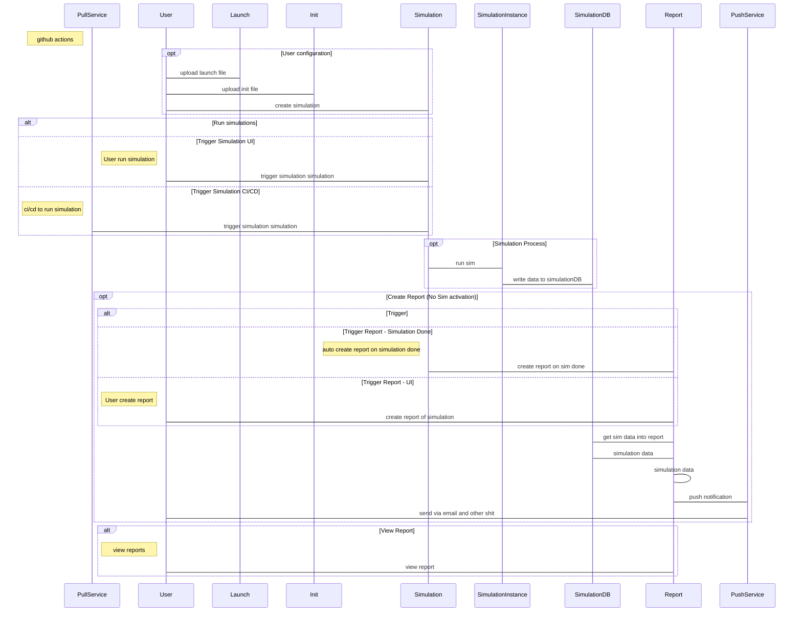

# LRS_Documentation

# Diagram

```mermaid
sequenceDiagram
    participant PullService
    participant User    

    note left of PullService: github actions 

    opt User configuration
    User->Launch: upload launch file
    User->Init: upload init file
    User->Simulation: create simulation
    end


    alt Run simulations
    else Trigger Simulation UI
        note left of User: User run simulation
        User->Simulation: trigger simulation simulation

    else Trigger Simulation CI/CD
        note left of PullService: ci/cd to run simulation
        PullService->Simulation: trigger simulation simulation
    end

    opt Simulation Process
        Simulation->SimulationInstance: run sim
        SimulationInstance->SimulationDB: write data to simulationDB
    end

    opt Create Report (No Sim activation)
        alt Trigger
        
        else Trigger Report - Simulation Done
            note left of Simulation: auto create report on simulation done
            Simulation->Report: create report on sim done
        
        else Trigger Report - UI
            note left of User: User create report
            User->Report: create report of simulation
        end
        
        Report->SimulationDB: get sim data into report
        SimulationDB->Report: simulation data
        Report->Report: simulation data
        
        Report->PushService: push notification
        PushService->User: send via email and other shit
    end


    alt View Report
        note left of User: view reports
        User->Report: view report
    end
```