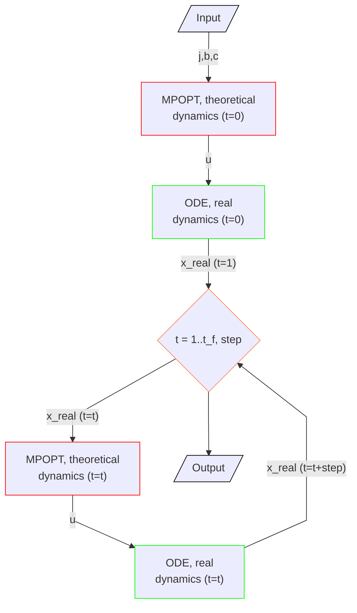

Blog posts support [Docusaurus Markdown features](https://docusaurus.io/docs/markdown-features), such as [MDX](https://mdxjs.com/).

## Example overview 🌐 


This Lunar Starship mission project addresses the lunar hopper challenge by optimizing the ascent, ballistic flight and landing process on the Moon's surface, aiming to minimize fuel consumption, time, or other relevant parameters. It empowers users to define both theoretical and real dynamic functions, enhancing prediction accuracy and enabling real-time corrections during lunar mission. 

Through the Lunar Starship project, researchers are paving the way for sustainable lunar exploration, as it not only optimizes missions but also conserves valuable resources for extended stays on the Moon. By allowing for the integration of real dynamic functions, it fosters adaptability and resilience in lunar operations, making it a cornerstone of future lunar exploration endeavors.

## Mathematical explanation 🎓
This example provides an array of time dependent values of states computed by solving non-linear optimal control problems(OCP) in the standard Bolza form using pseudo-spectral collocation methods and adjusted using an additional real dynamic function. The OCP solver used in this example is MPOPT (based on IPOPT) library modified by Lulav Space team.

The dynamic function is:

$$ 
\dot{v_N} = f_N + \frac{v_N v_D}{R_L + h} - \tan \phi \frac{v_E^2}{R_L + h} 
$$ 

$$
\dot{v_E} = f_E + \frac{v_E v_D}{R_L + h} - \tan \phi \frac{v_E v_N}{R_L + h} 
$$

$$
\dot{v_D} = f_D + \frac{\mu_L}{{(R_L + h)}^2} - \tan \phi \frac{v_{horis}^2}{R_L + h}
$$


$$
\text{where } v_{horis} = \sqrt{v_N^2 + v_E^2} \text{ is the magnitude of the horizontal velocity vector } V_{horis},
$$

$$
V_{horis}^L \triangleq {[v_N, v_e, 0]}^T,
$$

$$
\text{and where the latitude and altitude are determined from
} \\
\dot{\phi} = \frac{v_N}{R_L + h}, \quad \dot{h}=-v_D.
$$

$$
\text{The mass is} \\
$$

$$
\dot{m} = - \frac{F_{{thrust}}}{g_0 * I_{sp}}
$$

$$
\text{and the longitude is} \\
$$

$$
\dot{\lambda} = \frac{v_E}{(R_L + h)\cos{\phi}}
$$

$$
\begin{array}{|c|c|}
\hline
\text{Variable} & \text{Description} \\
\hline
v_n & \text{"northing" velocity} \\
v_e & \text{"east" velocity} \\
v_d & \text{vertical velocity} \\
f_n & \text{"northing" control value} \\
f_e & \text{"east" control value} \\
f_d & \text{vertical control value} \\
R_L & \text{Lunar radius} \\
h & \text{altitude above lunar surface level} \\
\phi & \text{latitude} \\
\lambda & \text{longitude} \\
\mu_L & \text{standard gravitational parameter} \\
m & \text{mass} \\
F_{\text{thrust}} & \text{The amount of thrust} \\
g_0 & \text{gravity parameter} \\
I_{\text{sp}} & \text{Specific impulse} \\
\hline
\end{array}
$$


You can define a "real" dynamic function to test the control values computed by solving non-linear optimal control problems(OCP). This function should have the same number of outputs. 

For this example terminal cost function, path constraints and terminal constraints functions used as well: 

1. Terminal contraints (we want to start from the given initial conditions and finish with the given final conditions):

$$
b_{min}^{(g)} \le b\big[x^{(1)}(t_0^{(1)}),...,x^{(P)}(t_0^{(P)}),t_0^{(1)},...,t_0^{(P)},x^{(1)}(t_f^{(1)}),...,
$$

$$
x^{(P)}(t_f^{(1)}),...,t_f^{(P)},q^{(1)},...,q^{(P)},s \big] \le b_{max}^{(g)}
$$

2. Path constraints (we need to limit controls values within the maximum possible thrust):

$$
c_{min}^{(p)} \le c^{(p)} \Big[x^{(p)}, y^{(p)}, t^{(p)} \Big] \le c_{max}^{(p)},
$$

3. Cost function:

$$
J = \phi \big[x^{(1)}(t^{(1)}_0),..., x^{(P)}(t^{(P )}_0), t^{(1)}_0, . . . , t^{(P)}_0, x^{(1)}(t^{(1)}_f), . . . , 
$$

$$
x^{(P )}(t^{(P )}_f), t^{(1)}_f, . . . , t^{(P )}_f, q^{(1)}, . . . , q^{(P )}, s \big]
$$


## Code overview

The project consists of three main files: 
1. ```lunar_starship.py``` - the main executable file of the project. It is a Python script for a ROS 2 (Robot Operating System 2) node designed for lunar exploration and trajectory optimization. It utilizes the ROS 2 framework (specifically, the rclpy library) to perform the following tasks:
    * It defines a class called lunar_starship, which inherits from the Node class provided by ROS 2. This class represents a ROS node responsible for controlling and simulating the trajectory of a lunar spacecraft.
    * The lunar_starship node is initialized with various parameters related to the initial and target states of the spacecraft, as well as physical parameters such as fuel mass, thrust, and specific impulse.
    * It defines a set of functions, including dynamic functions for theoretical and real dynamics of the spacecraft, cost functions, and constraints functions. These functions are essential components of an optimal control problem (OCP) used to optimize the spacecraft's trajectory.
    * The lopt.solve function is called to solve the OCP and obtain the optimized trajectory for the spacecraft. It uses the defined functions and parameters to perform this optimization.
    * The node sets up a timer to periodically publish the state of the spacecraft, including its position, velocity, and mass. This information is published as a Float64MultiArray message on the /lunar_starship/state topic.
    * The node runs in a loop, continuously publishing the spacecraft's state until the entire trajectory has been published. Upon completion, the node exits gracefully.
    * The main function initializes the ROS 2 node, creates an instance of the lunar_starship class, and enters the ROS 2 spin loop to keep the node running.

    Overall, this code file represents a ROS 2 node for trajectory optimization and simulation of a lunar spacecraft, with a focus on dynamic functions, constraints, and optimal control.

2. ```lopt_starship.py``` - OCP solver wrapper file. This file is a Python module designed to solve optimal control problems (OCP) for spacecraft trajectory optimization. It makes use of the `mpopt_lulav` library for solving OCPs. Here's an overview of the module's main components and functionality:
    * **`get_variables` Function:** This function extracts and interpolates state and control variables from the solver's results. It prepares interpolated functions for various state and control variables over time.
    * **`Stage_result` Class:** This class serves as a container for storing and organizing the results of the OCP solver. It maintains lists for time, altitude, latitude, longitude, velocities, fuel mass, and control inputs.
    * **`solve` Function:** The main function in the module, `solve`, is used to solve OCPs. It takes several parameters, including theoretical and real dynamic functions, cost functions, constraints, and various initial and boundary conditions. It uses the [MPOPT](https://github.com/mpopt/mpopt) library for solving the OCP, including real-time closed-loop simulation. The real dynamics function integrates the spacecraft's dynamics with control inputs in real-time.

    This module enables the optimization and simulation of lunar spacecraft trajectories while considering various dynamic and control factors. We use it as a valuable tool for mission planning and optimization within the ROS 2 framework.

3. ```mpopt_lulav.py``` - the main file of MPOPT library. It contains all MPOPT functions and features used in this project. You can find more information about MPOPT optimal control solving library on the MPOPT [GitHub](https://github.com/mpopt/mpopt) or [website](https://mpopt.readthedocs.io/en/latest/).

### Algorithmic representation 🧬



## Local Usage 💻

All project installation and usage information also available in the project [GitHub page](https://github.com/citros-garden/lunar_starship).

### Installation 🔨
1. Docker engine. This project runs inside Docker container, and requires Docker Engine/Docker Desktop. Follow the instructions on [Docker official website](https://www.docker.com/get-started/).
2. To use Docker inside VS Code several extensions are required. Install [Dev Containers](https://marketplace.visualstudio.com/items?itemName=ms-vscode-remote.remote-containers) and [Docker](https://marketplace.visualstudio.com/items?itemName=ms-azuretools.vscode-docker) extensions from Extensions tab on your left control panel.
3. Clone the repository:
```bash 
git clone git@github.com:citros-garden/lunar_starship.git
```

### Build 🏠
1. Open project root folder in VS Code.
2. Navigate to the lower-left corner of VS Code window and click on green mark.
3. Select "Reopen in container" option in the list on the top of the VS Code window. Wait a minute while Docker container is starting.
2. Open ```/src/lunar_starship/config/params.xml``` file to set parameters for simulation or just keep it default. Don't forget to save your changes!
3. Build ROS2 environment:
```bash 
colcon build
```
4. Source the environment:
```bash 
source install/local_setup.bash
```

### Preparing FoxGlove Studio 🪄
FoxGlove Studio is a robotics visualization and debugging tool, which can connect to ROS topic and get the data publishing through it. We will use it to visualizate the results of our simulations.

First of all, you need to download it from the [official website](https://foxglove.dev/) and install following the instructions. 

Next step is connecting to your ROS node. To perform it, open FoxGlove Studio and select *__Open connection__* option, then select *__Rosbridge__* option. Check the *__WebSocket URL__* field on the right of the window, it should contain ```ws://localhost:9090```. Now we are almost ready to go!

Last step is configuring the layout of FoxGlove. There are two ways to do it: using prepared layout file or manualy.

Manual plot layout configuration: we have 7 states in the output messages, so we need 7 plots. Add 7 plots using third tab on the left FoxGlove control panel. Then click on the fourth tab and set 'Message Path' for each plot: the path should be ``` /lunar_starship/state.data[n] ```, where n - number of the state. 

$$
\begin{array}{|c|c|c|}
\hline
\text{State number} & \text{Value} & \text{Describtion} \\
\hline
0 & h & \text{altitude above lunar surface level} \\
1 & \phi & \text{latitude} \\
2 & \lambda & \text{longitude} \\
3 & v_n & \text{"northing" velocity} \\
4 & v_e & \text{"east" velocity} \\
5 & v_d & \text{vertical velocity} \\
6 & m_{fuel} & \text{fuel mass} \\
\hline
\end{array}
$$


:::tip

The best way to process simulation results is Citros notebook 🍋 :)

:::


### Run 🚀
1. Go back to the VS Code.
2. Prepare your FoxGlove studio (previous step, if you haven't done it yet).
3. Launch ROS2 package:
```bash 
ros2 launch lunar_starship launch.py
```
4. Watch the FoxGlove plot built from results!

OR

:::tip

You can use Visual Code Tasks: simply press ```Alt+T``` and select ```Launch``` task to build, source and launch the project automaticly.

:::


## Citros usage 🛸
Although you can get simulation results using FoxGlove, the best way to work with such simulations and process the results is Citros! With its power, it is possible to create complex data processing scenarios, including the construction of more complex graphs, mathematical analysis and other high-level processing methods.

### Citros installation 🛫

First of all, to use all the powerfull Citros features usage requires Citros installation: follow the instructions on the Citros CLI [GitHub page](https://github.com/lulav/citros_cli).

### Configuring the project ⚙️
After all the prerequisites done, we can start configuring our project. The starting point is the Lunar_Starship devcontainer loaded and running, Citros CLI is installed and ready.
1. Initialize Citros:
```bash 
citros init
```
Now you can see ```.citros``` folder in the explorer.

2. Configuring the setup. We need to set up the maximum perfomance available: timeout, CPU, GPU and Memory. To perform it, we need to define it in the ```.citros/simulations/simulation_lunar_starship.json```. The recommended setup is minimum 600 seconds timeout, 4 CPU, 4 GPU and 4096 MB of Memory. Don't forget to save the file!

3. Configuring the params setup. You can find default setup in ```.citros/parameter_setups/default_param_setup.json```. Variables with '_0' are initial conditions, and variables with '_f' are final conditions respectively.

$$
\begin{array}{|c|c|}
\hline
\text{Parameter} & \text{Description} \\
\hline
h_0 & \text{initial altitude above lunar surface level} \\
lat_0 & \text{initial latitude} \\
long_0 & \text{initial longitude} \\
vn_0 & \text{initial "northing" velocity} \\
ve_0 & \text{initial "east" velocity} \\
vd_0 & \text{initial vertical velocity} \\
m_fuel_0 & \text{initial fuel mass} \\
lat_f & \text{final latitude} \\
long_f & \text{final longitude} \\
vn_f & \text{final "northing" velocity} \\
ve_f & \text{final "east" velocity} \\
vd_f & \text{final vertical velocity} \\
m_{\text{fuel f}}& \text{final fuel mass} \\
dry~mass_f & \text{dry mass} \\
F_{\text{thrustmax}} & \text{The maximum amount of thrust} \\
I_{\text{sp}} & \text{Specific impulse} \\
simulation~step & \text{step of simulation} \\
publish~freq & \text{frequency of publishing} \\
\hline
\end{array}
$$

Don't forget to save the file!

### Syncing the project's setup 📡
Now we can sync our project settings with Citros server:
```bash 
citros commit
citros push
```
### Running locally 🛋️
Since all the preparations done, we can launch it locally (your project should be built and sourced before that, check the instructions above):
```bash 
citros run -n 'Lunar_Starship' -m 'local test run'
```
Select the launch file (should be the only one here) by pressing ```Enter``` button and wait for the output in the terminal. To plot the local run results you can use FoxGlove.

### Uploading Docker image to the Citros database and running in the cloud 🛰️
1. We need to build and push Docker container image to the Citros server:
```bash 
citros docker-build-push
```

2. Finally, we can run it in the cloud! Simply add ```-r``` to the terminal command: 
```bash 
citros run -n 'Lunar_Starship' -m 'cloud test run' -r
```
Select the launch file (should be the only one here) by pressing ```Enter``` button. Now the simulation is running in the Citros server, and it will upload results to the Citros database automaticly.

### Citros Web usage and data analysis 🌌
TODO
## Extras
### FoxGlove examples


