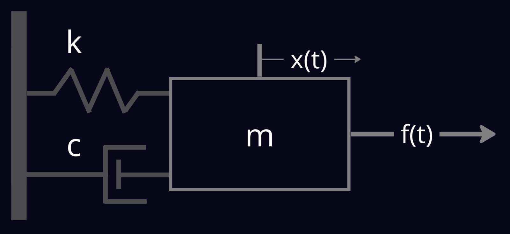

# Mass Spring Damper Tutorial

In this tutorial we will learn the following:

- Mass-Spring-Damper system details.
- Install the project on your PC.
- Configure and run simulation.
- Configure `citros_cli` and run simulations locally with CITROS.
- Create a Dockerfile for running standalone simulations.
- Push the simulation image to CITROS.
- Configure and run batch of simulation on the cloud with CITROS.
- Analyze the results from batch run.

# Overview 🌍

This is a simple ROS demonstration of a mass-spring-damper system.

The example contains two ROS 2 packages: `dynamics` and `controller`.

## System Dynamics 🏁

The system's equations of motion:

$$m\ddot x =  kf(t) -c\dot x -kx$$

and after laplace transformation (with zero I.C) we get a second order system:

$${X \over F} = {\omega_n^2 \over s^2 +2\omega_n\zeta s + \omega_n^2} $$

where the natural frequency $\omega_n = \sqrt{k \over m}$

You can choose the system's parameters `m`, `k` and `c` and choose the initial condition `x0`, `v0` and `a0`, all configured as ROS 2 parameters.

## The Controller 🎮

You can write your own controller to try stabilize the system for a given setpoint.

the default controller is a simple PID controller with the following form:

$$f(t) = {k_pe(t) + k_i\int{e(t)dt}} + k_d {d\over dt}(e(t))$$

you can tune the controller gains, $k_p$, $k_i$, $k_d$, configured as ROS 2 parameters.

# Installation 🛫

## Prerequisits:
* Docker
* VSCode
* Python 3.8+

## Install

Clone the repository to your local machine:
                
                git clone git@github.com:citros-garden/mass_spring_damper.git

Open the repository in the VScode:

                cd ~/mass_spring_damper
                code .

open the repository in the container from VScode with `reopen in container` option.

# Build :tractor:

build and source the workspace:

                colcon build
                source install/local_setup.bash