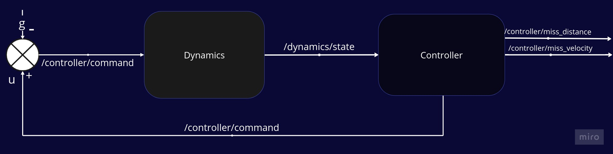
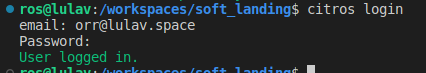
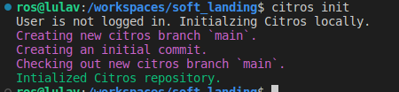
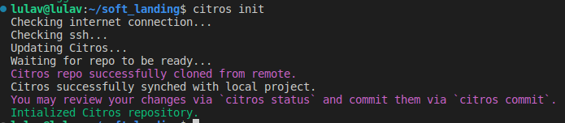
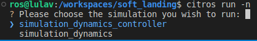
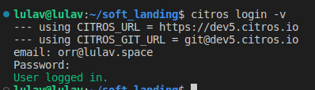
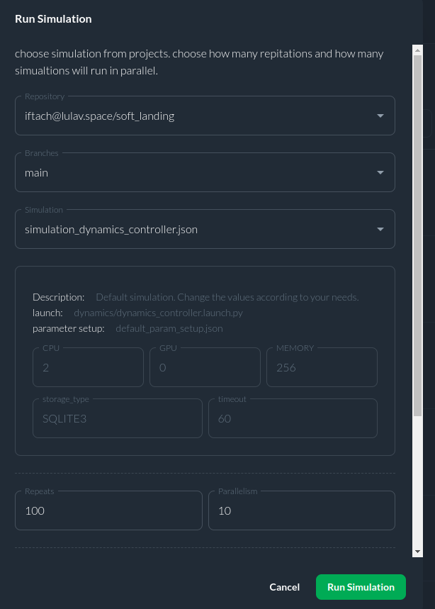
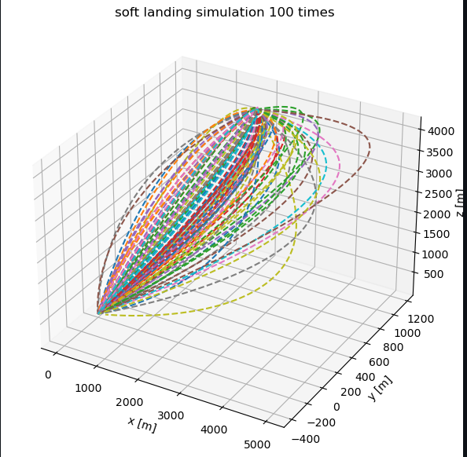
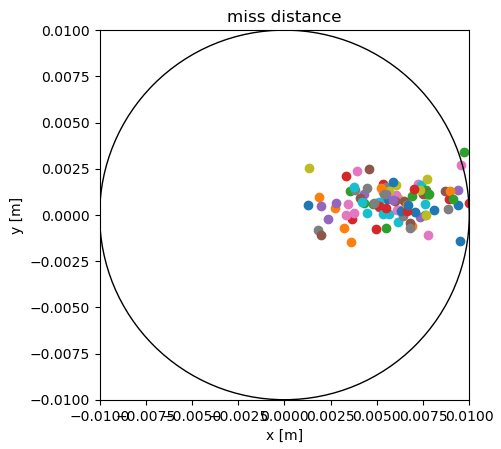

# Soft Landing Tutorial


**Contents**

- General Info
    - System Dynamics
    - The Controller
- Installition
    - Prerequisits
    - Install & Build
- CITROS interagtion
    - Configuring The Project
- Run The  Example
    - The Scenario
    - Run A Test Simulation Localy With CITROS
    - Run A Test Simulation In The Web With CITROS


# General Info  🌐

This is a ROS 2 simulation of soft landing of an object.  
In the ROS 2 system we have two nodes: the first represents the `dynamics` and the second one is the `controller`.



## **System Dynamics**  🏁
The system's equation of motion is the kinematic equation of a free body fall.  
for more information see [Soft Landing](https://github.com/CITROS-garden/soft_landing)  
## **The Controller**  🎮
The controller is based on this paper:

*S. Gutman, "Rendezvous and Soft Landing in Closed Form via LQ Optimization," 2019 27th Mediterranean Conference on Control and Automation (MED), Akko, Israel, 2019, pp. 536-540, doi: 10.1109/MED.2019.8798572.*


# Installition  🛫

### Prerequisits 📝
 - ✅ Python 3.8+  
 - ✅ VSCode  
 - ✅ Docker  
 
   
### Install & Build 🏠 
1. Clone the repository:
   ```sh
    git clone git@github.com:CITROS-garden/soft_landing.git
   ```

2. open the repository in the VScode:
	```sh
	cd ~/soft_landing
	code .
	```
3. open the repository in the container from VScode with `reopen in container` option.


# CITROS Interagtion 🛸
To use all the powerfull CITROS features usage requires CITROS installation:  
(from the instructions on the CITROS CLI [GitHub page](https://github.com/lulav/CITROS_cli))


**First,reopen the folder localy** then follow the instructions:
```
pip install CITROS
```  


then login:

```
  CITROS login 
```

enter your email and pasword ,you supose to see:    



then:

```
 CITROS init
```



and finely:

```
CITROS setup-ssh
CITROS add-remote
```
then cheack that we all set with the cli command: `CITROS status`
## Configuring The Project ⚙️
After all the prerequisites done, we can start configuring our project. The starting point is the soft_landing devcontainer loaded and running, CITROS CLI is installed and ready.
1. Initialize CITROS:
```bash 
CITROS init
```
Now you can see ```.CITROS``` folder in the explorer and at the terminal you can see that:  
  

4. Reopen in container
5. source and build:
	```sh
	colcon build
	source install/local_setup.bash
	```

# Run The  Example 🌑

## **The Scenario** 🎥
Run the example of an object with the initial condition that supose to land on an ending point.  
The parameters are:  


|     Variable     | Description |
| -------- |    ------- | 
| $$ [r_{x_0} ,r_{y_0},r_{z_0}] $$| initial position of the dynamics |
| $$[v_{x_0} ,v_{y_0},v_{z_0}]$$ | initial velocity of the dynamics |
| $$[g_{x_0} ,g_{y_0},g_{z_0}]$$ | gravity vector |
| $$dt$$ | time interval |
| $$u $$| controller fedback |
| $$[setpoint.{r_x} , setpoint.{r_y} , setpoint.{r_z}] $$| controler target point |
| $$[setpoint.{v_x} , setpoint.{v_y} , setpoint.{v_z}]$$ | controler target velocity | 
| $$um$$ |  -- |
| $$e $$| stoping condition value |

**All of the above are ROS 2 parameters that could easly change by the user as wish.**  


After compliting the CITROS interagition setup we can cheack CITROS by running a test simulation.  

First, set up the parameter of the simulation in the file   `default_param_setup.json` in `.CITROS/parameter_setups` folder.  
Don't forget to save the file!  


``` 
you can read more about changing parameters in  `parameter setups` section in `CITROS_cli` readme.
```  


## Run A Test Simulation Localy With CITROS 🕹️	
### Syncing The Project's Setup
Now we can sync our project settings with CITROS server:
```bash 
CITROS commit
CITROS push
```
when evrything is setup you can do a test run buy the following command:  
```
CITROS run -n 'test' -m 'testytest'
```
Then you will ask to choose the launch file you want to run.  
There are two option:



The `simulation_dynamics_controller` launch the dynamics with the controller and `simulation_dynamics` launch only the dynamics.  
Select the launch file by pressing ```Enter``` button and wait for the output in the terminal.  
If the simulation ran perfectly you can run the simlulation in the cloud.
## Run A Test Simulation In The Web With CITROS 📡
Befor uplouding the simulation to the cloud cheack that the parameter file, `default_param_setup.json`  in `.CITROS/parameter_setups` folder is set as you wish and saved.  
That you have build and sourced the project.  
And you have sync the project settings with CITROS server (CITROS commit , CITROS push).  

Then,run the following:
1. We need to build and push Docker container image to the CITROS server:
```bash 
CITROS docker-build-push
```
 Finally, we can run it in the cloud! Simply add ```-r``` to the terminal command: 
```bash 
CITROS run -n 'test' -m 'testytest' -r
```
Select the launch file you want by pressing ```Enter``` button. Now the simulation is running in the CITROS server, and it will upload results to the CITROS database automaticly.

Now we all set to run simulations from the web itself.  
At the web,go to the soft landing repo and then to the `Runs` tab.  

start a new simulation by clicking the  button.  
then a window will pop:

  

As you can see I chose to fill the soft landing repository, the main branch, and run the simulations with the controller.  
Then I chose to repeat 100 times such that CITROS run 10 simulations in parallel.  
Then i clicked on *Run Simulation*.  
The results were:  


And by getting the miss distance and miss velociy i could show a figure of all the runs.  
  
The full report with the data acces and error anlyisis you can watch it [here](https://CITROS.io/soft_landing/blob/main/notebooks/Soft_landing_analysis.ipynb).


