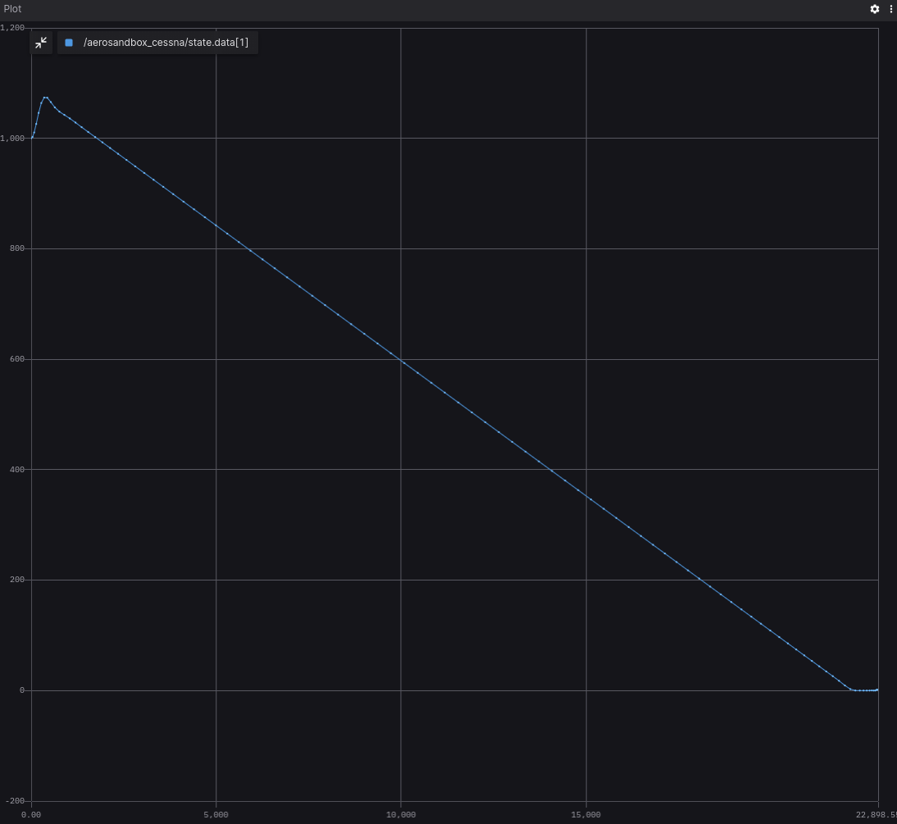
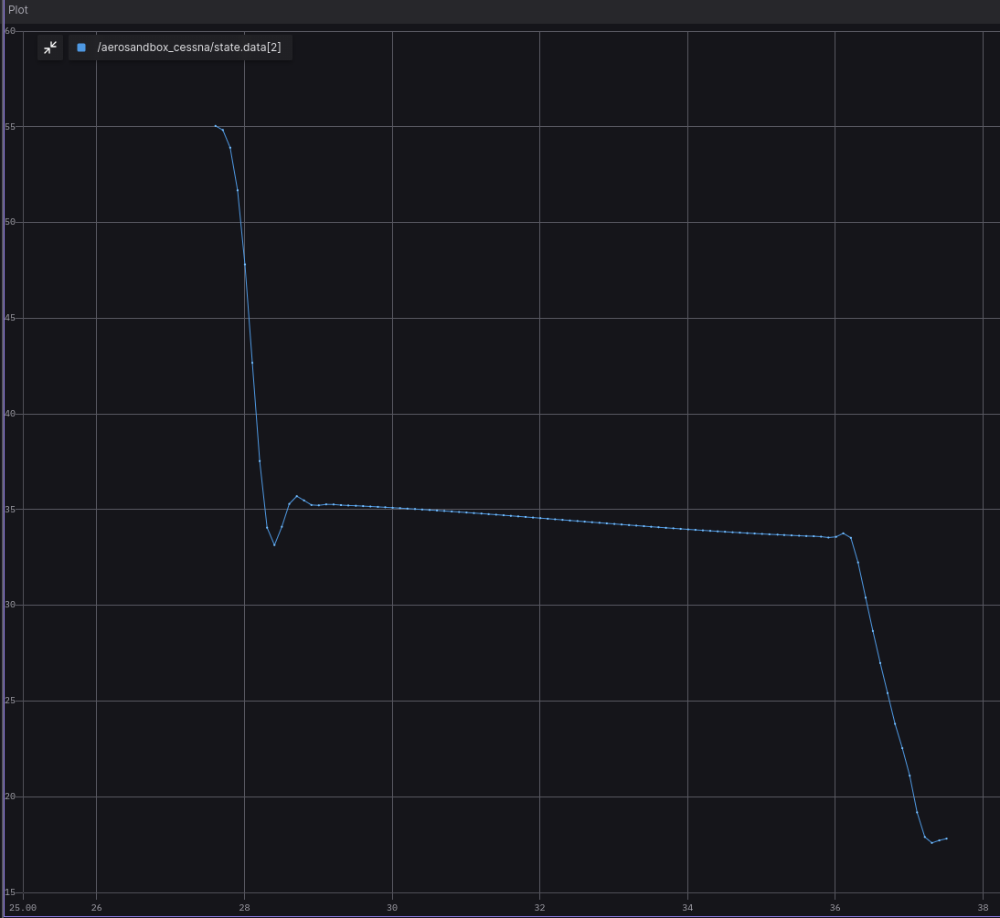

Blog posts support [Docusaurus Markdown features](https://docusaurus.io/docs/markdown-features), such as [MDX](https://mdxjs.com/).

.jpg")

## Example Overview 🌐 

The project is a simulation tool developed using ROS (Robot Operating System) nodes and leverages the Aerosandbox Python library for aerodynamic calculations. Its primary objective is to simulate gliding flight scenarios for a Cessna 152 aircraft in the event of engine failure.

The user provides flight parameters as input parameters to configure the simulation. These parameters are essential for defining the initial conditions of the simulated flight.

Once the simulation is initiated, the ROS nodes orchestrate the execution. The simulation takes into account various flight dynamics and aerodynamic factors to model the gliding behavior of the Cessna 152. The maximum gliding distance depends on plane's aerodynamic parameters, initial altitude and initial velocity. To find it this code uses iPOPT optimal problem solver under the hood (IPOPT included into AeroSandbox).

The output of the simulation comprises critical flight data, such as altitude, velocity, and other relevant parameters, recorded over time intervals. These results are published via ROS topics, allowing for real-time data visualization, analysis, and integration with other ROS-based systems.

You can find more information about this useful aerodynamics library on [Aerosandbox official website](https://github.com/peterdsharpe/AeroSandbox). All project installation, code overview and usage details also available in the project [GitHub page](https://github.com/citros-garden/aerosandbox_cessna).


## CITROS Usage 🛸
Although you can get simulation results using FoxGlove, the best way to work with such simulations and process the results is CITROS! With its power, it is possible to create complex data processing scenarios, including the construction of more complex graphs, mathematical analysis and other high-level processing methods.

### CITROS Installation 🛫

First of all, to use all the powerfull CITROS features usage requires CITROS installation: follow the instructions on the CITROS CLI [GitHub page](https://github.com/lulav/citros_cli).

### Configuring the Project ⚙️
After all the prerequisites done, we can start configuring our project. The starting point is the Aerosandbox_cessna devcontainer loaded and running, CITROS CLI is installed and ready.
1. Initialize CITROS:
```bash 
>>> citros init
Checking internet connection...
Checking ssh...
Updating Citros...
Waiting for repo to be ready...
Citros repo successfully cloned from remote.
Creating new citros branch `master`.
Creating an initial commit.
Default branch of remote 'origin' set to: master
Citros successfully synched with local project.
You may review your changes via `citros status` and commit them via `citros commit`.
Intialized Citros repository.
```
Now you can see ```.citros``` folder in the explorer.

2. Configuring the setup. We need to set up the maximum perfomance available: timeout, CPU, GPU and Memory. To perform it, we need to define it in the ```.citros/simulations/simulation_aerosandbox_cessna.json```. The recommended setup is minimum 180 seconds timeout, 2 CPU, 2 GPU and 1024 MB of Memory. Don't forget to save the file!

3. Configuring the params setup. You can find default setup in ```.citros/parameter_setups/default_param_setup.json```. [CITROS CLI](https://github.com/lulav/citros_cli) provides an opportinuty to use basic NumPy functions (such as distributions) and even user-defined functions, but let's keep it default for now. The Aerosanbox simulation has the following ROS parameters:

    |Parameter	|Package	|Description
    |--|--|--
    h_0	|aerosandbox_cessna	|Initial alitude (m)	
    v_0	|aerosandbox_cessna	|Initial velocity (knots)
    publish_freq	|aerosandbox_cessna	|Frequency of publishing


Don't forget to save the file!
4. Launch files. This project contains only one launch file ```aerosandbox_cessna.launch.py```. This file will be used for CITROS launch. 

    |Launch File	|Package	|Description
    |--|--|--
    aerosandbox_cessna.launch.py	|aerosandbox_cessna	|Aerosandbox simulation launch file 

### Syncing the Project's Setup 📡
Now we can sync our project settings with CITROS server:
```bash 
>>> citros commit
>>> citros push
```

:::tip

CITROS CLI in addition to other advantages also provides automatic ROS bag recording option, which allows user to use saved simulation results and export them! :)

:::

### Running Locally 🛋️
Since all the preparations done, we can launch it locally (your project should be built and sourced before that):
```bash 
>>> citros run -n 'aerosandbox_cessna' -m 'local test run'
? Please choose the simulation you wish to run:
❯ aerosandbox_cessna
```
Select the launch file (should be the only one here) by pressing ```Enter``` button and wait for the output in the terminal. To plot the local run results you can use FoxGlove.

```bash
created new batch_id: <your-batch-id-here>. Running locally.
+ running batch [<your-batch-id-here>], description: local test run, repeating simulations: [1]
+ + running simulation [0]
...
```


### Uploading Docker Image to CITROS Cloud
We need to build and push Docker container image to the CITROS server:
```bash 
>>> citros docker-build-push
Logging in to docker...
```

### Running in the Cloud 🛰️
Finally, we can run it in the cloud! Simply add ```-r``` to the terminal command: 
```bash 
citros run -n 'aerosandbox_cessna' -m 'cloud test run' -r
? Please choose the simulation you wish to run:
❯ aerosandbox_cessna
```

Select the launch file (should be the only one here) by pressing ```Enter``` button. Now the simulation is running in the CITROS server, and it will upload results to the CITROS database automaticly.

```bash
created new batch_id: <your-batch-id-here>. Running on Citros cluster. See https://citros.io/batch/<your-batch-id-here>.
```

### CITROS Web Usage
#### Launching project via CITROS Web
The best way to use all the innovative capabilities of CITROS is through it's Web interface. The following manual explains how to run this project in the cloud and how to process the simualtion results.
The starting point is CITROS main page, user is logged in and the project Docker image is built and pushed to the cloud (see the [manual](#uploading-docker-image-to-citros-cloud) above).
1. Go to the ```Repositories``` page clicking on the tab on the top;
2. Find your project and open it;
3. Navigate to the ```Runs``` tab;
4. Click on the ```Run Simulation``` button on the right;
5. Now you can choose the project and the simulation setup from the droplists, set the number of repeats and how many simulations should run in parallel, type the Name of the run and the additional message. This window also shows the perfomance preset.
6. We are ready to go! Start the Batch with the button below.

The simualtion launched! Open the Run you just started in the list on ```Runs``` page to check how is it going. In this page you can find all the runs of this batch. The number of runs here equals to the number of runs you've set before.
Navigate to the Run by clicking on it in the table:
* The main part of this page is a simulation's log. Here you can find all the logging information from all levels: from your code logs up to the CITROS system information.
* The right part of the page provides additional information about Events: the main stages of the simulation run.


#### Working with Integrated Jupiter Notebooks and Data Analysis 🌌
CITROS Web provides powerfull data analisys package, which is comprehensive solution for data query, analysis and visualization. With its extensive features, you can quickly and easily extract valuable insights from your data. To use it, the Jupiter Notebook support is built-in. 
Navigate to our project ```Code``` page, open the Notebooks folder and click on the notebook file. Here you can see the usual Jupiter editor's interface: you can add blocks of code or built-in Markdown engine, run and save notebook and control the Python kernel.

You can find all the data analisys package guides and API reference [here](https://citros.io/doc/docs_data_analysis).


## Extras
### FoxGlove examples



