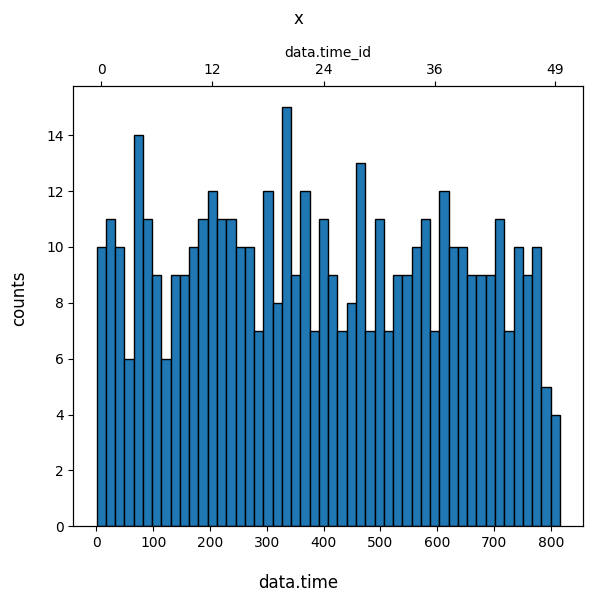
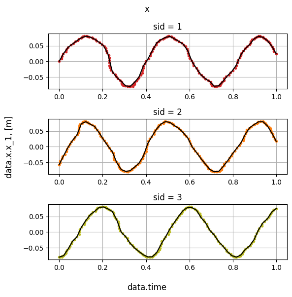
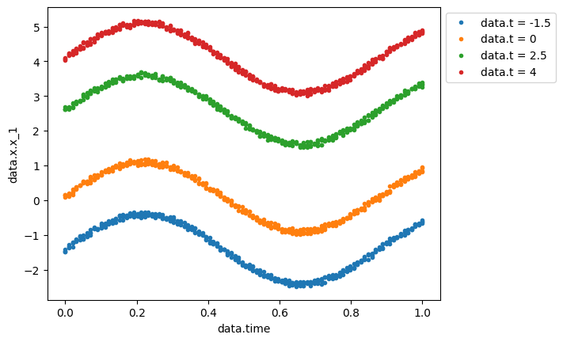

# Error analysis

For performing error analysis, module [error_analysis](error_analysis_description) is used. To download module:

```python
from citros_data_analysis import error_analysis as analysis
```

But first of all, let's have a quick look at [data_access](../data-access/data_access_description) module, which is dedicate to query data.

## Query data

To get access to a Citros database, create [**CitrosDB**](../data-access/data_access_description#citros_data_analysis.data_access.CitrosDB) object:

```python
from citros_data_analysis import data_access as da

citros = da.CitrosDB()
```
This way [**CitrosDB**](../data-access/data_access_description#citros_data_analysis.data_access.CitrosDB) is created with defaults parameters. To specify connection parameters, pass correspondiong arguments:

```python
citros = da.CitrosDB(host = 'hostName',
                     user = 'user',
                     password = 'myPassword',
                     database = 'myDatabase',
                     schema = 'mySchema',
                     batch = batchName,
                     port = '5432')
```

Data is always queried for exact topic. For examle, to query all data for topic 'A':

```python
df = citros.topic('A').data()
print(df)
```
<details>
    <summary>Show the result:</summary>

||sid	|rid	|time	|topic	|type	|data.x.x_1	|data.x.x_2	|data.x.x_3	|data.time	|data.time	|data.y
|--|--|--|--|--|--|--|--|--|--|--|--|
0	|3	|0	|0.105	|A	|a	|-0.080	|-0.002	|17.70	|0.3	|0.3	|[2, 28, 45]
1	|1	|0	|0.313	|A	|a	|0.000	|0.080	|154.47	|10.0	|10.0	|[15, 41, 43]
...|...|...|...|...|...|...|...|...|...|...|...
</details>

The result is a [**DataFrame**](https://pandas.pydata.org/docs/reference/api/pandas.DataFrame.html) of the [**pandas** package](https://pandas.pydata.org/).

Batch constists of two parts: json-data column, and all other columns.
To query exact json-objects, pass list with their labels to [**data()**](../data-access/data_access_description#citros_data_analysis.data_access.CitrosDB.data).
For example, if the json-data column looks like:

```python
data
{'x': {'x_1' : 1, 'x_2' : 12, 'x_3' : 70}, 'y': [5.0, 3.4, 10], 'height' : 12}
{'x': {'x_1' : 5, 'x_2' : 10, 'x_3' : 73}, 'y': [5.5, 6.7, 50], 'height' : 11}
...
```
to query 'x_1', 'x_2', 'height' and values from the first position of 'y' json-array, the following code may be used:
```python
df = citros.topic('A').data(['data.x.x_1', 'data.x.x_2', 'data.height', 'data.y[0]'])
```

Also, different constraints may be applied to query, see [examples of data_access module](../data-access/data_access_examples).

## Bin, interpolate and calculate statistics

### **CitrosData** object

To perform data analysis the [**CitrosData**](error_analysis_description#citros_data_analysis.error_analysis.CitrosData) object is used.
Say, we would like to investigate the 'x' vector and its behaviour depending on the time. Let's query data:
```python
df = citros.topic('A').data(['data.x', 'data.time'])
print(df)
```
<details>
    <summary>Show the output table:</summary>

||sid	|rid	|time	|topic	|type	|data.x | data.time
|--|--|--|--|--|--|--|--
0	|3	|0	|0.105	|A	|a	| {'x_1': -0.08, 'x_2': -0.002, 'x_3': 17.7}|0.3
1	|1	|0	|0.313	|A	|a	| {'x_1': 0.0, 'x_2': 0.08, 'x_3': 154.47}|10.0
...|...|...|...|...|...|...|...
</details>

[**CitrosData**](error_analysis_description#citros_data_analysis.error_analysis.CitrosData) object has two main attributes - 'data' - the depending variables whose behavior we would like to study, and all other additional columns - 'addData'. It is possible to specify which column(s) to treat as data by `data_label`. You may also specify `type_name` and `units` of the data to make future plots more informative.

```python
dataset = analysis.CitrosData(df,
                              data_label=['data.x'],
                              type_name = 'x',
                              units = 'm')
```
When [**CitrosData**](error_analysis_description#citros_data_analysis.error_analysis.CitrosData) object is created, it will turn all dicts or lists, if there were any in **df** rows, into separate columns and store them in 'data' attribute as a [**DataFrame**](https://pandas.pydata.org/docs/reference/api/pandas.DataFrame.html):

```python
print(dataset.data)
```
<details>
    <summary>Show the content of the 'data' attribute:</summary>

||data.x.x_1	|data.x.x_2	|data.x.x_3
|--|--|--|--|
0	|-0.080	|-0.002	|17.70
1	|0.000	|0.080	|154.47
...|...|...|...
</details>

All other data is stored in 'addData' attribute:

```python
print(dataset.addData)
```
<details>
    <summary>Show the content of the 'addData' attribute:</summary>

||sid	|rid	|time	|topic	|type	|data.time
|--|--|--|--|--|--|--|
0	|3	|0	|0.105	|A	|a	|0.3
1	|1	|0	|0.313	|A	|a	|10.0
...|...|...|...|...|...|...
</details>

It is possible to turn data of **CitrosData** object back to pandas.DataFrame. Method [**to_pandas()**](error_analysis_description#citros_data_analysis.error_analysis.CitrosData.to_pandas) concatenate 'data' and 'addData' attributes and return the result table as a pandas.DataFrame:

```python
F = dataset.to_pandas()
```
<details>
    <summary>The result of the concatenation:</summary>

||data.x.x_1	|data.x.x_2	|data.x.x_3	|sid	|rid	|time	|topic	|type	|data.time
|--|--|--|--|--|--|--|--|--|--
0	|-0.080|-0.002|	17.70	|3	|0	|0.105	|A	|a	|0.3
1	|0.000|	0.080|	154.47	|1	|0	|0.313	|A	|a	|10.0
...|...|...|...|...|...|...|...|...|...
</details>

### Bin data
Let's choose one of the parameter, say 'data.time', divide it into `n_bins` intervals and assign index to each of the interval. Then let's group values of the 'x' vector from the [previous example](#citrosdata-object) according to this binning and calculate the mean values of 'x' for the each group. This procedure may be done by function [**bin_data()**](error_analysis_description#citros_data_analysis.error_analysis.CitrosData.bin_data). To see the histogram and control number of counts falling in each bin, pass `show_fig` = True:

```python
db_bin = dataset.bin_data(n_bins = 50,
                          param_label = 'data.time',
                          show_fig = True)
```
<details>
    <summary>Show the distribution:</summary>


</details>

The result is a [**CitrosData**](error_analysis_description#citros_data_analysis.error_analysis.CitrosData) object too, whose `data` and `addData` attributes have two levels of indexes - the new obtained after binning indexes and 'sid'. Mean values of the vector 'x' are stored in 'data' attribute and values of the bin centers are stored in 'addData' attribute.

```python
print(db_bin.data)
```
<details>
    <summary>Show the content of the 'data' attribute:</summary>

|||data.x.x_1	|data.x.x_2	|data.x.x_3
|--|--|--|--|--
|data.time_id|	sid | | | |
|0|	1	|0.00000	|0.08000	|154.470000
| |   2	|-0.04460	|0.06540	|87.728000
| |   3	|-0.07900	|0.00975	|68.055000
|1|	1	|0.01600	|0.07800	|74.453333
| |   2	|-0.01600	|0.07800	|65.020000
...|...|...|...|...|
</details>


```python
print(db_bin.addData)
```
<details>
    <summary>Show the content of the 'addData' attribute:</summary>

|||data.time
|--|--|--|
|data.time_id|	sid	
|0	|1	|8.458
|    |2	|8.458
|    |3	|8.458
|1	|1	|24.774
|    |2	|24.774
|...	|...|	...
</details>

### Scale data
Another approach besides from binning is to scale parameter to [0,1] interval and interpolate data on this new interval with equally spaced points. Data of different 'sid' values processed independently. The function to perform this is [**scale_data**](error_analysis_description#citros_data_analysis.error_analysis.CitrosData.scale_data). It's syntax is pretty similar to [**bin_data()**](#bin-data):

```python
db_sc = dataset.scale_data(n_points = 50,
                                param_label = 'data.time', 
                                show_fig = False)
```
Structure of the output is similar too:

```python
print(db_sc.data)
```
<details>
    <summary>Show the content of the 'data' attribute:</summary>

|||data.x.x_1	|data.x.x_2	|data.x.x_3
|--|--|--|--|--
|data.time_id|	sid | | | |
|0	|1	|0.000000	|0.080000	|154.470000
|   | 2	|-0.057000  |0.056000	|108.950000
|   | 3	|-0.080000  |-0.002000|17.700000
|1	|1	|0.025494	|0.075573	|6.569425
|   | 2	|-0.028482  |0.074719	|167.725144
|...|...|...	    |...	   |...
</details>

```python
print(db_sc.addData)
```
<details>
    <summary>Show the content of the 'addData' attribute:</summary>

|||data.time
|--|--|--|
|data.time_id|	sid	
|0	|1	|0.000000
|   |2	|0.000000
|   |3	|0.000000
|1	|1	|0.020408
|   |2	|0.020408
|...|...|...
</details>

As previously in the case of [**bin_data()**](#bin-data) method, to controll if the number of point should be increased, pass `show_fig` = True and the result of interpolation for each of the vector's component will be shown. Plots are shown for the first five 'sid' values.

<details>
    <summary>Show example for example the 'x_1':</summary>


</details>

### Statistics

#### Get statistics

Now, when we bin or scale data over one of the independent parameter and set new indices according to these procedures, we are able to study statistics for each of these indices.
[**get_statistics()**](error_analysis_description#citros_data_analysis.error_analysis.CitrosData.get_statistics) method is dedicated to do it:

```python
stat = db_sc.get_statistics()
```
It returns [**DataFrame**](https://pandas.pydata.org/docs/reference/api/pandas.DataFrame.html) with mean values, covariant matrix and dispersion (the square root of its diagonal elements) calculated over sids for each index.

```python
print(stat)
```
||data.time|	mean|	covarMatrix	|sigma
|--|--|--|--|--
|data.time_id||||
0|	0.000000|array([... |array([[...| array([...
1|	0.020408 | array([... |array([[... | array([...
...|...|...|...|...

The type of 'mean', 'covarMatrix' and 'sigma' values in each row are numpy.ndarray:

```python
>>> print(stat['covarMatrix'].iloc[0])

array([[1.69633333e-03, 1.54366667e-03, 2.60583167e+00],
       [1.54366667e-03, 1.77733333e-03, 2.93335333e+00],
       [2.60583167e+00, 2.93335333e+00, 4.85077763e+03]])
```

```python
>>> print(stat['mean'].iloc[0])

array[-4.56666667e-02  4.46666667e-02  9.37066667e+01]
```

```python
>>> print(stat['sigma'].iloc[0])

array([4.11865674e-02, 4.21584313e-02, 6.96475242e+01])
```

#### Plot statistics

To visualize statistics [**show_statistics()**](error_analysis_description#citros_data_analysis.error_analysis.CitrosData.show_statistics) function is used. It plots values from `data` attribute vs. independent parameter for each of the sid, the mean value over all sids and 3 $\sigma$ interval. If 'data' has several components, like in the example above ('x_1', 'x_1', 'x_3'), it makes separate plots for each of the component: 

```python
db_sc.show_statistics()
```
<details>
    <summary>Show the statistics plot:</summary>


</details>

To study in details the features at the exact 'data.time' value see about [**show_correlation()**](#correlation) method.

## Correlation

Function [**show_correlation()**](error_analysis_description#citros_data_analysis.error_analysis.CitrosData.show_correlation) plots correlation between two variables for the exact index `slice_id`. Applying it to the previous example for the time_id = 0:
```python
db_sc.show_correlation(x_col = 'data.x.x_1',
                       y_col = 'data.x.x_2',
                       slice_id = 0,
                       n_std = [1,2,3])
```
The value of the independent parameter, that corresponds to `slice_id` = 0 is 0.0. This information is printed in the output:
```python
slice_id = 0,
slice_val = 0.0
```
<details>
    <summary>Show the correalation plot:</summary>


</details>

Pass to `x_col` and `y_col` either label or index of the columns to plot along x and y axis respectively. Instead of `slice_id` index the value `slice_val` may be specified. That way, the nearest `slice_id` index will be found and the corresponding to it exact value of `slice_val` will be printed. `n_std` states the radious or radii of the confidence ellipses in sigmas. If `bounding_error` = True, then the bounding error circle is added to plot.

The following code plots first column ('data.x.x_1') vs. second ('data.x.x_2') for the id, nearest to 'data.time' = 0.2 and plots bounding error circle.

```python
db_sc.show_correlation(x_col = 0,
                       y_col = 1,
                       slice_val = 0.2,
                       n_std = [1,2,3],
                       bounding_error = True)
```
The nearest to `slice_val` = 0.2 `slice_id` turned out to be 10 and the exact value, that corresponds to `slice_id` = 10 is 0.204: 
```python
slice_id = 10,
slice_val = 0.204
```
<details>
    <summary>Show the correalation plot with bounding error:</summary>


</details>

To plot correlation between variables from different [**CitrosData**](#citrosdata-object) objects, pass the object by `db2` parameter. This way, `x_col` is supposed to be the column of the first [**CitrosData**](#citrosdata-object) objects, while `y_col` - the column of the `db2`. If `slice_val` is passed, then the `slice_id` is searched for each [**CitrosData**](#citrosdata-object) objects.

Let's query for topic 'B', scale it over 20 points and plot correlation between 'data.x.x_2' of `db_sc` vs. 'data.x.x_1' of `db_sc_B` near the point 'data.time' = 0.7:

```python
#download columns 'data.x' and 'data.time' for topic 'B'
df_B = citros.topic('B').data(['data.x', 'data.time'])

#construct CitrosData object with 3 data-columns from 'data.x'
dataset_B = analysis.CitrosData(df, type_name = 'x', data_label=['data.x'], units = 'm')

#scale data
db_sc_B = dataset.scale_data(n_points = 20, 
                             param_label = 'data.time', 
                             show_fig = False)

db_sc.show_correlation(db2 = db_sc_B,
                       x_col = 'data.x.x_2',
                       y_col = 'data.x.x_1',
                       slice_val = 0.7,
                       n_std = [1,2,3])
```
The output is:
```python
slice_id = 34,
slice_val = 0.694,
slice_id_2 = 13,
slice_val_2 = 0.684
```
<details>
    <summary>Show the plot:</summary>


</details>

## Regression
Different input parameters may vary the output, and to predict how the parameter affects the result, regressions are used. By now, three methods of regression are supported: polinomial regression ('poly'), simple neural net regression ('neural_net') and gaussian mixture model ('gmm'). To apply regression analysis, we need to construct [**CitrosDataArray**](error_analysis_description#citros_data_analysis.error_analysis.CitrosDataArray) object, that stores [**CitrosData**](#citrosdata-object) objects with different input parameters.

```python
db_array = analysis.CitrosDataArray()
```

Let's say for the topic 'A' we have data for four different values of the parameter 't', that is written in json-data column 'data.t'. First, let's get all possible 'data.t' values for topic 'A' (see [examples](../data-access/data_access_examples) of [data_access](../data-access/data_access_description) module):
```python
>>> list_t = citros.get_unique_values('data.t', filter_by = {'topic' : 'A'})
>>> print(list_t)

[-1.5, 0, 2.5, 4]
```
Now let's query data for each of these parameter values, set it as parameter, scale data over 'data.time' and put to [**CitrosDataArray**](error_analysis_description#citros_data_analysis.error_analysis.CitrosDataArray):

```python
for t in list_t:
    #query data
    df = citros.topic('A').\
                set_filter({'data.t': [t]}).\
                data(['data.x.x_1', 'data.time', 'data.p', 'data.t'])
    
    #create CitrosData object and set 'data.t' as a parameter.
    dataset = analysis.CitrosData(df,  
                                  data_label=['data.x.x_1'], 
                                  type_name = 'x',
                                  units = 'm', 
                                  parameter_label = ['data.t'])

    #scale over 'data.time'
    db_sc = dataset.scale_data(n_points = 100, 
                               param_label = 'data.time', 
                               show_fig = False)

    #store in CitrosDataArray by add_db() method
    db_array.add_db(db_sc)
```
To set value from 'data.t' column as a parameter, pass the column label to `parameter_label` argument of [**CitrosData**](#citrosdata-object) object. 

If a column with parameters is not presented, it is possible to put `dict` with parameters by `parameters` argument:

```python
dataset = analysis.CitrosData(df,  
                              data_label=['data.x.x_1'], 
                              type_name = 'x',
                              units = 'm', 
                              parameters = {'data.t': t})
```
or set parameters manualy by [`set_parameter(`](error_analysis_description#citros_data_analysis.error_analysis.CitrosData.set_parameter) method. It accepts either setting parameter one by one by `key` and `value`:
```python
db_sc.set_parameter(key = 'data.t', value = 0)
```
or by passing dictionary by `item`:
```python
db_sc.set_parameter(item={'data.t': 0})
```
The last method allows you to pass multiple parameters, for example:
```python
db_sc.set_parameter(item={'param_1':0, 'param_2':1, 'param_3':2})
```

Let's take a look at the scaled to [0,1] interval data:
```python
import matplotlib.pyplot as plt

for db in db_array.dbs:
    plt.plot(db.addData['data.time'], db.data['data.x.x_1'], 
             '.', label = 'data.t = ' + str(db.parameters['data.t']))
plt.xlabel('data.time')
plt.ylabel('data.x.x_1')
plt.legend(bbox_to_anchor=(1.0, 1.0))
```

It is a sine function with some noise added, biased by 'data.t' value.

<details>
    <summary>Show the figure:</summary>


</details>

Let's find the solution for the case 'data.t' = 1 by [**get_prediction()**](error_analysis_description#citros_data_analysis.error_analysis.CitrosDataArray.get_prediction) method. Parameter label (in our case 'data.t') and value (1), for which the prediction is desired, should be passed as `dict` by `parameters` argument. Method of regression calculation ('poly' for polinomial regression, simple  'neural_net' for neural net regression and 'gmm' for gaussian mixture model) should be stated by `method` argument.

### Polynomial regression

The first method is a polynomial regression, with the highest polynomial order defined by `n_poly`:
```python
result = db_array.get_prediction(parameters = {'data.t': 1},
                                 method = 'poly', 
                                 n_poly = 2,
                                 show_fig = True)
```
<details>
    <summary>Show the figure:</summary>


</details>

The result is a [**DataFrame**](https://pandas.pydata.org/docs/reference/api/pandas.DataFrame.html).
<details>
    <summary>Show the result:</summary>

||data.time|	data.x.x_1
|--|--|--|
0|	0.000000|	1.155301
1|	0.010101|	1.145971
2|	0.020202|	1.232255
...|...|...
</details>

### Neural net

The second method is 'neural_net', which is based on the [`sklearn.neural_network.MLPRegressor`](https://scikit-learn.org/stable/modules/generated/sklearn.neural_network.MLPRegressor.html) class. Its the most important arguments are `activation`, that defines activation function for the hidden layers ('relu', 'identity', 'logistic' or 'tanh'), `max_iter` - maximum number of iteration, `solver` - solver for weight optimization ('lbfgs', 'sgd' or 'adam'), `hidden_layer_sizes` - the number of neurons in the ith hidden layer, see [`sklearn.neural_network.MLPRegressor`](https://scikit-learn.org/stable/modules/generated/sklearn.neural_network.MLPRegressor.html) for the details of the other possible arguments.

```python
result = db_array.get_prediction(parameters = {'data.t':1}, 
                                 method = 'neural_net',
                                 activation='tanh', max_iter = 200, solver='lbfgs',
                                 hidden_layer_sizes = (8,), random_state = 9,
                                 show_fig = True)
```
<details>
    <summary>Show the figure:</summary>


</details>

### Gaussian mixture model

The last method is a gaussian mixture model:
```python
result = db_array.get_prediction(parameters = {'data.t':1}, 
                                 method = 'gmm',
                                 show_fig = True)
```
<details>
    <summary>Show the result:</summary>


</details>

### Regression comparison

To compare the results of these methods, list their names as `method`:

```python
result_list = db_array.get_prediction(parameters = {'data.t':1}, 
                                      method = ['neural_net', 'poly', 'gmm'],
                                      n_poly = 2, 
                                      activation='tanh', solver='lbfgs', hidden_layer_sizes = (8,), random_state = 9,  
                                      show_fig = True)
```
<details>
    <summary>The resulting plot:</summary>


</details>

That way, the returning result is a list of the [**DataFrames**](https://pandas.pydata.org/docs/reference/api/pandas.DataFrame.html).