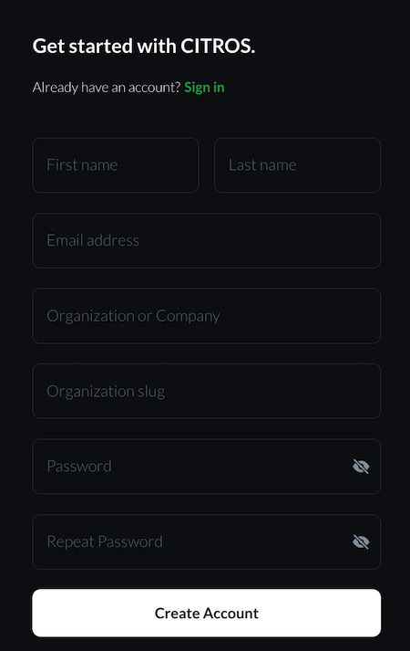

# Registration

## Description

The first step to work with CITROS is registration and login. 
This is a step-by-step guide to account registration an login into [CITROS](http://citros.io/) account.

## Table Of Contents
1. [Account Registration](#account-registration)
2. [Account Registration by Invitation](#account-registration-by-invitation)
3. [Log in to CITROS](#logging-into-citros)
4. [Reset Password](#reset-password)

## Account Registration

1. Open [CITROS](http://citros.io/) website.

2. Click on the "Get Started" button.

3. Enter details, all fields required
  - First Name, 
  - Last Name
  - Email
  - Organization Name or Company name
  - Organization Slug

  :::note 
  *Organization slug is the unique identifier of the organization. For example: Lulav Space slug is: lulav-space*
  :::

  - Password
  - Repeat Password

4. Click on "Create Account"

5. Success message will appear

6. You should receive an email notifying that we have received your registration request.

**This is not an activation email**

7. the CITROS team will be notified of a new User and Organization. We will review the information and confirm the request. Shortly after, you will receive a confirmation email.

8. You can now login into [CITROS](https://citros.io/auth/login) account with the email and password you entered in registration

## Account Registration by Invitation

After organization admin has invited you to join the organization, you should receive an invitation email.

1. To proceed, click "LOG IN" button in your invitation email.

2. Enter details, all fields required
  - First Name, 
  - Last Name
  - Password
  - Repeat Password

3. Click on "Create Account".

4. You can now login into [CITROS](https://citros.io/auth/login) account with the email and password you enterd in registration

## Log in to CITROS

1. Open [CITROS](http://citros.io/) website.

2. Click the "Sign In" button

3. Enter your email and password and click "Login".

## Reset Password

For security reasons, if you ure unable to login to your account and need to reste your password, please contact our support team directly at [support@citros.io](mailto:support@citros.io)