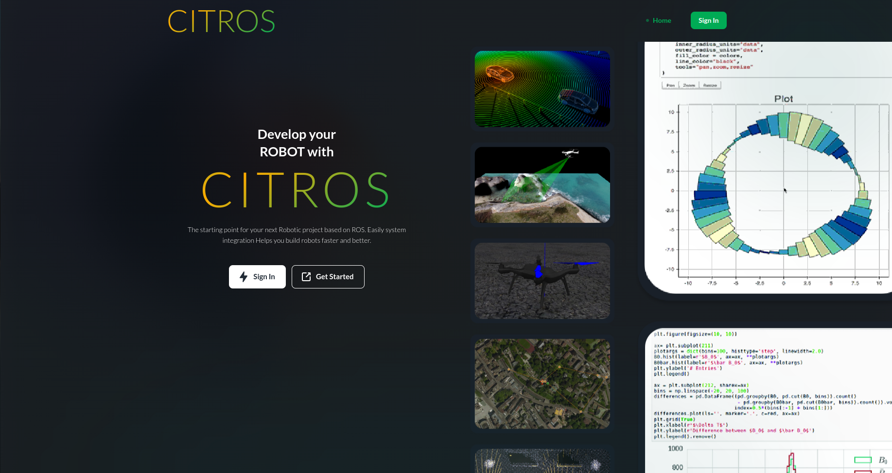
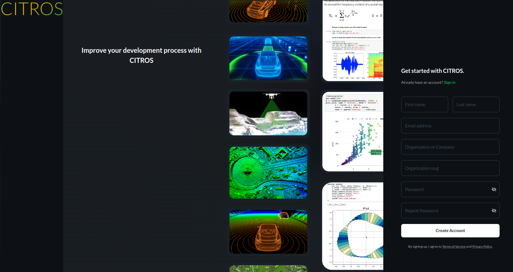
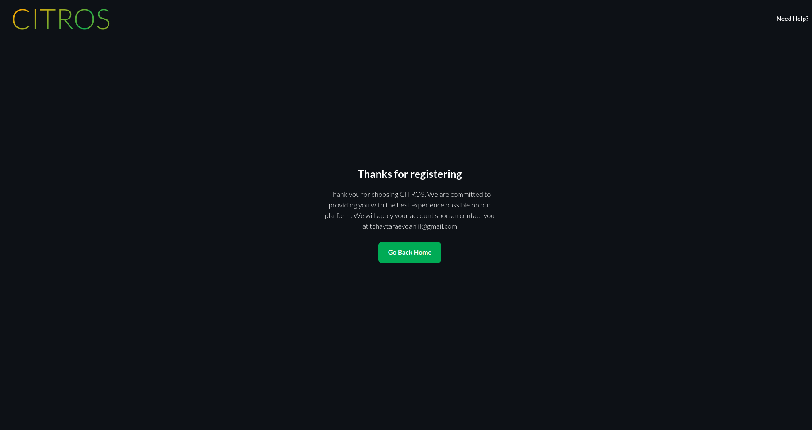
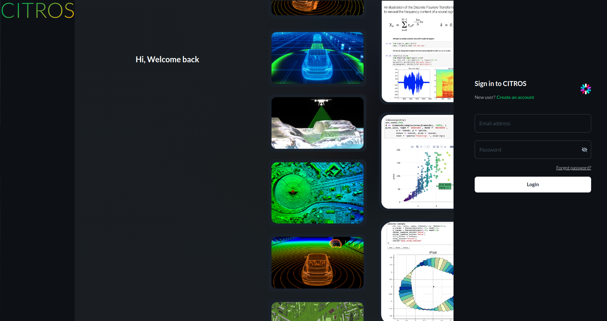

<!-- ---
sidebar_label: 'Documentation'
description: 'Documentation'
hide_title: true
--- -->

# Account Entrance

### Description

The first step to work with CITROS is registration (or login). This guide will take you through the process of registering and/or logging into your account step by step.

## Account Registration

- Open [CITROS](http://citros.io/) website.

- Click on the "Get Started" button, and you will be redirected to the registration page.

- Enter your First Name, Last Name, Email, Organization Name, and Organization Slug (the lowercase version of the organization name; it should contain only lowercase letters or numbers). Finally, set your password. Click on "Create Account", and if all fields are correctly filled, you will be redirected to this page:

- You will receive an email notifying you that we have received your registration request.

- At this step, the CITROS team will be notified of a new User and Organization. We will review the information and confirm the request. Shortly after, you will receive a confirmation email.

- Then, you can return to the [CITROS](http://citros.io/) website and log in.

## Logging into CITROS

- Open [CITROS](http://citros.io/) website.

- Click on the "Sign In" button, and you will be redirected to the login page.

  

- Enter your email and password and click "Login".
- If the data you entered is correct, you will be logged into CITROS.

## Inviting a New User to Your Organization (For admin users only)

- Open the "Settings" tab on the main CITROS page.

- Click on the "Invite User" button at the top right of the tab. The user invitation drawer will appear.

- Enter the email address of the user you wish to invite in the "Email address" field and click "Invite User". Right after, a confirmation dialog will pop up. Double-check the email address you entered and if it's correct, click "Confirm".

- Afterward, an invitation email will be sent to the address you provided. You will see a snack bar confirming that the user invitation was successful.

## Account Reegistration by invitation

- If you have been invited to CITROS, you will receive an invitation email.

- Click "Log In" to proceed to the registration page.

- Enter your First Name, Last Name, and password. Click on "Create Account" and if all fields are filled correctly, you will be redirected to the Login page.

- Log into CITROS.
