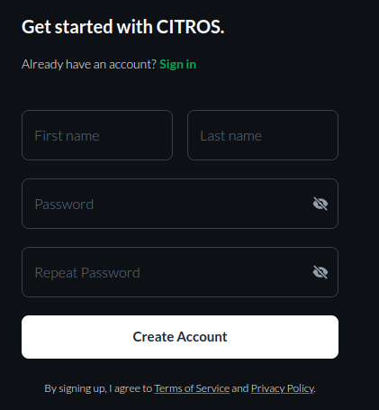

# Account Entrance

## Description

The first step to work with CITROS is registration (or login). This is a step-by-stpe guide of the registering and/or logging process into [CITROS](http://citros.io/) account.

## Account Registration

1. Open [CITROS](http://citros.io/) website.

2. Click on the "Get Started" button.

3. Enter details, all fields required
  - First Name, 
  - Last Name
  - Email
  - Organization Name or Company name
  - Organization Slug
  :::note
  *Organization slug is the unique identifier of the organization.*
  *For example: Lulav Space slug is: lulav-space*
  :::
  - Password
  - Repeat Password

4. Click on "Create Account"

5. Success message will appear

6. You shuold receive an email notifying that we have received your registration request.
**This is not an activation email**

7. the CITROS team will be notified of a new User and Organization. We will review the information and confirm the request. Shortly after, you will receive a confirmation email.

8. You can now login into [CITROS](https://citros.io/auth/login) account with the email and password you enterd in registration

## Logging into CITROS

1. Open [CITROS](http://citros.io/) website.

2. Click the "Sign In" button

3. Enter your email and password and click "Login".

## Inviting a New User to Your Organization (Admin Users Only)

1. Open the "Settings" tab on the main CITROS page.

2. Click on the "Invite User" button at the top right of the tab. The user invitation drawer will appear.

3. Enter the email address of the user you wish to invite.

4. click "Invite User". 

5. click "Confirm" the email appears in dialog or "Cancel" to change address.

6. Success notification will pop-up.

7. Invitation email will be sent to the address you provided. 

## Account Reegistration by Invitation

1. Click "LOG IN" button in your invitaation email.

2. Enter details, all fields required
  - First Name, 
  - Last Name
  - Password
  - Repeat Password

3. Click on "Create Account".

4. You can now login into [CITROS](https://citros.io/auth/login) account with the email and password you enterd in registration
