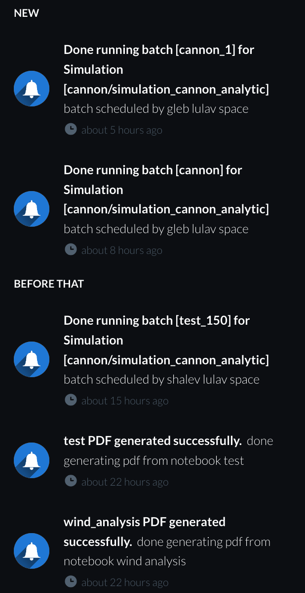
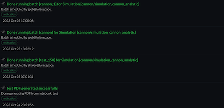
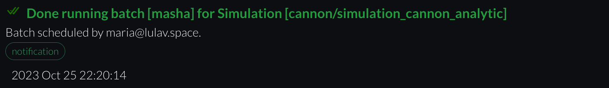

# Notifications

Notifications presents the completion of each process in CITROS within the organization. For example pdf document created, batch run finished, etc.

## Notifications Window

The Notifications tab contains a list of 5 latest notifications received 

### Notifications List

Each list item represents a notification. it contains the following fields:
- Notification Title
- Notification Description
- Notification Type (notification, announcement, etc.)
- Notification creation date

### New Notification
When new notification added the bell icon will have a red indicator with number indicating how many notifications are unread.

### Notifications Indicator

Text indicates how many unread notifications exist.

### View All Button

"View All" button redirects to the [notifications screen](#notifications-screen).

### Click On Notification

Clicking on a notification redirects to the relevant location associated with the notification

## Notifications Screen

The Notifications tab contains a list of all notifications received 

### Notifications List

Each list item represents a notification. it contains the following fields
- Notification Title
- Notification Description
- Notification Type (notification, announcement, etc.)
- Notification creation date

### New Notification

When new notification added the "v" icon will be green

### Search Box
This allows to search a notification name by entering it in the text box

### Mark as Read Button

Pressing on the button marks all notifications as read

### Click On Notification

Clicking on a notification redirects to the relevant location associated with the notification

