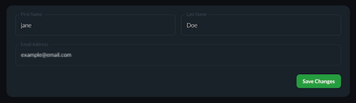
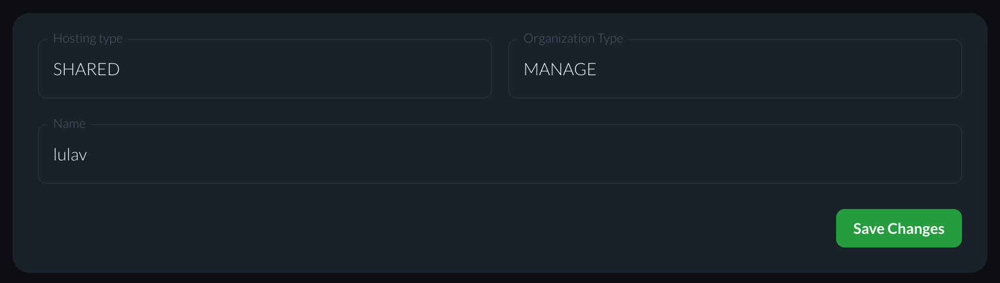
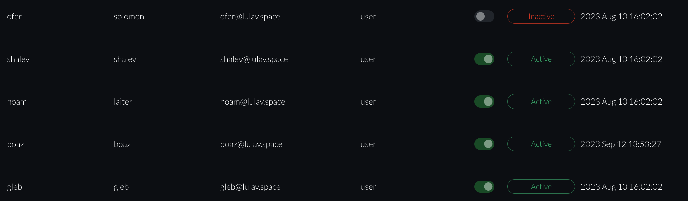
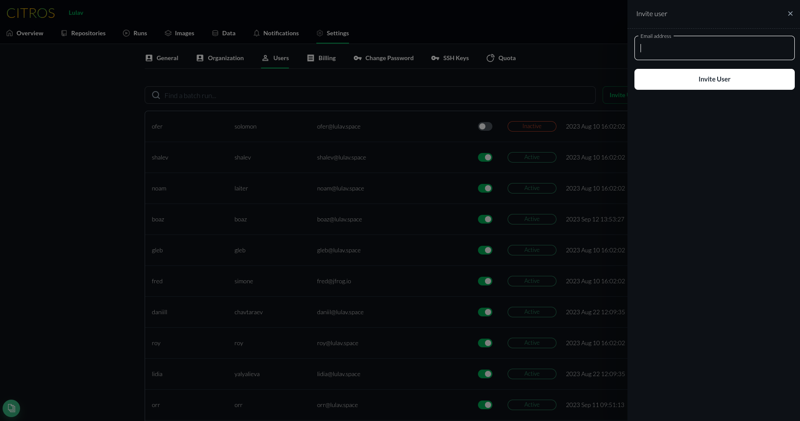
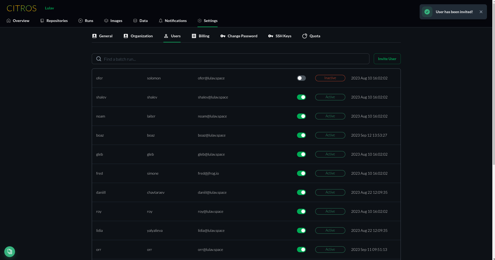
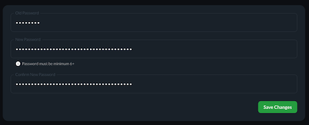
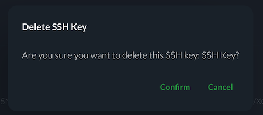

# Settings

Settings screen contains a few tabs which represent each option a user has.
Some of the settings are open only to admin users.

## Table of Contents
1. [Access to Settings](#access-to-settings)
2. [General](#general)
3. [Organization](#organization)
4. [Users](#users)
5. [Change Password](#change-password)
6. [SSH Keys](#ssh-keys)

## Access to Settings
The settings screen can be entered in two ways

1. from the gear in the top right corner of the screen. this option is available throughout all screens.

    1. Click on Gear icon
    2. Choose Settings

2. From settings tab which available in your home page

## General

General screen contains general details

- First Name
- Last Name 
- Email address

The first and last name are changeable
1. Click on the box to edit
2. After editing is done, Click "Save Changes" button

The email address cannot be changed.

## Organization

Organization screen contains organization details 

- Hosting Type
- Organization Type 
- Name

This details cannot be changed.

## Users

Users Screen contains a list of all users in the organization.

Each list item contains
- First Name
- Last Name
- Email
- User Type (user or admin)
- User Activation Toggle (Can be changed only by admin)
- User Status Active/ Inactive
- Date added to organization

### Search Box

This allows to search a user by entering an email in the text box.

### Invite Users

:::note
Only admin can invite users
:::
1. Click on "Invite User" button

2. Enter the email address of the user you wish to invite.

3. click "Invite User". 

4. click "Confirm" the email appears in dialog or "Cancel" to change address.

5. Success notification will pop-up.

6. Invitation email will be sent to the address you provided. 

### User Activation

:::note
Only admin can change user activation state
:::

Toggle to activate or deactivate the user in the user list.

## Change Password

The change password screen offers you to update your password.
You must have your old password to update your password.

To change password:
1. Insert old password

2. Insert new password. Password must be at least 8 characters 

3. Repeat new password.

4. Click "Save Changes" button.

## SSH Keys

SSH Keys screen contains a list of all SSH Keys added to your CITROS account

### Add SSH Key to List

1. [Generate SSH Key](/docs/authentication/ssh/ssh_generate_key.md)

2. [Add New Key](/docs/authentication/ssh/ssh_add_new.md).

3. Click "New SSH Key" button

4. Enter SSH key name.

5. Paste the SSH key copied to clipboard.

6. Click "Add" button to add the SSH Key to the account.

7. The new key will be added to the list item

### Delete Key 

1. Click the Delete Button to the right of the key.

2. Confirm deletion or cancel otherwise

