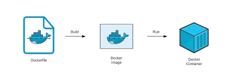
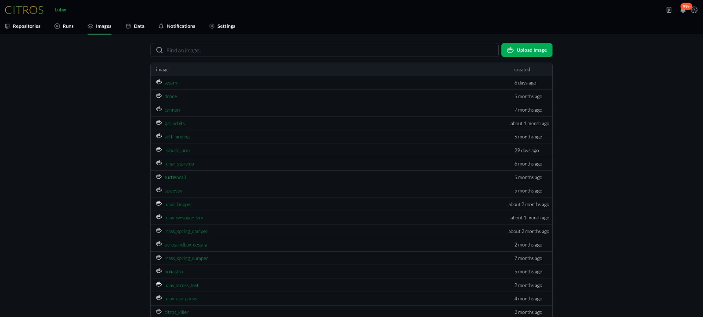

#  Dockerfile Overview

After configuring the simulation environment and conducting a local simulation using [citros_cli](https://citros.io/doc/docs_cli), the next step is to enhance CITROS' capabilities by deploying the simulation environment to the cloud.

Cloud deployment provides the flexibility to execute multiple parallel simulations, each with predefined parameter distributions. This facilitates Monte-Carlo analysis and leverages the machine learning capabilities of CITROS.

# Table Of Contents

1. [About Dockerfiles](#about-dockerfiles)
2. [Write Your Own Dockerfile](#write-your-own-dockerfile)
3. [Required Packages for CITROS Usage](#required-packages-for-citros-usage)

# About Dockerfiles

[Dockerfiles](https://docs.docker.com/get-started/02_our_app/) are essential components when deploying your CITROS simulation environment on the cloud. A Dockerfile is a text file that contains a set of instructions to build a Docker container image. 
These images encapsulate all the necessary software, libraries, and dependencies required to run your application consistently across different environments. By utilizing Dockerfiles, you can ensure that your simulation environment remains reproducible, scalable, and easily deployable on cloud platforms. Whether you're performing Monte-Carlo analysis or harnessing machine learning capabilities, Dockerfiles play a crucial role in streamlining the deployment process and maximizing CITROS' potential.

# Write Your Own Dockerfile

Creating a customized Dockerfile tailored to your CITROS simulation environment is a fundamental step in harnessing the full power of cloud deployment. A well-crafted Dockerfile allows you to define the exact configuration and dependencies your simulation needs, ensuring a consistent and reliable execution environment. The Dockerfile should build and install all the relevant libraries, packages and source code as the local simulation environment.
Here are the key steps to write your Dockerfile:

1. **Select a Base Image:** Begin by choosing a base image that matches your application's requirements. The base image serves as the starting point for your container and may include an operating system and pre-installed software.

2. **Install Required Packages:** Use the `RUN` instruction to install any necessary packages, libraries, and tools. You can also copy any custom scripts or configurations into the container.

3. **Set Environment Variables:** Use the `ENV` instruction to define environment variables that your application relies on. This ensures proper configuration within the container.

4. **Specify the Entry Point:** Use the `CMD` or `ENTRYPOINT` instruction to define the command that should be executed when the container starts. This is typically the command to run your CITROS simulation.

5. **Build the Docker Image:** Use the `docker build` command to build your Docker image, referencing your Dockerfile. This command will create an image containing your CITROS environment.

6. **Run Tests**: Use the `docker run` command to locally run your simulation' image, verifying the setup works before pushing the image to CITROS.

6. **Push Your Image to CITROS:** Use [`citros docker-build-push`](https://citros.io/doc/docs_cli/commands/cli_commands#command-docker-build-push) command to build and push your docker image to CITROS.

Once the upload of the docker image is done, you can check on CITROS [Image](https://citros.io/doc/docs/repos/repository/repo_sc_images) tab that the image exists.

# Required Packages for CITROS Usage

* `citros`: This will allow CITROS to run the simulation image in the servers. Install with (`RUN pip install citros`) in your Dockerfile.
* `rosbag2-storage-mcap`(***Only for ROS 2 foxy version***): For recording bags using [`mcap`](https://mcap.dev/guides/getting-started/ros-2) format. Install with (`RUN apt-get update && apt-get install -y ros-foxy-rosbag2-storage-mcap`) in your Dockerfile.