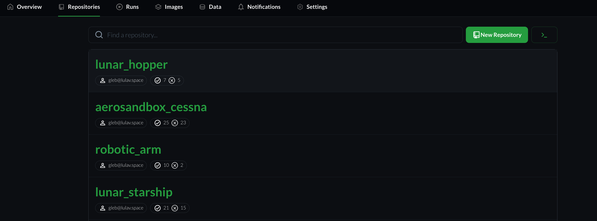
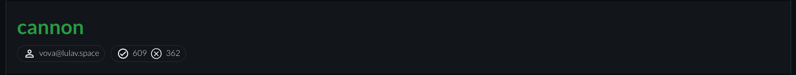

# Repositories Screen

## Introduction

The `Repositories` tab contains a list of all organization's repositories.
It allows you to manage and monitor repositories easily and efficiently. 

## Repositories List

Each list item represents a repository. it contains the following fields
- Repository Name
- Uploader name - The team member who uploaded the project
- Number of successful runs
- Number of failed runs

## Search Box

This allows to search a repository name by entering it in the text box

## New Repository Button

Pressing on the button opens a window with a step-by-step instructions to upload a new repository

