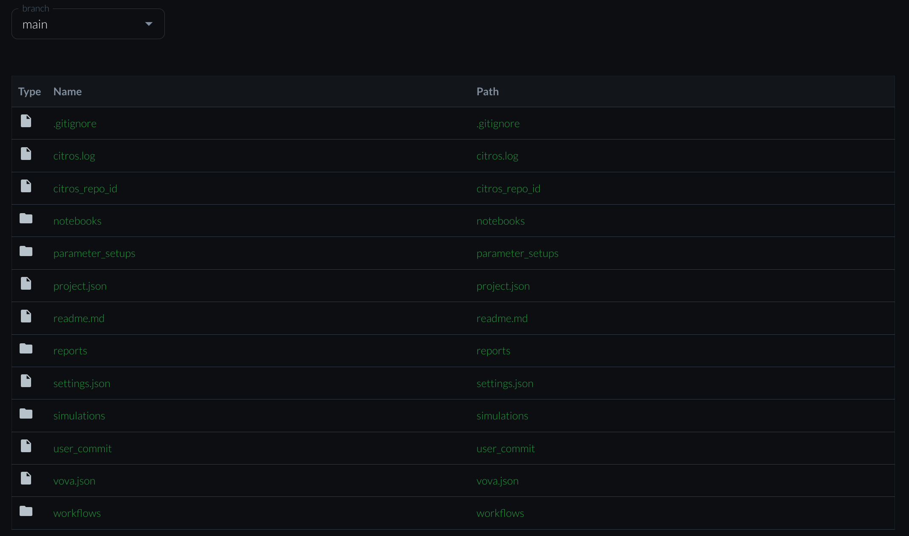
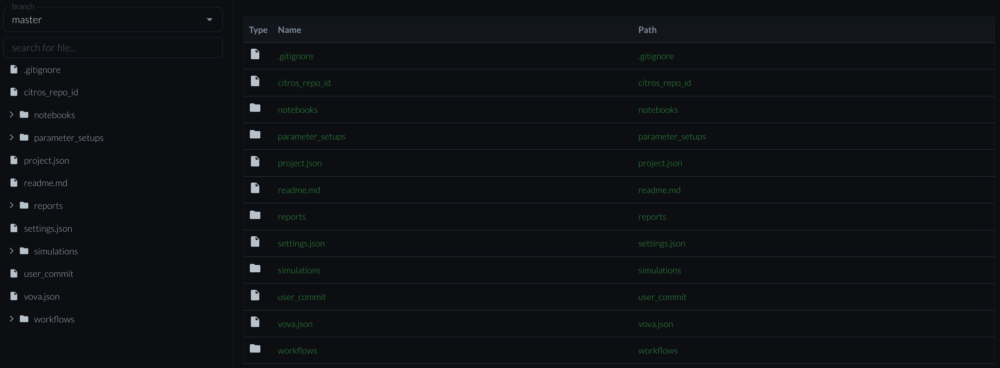

# Repository Code

## Introduction

The code tab contains the full code structure and directories of the repository

## Code Table

The code structure described in a table with the following fields:

1. Type - Directory or file

2. Name - Name of directory or file

3. Path - The path of the directory or file in the code

## Directories and Files Description

### Directory `notebooks`

  
Description
  

The `notebooks` directory in your CITROS simulation contains all the Jupyter-Notebook files. These notebooks help you process the data after running a CITROS simulation. It is recommended to use IPYNB files for this purpose, as they are primarily used by Jupyter Notebook - an interactive computational program designed to assist users in manipulating and analyzing Python language.

The advantages of IPYNB files is that they are human-readable, as plain text files formatted using JSON (JavaScript Object Notation), which makes them easy to read. Additionally, IPYNB files are saved in an open standard file format, which means they are accessible to anyone. Furthermore, IPYNB files can easily be converted to other formats such as HTML, PDF, reStructuredText, and LateX formats.

For further information on how to process the data and analyze the results you can see [here](../docs_data_analysis/data_access/getting_started.md).

### Directory `parameter_setups`

Description

The `parameter_setups` directory stores your JSON-formatted parameter setup files. When you initialize your citros repository, a `default_param_setup.json` file is automatically generated. This file consolidates all the default parameters for every node across all the packages in your ROS project, providing a consolidated and easily accessible record of these parameters.

The file `default_param_setup.json` will not be overwritten during citros `init`, `run` or `status` commands. Nevertheless, it is recommended to duplicate this file under a different name within the `parameter_setups` directory before making any modifications. This practice ensures your custom setups are preserved and allows you to experiment with various parameter configurations.
    
The structured format of the parameter setup files streamlines both the understanding and alteration of parameters for each node in your ROS project. This becomes especially valuable when you're keen to explore the influence of different parameter values on your ROS project's behavior. Take, for instance, a static parameter value like 42. Instead of hard-coding it, you could use a *function object* to derive a value from a normal distribution centered at 42. The introduction of function objects broadens your horizons, enabling you to use any numpy function or even craft user-defined functions for meticulous computational adjustments. A prime example is when parameter values are intricate, making them cumbersome to hard-code; in such scenarios, you can devise a function to fetch them from a file. In essence, this newfound flexibility paves the way for limitless computational and manipulative possibilities for your parameters.

<!-- To learn more about how to include functions in the parameter file, you can find detailed information on the process [here](/docs_cli/configuration/config_params.md). -->

### Directory `reports`

  
Description

  TODO

### Directory `simulations`

Description

The `simulations` directory stores your JSON-formatted simulation files.

A simulation json file is an auto-generated file corresponding to each launch file in your ROS project. For instance, a launch file named `foo.launch.py` will have a corresponding `simulation_foo.json` file. This file outlines the details necessary to run the corresponding simulation, specifying parameters, resources, and launch files.

Here's a breakdown of its typical structure and content:

- `description`: This is a descriptive field for the simulation setup. You can modify it to better describe your specific simulation.

- `parameter_setup`: This field points to the parameter setup JSON file that will be used for this simulation. By default, it points to `default_param_setup.json`, but you can point it to any custom parameter setup file you created in the `parameter_setups` directory.

- `launch_file`: Specifies the ROS launch file that will be used to start the simulation. For instance, `foo.launch.py`.

- `timeout`: This is the maximum time (in seconds) the simulation is allowed to run. The default is 60 seconds. If the simulation does not conclude within this timeframe, it will be terminated.

- `GPU`: Specifies the number of GPU resources required for the simulation. The default is 0, indicating that no GPU resources are needed.

- `CPU`: Specifies the number of CPU resources required for the simulation. The default is 2.

- `MEM`: Specifies the amount of memory required for the simulation in megabytes, e.g., 265.

- `storage_type`: This setting determines the storage format for the ROS bag files generated during the simulation's runs. The possible valid value are `SQLITE3` (default) and `MCAP`.

You can modify these fields to suit your simulation needs, just remember to save your customized version under a different name to prevent overwriting during citros `init`, `run`, or `status` commands.

### Directory `workflows`

Description

The `workflows` directory stores your JSON-formatted workflow files.

A flow.json file (e.g. `default_flow.json` which is auto-generated during `citros init`) is a user-crafted file used to automate and manage the flow of simulations in a citros repository. This file controls when the flow is triggered, which simulations are running, the post-processing analysis using Jupyter notebooks, and the recipients of the final reports. Here is a breakdown of its structure and content:

- `trigger`: This field specifies the event that initiates the flow. It is usually tied to some form of version control event, like a Git push, but can be configured according to the user's needs.

- `simulations`: This is an array of simulations to be run, specified as pairs of simulation name and the number of times to run them. For example, ["sim1", 17] means the simulation "sim1" will be run 17 times. Multiple simulations can be listed and each will be run the specified number of times.

- `notebooks`: This is a list of Jupyter notebooks used for post-processing analysis of the simulation results. For example, ["nb1.ipynb", "nb2.ipynb"] means these two notebooks will be run once the simulations complete, with the results used as their input data.

- `recipients`: This is a list of email addresses that will receive the reports generated from the notebooks' analysis.

The flow.json file helps to streamline and automate your citros repository by tying together simulation runs, data analysis, and report distribution into a single manageable file. You can customize it to suit the specifics of your project.

### File `project.json`

Description

The project.json file is a key component of your Citros repository. It contains metadata about your ROS project, and is automatically generated by the citros `init`, `run` and `status` commands. Here's a description of its top-level fields:

- `citros_cli_version`: The Citros CLI version installed.

- `cover`: A placeholder for a potential image that represents the project.

- `description`: A string for providing a detailed description of the project.

- `git`: The git repository URL associated with the project.

- `image`: A name that corresponds to the docker image of the project.

- `is_active`: A boolean flag indicating whether the project is active or not.

- `launches`: An array for storing metadata about launch files associated with the project. 
  
    **Note**: these are the global launch files, which are not associated with any specific package. Generally, they are less commonly used. For package launch files, see inside the list of [*packages*](#packages-array).

- `license`: A string indicating the license of the project.

- `name`: The name of the project. *Note*: this is the only field that you may edit and it will not be overwritten during subsequent citros commands.

- [`packages`](#packages-array): An array of objects that describe the ROS packages that exist within the project.

- `path`: The directory path to the project.

- `readme`: The contents of the project's README file.

- `tags`: An array of strings for tagging and categorizing the project.

#### `packages` Array

In the `packages` array, each object describes a specific package within the project. These objects contain similar information to the top-level fields, with additional fields:

- `maintainer`: The maintainer of the package.

- `maintainer_email`: The email address of the maintainer.

- [`nodes`](#nodes-array): An array of objects describing each node in the package, including their parameters and entry points.

- `package_xml`: The path to the package's XML file.

- `setup_py`: The path to the package's `setup.py` file. For python ROS projects only.

- `cmake`: The path to the package's `CMakeLists.txt` file. For C++ ROS projects only.

- `parameters`: An array of objects that describe the package-level parameters, i.e. parameters which are not associated with any node. As with node-level parameters, this includes their name, type, and value.

#### `nodes` Array

The `nodes` array contains objects that describe the ROS nodes within a package. Each object includes the following fields:

- `entry_point`: The entry point for the node, typically the function that should be executed when the node is run.

- `name`: The name of the node.

- `parameters`: An array of objects that describe the parameters associated with the node, including their name, type, and value.

- `path`: The path to the node's Python file.

### File `settings.json`

Description

The settings.json file holds configuration settings for your Citros repository. Here is a breakdown of each field in 
this file:

- `name`: The name of the current settings profile. This can be useful if you want to maintain different sets of settings for different contexts (e.g., 'default_settings', 'debug_settings', etc.).

- `force_message`: This is a boolean setting (in string format). If set to "True", it enforces that a descriptive message is provided for each batch of simulation runs. This can be helpful for keeping track of the purpose or characteristics of each run batch.

- `force_batch_name`: Similar to force_message, this is a boolean setting (in string format). If set to "True", it enforces that a unique name is provided for each batch of simulation runs. This can be useful for organizing and identifying different batches of runs.

## Other Options

### Droop Down Menu

Branch drop down menu exists above the code table, lising all branches the repositoory have.

### Readme File

The readme.md file of the repoository shown under the coode table.

## Detailed Code Screen

Choosing a specific file or a branch from the [roop Down Menu](#droop-down-menu) opens a new view of the code which contains:

- Code Tree - contains the direcotries and files as [described above](#directories-and-files-description).
- Preview of the directory or file chosen
- search Box to find a file
- Drop down menu to choose a different branch

