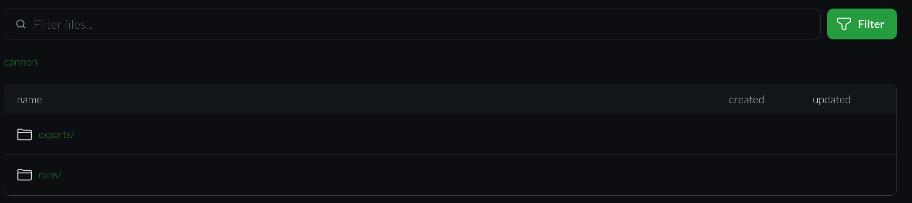

# Repository Data

## Introduction

The Data tab contains any generated data (runs, file exports, etc.) of the repository.

  

## Data List Item

Each Data list items contains name and creation date. The list is sorted by name.
Pressing on the list item will open all files created under this folder.

## Other Options

### Filter Files

This allows to filter the folders by name or extension entering it in the text box and pressing either the filter button or Enter

  
