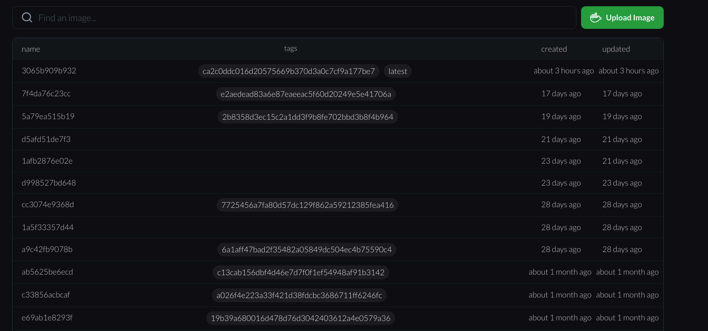

# Repository Images

## Introduction

The Images tab displays all Docker images of the repository which were uploaded on to the CITROS server.

  

## Images Table

The images table contains the following fields:

- Name of the Image

- Tags - contains all tags of the images while for the latest image a "latest" tag added,

- Created the date of the created image

The table is sorted by date

## Search Box

This allows to search an image name or tag by entering it in the text box

## Upload Image Button

Pressing on the button opens a window with a step-by-step instructions to upload a new image to CITROS

  

