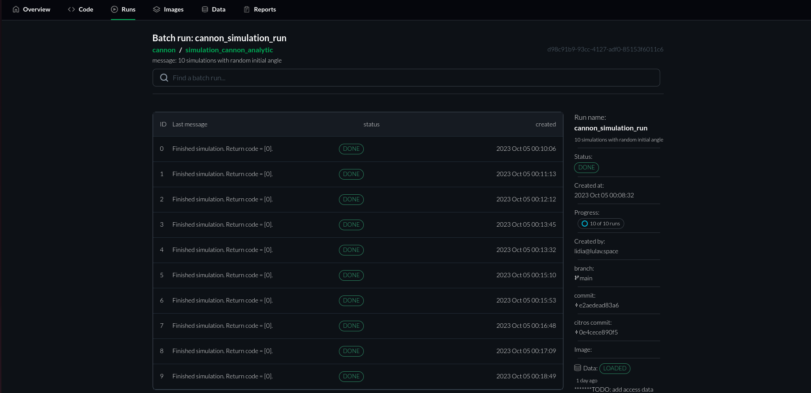
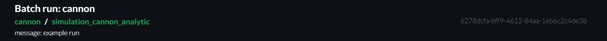
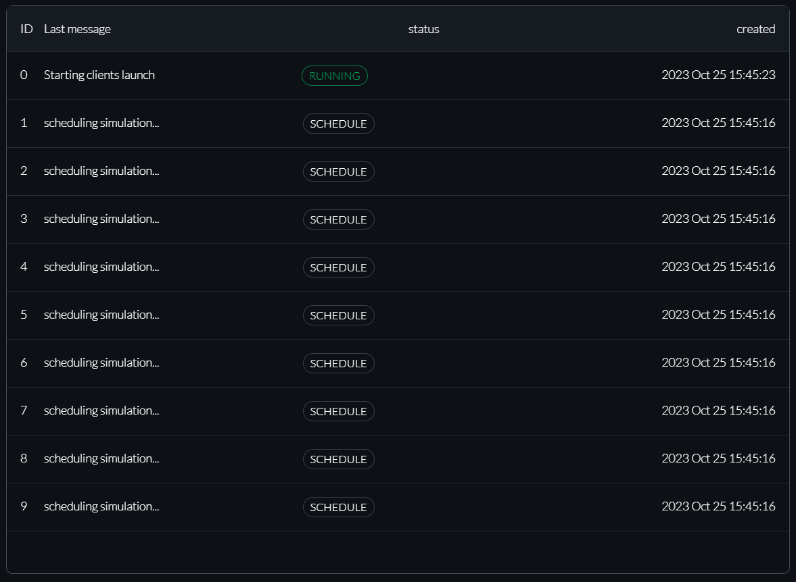
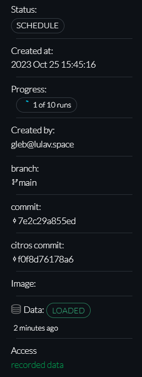

# Batch Run

## Introduction
The Batch page provides a comprehensive dashboard that allows users to monitor and manage batch simulation runs, offering detailed information about each run and overall batch status, while also providing insights into the development context in which the simulations were run.

## Simulation Info

The top of this page contains the Batch Run Info for quick review of the context and purpose of the current batch simulation. It includes:
* Repository Name
* Batch Name
* Simulation Name
* Run number
* User-defined message
* Batch ID

## Simulation Run Table

The Simulation Runs Table contains all the runs of the batch . You can observe it to monitor the status and progress of individual simulations in the batch. Click on specific simulation IDs or rows to navigate to detailed run page. This table has 4 columns:

* Run number
* [Last Event of the Run](/docs/simulations/sim_run_page#events)
* [Status](/docs/simulations/sim_runs_page#simulation-data-status)
* Timestamp of creation

## Batch Information

The Info section contains all the information about the batch, it contains the following fields:

* Status: general batch status. Depends on statuses of all related simulations. See [Batch Status](#batch-status) for additional info.
* Timestamp of creation
* Progress: the number of Runs in DONE status in relation to the total number of Runs in the Batch
* Created by: nickname of the user, who created this Batch
* Branch
* Commit: commit ID
* CITROS commit: CITROS commit ID
* Image: link to the used image
* [Data status](/docs/simulations/sim_runs_page.md#simulation-data-status)
* Link to the data of the Batch.

Use this information for troubleshooting, understanding the developer context, and monitoring database status.

### Batch Status

The Batch may exist in one of the following states: 
* SCHEDULE: The first stage of the batch run. Batch runs are initializing
* RUNNING: All simulations are running
* TERMINATING: the simulations themselves finished, but other operational processes (e.g. uploading data to the Database) need to finish
* DONE: All related simulation runs are in DONE state
* All related simulation runs are in DONE, but at least one of them is in ERROR status.

The status of the Batch is contingent upon the cumulative statuses of all simulations associated with said batch.