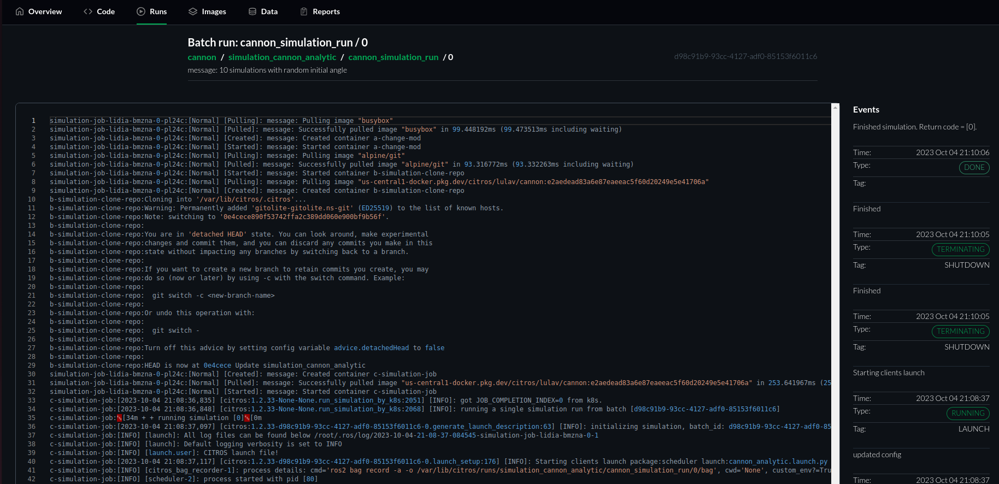
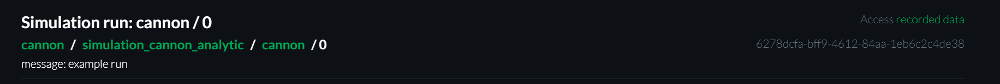
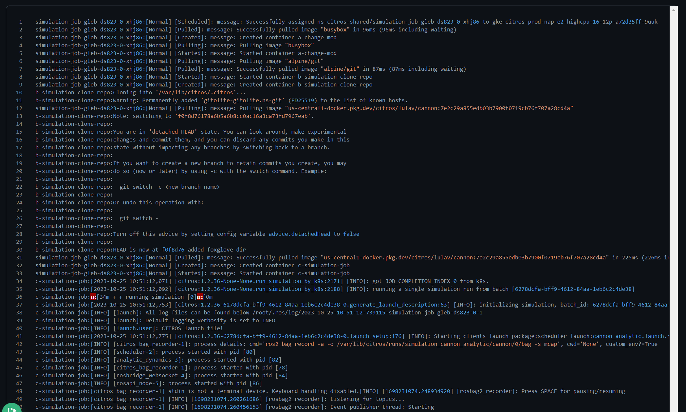
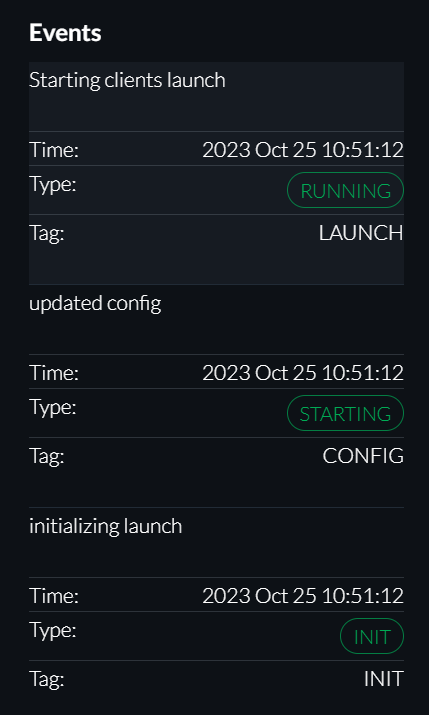

# Simulation Run

## Introduction
The Simulation Run Page provides a detailed record of all simulation logs across various levels, from high-level batch (e.g., CITROS level) down to granular simulation logging levels. It also showcases the status messages related to the simulation, offering insights into the simulation's progression, state, and any potential issues or milestones.

## Simulation Info

The top of this page is dedicated for general simulation information. It includes:

* Repository Name
* Batch Name
* Simulation Name
* Run number
* User-defined message

## Simulation Log

The detailed Simulation Log provides a comprehensive view of all messages and data logged during the simulation and analyze the logs to understand the simulation’s progression, identify potential issues, or extract data for further analysis and reporting.

Search option is available for the log, focus on the log and use the keyboard shortcuts Ctrl + f (Windows, Linux) or ⌘ + f (Mac).

## Events

The Events section on the right is useful to keep track of the simulation’s ongoing status and progression. 
Review the most recent status message at the top, and peruse previous messages to understand the historical progression of the simulation status. Use the status messages for quick insights into the simulation's health, state, and any noteworthy events or issues.

