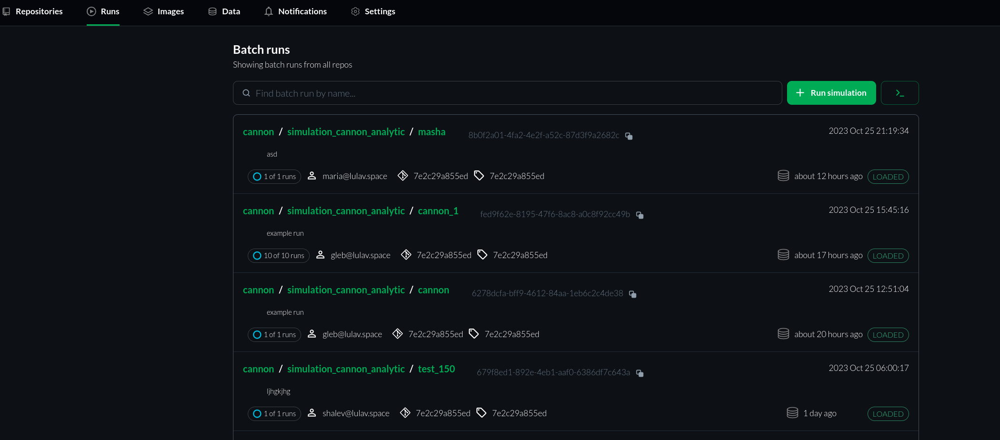

<!-- 
This page should describe runs page
#(Title) Batch Run

##Introduction

## Batch Runs List
//explanations about it

### Runs details
 //list all details and explain each of them
### Run status

## Available actions
### new simulation
### filter
...
###

 -->

# Runs page

## Introduction
The `Runs` page is comprized of a list of your team's simulation runs. It allows you to manage and monitor simulations easily and efficiently.

## Batch Runs List
The Batch Runs list is located in the center of the page. It provides a list of all batches run by your team members. The last batch appears on the top of the list. 

### Batch Details
Each line of the list contains extensive batch information and status:

   * Project name;
   * Simulation JSON file (corresponding to the ROS Launch file);
   * User-defined simulation name;
   * Batch ID;
   * Simulation launch timestamp;
   * [Status of the simulation data (results)](#simulation-status-data);
   * Commit ID (The commit the data was created with);
   * Simulation image tag (The image used for simulation);
   * Username;
   * Number of runs and their status.

Check [Overview Page](https://citros.io/doc/docs/simulations/sim_step_by_step) for additional explanation of Simulation workflow.

#### Simulation Data Status 

The status of simulation results can be one of several states:
   - **UNKNOWN:** Unsynced with the Database.
   - **UNLOADED:** The batch run data is unloaded from the Database.
   - **LOADED:** The batch run data is loaded to the data DB and available for querying.
   - **LOADING:** The data is being loaded and should be available soon.
   - **ERROR:** All related simulation runs are in a DONE state and at least one is in an ERROR state.

## Available Actions

### Running a New Simulation

   To run a new simulation, click the "Run Simulation" button. Fill in the required parameters and configurations in the simulation setup form. Click "Run Simulation" to initiate the simulation. You can monitor the progress of the simulation on the list page. Check our [Step-By-Step Simulation tutorial](https://citros.io/doc/docs/simulations/sim_step_by_step) for additional information.

### Searching the Simulations

   The search field is available right above the Batch Run List. You can search by project's name, batch name, batch message etc. Simply enter the text for search in the field and the search results will be shown automaticly.