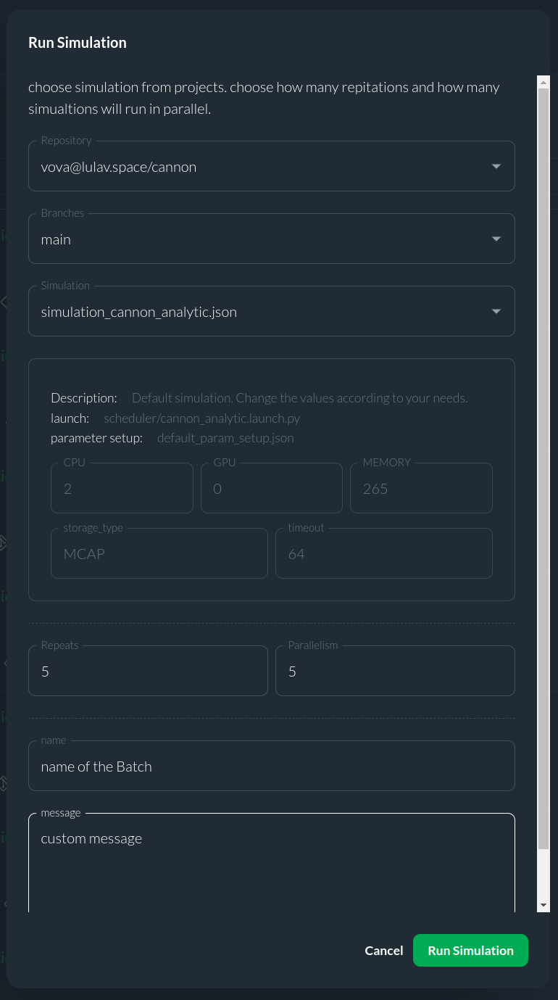

# Runs page

## Introduction
The `Runs` page is comprized of a list of your team's simulation runs. It allows you to manage and monitor simulations easily and efficiently.

## Batch Runs List
Each list item represents a batches run. it contains the following fileds:

   * Project name;
   * Simulation JSON file (corresponding to the ROS Launch file);
   * User-defined simulation name;
   * Batch ID;
   * Simulation launch timestamp;
   * Number of runs and their status.
   * Username;
   * Commit ID (The commit the data was created with);
   * Simulation image tag (The image used for simulation);
   * [Status of the simulation data (results)](#simulation-status-data);

#### Simulation Data Status 

The status of simulation results can be one of several states:
   - **UNKNOWN:** Unsynced with the Database.
   - **UNLOADED:** The batch run data is unloaded from the Database.
   - **LOADED:** The batch run data is loaded to the data DB and available for querying.
   - **LOADING:** The data is being loaded and should be available soon.
   - **ERROR:** All related simulation runs are in a DONE state and at least one is in an ERROR state.

## Available Actions

### Search Box

   The search field is available right above the Batch Run List. You can search by project's name, batch name, batch message etc. This allows to search a batch run name by entering it in the text box.

### Run Simulation Button

   Pressing on the button opens a window to define and run a new simulation. For more information follow this [Step-By-Step Simulation tutorial](https://citros.io/doc/docs/simulations/sim_step_by_step).

### CLI Button

   Pressing on the button opens a window with a step-by-step instructions to run a new simulation using CITROS CLI.