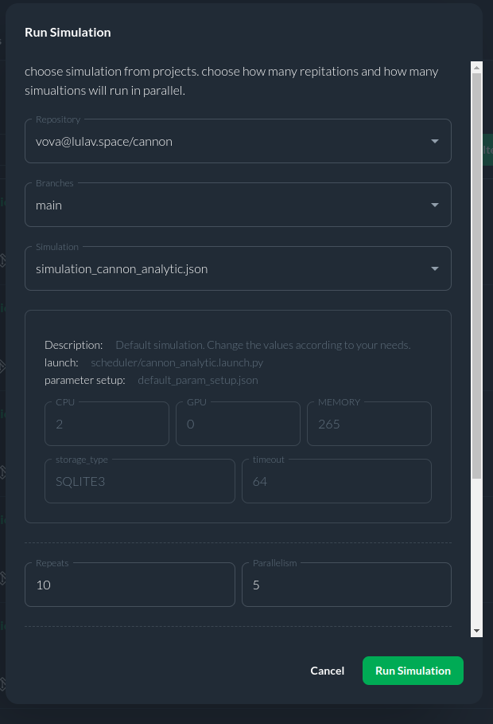
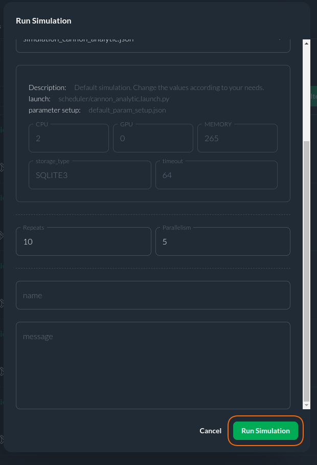

# Run New Simulation

To run a Simulation using CITROS Web please follow next steps:

1. Click the ```Run Simulation``` button located at the top-right of the page.

   

2. Ensure the appropriate Repository and Branch are selected, choose the simulation setup, and specify the number of runs and parallel launches:

   2.1 Choose repository to run your simulation

   2.2 Choose branch

   2.3 Choose simulation

   2.4 Define in repetitions filed how many times you'd like to repeat your simulation

   2.5 Define in parallelism filed, how many simulations will run in parallel in each iteration (parallelism <= repetitions).

   

3. Click on ```Run Simulation``` button.

   

Congratulations! You have successfully launched your first simulation batch via CITROS Web!
Your batch now appears at the top of the [batch list](/docs/simulations/sim_runs_page.md), indicated by a Loading status. You may initiate another simulation or visit the [Batch Page](https://citros.io/doc/docs_citros_web/simulations/sim_batch_page) to monitor its progress.