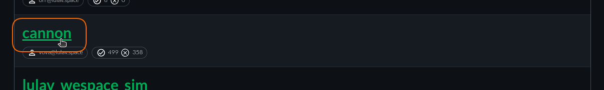
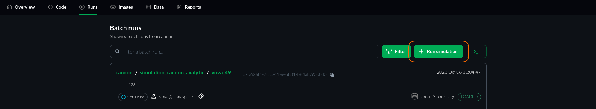

<!-- ## Access Runs
 1. make sure logged in (with reference link)
  2. go to... -->
# Getting Started with Simulations

**Introduction:**
The best way to use all the innovative capabilities of CITROS is through its Web interface. This manual provides a step-by-step guide to executing a project in the cloud and retrieving simulation results with ease.

### Prerequisites
   To begin, ensure that your project is initialized and synced using the [CITROS CLI tool](https://citros.io/doc/docs_cli). Running a simulation via the Web interface also requires building a Docker Image and pushing it to the CITROS cloud. It is presupposed that your project is prepared, synchronized and uploaded to the CITROS cloud (check [this](https://citros.io/doc/docs/cli/cli_overview) manual).

## Step-by-Step Tutorial

1. Make sure you are [logged in](https://citros.io/doc/docs/authentication/account/account_login) into your account on [CITROS WEB](https://citros.io/).

2. Navigate to Repositories:

   Proceed to the ```Repositories``` page by clicking on the respective tab at the top of the interface.

   

3. Select Your Project:

   Locate and open your project. For this guide, we will utilize the ```Cannon``` project as a reference.

   

4. Project Main Page Overview:

   Upon accessing [the main project page](https://citros.io/doc/docs/repos/repository/repo_sc_overview), you will encounter comprehensive information about your project, including settings, parameter and performance setups, run info, and an overview of simulation reports.

5. Interacting with the ```Code``` Tab:

   Navigate to the ```Code``` tab. The file browser interface is synchronized with the ```.citros``` folder in your project's workspace, enabling file addition, opening, editing, and saving (check [this page](https://citros.io/doc/docs/repos/repos_overview.md) for additional instructions). At the top of the page, a dropdown list allows branch changing, synchronized with your own project's git repo. Key files and folders include:
   - ```Notebooks```: This folder stores notebooks pertinent to the project. Utilize notebooks for processing simulation results via the powerful [CITROS Data Analysis Package](https://citros.io/doc/docs_data_analysis).
   - ```Parameter_setups```: Store your ROS parameter setups here, with options to add more setups, modify existing ones, and save them via the built-in UI or direct code editing.
   - ```Simulations```: This folder holds the project's principal setup files, which define the project description, launch files and performance setup.

6. Adjusting Settings:

   After confirming and saving the necessary settings, navigate to the ```Runs``` tab, where all existing simulation batches reside. Additional information about this page is available in the [Runs Page Overview](https://citros.io/doc/docs_citros_web/simulations/sim_runs_page).

7. Launching the Simulation:

   Click the ```Run Simulation``` button located at the top-right of the page.

   

8. Setting Up the Simulation:

   Ensure the appropriate Repository and Branch are selected, choose the simulation setup, and specify the number of runs and parallel launches.

   

9. Final Steps Before Launch:

   In the final preparation stage, enter the batch name and an optional message in the provided fields, followed by clicking the prominent green ```Run Simulation``` button.

   

Congratulations! You have successfully launched your first simulation batch via CITROS WEB! Your batch now appears at the top of the batch list, indicating a ```Loading``` status. You may initiate another simulation or visit the [Batch Page](https://citros.io/doc/docs_citros_web/simulations/sim_batch_page) to monitor its progress.