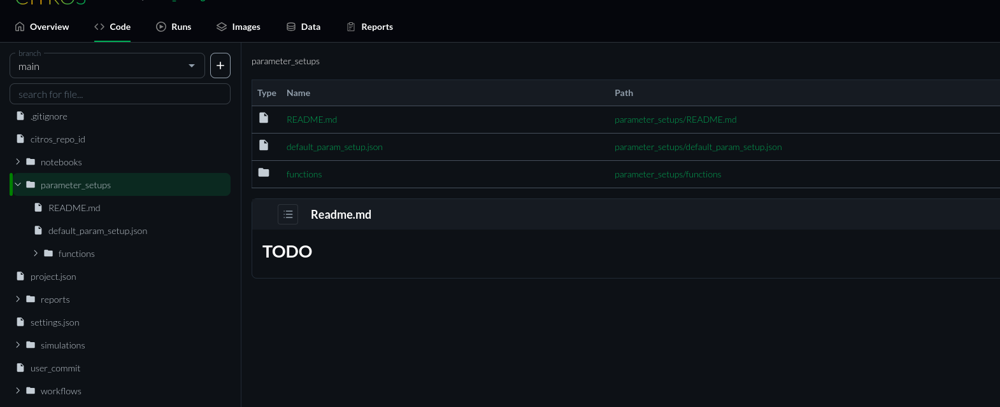

# Parameters Setup

Here you can control on the parameters of your project.  
It stores your JSON-formatted parameter setup files.

As you can see, we have `default_param_setup.json` that contains all the parameters you can controll that automatically generated when you initialize the CITROS repository.  
Furthermore we can see the `functions` folder that contains all the functions you made for the parameters.

To learn how to add functions to parameter setups, please refer to the
[CITROS CLI doc](https://github.com/lulav/citros_cli#Adding-functions-to-parameter-setup).

