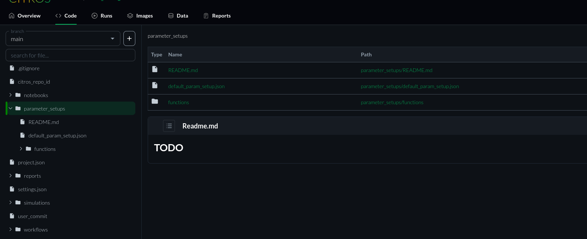

# Parameters Setup

Here you can control on the parameters of your project.  
It stores your JSON-formatted parameter setup files.



We have `default_param_setup.json` that contains all the parameters you can controll that automatically generated when you initialize the CITROS repository.  
This file consolidates all the default parameters for every node across all the packages in your ROS 2 project, providing a consolidated and easily accessible record of these parameters.  
The file `default_param_setup.json` will not be overwritten during citros `init`, `run` or `status` commands. Nevertheless, it is recommended to duplicate this file under a different name within the `parameter_setups` directory before making any modifications. This practice ensures your custom setups are preserved and allows you to experiment with various parameter configurations.  

Additionally, we can see a `functions` folder containing all the functions created for the parameters.

## Adding functions to parameter setup

In order to define a function in your parameter setup file, simply replace any constant parameter value with a `function object`.

Function objects provide a powerful and dynamic way to compute and set values in the `parameter_setup.json` file for ROS 2 nodes. This feature allows for much greater flexibility and dynamism when setting parameters.

## How to Add Function Objects

Function objects are essentially references to functions (either from numpy or user-defined) that will be executed to compute a value for a particular key.

#### Numpy Functions

To use a numpy function, simply provide its fully qualified name as the value in the dictionary. For example:
```python
{
    "my_param": {
         "function": "numpy.add",
            "args": [1, 2]
    }
}
```
#### User-Defined Functions

For user-defined functions, you need to:

- Define your function in a separate `.py` file and place it under `.citros/parameter_setups/functions`.
- Use the file name (with the `.py` extension) followed by the function name, separated by a colon, as the value of the `function` key.

For instance, if you have a function named `my_function` in a file named `my_functions.py`, you would reference it as:
```python
{
    "my_param": {
       "function": "my_functions.py:my_function",
        "args": [...]
    }
}
```
## Examples - numpy

#### simple arithmetic 

compute the product of two numbers:
```python
{
    "product_param": {
        "function": "numpy.multiply",
        "args": [4, 7]
    }
}
```
#### Using Random Distribution

Generating a random number from a normal distribution with a mean of 0 and standard deviation of 1:
```python
{
    "random_param": {
        "function": "numpy.random.normal",
        "args": [0, 1]
    }
}
```

Drawing a random value between 1 and 10:
```python
{
    "low": 1.0,
    "high": 10.0,
    "uniform_random_param": {
        "function": "numpy.random.uniform",
        "args": ["low", "high"]
    }
}
```
## Examples - user-defined

#### Read from a CSV file

Suppose you want to load a matrix from a csv file into a parameter of type list of lists of floats. Copy the following function to a python file (let's call it `file_utils.py`) and place it in the `functions` directory:
```python
def load_matrix_from_csv(filename):
        import csv
        with open(filename, 'r') as f:
            reader = csv.reader(f)
            matrix = [list(map(float, row)) for row in reader]
        return matrix
```

Reference it in your `parameter_setup.json` as:
```python
{
    "matrix_param": {
        "function": "file_utils.py:load_matrix_from_csv",
        "args": ["my_data.csv"]
    }
}
```
## function with CITROS context

Sometimes you may want to access some information that is part of the CITROS context. For example, you may want to write a user-defined function that uses the run index of the simulation being run. In such a case, you could write a function with a parameter named `citros_context` (which must appear last in the parameter list):
```python
    def func_with_context(num, citros_context):
        return num + float(citros_context['run_id'])
```
`citros_context` is a dictionary with key/value pairs describing the current CITROS context. Currently the only key is `run_id`, but more may be added in the future. Then, you would call it from your `parameter_setup.json` file:
```python
    "init_speed": {
        "function": "my_func.py:func_with_context",
        "args": [50.0]
    }
```
Notice that the argument for `citros_context` is added automatically for you - the `args` list only contains the argument for the first parameter (`num`).

### Examples - full parameter_setup.json example

Using the following parameter setup file, the `init_angle` parameter in the `analytic_dynamics` node of the `cannon_analytic` package (taken from the `cannon` project), will get a random value each time the simulation is run. Specifically, 60% of the evaluated values will be between 30 and 60 degrees (a standard deviation of 15 around 45). In addition, the parameter `init_speed` will be evaluated to 50.0 on the first run, and will be incremented by one for every subsequent run (see previous example for details):
```python
    {
        "packages": {
            "cannon_analytic": {
                "analytic_dynamics": {
                    "ros__parameters": {
                        "init_speed": {
                            "function": "my_func.py:func_with_context",
                            "args": [50.0]
                        },
                        "init_angle": {
                            "function": "numpy.random.normal",
                            "args": [45, 15]
                        },
                        "dt": 0.01
                    }
                }
            },
            "cannon_numeric": {
                "numeric_dynamics": {
                    "ros__parameters": {
                        "init_speed": 50.0,
                        "init_angle": 30.0,
                        "dt": 0.01
                    }
                }
            },
            "scheduler": {
                "scheduler": {
                    "ros__parameters": {
                        "dt": 0.1
                    }
                }
            }
        }
    }
```
So, for example, if you run the following command in the `cannon` project:

    citros run -n "my_batch_name" -m "some_message" -c 10

and choose `simulation_cannon_analytic`, the simulation will be run 10 times, and each time `init_angle` and `init_speed` will be evaluated to different values. You can see for yourself the evaluated values if you open the `cannon_analytic.yaml` under `.citors/runs/simulation_cannon_analytic/my_batch_name/0/config`, after the run has finished.


