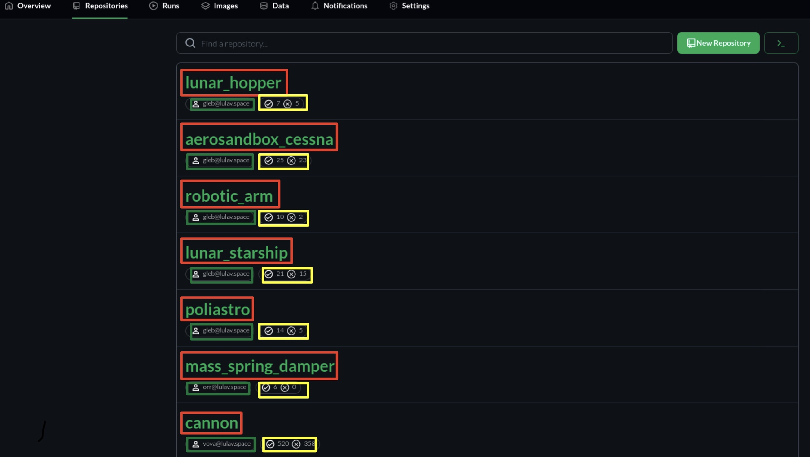

# Repositories Screen

The `Repositories` page is comprized of a list of your team's repositories.  

The red boxes contain the name or identifier of the specific project or software component that is being monitored or tested in CITROS.  
The green boxes contain the name of the team member who uploaded the project to CITROS for testing or analysis.  
The yellow boxes field is used to track the number of times the project passed and the number of times it failed in CITROS runs. It's common to represent this as two separate counts, one for "Pass" and one for "Fail." These counts are updated each time a CITROS test is executed, and the outcome is recorded.