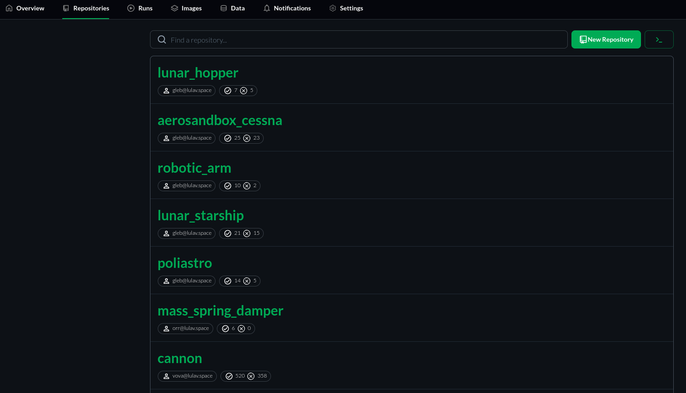

# Repositories Screen

The `Repositories` page is comprized of a list of your team's repositories.  
Here you can see each project your team have, who upload it to CITROS and how many times it pass/fail in a CITROS run. 
<!-- TODO instead of the line above, explain each field a repository list item contains -->

