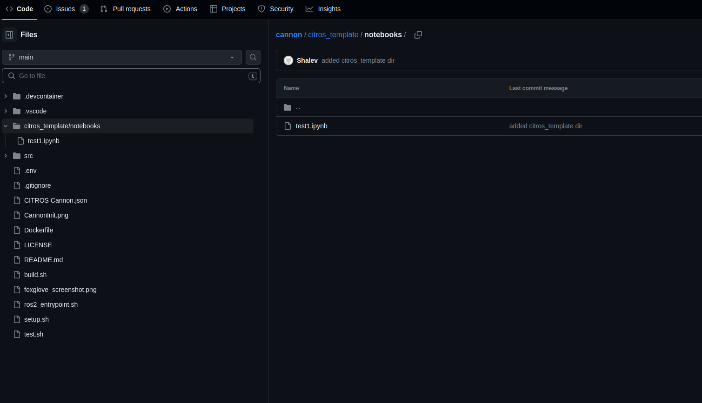
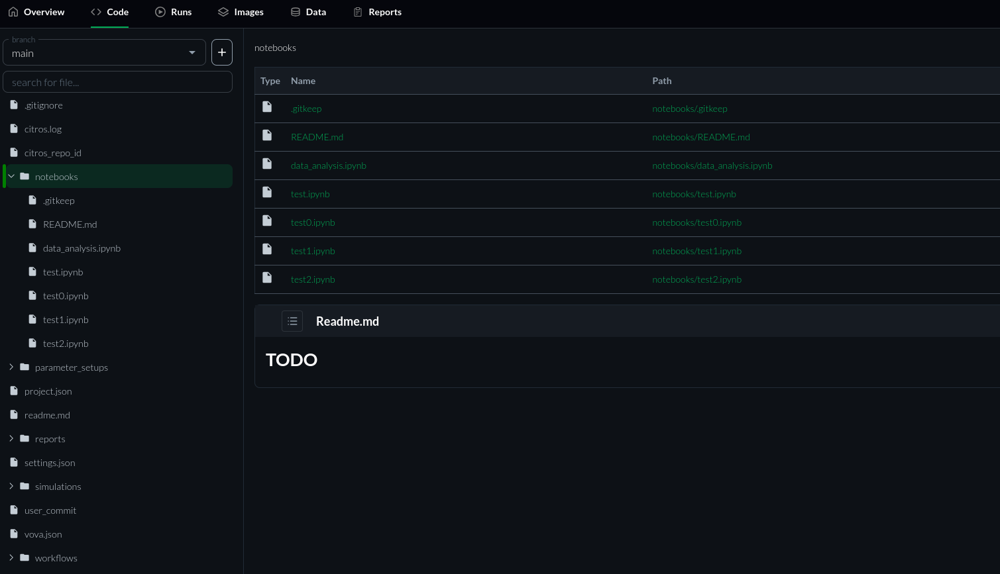

# Repository Template
There is a convenient way to automatically copy any predefined files (for example: notebooks)
from the user's project to the CITROS repo.  
Simply create a directory named `citros_template` under your project directory, and inside it create any files and subdirectories that parallel the `.citros` directory structure.

For example, if you've created a notebook file named `test1.ipynb` which you'd like to always be available by default in your `.citros` notebooks for this project, simply create a `citros_template/notebooks/` directory under the main directory of your project, and copy the file into it:

    <your project>/citros_template/notebooks/test1.ipynb. 

From this point, when you run `citros init` for this project, the file `test1.ipynb` will be automatically copied to the `notebooks` directory
under `.citros`:

