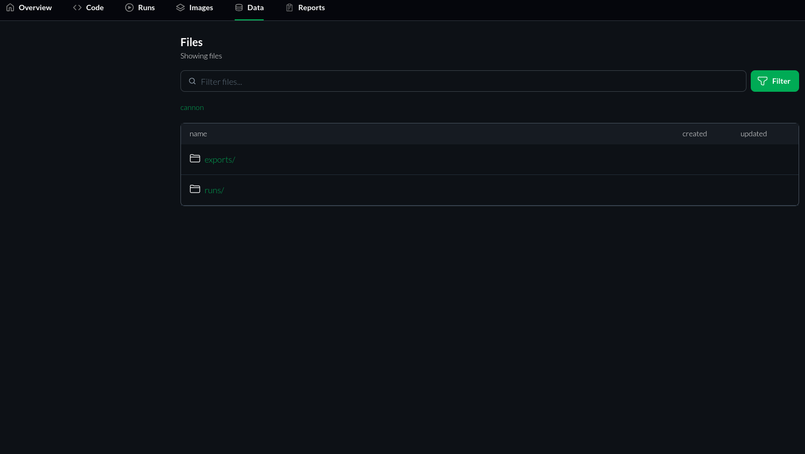

# Repository Data
The `Data` tab contains all the data generated for that repository by CITROS simulation and by the users. 

  

The `runs` directory stores simulation data while the `exports` directory holds exported PDF notebooks.