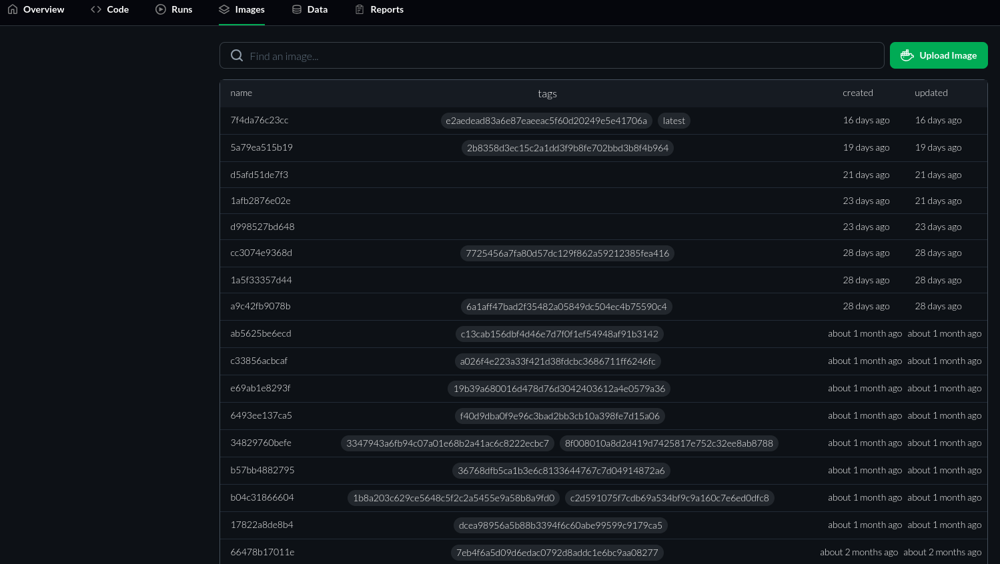

# Repository Images
The `Images` tab displays all uploaded Docker images for that repository on the CITROS server.

  

The list displays all the images in chronological order, with the latest one appearing at the top.  
Additionally, it provides details about the last time each image was updated on CITROS.

Moreover, there is a green ‘Upload Image’ button that will assist you in uploading an image to CITROS.  
You can simply upload a new image by following the steps [here](../repos_add.md).  
The command `citros docker-build-push` uploads your image to CITROS.