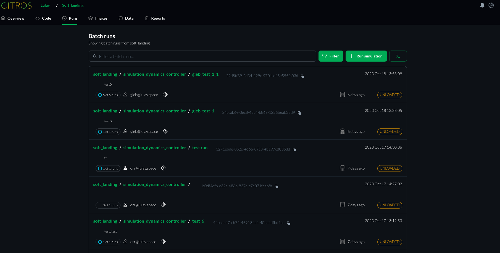
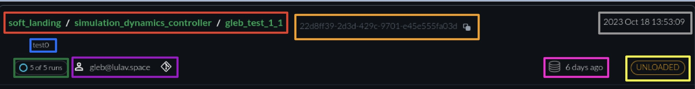

 <!-- TODO Gleb is working on simulation documentation, he might have something that will fit this screen  -->

# Repository Runs
When you navigate to the `Runs` tab within a repository, you will see a list of all previous runs for that repository.

  

The default order of the list is from newest to oldest, with the newest one appearing first. This order can be changed by clicking on the green `Filter` button.  
There is a green button labeled `Run simulation`.  
For instructions on how to upload a new simulation, refer to [source](../docs_citros_web/simulations/sim_run_simulation.md).

Let's examine a particular run in more detail.  

  

The syntax for the red box is the repository name, followed by the launch file and the run name.  
The blue box provides a description of the run provided.  
The green box displays the total number of runs and the number of runs left to complete. The purple box shows the team member who performed the run, while the orange box displays the batch ID. Next to the ID number is a copy icon, which enables you to easily copy the batch ID for analyzing the simulation data.  
The gray box displays the date and time when the simulation was first run while the pink box helps you keep track of how many days have passed since the first simulation run.  
The yellow box on the CITROS server displays the simulation status, which can be `LOADING`, `LOADED`, or `UNLOADED`.

<!-- need to check what each status means>