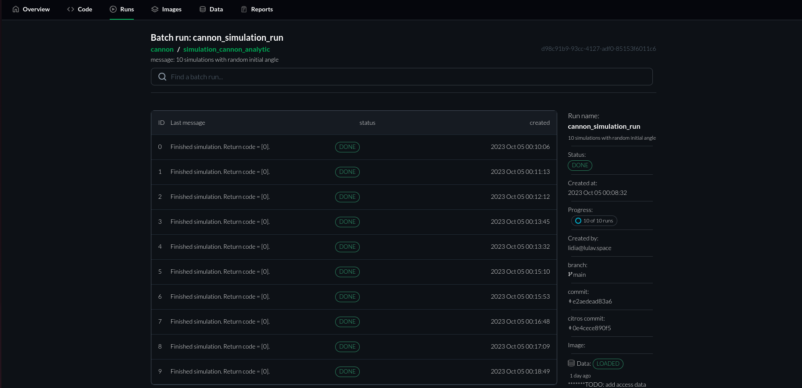

# Batch Page Overview

**Introduction:**
This simulation run page provides a comprehensive dashboard that allows users to monitor and manage batch simulation runs, offering detailed information about each run and overall batch status, while also providing insights into the development context in which the simulations were run.

1. **Understanding Batch Info**
   - View the Batch Run Info to quickly understand the context and purpose of the current batch simulation.

2. **Monitoring Individual Simulations**
   - Observe the Simulation Runs Table to monitor the status and progress of individual simulations in the batch.
   - Click on specific simulation IDs or rows to navigate to detailed run page.

3. **Understanding and Utilizing Additional Info**
   - Review the Additional Info section to gain insights into the batch's status, progress, and associated development context (git branch, commit ID).
   - Use this information for troubleshooting, understanding the developer context, and monitoring database status.

4. **Managing and Analyzing Simulations**
   - Utilize the information from the table and additional info to manage ongoing simulations and plan subsequent runs or analyses.
   - Act upon any error or warning messages to troubleshoot or optimize subsequent simulation runs.