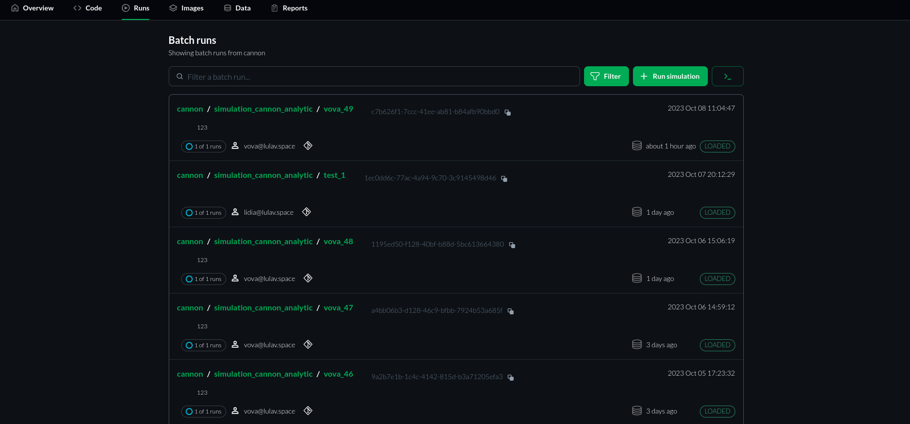

# Runs page Overview

**Introduction:**
The `Runs` page is comprized of a list of your team's simulation runs. It allows you to manage and monitor simulations easily and efficiently. In this tutorial, we will walk through the key features and functionalities of this page to help you navigate and utilize it effectively.

1. **Accessing the Simulations List Page:**

   Navigate to the "Runs" page using the corresponding button in the main navigation bar. Log in to your account if prompted.

2. **The Simulations' List Overview**

   Upon accessing the page, you will see a list of simulations. Each simulation entry includes essential information such as simulation name, parameters, and status.

3. **Filtering Simulations**

   To find specific simulations quickly, you can use the filtering options. Click on the "Filter" button, and a filter panel will appear on the side. Here, you can filter simulations based on various criteria like name, status, or date.

4. **Viewing Simulation Details**

    To access more details about a specific simulation, click on its name. This will open a new page dedicated to that particular simulation. Here, you can see in-depth information about parameters, progress, and results.

5. **Running a New Simulation**

   To run a new simulation, click the "Run Simulation" button. Fill in the required parameters and configurations in the simulation setup form. Click "Run Simulation" to initiate the simulation. You can monitor the progress of the simulation on the list page.

6. **Understanding Simulation Parameters**

   In the list view, you can see essential simulation parameters such as:
      * Project name;
      * Simulation JSON file (corresponding to the ROS Launch file);
      * User-defined simulation name;
      * Batch ID;
      * Simulation launch timestamp;
      * Status of the simulation data (results);
      * Commit ID;
      * Username;
      * Number of runs and their status.

7. **Interpreting Simulation Status Data**

   The status of simulation results can be one of several states:
     - **UNKNOWN:** Unsynced with the Database.
     - **UNLOADED:** The batch run data is unloaded from the Database.
     - **LOADED:** The batch run data is loaded to the data DB and available for querying.
     - **LOADING:** The data is being loaded and should be available soon.
     - **ERROR:** All related simulation runs are in a DONE state and at least one is in an ERROR state.

8. **Best Practices**
   
   Keep simulation names descriptive for easy identification. Regularly check and manage old or unnecessary simulations to save resources.

By following these steps, you'll be able to effectively use the simulations list page, improving your workflow and ensuring smoother simulation management.
