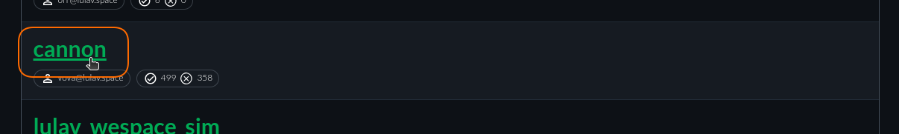
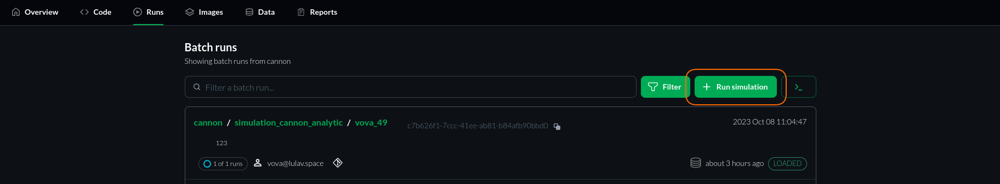
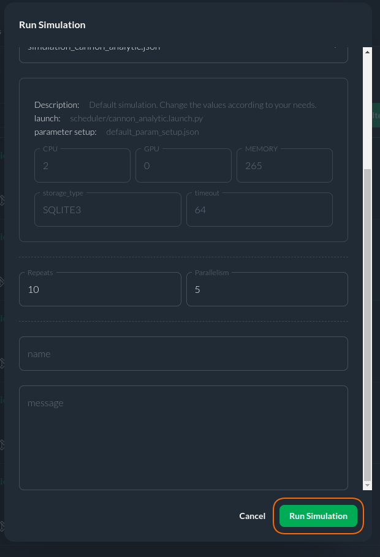

# Getting Started with Simulations

**Introduction:**
The best way to use all the innovative capabilities of CITROS is through its Web interface. This manual provides a step-by-step guide to executing a project in the cloud and retrieving simulation results with ease.

## Glossary

   |Term	|Description |
   |--|--|
   Project	|A user’s ROS-based project that includes a prepared Docker container file.
   Project's repository	|A user’s git repository, which must be initialized and synchronized with the local workspace prior to CITROS initialization.
   CITROS repository |A git repositroy hosted on the CITROS cloud. Manages all data related to CITROS, and synchronized with the Project's git repository during CITROS initialization.
   Simulation Batch |A set of one or more simulation runs, executed collectively with a designated configuration and parameter setup to efficiently analyze multiple scenarios or iterations.
   Simulation Run |A singular execution of a simulation model, performed with a specific set of parameters and conditions to analyze and observe system behavior in a specific scenario or iteration.

### Prerequisites
   To begin, ensure that your project is initialized and synced using the [CITROS CLI tool](https://citros.io/doc/docs_cli). Running a simulation via the Web interface also requires building a Docker Image and pushing it to the CITROS cloud. It is presupposed that your project is prepared, synchronized, uploaded to the CITROS cloud (check [this](https://citros.io/doc/docs/cli/cli_overview) manual), and that you are logged into your account on [CITROS WEB](https://citros.io/).

## Step-by-Step Tutorial

1. Navigate to Repositories:

   Proceed to the ```Repositories``` page by clicking on the respective tab at the top of the interface.

   

2. Select Your Project:

   Locate and open your project. For this guide, we will utilize the ```Cannon``` project as a reference.

   

3. Project Main Page Overview:

   Upon accessing the main project page, you will encounter comprehensive information about your project, including settings, parameter and performance setups, run info, and an overview of simulation reports.

4. Interacting with the ```Code``` Tab:

   Navigate to the ```Code``` tab. The file browser interface is synchronized with the ```.citros``` folder in your project's workspace, enabling file addition, opening, editing, and saving. At the top of the page, a dropdown list allows branch changing, synchronized with your own project's git repo. Key files and folders include:
   - ```Notebooks```: This folder stores notebooks pertinent to the project. Utilize notebooks for processing simulation results via the powerful [CITROS Data Analysis Package](https://citros.io/doc/docs_data_analysis).
   - ```Parameter_setups```: Store your ROS parameter setups here, with options to add more setups, modify existing ones, and save them via the built-in UI or direct code editing.
   - ```Simulations``` This folder holds the project's principal setup files, which define the project description, launch files, and performance setup.

5. Adjusting Settings:

   After confirming and saving the necessary settings, navigate to the ```Runs``` tab, where all existing simulation batches reside. Additional information about this page is available in the [Runs Page Overview](https://citros.io/doc/docs_citros_web/simulations/sim_overview).

6. Launching the Simulation:

   Click the ```Run Simulation``` button located at the top-right of the page.

   

7. Setting Up the Simulation:

   Ensure the appropriate Repository and Branch are selected, choose the simulation setup, and specify the number of runs and parallel launches.

   

8. Final Steps Before Launch:

   In the final preparation stage, enter the batch name and an optional message in the provided fields, followed by clicking the prominent green ```Run Simulation``` button.

   

Congratulations! You have successfully launched your first simulation batch via CITROS WEB! Your batch now appears at the top of the batch list, indicating a ```Loading``` status. You may initiate another simulation or visit the [Batch Page](https://citros.io/doc/docs_citros_web/simulations/sim_batch_screen) to monitor its progress.