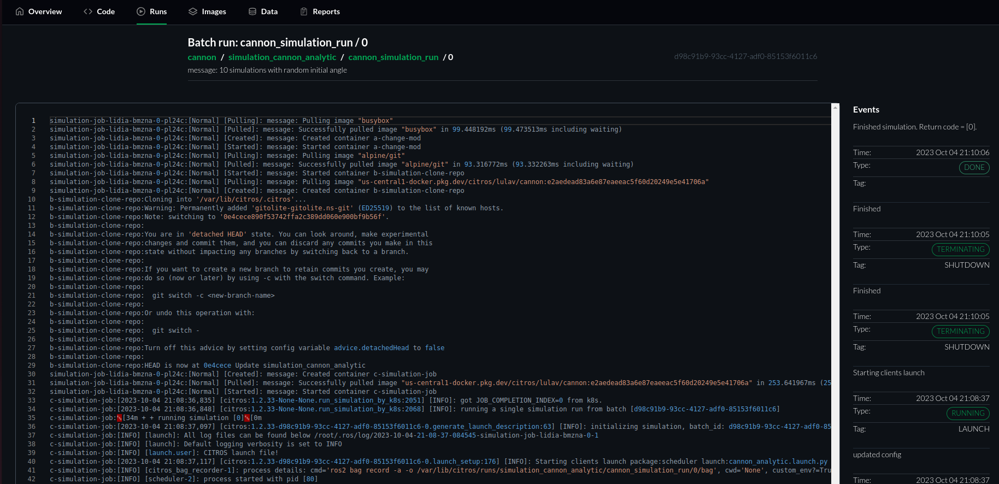

# Run Page Overview

**Introduction:**
The Simulation Run Page provides a detailed record of all simulation logs across various levels, from high-level batch (e.g., CITROS level) down to granular simulation logging levels. It also showcases the status messages related to the simulation, offering insights into the simulation's progression, state, and any potential issues or milestones.

On this page you can get the Simulation Info to comprehend the specifics and context of the simulation whose logs are being viewed.

The detailed Simulation Log is located in the center of the page. Review it for a comprehensive view of all messages and data logged during the simulation and analyze the logs to understand the simulation’s progression, identify potential issues, or extract data for further analysis and reporting.

The Status Info section on the right is very useful to keep track of the simulation’s ongoing status and progression. 
Review the most recent status message at the top, and peruse previous messages to understand the historical progression of the simulation status. Use the status messages for quick insights into the simulation's health, state, and any noteworthy events or issues.