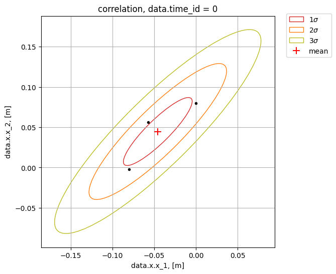

# Correlation

Function [**show_correlation()**](../documentation/error_analysis/citros_data.md#citros_data_analysis.error_analysis.citros_data.CitrosData.show_correlation) plots correlation between two variables for the exact index `slice_id`. Applying it to the [previous example](statistics.md#scale-data) for the time_id = 0:
```python
>>> db_sc.show_correlation(x_col = 'data.x.x_1',
                           y_col = 'data.x.x_2',
                           slice_id = 0,
                           n_std = [1,2,3])
```
The value of the independent parameter, that corresponds to `slice_id` = 0 is 0.0. This information is printed in the output:
```text
slice_id = 0,
slice_val = 0.0
```
<details>
    <summary>Show the correalation plot:</summary>


</details>

Pass to `x_col` and `y_col` either label or index of the columns to plot along x and y axis respectively. Instead of `slice_id` index the value `slice_val` may be specified. That way, the nearest `slice_id` index will be found and the corresponding to it exact value of `slice_val` will be printed. `n_std` states the radious or radii of the confidence ellipses in sigmas. If `bounding_error` = True, then the bounding error circle is added to plot.

The following code plots first column ('data.x.x_1') vs. second ('data.x.x_2') for the id, nearest to 'data.time' = 0.2 and plots bounding error circle. Additionally, when setting `return_fig` to True, the function will return the figure (matplotlib.figure.Figure) and ax (matplotlib.axes.Axes) objects. These objects can be employed to further enhance the image with customized styling:

```python
>>> fig, ax = db_sc.show_correlation(x_col = 0,
                                     y_col = 1,
                                     slice_val = 0.2,
                                     n_std = [1,2,3],
                                     bounding_error = True,
                                     return_fig = True)
```
The nearest to `slice_val` = 0.2 `slice_id` turned out to be 10 and the exact value, that corresponds to `slice_id` = 10 is 0.204: 
```text
slice_id = 10,
slice_val = 0.204
```
<details>
    <summary>Show the correalation plot with bounding error:</summary>


</details>

If `return_ellipse_param` = True, the dictionary with ellipse parameters is also returned:

```python
>>> fig, ax, ellipse_param = db_sc.show_correlation(x_col = 0, y_col = 1,
                                                    slice_val = 0.2,
                                                    n_std = 1,
                                                    bounding_error = True,
                                                    return_fig = True,
                                                    return_ellipse_param = True)
# Print ellipse parameters:
>>> print("\nellipse parameters:")
>>> print(f"center: ({ellipse_param['x']}, {ellipse_param['y']})")
>>> print(f"width: {ellipse_param['width']}, height: {ellipse_param['height']}")
>>> print(f"angle of rotation: {ellipse_param['alpha']}\n")
>>> if bounding_error:
>>>     print(f"radius of the error circle: {ellipse_param['bounding_error']}\n")
```

 The output containes:
- 'x' - x coordinate of the center;
- 'y' - y coordinate of the center;
- 'width' - ellipse width (along the longer axis);
- 'height' - ellipse height (along the shorter axis);
- 'alpha' - angle of rotation, in degrees.
            
And if `bounding_error` set True:
- bounding_error - radius of the error circle.

If the number of error elippses more then 1, the output is the list of dict.

To plot correlation between variables from different [**CitrosData**](statistics.md#citrosdata-object) objects, pass the object by `db2` parameter. This way, `x_col` is supposed to be the column of the first [**CitrosData**](statistics.md#citrosdata-object) objects, while `y_col` - the column of the `db2`. If `slice_val` is passed, then the `slice_id` is searched for each [**CitrosData**](statistics.md#citrosdata-object) objects.

Let's query for topic 'B', scale it over 20 points and plot correlation between 'data.x.x_2' of `db_sc` vs. 'data.x.x_1' of `db_sc_B` near the point 'data.time' = 0.7:

```python
#download columns 'data.x' and 'data.time' for topic 'B'
df_B = citros.topic('B').data(['data.x', 'data.time'])

#construct CitrosData object with 3 data-columns from 'data.x'
dataset_B = analysis.CitrosData(df, data_label=['data.x'], units = 'm')

#scale data
db_sc_B = dataset.scale_data(n_points = 20, 
                             param_label = 'data.time', 
                             show_fig = False)
                             
db_sc.show_correlation(db2 = db_sc_B,
                       x_col = 'data.x.x_2',
                       y_col = 'data.x.x_1',
                       slice_val = 0.7,
                       n_std = [1,2,3])
```
The output is:
```text
slice_id = 34,
slice_val = 0.694,
slice_id_2 = 13,
slice_val_2 = 0.684
```
<details>
    <summary>Show the plot:</summary>


</details>
