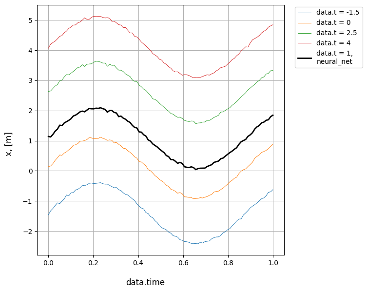

# Regression
Different input parameters may vary the output, and to predict how the parameter affects the result, regressions are used. By now, three methods of regression are supported: polinomial regression ('poly'), simple neural net regression ('neural_net') and gaussian mixture model ('gmm'). To apply regression analysis, we need to construct [**CitrosDataArray**](../documentation/error_analysis/citros_data_array.md#citros_data_analysis.error_analysis.citros_data_array.CitrosDataArray) object, that stores [**CitrosData**](statistics.md#citrosdata-object) objects with different input parameters.

```python
>>> db_array = analysis.CitrosDataArray()
```

Let's say for the topic 'A' we have data for four different values of the parameter 't', that is written in json-data column 'data.t'. First, let's get all possible 'data.t' values for topic 'A' (see [examples](../data_access/query_data.md) of [data_access](../documentation/data_access/citros_db.md) module):
```python
list_t = citros.topic('A').get_unique_values('data.t')
>>> print(list_t)
```
```text
[-1.5, 0, 2.5, 4]
```
Now let's query data for each of these parameter values, set it as parameter, scale data over 'data.time' and put to [**CitrosDataArray**](../documentation/error_analysis/citros_data_array.md#citros_data_analysis.error_analysis.citros_data_array.CitrosDataArray):

```python
for t in list_t:
    #query data
    df = citros.topic('A').\
                set_filter({'data.t': [t]}).\
                data(['data.x.x_1', 'data.time', 'data.p', 'data.t'])
    
    #create CitrosData object and set 'data.t' as a parameter.
    dataset = analysis.CitrosData(df,  
                                  data_label=['data.x.x_1'],
                                  units = 'm', 
                                  parameter_label = ['data.t'])

    #scale over 'data.time'
    db_sc = dataset.scale_data(n_points = 100, 
                               param_label = 'data.time', 
                               show_fig = False)

    #store in CitrosDataArray by add_db() method
    db_array.add_db(db_sc)
```
To set value from 'data.t' column as a parameter, pass the column label to `parameter_label` argument of [**CitrosData**](statistics.md#citrosdata-object) object. 

If a column with parameters is not presented, it is possible to put `dict` with parameters by `parameters` argument:

```python
>>> dataset = analysis.CitrosData(df,  
                                  data_label=['data.x.x_1'],
                                  units = 'm', 
                                  parameters = {'data.t': t})
```
or set parameters manualy by [`set_parameter(`](../documentation/error_analysis/citros_data.md#citros_data_analysis.error_analysis.citros_data.CitrosData.set_parameter) method. It accepts either setting parameter one by one by `key` and `value`:
```python
>>> db_sc.set_parameter(key = 'data.t', value = 0)
```
or by passing dictionary by `item`:
```python
>>> db_sc.set_parameter(item={'data.t': 0})
```
The last method allows you to pass multiple parameters, for example:
```python
>>> db_sc.set_parameter(item={'param_1':0, 'param_2':1, 'param_3':2})
```

Let's take a look at the scaled to [0,1] interval data:
```python
import matplotlib.pyplot as plt

for db in db_array.dbs:
    plt.plot(db.addData['data.time'], db.data['data.x.x_1'], 
             '.', label = 'data.t = ' + str(db.parameters['data.t']))
plt.xlabel('data.time')
plt.ylabel('data.x.x_1')
plt.legend(bbox_to_anchor=(1.0, 1.0))
```

It is a sine function with some noise added, biased by 'data.t' value.

<details>
    <summary>Show the figure:</summary>


</details>

Let's find the solution for the case 'data.t' = 1 by [**get_prediction()**](../documentation/error_analysis/citros_data_array.md#citros_data_analysis.error_analysis.citros_data_array.CitrosDataArray.get_prediction) method. Parameter label (in our case 'data.t') and value (1), for which the prediction is desired, should be passed as `dict` by `parameters` argument. Method of regression calculation ('poly' for polinomial regression, simple  'neural_net' for neural net regression and 'gmm' for gaussian mixture model) should be stated by `method` argument.

## Polynomial Regression

The first method is a polynomial regression, with the highest polynomial order defined by `n_poly`:
```python
>>> result = db_array.get_prediction(parameters = {'data.t': 1},
                                     method = 'poly', 
                                     n_poly = 2,
                                     show_fig = True)
```
<details>
    <summary>Show the figure:</summary>


</details>

The result is a [**DataFrame**](https://pandas.pydata.org/docs/reference/api/pandas.DataFrame.html).
<details>
    <summary>Show the result:</summary>

||data.time|	data.x.x_1
|--|--|--|
0|	0.000000|	1.155301
1|	0.010101|	1.145971
2|	0.020202|	1.232255
...|...|...
</details>

## Neural Net

The second method is 'neural_net', which is based on the [`sklearn.neural_network.MLPRegressor`](https://scikit-learn.org/stable/modules/generated/sklearn.neural_network.MLPRegressor.html) class. Its the most important arguments are `activation`, that defines activation function for the hidden layers ('relu', 'identity', 'logistic' or 'tanh'), `max_iter` - maximum number of iteration, `solver` - solver for weight optimization ('lbfgs', 'sgd' or 'adam'), `hidden_layer_sizes` - the number of neurons in the ith hidden layer, see [`sklearn.neural_network.MLPRegressor`](https://scikit-learn.org/stable/modules/generated/sklearn.neural_network.MLPRegressor.html) for the details of the other possible arguments.

```python
>>> result = db_array.get_prediction(parameters = {'data.t':1}, 
                                     method = 'neural_net',
                                     activation='tanh', max_iter = 200, solver='lbfgs',
                                     hidden_layer_sizes = (8,), random_state = 9,
                                     show_fig = True)
```
<details>
    <summary>Show the figure:</summary>


</details>

## Gaussian Mixture Model

The last method is a gaussian mixture model:
```python
>>> result = db_array.get_prediction(parameters = {'data.t':1}, 
                                     method = 'gmm',
                                     show_fig = True)
```
<details>
    <summary>Show the result:</summary>


</details>

## Regression Comparison

To compare the results of these methods, list their names as `method`:

```python
>>> result_list = db_array.get_prediction(parameters = {'data.t':1}, 
                                          method = ['neural_net', 'poly', 'gmm'],
                                          n_poly = 2, 
                                          activation='tanh', solver='lbfgs', hidden_layer_sizes = (8,), random_state = 9,  
                                          show_fig = True)
```
<details>
    <summary>The resulting plot:</summary>


</details>

That way, the returning result is a list of the [**DataFrames**](https://pandas.pydata.org/docs/reference/api/pandas.DataFrame.html).