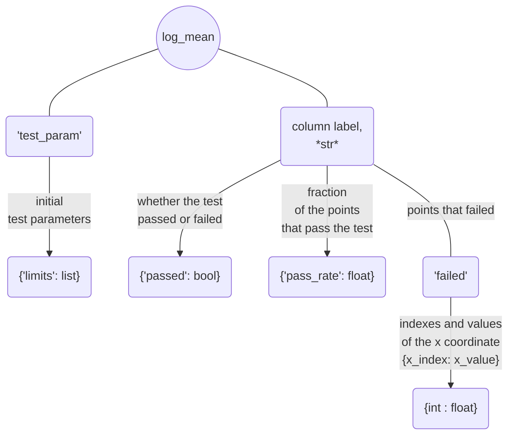
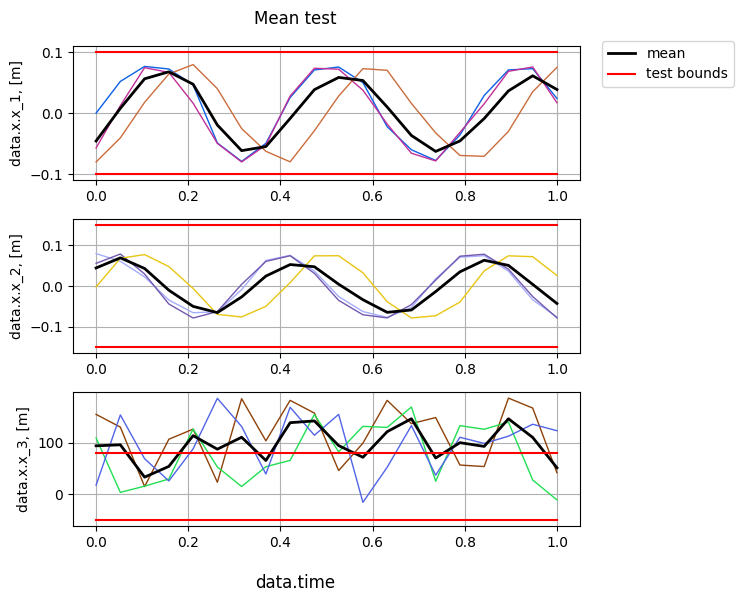

## Mean value test

[**mean_test()**](../documentation/validation/validation.md#citros_data_analysis.validation.validation.Validation.mean_test) - test whether mean is within the given limits. 

```python
>>> log, table, fig = V.mean_test(limits = [0.1, 0.15, [-50, 80]])
```

### Setting limits

Ways to set limits are the same as for [**std_bound_test()**](standard_deviation_boundary_test.md) and [**sid_test()**](testing_each_simulation.md):
  
  - if `limits` are set as a one value, for example `limits` = 1, then it will be applied to all columns and considered as an test interval [-1, 1];
  - if `limits` are set as a list of two values, for example `limits` = [-2, 3], then they will be applied to all columns as an test interval [-2, 3];
  - `limits` may be set separately for each column, as in the example above: `limits` = [0.1, 0.15, [-50, 80]] means that for the first column boundaries are [-0.1, 0.1], for the second one are [-0.15, 0.15] and for the last column [-50, 80]. That way length of the `limits` must be equal to the number of columns.
  - if number of column equals two, then `limits` = [1, 3] will be considered as common limits [1, 3] for both columns. If separate limits [-1, 1] for the first column and [-3, 3] for the second one are needed, they must be passed as `limits` = [[-1, 1],  [-3, 3]].

### Returning parameters

The method returns three parameters: 
- `log` : [**CitrosDict**](../documentation/data_access/citros_dict.md#citros_data_analysis.data_access.citros_dict.CitrosDict) - dictionary with test result summary;



- `table` : [**pandas.DataFrame**](https://pandas.pydata.org/docs/reference/api/pandas.DataFrame.html) - table that specifies for each point whether the mean value passes the test (True) or fails (False).

- `fig` : [**matplotlib.figure.Figure**](https://matplotlib.org/stable/api/figure_api.html#matplotlib.figure.Figure)

The output of the example above:

```python
>>> fig.show()
```


As it may be seen, the black line that repressents the mean value remain within the limits for the 'data.x.x_1' and 'data.x.x_2' columns, while in case of the 'data.x.x_3' column only some points meets the given constraints.

```python
>>> print(table)
```
||	data.time| data.x.x_1 |data.x.x_2 |data.x.x_3
|--|--|--|--|--|
data.time_id||||
0   | 0.000000| True|True| False
1   | 0.052632| True|True| False
2   | 0.105263| True|True| True
...|...|...|...|...

`log` can be accessed like a regular python dictionary and can be printed using the [**print()**](../documentation/data_access/citros_dict.md#citros_data_analysis.data_access.citros_dict.CitrosDict.print) method to display it as a JSON object:

```python
>>> log.print()
```
```js
{
 'test_param': {
   'limits': [0.1, 0.15, [-50, 80]]
 },
 'data.x.x_1': {
   'passed': True,
   'pass_rate': 1.0,
   'failed': {
   }
 },
 'data.x.x_2': {
   'passed': True,
   'pass_rate': 1.0,
   'failed': {
   }
 },
 'data.x.x_3': {
   'passed': False,
   'pass_rate': 0.3,
   'failed': {
     0: 0.0,
     1: 0.05263157894736842,
     4: 0.21052631578947367,
     5: 0.2631578947368421,
     6: 0.3157894736842105,
     8: 0.42105263157894735,
     9: 0.47368421052631576,
     10: 0.5263157894736842,
     12: 0.631578947368421,
     13: 0.6842105263157894,
     15: 0.7894736842105263,
     16: 0.8421052631578947,
     17: 0.894736842105263,
     18: 0.9473684210526315
   }
 }
}
```

`log` containes summary of the test result: 
  - initial test parameters:

    ```python
    >>> log['test_param'].print()
    ```
    ```js
    {
     'limits': [0.1, 0.15, [-50, 80]]
    }
    ```
  - Information about the test results of each column, let's take a look at the 'data.x.x_1':
    - 'passed' - whether the test for the column was passed (True) or not (False):

      ```python
      >>> print(log['data.x.x_1']['passed'])
      ```
      ```js
      True
      ``` 
    - 'pass_rate' - fraction of the points that pass the test, 0 < 'pass_rate' < 1:

      ```python
      >>> print(log['data.x.x_1']['pass_rate'])
      ```
      ```js
      1.0
      ```
    - 'failed' - dictionaries with indexes and corresponding them values of the x axis ('data.time' in this case) for points that failed the test. Since all points of 'data.x.x_1' passed the test, log['data.x.x_1']['failed'] is empty:
      ```python
      >>> log['data.x.x_1']['failed'].print()
      ```
      ```js
      {
      }
      ```

      whereas column 'data.x.x_3' has a series of points that exceed the limits:
      ```python
      >>> log['data.x.x_3']['failed'].print()
      ```
      ```js
      {
       0: 0.0,
       1: 0.052,
       4: 0.210,
       5: 0.263,
       6: 0.315,
       8: 0.421,
       9: 0.473,
       10: 0.526,
       12: 0.631,
       13: 0.684,
       15: 0.789,
       16: 0.842,
       17: 0.894,
       18: 0.947
      }
      ```