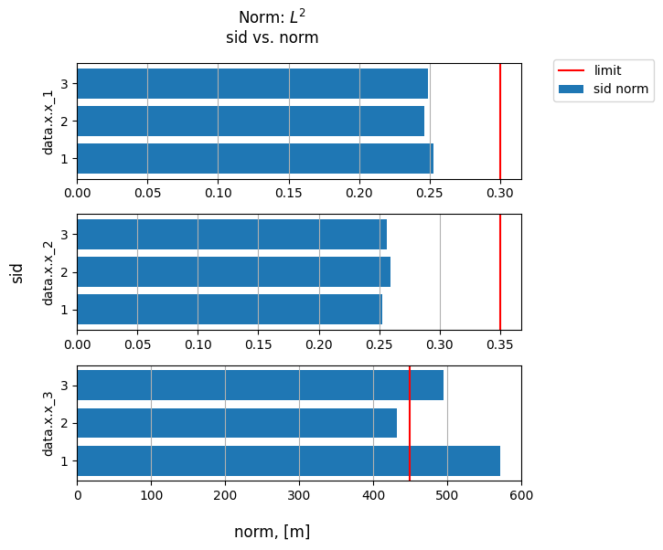

# Set Multiple Tests

It is possible to set several tests by the method [**set_tests**](../documentation/validation/validation.md#citros_data_analysis.validation.validation.Validation.set_tests):

```python
>>> V.set_tests(test_method = {<test_type> : <parameters>})
```
The types of tests and corresponding parameters are provided as a dictionary by a `test_method` parameter, where each test is represented by a key-value pair. The key defines the name of the test, and the corresponding value is a dictionary containing the test parameters. The allowed test_type keywords:

  - 'std_bound' - perform [**std_bound_test()**](standard_deviation_boundary_test.md);
  - 'mean_test' - set [**mean_test()**](mean_value_test.md);
  - 'sid_test' - for [**sid_test()**](testing_each_simulation.md);
  - 'norm_L2' and 'norm_Linf' - set [**norm_test()**](norm_test.md).

Once again, let's query data and do the necessary data preparations (see [Getting started](getting_started.md)):

```python
>>> df = citros.topic('A').data(['data.x.x_1', 'data.x.x_2', 'data.x.x_3', 'data.time'])
>>> V = va.Validation(df, data_label = ['data.x.x_1', 'data.x.x_2', 'data.x.x_3'], 
                      param_label = 'data.time', method = 'scale', num = 20, units = 'm')
```

For example, to set a standard deviation boundary test and a test on norm $L^2$:

```python
>>> logs, tables, figs = V.set_tests(test_method = 
                                 {'std_bound' : {'limits' : [0.25, 0.3, [-150, 300]], 'n_std': 3},
                                  'norm_L2' : {'limits' : [0.3, 0.35, 450]}})
```
## Returning Parameters

The method returns three dictionaries that contain the output results of each test: 

- `log` : [**CitrosDict**](../documentation/data_access/citros_dict.md#citros_data_analysis.data_access.citros_dict.CitrosDict) - dictionary with test result summary for each test method;

- `table` :  dictionary with [**pandas.DataFrame**](https://pandas.pydata.org/docs/reference/api/pandas.DataFrame.html) tables for each test method that specifies for each point whether it passes the test (True) or fails (False).

- `fig` : dictionary with figures [**matplotlib.figure.Figure**](https://matplotlib.org/stable/api/figure_api.html#matplotlib.figure.Figure) for each test method.


For example, to get detailed information about the results of the norm test:

```python
>>> logs['norm_L2'].print()
```
```js
{
 'test_param': {
   'limits': [0.3, 0.35, 450]
 },
 'data.x.x_1': {
   'passed': True,
   'pass_rate': 1.0,
...
 }
}
```
To get table that specifies for each simulation whether the norm is less then the given limit:

```python
>>> print(tables['norm_L2'])
```
```js
     data.x.x_1  data.x.x_2  data.x.x_3
sid                                    
1          True        True       False
2          True        True        True
3          True        True       False
```

To get the corresponding figure:

```python
>>> figs['norm_L2']
```


See [**std_bound_test()**](standard_deviation_boundary_test.md), [**mean_test()**](mean_value_test.md), [**sid_test()**](testing_each_simulation.md) and [**norm_test()**](norm_test.md) for the output details.
