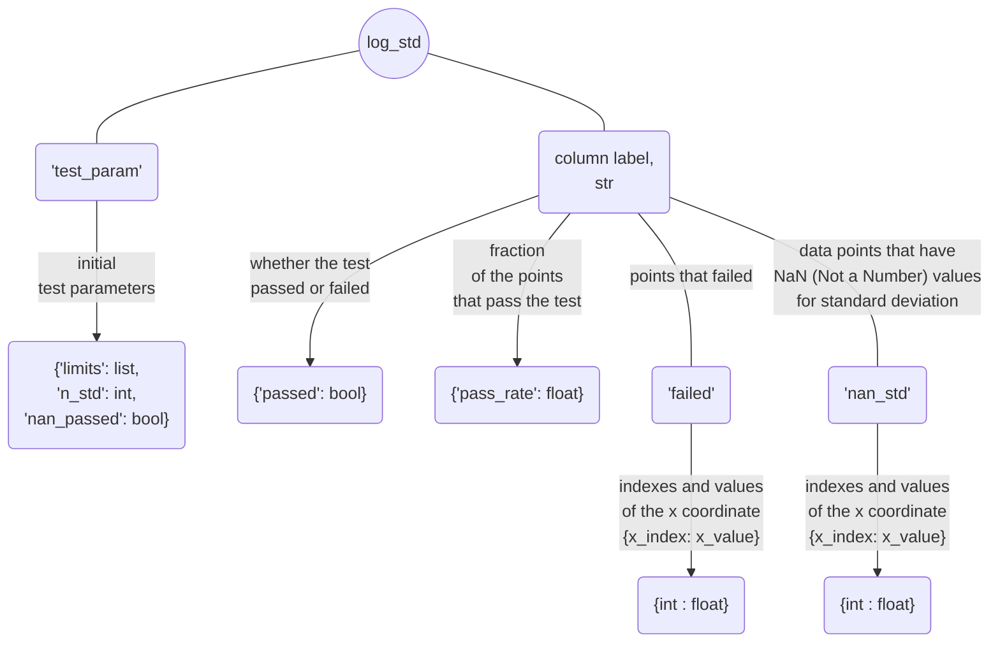
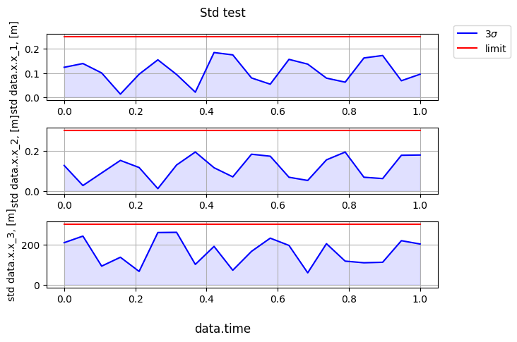

# Standard Deviation Test

[**std_test()**](../documentation/validation/validation.md#citros_data_analysis.validation.validation.Validation.std_test) test whether `n_std`-standard deviation is less than the given limits. In case there are NaN (Not a Number) values of standard deviation, to specify whether they should be considered as passing the test, set `nan_passed` = True or False (True by default).

Let's query data for a 3 dimensional vector, assign indexes to data to set correspondence between different simulations (see [Getting started](getting_started.md) page) and test whether whether the 3 standard deviation is within the established limits:

```python
>>> df = citros.topic('A').data(['data.x.x_1', 'data.x.x_2', 'data.x.x_3', 'data.time'])
>>> V = va.Validation(df, data_label = ['data.x.x_1', 'data.x.x_2', 'data.x.x_3'], 
                      param_label = 'data.time', method = 'scale', num = 20, units = 'm')
                      
>>> log, table, fig = V.std_test(limits = [0.25, 0.3, 300], n_std = 3, nan_passed = True, 
                                 std_area = True)
```

## Setting Limits

Ways to set limits are the same as for [**norm_test**](norm_test.md):
  
  - if `limits` are set as a one value, for example `limits` = 1, then it will be applied to all columns and considered as maximum value that must not be exceeded;
  - `limits` may be set separately for each column, as in the example above: `limits` = [0.25, 0.3, 300] means that standard deviation (or 3 standard deviations, as in the example, since `n_std` = 3) for the first column must be < 0.25, for the second < 0.3 and for the last column < 300. That way length of the `limits` must be equal to the number of columns.

## Returning Parameters

The method returns three parameters: 
- `log` : [**CitrosDict**](../documentation/data_access/citros_dict.md#citros_data_analysis.data_access.citros_dict.CitrosDict) - dictionary with test result summary;



- `table` : [**pandas.DataFrame**](https://pandas.pydata.org/docs/reference/api/pandas.DataFrame.html) - table that specifies whether the corresponding standard deviation boundary point passes the test (True) or not (False).

- `fig` : [**matplotlib.figure.Figure**](https://matplotlib.org/stable/api/figure_api.html#matplotlib.figure.Figure)

As for the mentioned above example, the output is:

```python
>>> fig.show()
```



Red lines show the limits, that must not be exceed by the values of standard deviations. In this example the test is passed.
Like in [**std_bound_test()**](standard_deviation_boundary_test.md), to change the style of the plot, parameters `std_area`, `std_lines` and `std_color` may be used: setting `std_area` = True to fill the area within y = 0 and the standard deviation (like we did above), `std_lines` = False to remove the borders and `std_color` change the color of the standard deviation boundary.

```python
>>> print(table)
```
||	data.time| data.x.x_1 |data.x.x_2 |data.x.x_3
|--|--|--|--|--|
data.time_id||||
0   | 0.000000| True|True| True
1   | 0.052632| True|True| True
2   | 0.105263| True|True| True
...|...|...|...|...

`log` can be accessed like a regular python dictionary and can be printed using the [**print()**](../documentation/data_access/citros_dict.md#citros_data_analysis.data_access.citros_dict.CitrosDict.print) method to display it as a JSON object:

```python
>>> log.print()
```
```js
{
 'test_param': {
   'limits': [0.25, 0.3, 300],
   'n_std': 3,
   'nan_passed': True
 },
 'data.x.x_1': {
   'passed': True,
   'pass_rate': 1.0,
   'failed': {
   },
   'nan_std': {
   }
 },
 'data.x.x_2': {
   'passed': True,
   'pass_rate': 1.0,
   'failed': {
   },
   'nan_std': {
   }
 },
 'data.x.x_3': {
   'passed': True,
   'pass_rate': 1.0,
   'failed': {
   },
   'nan_std': {
   }
 }
}
```

`log` contains summary of the test result: 
  - initial test parameters:
  ```python
  >>> log['test_param'].print()
  ```
  ```js
  {
   'limits': [0.25, 0.3, 300],
   'n_std': 3,
   'nan_passed': True
  }
  ```

  - Information about the test results of each column, let's take a look at the 'data.x.x_1':
    - 'passed' - whether the test for the column was passed (True) or not (False):

      ```python
      >>> print(log['data.x.x_1']['passed'])
      ```
      ```js
      True
      ``` 

    - 'pass_rate' - fraction of the points that pass the test, 0 < 'pass_rate' < 1:

      ```python
      >>> print(log['data.x.x_1']['pass_rate'])
      ```
      ```js
      1.0
      ```

    - 'failed' - dictionaries with indexes and corresponding them values of the x axis ('data.time' in this case) for points that failed the test. Since all points of 'data.x.x_1' passed the test, log['data.x.x_1']['failed'] is empty:
      
      ```python
      >>> log['data.x.x_1']['failed'].print()
      ```
      ```js
      {
      }
      ```

    - 'nan_std' - if some of the standard deviations points could not be calculated (for example, number of simulations for this index is less then two, that may occurs if the method of data assignment `method` = 'bin' has been chosen), their indexes and values of the x axis will be stored in the same way, as in the section 'failed':

      ```python
      >>> log['data.x.x_1']['nan_std'].print()
      ```
      ```js
      {
      }
      ```