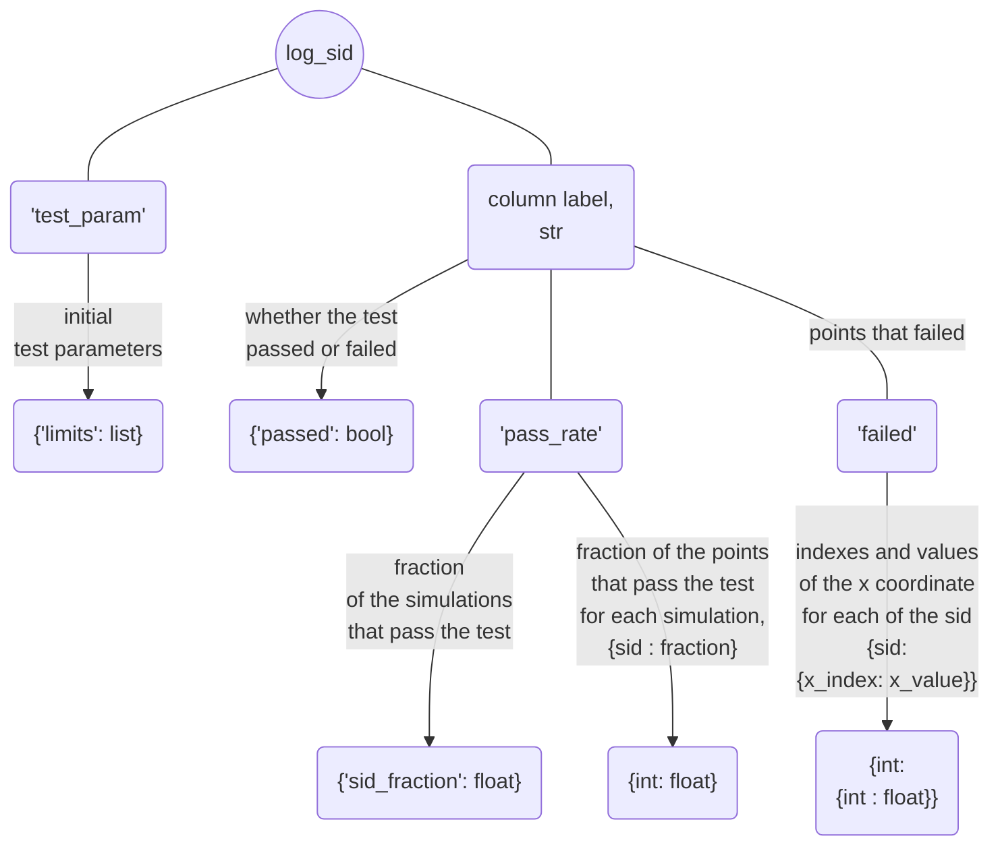
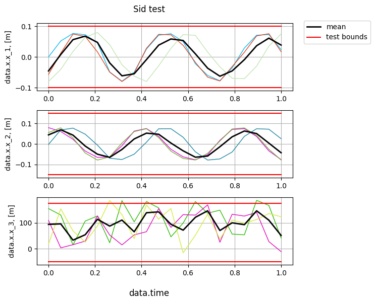

# Testing Each Simulation

[**sid_test()**](../documentation/validation/validation.md#citros_data_analysis.validation.validation.Validation.sid_test) test whether all simulation values are within the given limits.

Let's query data for a 3 dimensional vector, assign indexes to data to set correspondence between different simulations (see [Getting started](getting_started.md) page) and test whether all simulations retain their values within the limits:

```python
>>> df = citros.topic('A').data(['data.x.x_1', 'data.x.x_2', 'data.x.x_3', 'data.time'])
>>> V = va.Validation(df, data_label = ['data.x.x_1', 'data.x.x_2', 'data.x.x_3'], 
                      param_label = 'data.time', method = 'scale', num = 20, units = 'm')
                      
>>> log, table, fig = V.sid_test(limits = [0.1, 0.15, [-50, 175]])
```

## Setting Limits

Ways to set limits are the same as for [**std_bound_test()**](standard_deviation_boundary_test.md) and [**mean_test**](mean_value_test.md):
  
  - if `limits` are set as a one value, for example `limits` = 1, then it will be applied to all columns and considered as an test interval [-1, 1];
  - if `limits` are set as a list of two values, for example `limits` = [-2, 3], then they will be applied to all columns as an test interval [-2, 3];
  - `limits` may be set separately for each column, as in the example above: `limits` = [0.1, 0.15, [-50, 175]] means that for the first column boundaries are [-0.25, 0.25], for the second one are [-0.3, 0.3] and for the last column [-50, 175]. That way length of the `limits` must be equal to the number of columns.
  - if number of column equals two, then `limits` = [1, 3] will be considered as common limits [1, 3] for both columns. If separate limits [-1, 1] for the first column and [-3, 3] for the second one are needed, they must be passed as `limits` = [[-1, 1],  [-3, 3]].

## Returning Parameters

The method returns three parameters: 
- `log` : [**CitrosDict**](../documentation/data_access/citros_dict.md#citros_data_analysis.data_access.citros_dict.CitrosDict) - dictionary with test result summary;



- `table` : [**pandas.DataFrame**](https://pandas.pydata.org/docs/reference/api/pandas.DataFrame.html) - table that specifies for each simulation point whether it passes the test (True) or fails (False).

- `fig` : [**matplotlib.figure.Figure**](https://matplotlib.org/stable/api/figure_api.html#matplotlib.figure.Figure)

The output of the example above:

```python
>>> fig.show()
```


All points of 'data.x.x_1' and 'data.x.x_2' columns are within the set limits, while some points of the simulations for 'data.x.x_3' column do not satisfy the given constraints.

```python
>>> print(table)
```
|||data.time|	data.x.x_1	|data.x.x_2|	data.x.x_3
|--|--|--|--|--|--
data.time_id |sid	|		|		|		|
0				|1		|0.000000|	True|	True|	True
2				|		|0.000000|	True|	True|	True
3				|		|0.000000|	True|	True|	True
1				|1		|0.052632|	True|	True|	True
2				|		|0.052632|	True|	True|	True
3				|		|0.052632|	True|	True|	True
... | ...| ... | ...|...|...

`log` can be accessed like a regular python dictionary and can be printed using the [**print()**](../documentation/data_access/citros_dict.md#citros_data_analysis.data_access.citros_dict.CitrosDict.print) method to display it as a JSON object:

```python
>>> log.print()
```
```js
{
 'test_param': {
   'limits': [0.1, 0.15, [-50, 150]]
 },
 'data.x.x_1': {
   'passed': True,
   'pass_rate': {
     'sid_fraction': 1.0,
     1: 1.0,
     2: 1.0,
     3: 1.0
   },
   'failed': {
   }
 },
 'data.x.x_2': {
   'passed': True,
   'pass_rate': {
     'sid_fraction': 1.0,
     1: 1.0,
     2: 1.0,
     3: 1.0
   },
   'failed': {
   }
 },
 'data.x.x_3': {  
   'passed': False,
   'pass_rate': {
     'sid_fraction': 0.333,
     1: 0.8,
     2: 1.0,
     3: 0.95
   },
   'failed': {
     1: {
       6: 0.316,
       8: 0.421,
       12: 0.632,
       17: 0.895
     },
     3: {
       5: 0.263
     }
   }
 }
}
```

`log` contains summary of the test result: 
  - initial test parameters:
  ```python
  >>> log['test_param'].print()
  ```
  ```js
  {
   'limits': [0.1, 0.15, [-50, 175]]
  }
  ```
  - Information about the test results of each column, let's take a look at the 'data.x.x_1':
    - 'passed' - whether the test for the column was passed (True) or not (False):
      ```python
      >>> print(log['data.x.x_1']['passed'])
      ```
      ```js
      True
      ``` 
    - 'pass_rate' contains information about fraction of the simulations that pass the test, 0 < 'pass_rate' < 1:
      ```python
      >>> print(log['data.x.x_1']['pass_rate']['sid_fraction'])
      ```
      ```js
      1.0
      ```
      ```python
      >>> print(log['data.x.x_3']['pass_rate']['sid_fraction'])
      ```
      ```js
      0.333
      ```
      and for each simulation fraction of the points that pass the test. For example, for simulation with sid = 1:
      ```python
      >>> print(log['data.x.x_1']['pass_rate'][1])
      ```
      ```js
      1.0
      ```
      ```python
      >>> print(log['data.x.x_3']['pass_rate'][1])
      ```
      ```js
      0.8
      ```
    - 'failed' - dictionaries with indexes and corresponding them values of the x axis ('data.time' in this case) for points that failed the test. Since all points of 'data.x.x_1' passed the test, log['data.x.x_1']['failed'] is empty:
      ```python
      >>> log['data.x.x_1']['failed'].print()
      ```
      ```js
      {
      }
      ```
      Otherwise, if there are points that failed the test, they are grouped by sid in the output. For example, in 'data.x.x_3' simulation 1 has 4 point that exceed limits and simulation 3 has 1 point:
      ```python
      >>> log['data.x.x_3']['failed'].print()
      ```
      ```js
      {
       1: {
         6: 0.315,
         8: 0.421,
         12: 0.631,
         17: 0.894
       },
       3: {
         5: 0.263
       }
      }
      ```