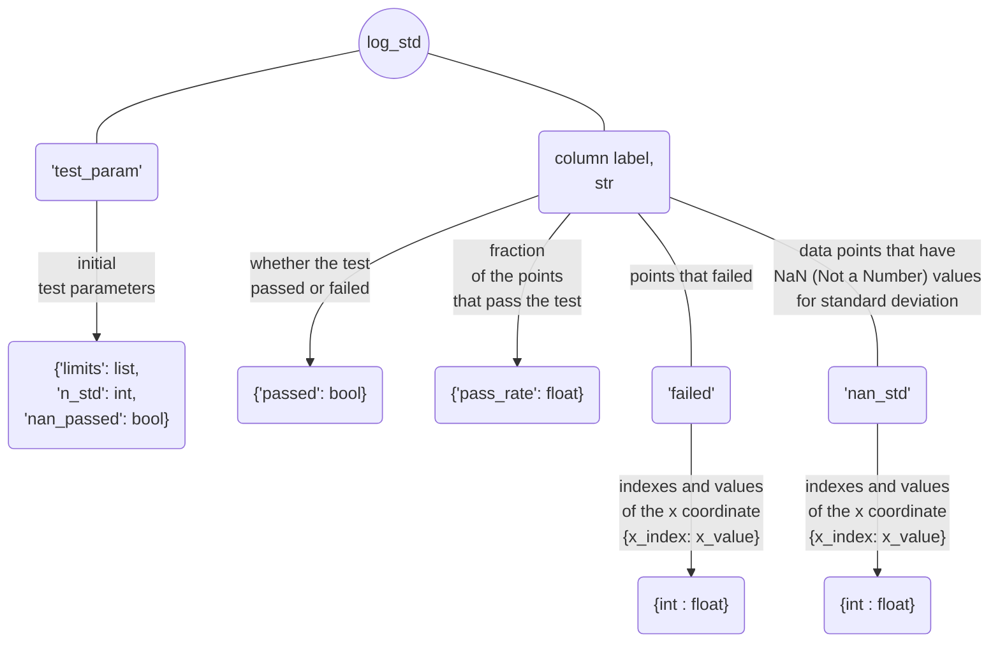
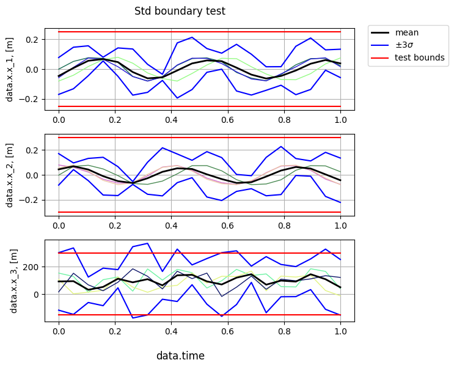
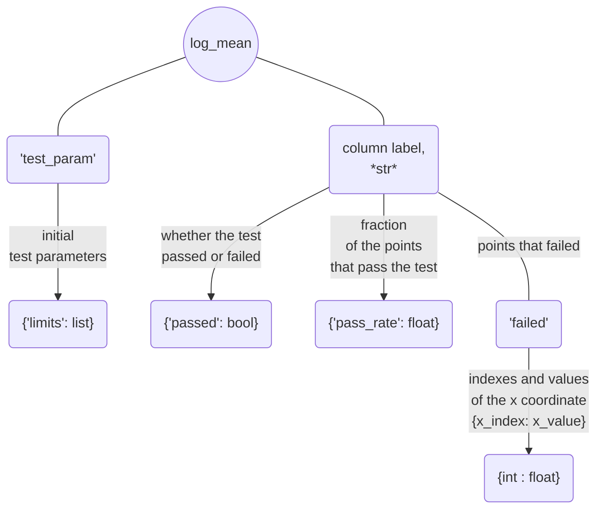
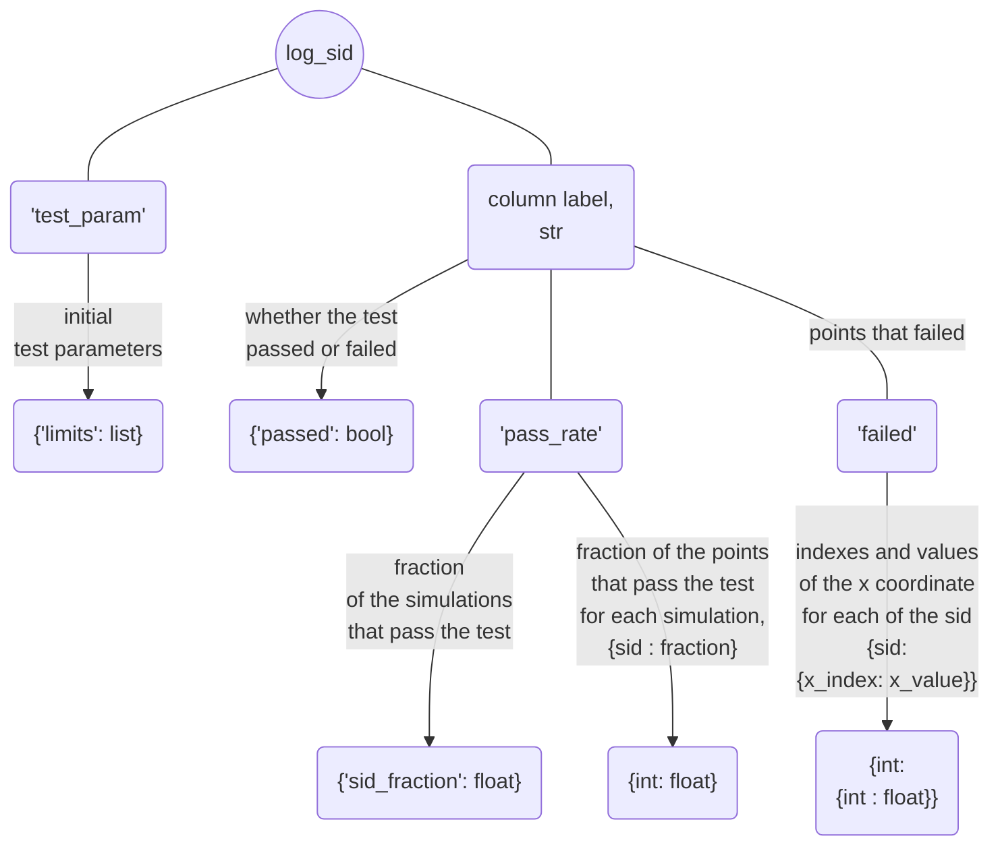
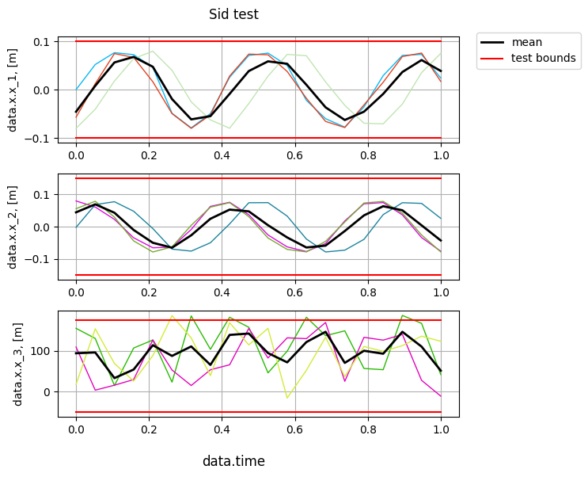
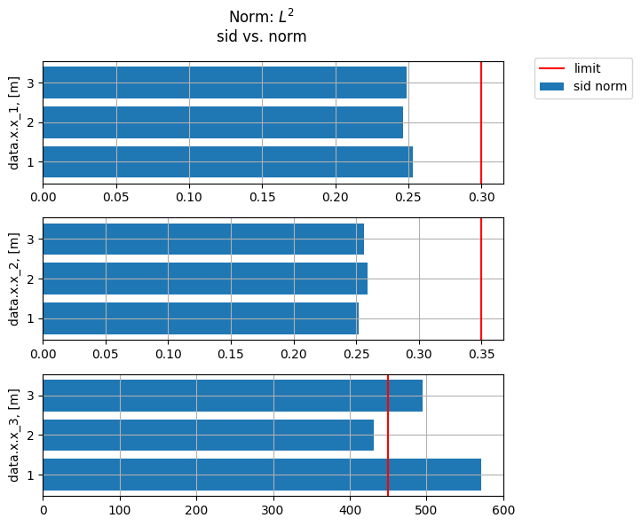
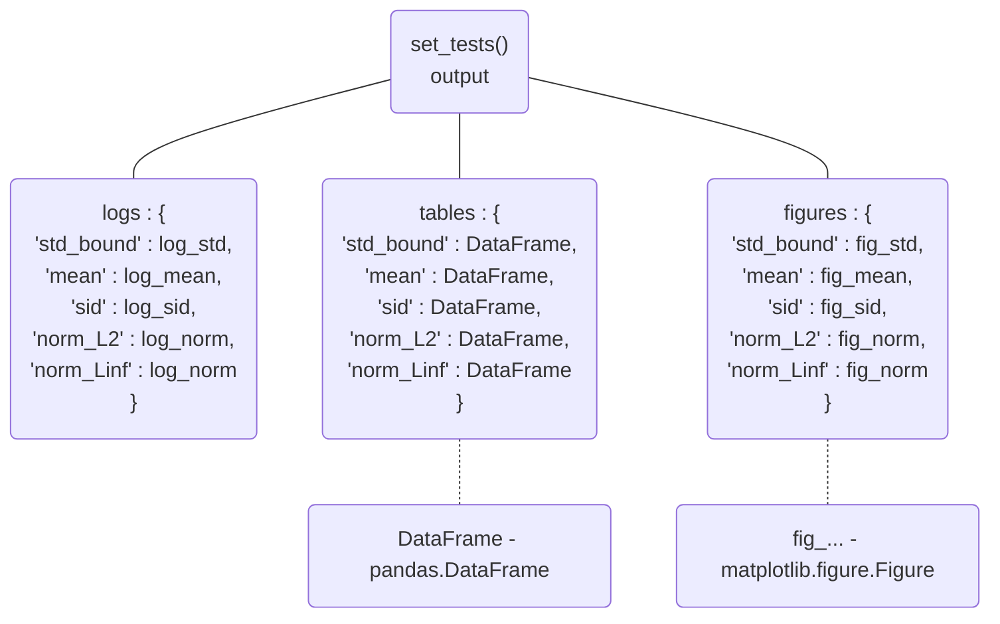

# Validation

The [**validation**](documentation/validation.md) module provides a set of tests check the simulation results. These tests include:

 - [**std_bound_test()**](documentation/validation.md#method-std_bound_test-citros_data_analysisvalidationvalidationstd_bound_test) - verifies whether the n-$\sigma$ standard deviation boundary falls within the specified limits;

 - [**mean_test()**](documentation/validation.md#method-mean_test-citros_data_analysisvalidationvalidationmean_test) - checks if the mean value is within the given limits;

 - [**sid_test()**](documentation/validation.md#method-sid_test-citros_data_analysisvalidationvalidationsid_test) - examines if the simulation values do not exceed the limits;

 - [**norm_test**](documentation/validation.md#method-norm_test-citros_data_analysisvalidationvalidationnorm_test) - evaluates norm of each simulation and compares it with the specified limit;

Number and type of tests may be set by [**set_tests()**](documentation/validation.md#method-set_tests-citros_data_analysisvalidationvalidationset_tests) method that allows to specify the desired tests by providing their names and corresponding parameters and produces a consolidated report.

## Query and prepare data

To connect to the database [**CitrosDB**](documentation/data_access.md#citros_data_analysis.data_access.CitrosDB) object is created:
```python
from citros_data_analysis import data_access as da

citros = da.CitrosDB()
```
To learn more about connection parameters, see [examples of data_access module](data_access_examples.md#connection-to-the-database).

Let's assume, that data for topic 'A' looks like:

||sid	|rid	|time	|topic	|type	|data
|--|--|--|--|--|--|--
0	|1	|0	|312751159	|A	|a	|{'x': {'x_1': 0.0, 'x_2': 0.08, 'x_3': 154.47}, 'time': 10.0}
1	|1	|1	|407264008	|A	|a	|{'x': {'x_1': 0.008, 'x_2': 0.08, 'x_3': 130.97}, 'time': 17.9}
2	|1	|2	|951279608	|A	|a	|{'x': {'x_1': 0.016, 'x_2': 0.078, 'x_3': 117.66}, 'time': 20.3}
...|...|...|...|...|...|...|

A json-data column containes information about time and vector x, that has elements x_1, x_2 and x_3. Let's query these columns:

```python
df = citros.topic('A').data(['data.x', 'data.time'])
```
The output is a [**pandas.DataFrame**](https://pandas.pydata.org/docs/reference/api/pandas.DataFrame.html):

||sid	|rid	|time	|topic	|type	|data.x|	data.time
|--|--|--|--|--|--|--|--|
0	|1	|0	|312751159	|A	|a	|{'x_1': 0.0, 'x_2': 0.08, 'x_3': 154.47}	|10.0
1	|1	|1	|407264008	|A	|a	|{'x_1': 0.008, 'x_2': 0.08, 'x_3': 130.97}	|17.9
2	|1	|2	|951279608	|A	|a	|{'x_1': 0.016, 'x_2': 0.078, 'x_3': 117.66}	|20.3
...|...|...|...|...|...|...|...

Analysis of data from multiple simulations may be performed if the correspondence between data values from different simulation is set. It may be done through an independent variable that is shared between simulations. Indexes are assigned based on this variable, connecting data values across the simulations.

There are two methods to handle index assignment:

 - to divides the independent variable into `num` ranges, assign an index to each interval, and calculate data value averages for each simulation within each range (see [**bin_data()**](documentation/error_analysis.md#method-bin_data-citros_data_analysiserror_analysiscitrosdatabin_data))
 - to scale for each simulation the independent variable to the interval [0,1], defines `num` uniformly distributed points from 0 to 1, and interpolates data points over this new interval (see [**scale_data()**](documentation/error_analysis.md#method-scale_data-citros_data_analysiserror_analysiscitrosdatascale_data)).

This preparation may be done by creating [**Validation**](documentation/validation.md#class-validation-citros_data_analysisvalidationvalidation) object, that is able to apply mentioned above approaches to assign indexes and to calculate statistics over different simulations. Let's choose 'data.time' as an independent variable and use it to assign indexes and connect 'data.x' values of different simulations. The method of index setting is specified by `method`: 'scale' or 'bin', the number of points (bins) is passed by `num`:

```python
from citros_data_analysis import validation as va

V = va.Validation(df, data_label = ['data.x'], param_label = 'data.time', 
                  method = 'scale', num = 20, units = 'm')
```
`units` are specified to make plots more informative.

If only some of the elements of the vector 'data.x' are needed, for example 'data.x.x_1' and 'data.x.x_2', they may be quered and passed to [**Validation**](documentation/validation.md#class-validation-citros_data_analysisvalidationvalidation) object as follows:

```python
df = citros.topic('A').data(['data.x.x_1', 'data.x.x_2', 'data.time'])
V = va.Validation(df, data_label = ['data.x.x_1', 'data.x.x_2'], param_label = 'data.time', 
                  method = 'scale', num = 20, units = 'm')
```

After initialisation, [**Validation**](documentation/validation.md#class-validation-citros_data_analysisvalidationvalidation) object stores statistics as a [**CitrosStat**](documentation/error_analysis.md#class-citrosstat-citros_data_analysiserror_analysiscitrosstat) in `stat` attribute. For example, to get mean values:

```python
>>> print(V.stat.mean)
              data.x.x_1   data.x.x_2   data.x.x_3
data.time_id
0             -0.045667    0.044667     93.706667
1             0.007875     0.069515     95.639414
2             0.056261     0.043401     33.128443
...           ...          ...          ...
```
In the same way it is possible to access scaled 'data.time' range (`V.stat.x`), standard deviation (`V.stat.sigma`) and covarian matrix (`V.stat.covar_matrix`).

## Standard deviation boundary test

[**std_bound_test()**](documentation/validation.md#method-std_bound_test-citros_data_analysisvalidationvalidationstd_bound_test) test whether `n_std`-standard deviation boundary is within the given limits, where boundary is defined as mean value $\pm$ `n_std` * standard deviation. In case there are NaN (Not a Number) values of standard deviation, to specify whether they should be considered as passing the test, set `nan_passed` = True or False (True by default).

```python
log, table, fig = V.std_bound_test(limits = [0.25, 0.3, [-150, 300]], n_std = 3, nan_passed = True)
```
### Setting limits

Ways to set limits are the same as for [**mean_test**](#mean-value-test) and [**sid_test()**](#simulation-limits-test):
  
  - if `limits` are set as a one value, for example `limits` = 1, then it will be applied to all columns and considered as an test interval [-1, 1];
  - if `limits` are set as a list of two values, for example `limits` = [-2, 3], then they will be applied to all columns as an test interval [-2, 3];
  - `limits` may be set separetly for each column, as in the example above: `limits` = [0.25, 0.3, [-150, 300]] means that for the first column boundaries are [-0.25, 0.25], for the second one are [-0.3, 0.3] and for the last column [-150, 300]. That way length of the `limits` must be equal to the number of columns.
  - if number of column equals two, then `limits` = [1, 3] will be considered as common limits [1, 3] for both columns. If separate limits [-1, 1] for the first column and [-3, 3] for the second one are needed, they must be passed as `limits` = [[-1, 1],  [-3, 3]].

### Returning parameters

The method returns three parameters: 
- `log` : [**CitrosDict**](documentation/data_access.md#class-citrosdict-citros_data_analysisdata_accesscitrosdict) - dictionary with test result summary;



- `table` : [**pandas.DataFrame**](https://pandas.pydata.org/docs/reference/api/pandas.DataFrame.html) - table that specifies whether the corresponding standard deviation boundary point passes the test (True) or not (False).

- `fig` : [**matplotlib.figure.Figure**](https://matplotlib.org/stable/api/figure_api.html#matplotlib.figure.Figure)

Let's inspect the output of the example above:

```python
fig.show()
```


It is evident that the 3-$\sigma$ standard deviation boundaries remain within the limits for the 'data.x.x_1' and 'data.x.x_2' values, while in case of the 'data.x.x_3' column, certain points exceed the given limit.

```python
print(table)
```
||	data.time| data.x.x_1 |data.x.x_2 |data.x.x_3
|--|--|--|--|--|
data.time_id||||
0   | 0.000000| True|True| False
1   | 0.052632| True|True| False
2   | 0.105263| True|True| True
...|...|...|...|...

`log` can be accessed like a regular python dictionary and can be printed using the [**print()**](documentation/data_access.md#method-print-citros_data_analysisdata_accesscitrosdictprint) method to display it as a JSON object:

```python
>>> log.print()
```
```python
{
 'test_param': {
   'limits': [0.25, 0.3, [-150, 300]],
   'n_std': 3,
   'nan_passed': True
 },
 'data.x.x_1': {
   'passed': True,
   'pass_rate': 1.0,
   'failed': {
   },
   'nan_std': {
   }
 },
 'data.x.x_2': {
   'passed': True,
   'pass_rate': 1.0,
   'failed': {
   },
   'nan_std': {
   }
 },
 'data.x.x_3': {
   'passed': False,
   'pass_rate': 0.55,
   'failed': {
      0: 0.0,
      1: 0.052,
      5: 0.263,
      6: 0.315,
      8: 0.421,
      11: 0.578,
      12: 0.631,
      18: 0.947,
      19: 1.0
   },
   'nan_std': {
   }
 }
}

```

`log` containes summary of the test result: 
  - initial test parameters:
  ```python
  >>> log['test_param'].print()
  
  {
   'limits': [0.25, 0.3, [-300, 400]],
   'n_std': 3,
   'nan_passed': True
  }
  ```

  - Information about the test results of each column, let's take a look at the 'data.x.x_1':
    - 'passed' - whether the test for the column was passed (True) or not (False):

      ```python
      >>> print(log['data.x.x_1']['passed'])
      True
      ``` 

    - 'pass_rate' - fraction of the points that pass the test, 0 < 'pass_rate' < 1:

      ```python
      >>> print(log['data.x.x_1']['pass_rate'])
      1.0
      ```

    - 'failed' - dictionaries with indexes and corresponding them values of the x axis ('data.time' in this case) for points that failed the test. Since all points of 'data.x.x_1' passed the test, log['data.x.x_1']['failed'] is empty:
      
      ```python
      >>> log['data.x.x_1']['failed'].print()
      
      {
      }
      ```

      whereas column 'data.x.x_3' has a series of points that exceed the limits:

      ```python
      >>> log['data.x.x_3']['failed'].print()
      
      {
       0: 0.0,
       1: 0.052,
       5: 0.263,
       6: 0.315,
       8: 0.421,
       11: 0.578,
       12: 0.631,
       18: 0.947,
       19: 1.0
      }
      ```

    - 'nan_std' - if some of the standard deviations points could not be calculated (for example, number of simulations for this index is less then two, that may occurs if the method of data assignment `method` = 'bin' has been chosen), their indexes and values of the x axis will be stored in the same way, as in the section 'failed'.

## Mean value test

[**mean_test()**](documentation/validation.md#method-mean_test-citros_data_analysisvalidationvalidationmean_test) - test whether mean is within the given limits. 

```python
log, table, fig = V.mean_test(limits = [0.1, 0.15, [-50, 80]])
```

### Setting limits

Ways to set limits are the same as for [**std_bound_test()**](#standard-deviation-boundary-test) and [**sid_test()**](#simulation-limits-test):
  
  - if `limits` are set as a one value, for example `limits` = 1, then it will be applied to all columns and considered as an test interval [-1, 1];
  - if `limits` are set as a list of two values, for example `limits` = [-2, 3], then they will be applied to all columns as an test interval [-2, 3];
  - `limits` may be set separetly for each column, as in the example above: `limits` = [0.1, 0.15, [-50, 80]] means that for the first column boundaries are [-0.1, 0.1], for the second one are [-0.15, 0.15] and for the last column [-50, 80]. That way length of the `limits` must be equal to the number of columns.
  - if number of column equals two, then `limits` = [1, 3] will be considered as common limits [1, 3] for both columns. If separate limits [-1, 1] for the first column and [-3, 3] for the second one are needed, they must be passed as `limits` = [[-1, 1],  [-3, 3]].

### Returning parameters

The method returns three parameters: 
- `log` : [**CitrosDict**](documentation/data_access.md#class-citrosdict-citros_data_analysisdata_accesscitrosdict) - dictionary with test result summary;



- `table` : [**pandas.DataFrame**](https://pandas.pydata.org/docs/reference/api/pandas.DataFrame.html) - table that specifies for each point whether the mean value passes the test (True) or fails (False).

- `fig` : [**matplotlib.figure.Figure**](https://matplotlib.org/stable/api/figure_api.html#matplotlib.figure.Figure)

The output of the example above:

```python
fig.show()
```


As it may be seen, the black line that repressents the mean value remain within the limits for the 'data.x.x_1' and 'data.x.x_2' columns, while in case of the 'data.x.x_3' column only some points meets the given constraints.

```python
print(table)
```
||	data.time| data.x.x_1 |data.x.x_2 |data.x.x_3
|--|--|--|--|--|
data.time_id||||
0   | 0.000000| True|True| False
1   | 0.052632| True|True| False
2   | 0.105263| True|True| True
...|...|...|...|...

`log` can be accessed like a regular python dictionary and can be printed using the [**print()**](documentation/data_access.md#method-print-citros_data_analysisdata_accesscitrosdictprint) method to display it as a JSON object:

```python
log.print()
```
```python
{
 'test_param': {
   'limits': [0.1, 0.15, [-50, 80]]
 },
 'data.x.x_1': {
   'passed': True,
   'pass_rate': 1.0,
   'failed': {
   }
 },
 'data.x.x_2': {
   'passed': True,
   'pass_rate': 1.0,
   'failed': {
   }
 },
 'data.x.x_3': {
   'passed': False,
   'pass_rate': 0.3,
   'failed': {
     0: 0.0,
     1: 0.05263157894736842,
     4: 0.21052631578947367,
     5: 0.2631578947368421,
     6: 0.3157894736842105,
     8: 0.42105263157894735,
     9: 0.47368421052631576,
     10: 0.5263157894736842,
     12: 0.631578947368421,
     13: 0.6842105263157894,
     15: 0.7894736842105263,
     16: 0.8421052631578947,
     17: 0.894736842105263,
     18: 0.9473684210526315
   }
 }
}
```

`log` containes summary of the test result: 
  - initial test parameters:

    ```python
    >>> log['test_param'].print()
    
    {
     'limits': [0.1, 0.15, [-50, 80]]
    }
    ```
  - Information about the test results of each column, let's take a look at the 'data.x.x_1':
    - 'passed' - whether the test for the column was passed (True) or not (False):

      ```python
      >>> print(log['data.x.x_1']['passed'])
      True
      ``` 
    - 'pass_rate' - fraction of the points that pass the test, 0 < 'pass_rate' < 1:

      ```python
      >>> print(log['data.x.x_1']['pass_rate'])
      1.0
      ```
    - 'failed' - dictionaries with indexes and corresponding them values of the x axis ('data.time' in this case) for points that failed the test. Since all points of 'data.x.x_1' passed the test, log['data.x.x_1']['failed'] is empty:
      ```python
      >>> log['data.x.x_1']['failed'].print()
      
      {
      }
      ```

      whereas column 'data.x.x_3' has a series of points that exceed the limits:
      ```python
      >>> log['data.x.x_3']['failed'].print()
      
      {
       0: 0.0,
       1: 0.052,
       4: 0.210,
       5: 0.263,
       6: 0.315,
       8: 0.421,
       9: 0.473,
       10: 0.526,
       12: 0.631,
       13: 0.684,
       15: 0.789,
       16: 0.842,
       17: 0.894,
       18: 0.947
      }
      ```
## Simulation limits test

[**sid_test()**](documentation/validation.md#method-sid_test-citros_data_analysisvalidationvalidationsid_test) test whether all simulation values are within the given limits.

```python
log, table, fig = V.sid_test(limits = [0.1, 0.15, [-50, 175]])
```

### Setting limits

Ways to set limits are the same as for [**std_bound_test()**](#standard-deviation-boundary-test) and [**mean_test**](#mean-value-test):
  
  - if `limits` are set as a one value, for example `limits` = 1, then it will be applied to all columns and considered as an test interval [-1, 1];
  - if `limits` are set as a list of two values, for example `limits` = [-2, 3], then they will be applied to all columns as an test interval [-2, 3];
  - `limits` may be set separetly for each column, as in the example above: `limits` = [0.1, 0.15, [-50, 175]] means that for the first column boundaries are [-0.25, 0.25], for the second one are [-0.3, 0.3] and for the last column [-50, 175]. That way length of the `limits` must be equal to the number of columns.
  - if number of column equals two, then `limits` = [1, 3] will be considered as common limits [1, 3] for both columns. If separate limits [-1, 1] for the first column and [-3, 3] for the second one are needed, they must be passed as `limits` = [[-1, 1],  [-3, 3]].

### Returning parameters

The method returns three parameters: 
- `log` : [**CitrosDict**](documentation/data_access.md#class-citrosdict-citros_data_analysisdata_accesscitrosdict) - dictionary with test result summary;



- `table` : [**pandas.DataFrame**](https://pandas.pydata.org/docs/reference/api/pandas.DataFrame.html) - table that specifies for each simulation point whether it passes the test (True) or fails (False).

- `fig` : [**matplotlib.figure.Figure**](https://matplotlib.org/stable/api/figure_api.html#matplotlib.figure.Figure)

The output of the example above:

```python
fig.show()
```


All points of 'data.x.x_1' and 'data.x.x_2' columns are within the set limits, while some points of the simulations for 'data.x.x_3' column do not satisfy the given constraints.

```python
print(table)
```
|||data.time|	data.x.x_1	|data.x.x_2|	data.x.x_3
|--|--|--|--|--|--
data.time_id |sid	|		|		|		|
0				|1		|0.000000|	True|	True|	True
2				|		|0.000000|	True|	True|	True
3				|		|0.000000|	True|	True|	True
1				|1		|0.052632|	True|	True|	True
2				|		|0.052632|	True|	True|	True
3				|		|0.052632|	True|	True|	True
... | ...| ... | ...|...|...

`log` can be accessed like a regular python dictionary and can be printed using the [**print()**](documentation/data_access.md#method-print-citros_data_analysisdata_accesscitrosdictprint) method to display it as a JSON object:

```python
log.print()
```
```python
{
 'test_param': {
   'limits': [0.1, 0.15, [-50, 150]]
 },
 'data.x.x_1': {
   'passed': True,
   'pass_rate': {
     'sid_fraction': 1.0,
     1: 1.0,
     2: 1.0,
     3: 1.0
   },
   'failed': {
   }
 },
 'data.x.x_2': {
   'passed': True,
   'pass_rate': {
     'sid_fraction': 1.0,
     1: 1.0,
     2: 1.0,
     3: 1.0
   },
   'failed': {
   }
 },
 'data.x.x_3': {  
   'passed': False,
   'pass_rate': {
     'sid_fraction': 0.333,
     1: 0.8,
     2: 1.0,
     3: 0.95
   },
   'failed': {
     1: {
       6: 0.316,
       8: 0.421,
       12: 0.632,
       17: 0.895
     },
     3: {
       5: 0.263
     }
   }
 }
}
```

`log` containes summary of the test result: 
  - initial test parameters:
  ```python
  >>> log['test_param'].print()

  {
   'limits': [0.1, 0.15, [-50, 175]]
  }
  ```
  - Information about the test results of each column, let's take a look at the 'data.x.x_1':
    - 'passed' - whether the test for the column was passed (True) or not (False):
      ```python
      >>> print(log['data.x.x_1']['passed'])
      True
      ``` 
    - 'pass_rate' containes information about fraction of the simulations that pass the test, 0 < 'pass_rate' < 1:
      ```python
      >>> print(log['data.x.x_1']['pass_rate']['sid_fraction'])
      1.0
      >>> print(log['data.x.x_3']['pass_rate']['sid_fraction'])
      0.333
      ```
      and for each simulation fraction of the points that pass the test. For example, for simulation with sid = 1:
      ```python
      >>> print(log['data.x.x_1']['pass_rate'][1])
      1.0
      >>> print(log['data.x.x_3']['pass_rate'][1])
      0.8
      ```
    - 'failed' - dictionaries with indexes and corresponding them values of the x axis ('data.time' in this case) for points that failed the test. Since all points of 'data.x.x_1' passed the test, log['data.x.x_1']['failed'] is empty:
      ```python
      >>> log['data.x.x_1']['failed'].print()
      
      {
      }
      ```
      Otherwise, if there are points that failed the test, they are grouped by sid in the output. For example, in 'data.x.x_3' simulation 1 has 4 point that exceed limits and simulation 3 has 1 point:
      ```python
      >>> log['data.x.x_3']['failed'].print()

      {
       1: {
         6: 0.315,
         8: 0.421,
         12: 0.631,
         17: 0.894
       },
       3: {
         5: 0.263
       }
      }
      ```
## Norm test

[**norm_test()**](documentation/validation.md#method-norm_test-citros_data_analysisvalidationvalidationnorm_test) - test whether norm of the each simulation is less than the given limit.

```python
log_norm, table, fig = V.norm_test(norm_type = 'L2', limits = [0.3, 0.35, 450])
```
The type of the norm may be specified by `norm_type` parameter:

  - `norm_type` = 'L2' - Euclidean norm or $L^2$ norm, square root of the sum of the squares:
  $$
  \sqrt{\sum_{k=1}^{N} x_k^2}
  $$
  - `norm_type` = 'Linf' - absolute maximum:
  $$
  \max_k{|x_k|}
  $$


### Setting limits

Limits may be set as:
  
  - if `limits` are set as a one value, for example `limits` = 1, then it will be considered as a limit for all columns;
  - `limits` may be set separetly for each column, as in the example above: `limits` = [0.3, 0.35, 450] means that for the first column limit on the norm is 0.3, for the second one is 0.35 and for the last column 450. That way length of the `limits` must be equal to the number of columns.

### Returning parameters

The method returns three parameters: 
- `log` : [**CitrosDict**](documentation/data_access.md#class-citrosdict-citros_data_analysisdata_accesscitrosdict) - dictionary with test result summary;

```mermaid
flowchart TD
  log_norm((log_norm)) --- init4("'test_param'") --> |initial \ntest parameters| init4_("{'limits': list}")
  
  log_norm--- col4("column label,
    str") -->|whether the test\n passed or failed| B4("{'passed': bool}")

  col4 --> |fraction\n of the simulations\n that pass the test| C4("`{'pass_rate': float}")

  col4 --- E4('norm_value') --> |"norm for each\n of the simulation\n{sid: value}"| E4a("{int: float}")

  col4 -->|"sid that\nfail the test\n"| D4("`{'failed':list}")
```

- `table` : [**pandas.DataFrame**](https://pandas.pydata.org/docs/reference/api/pandas.DataFrame.html) - table that specifies for each simulation whether the norm is less then the given limit (True) or not (False).

- `fig` : [**matplotlib.figure.Figure**](https://matplotlib.org/stable/api/figure_api.html#matplotlib.figure.Figure)

The output of the example above:

```python
fig.show()
```


The norm, calculated for each simulation of the 'data.x.x_1' and 'data.x.x_2' columns are within the esteblished limits, while norm for simulation 1 and 3 of the 'data.x.x_3' column exceed the limit.

```python
print(table)
```
||data.x.x_1 |data.x.x_2 |data.x.x_3
|--|--|--|--
sid||||
1 |True |True |False
2 |True |True |True
3 |True |True |False

`log` can be accessed like a regular python dictionary and can be printed using the [**print()**](documentation/data_access.md#method-print-citros_data_analysisdata_accesscitrosdictprint) method to display it as a JSON object:

```python
log.print()
```
```python
{
 'test_param': {
   'limits': [0.3, 0.35, 450]
 },
 'data.x.x_1': {
   'passed': True,
   'pass_rate': 1.0,
   'norm_value': {
     1: 0.253,
     2: 0.246,
     3: 0.249
   },
   'failed': []
 },
 'data.x.x_2': {
   'passed': True,
   'pass_rate': 1.0,
   'norm_value': {
     1: 0.252,
     2: 0.259,
     3: 0.256
   },
   'failed': []
 },
 'data.x.x_3': {
   'passed': False,
   'pass_rate': 0.333,
   'norm_value': {
     1: 571.5,
     2: 431.8,
     3: 495.0
   },
   'failed': [1, 3]
 }
}
```

`log` containes summary of the test result: 
  - initial test parameters:
  ```python
  >>> log['test_param'].print()
  {
   'limits': [0.3, 0.35, 450]
  }
  ```

  - Information about the test results of each column, let's take a look at the 'data.x.x_1':
    - 'passed' - whether the test for the column was passed (True) or not (False):
      ```python
      >>> print(log['data.x.x_1']['passed'])
      True
      ``` 
    - 'pass_rate' - fraction of the points that pass the test, 0 < 'pass_rate' < 1:
      ```python
      >>> print(log['data.x.x_1']['pass_rate'])
      1.0
      ```
    - 'norm_value' - the calculated for each simulation norm:
      ```python
      >>> log['data.x.x_1']['norm_value'].print()
      
      {
       1: 0.253,
       2: 0.246,
       3: 0.249
      }
      ```

    - 'failed' - list with sids that do not pass the test. Since column 'data.x.x_1' passed the test, log['data.x.x_1']['failed'] is an empty list:
      ```python
      >>> print(log['data.x.x_1']['failed'])
      []
      ```
      whereas in case of simulations 1 and 3 norm of the column 'data.x.x_3' exceed the give limit:
      ```python
      >>> print(log['data.x.x_3']['failed'])
      [1, 3]
      ```

## Set multiple tests

It is possible to set several tests by the method [**set_tests**](documentation/validation.md#method-set_tests-citros_data_analysisvalidationvalidationset_tests):

```python
V.set_tests(test_method = {<test_type> : <parameters>})
```
The types of tests and corresponding parameters are provided as a dictionary by a `test_method` parameter, where each test is represented by a key-value pair. The key defines the name of the test, and the corresponding value is a dictionary containing the test parameters. The allowed test_type keywords:

  - 'std_bound' - perform [**std_bound_test()**](#standard-deviation-boundary-test);
  - 'mean_test' - set [**mean_test()**](#mean-value-test);
  - 'sid_test' - for [**sid_test()**](#simulation-limits-test);
  - 'norm_L2' and 'norm_Linf' - set [**norm_test()**](#norm-test).

For example, to set a standard deviation boundary test and a test on norm $L^2$:

```python
logs, tables, figs = V.set_tests(test_method = 
                                 {'std_bound' : {'limits' : [0.25, 0.3, [-150, 300]], 'n_std': 3},
                                  'norm_L2' : {'limits' : [0.3, 0.35, 450]}})
```
### Returning parameters

The method returns three dictionaris, that containes the output results of each test: 

- `log` : [**CitrosDict**](documentation/data_access.md#class-citrosdict-citros_data_analysisdata_accesscitrosdict) - dictionary with test result summary for each test method;

- `table` :  dictionary with [**pandas.DataFrame**](https://pandas.pydata.org/docs/reference/api/pandas.DataFrame.html) tables for each test method that specifies for each point whether it passes the test (True) or fails (False).

- `fig` : dictionary with figures [**matplotlib.figure.Figure**](https://matplotlib.org/stable/api/figure_api.html#matplotlib.figure.Figure) for each test method.


For example, to get detailed information about the results of the norm test:

```python
>>> logs['norm_L2'].print()

{
 'test_param': {
   'limits': [0.3, 0.35, 450]
 },
 'data.x.x_1': {
   'passed': True,
   'pass_rate': 1.0,
...
```
To get table that specifies for each simulation whether the norm is less then the given limit:

```python
>>> print(tables['norm_L2'])
     data.x.x_1  data.x.x_2  data.x.x_3
sid                                    
1          True        True       False
2          True        True        True
3          True        True       False
```

To get the corresponding figure:

```python
figs['norm_L2']
```


See [**std_bound_test()**](#standard-deviation-boundary-test), [**mean_test()**](#mean-value-test), [**sid_test()**](#simulation-limits-test) and [**norm_test()**](#norm-test) for the output detailes.

