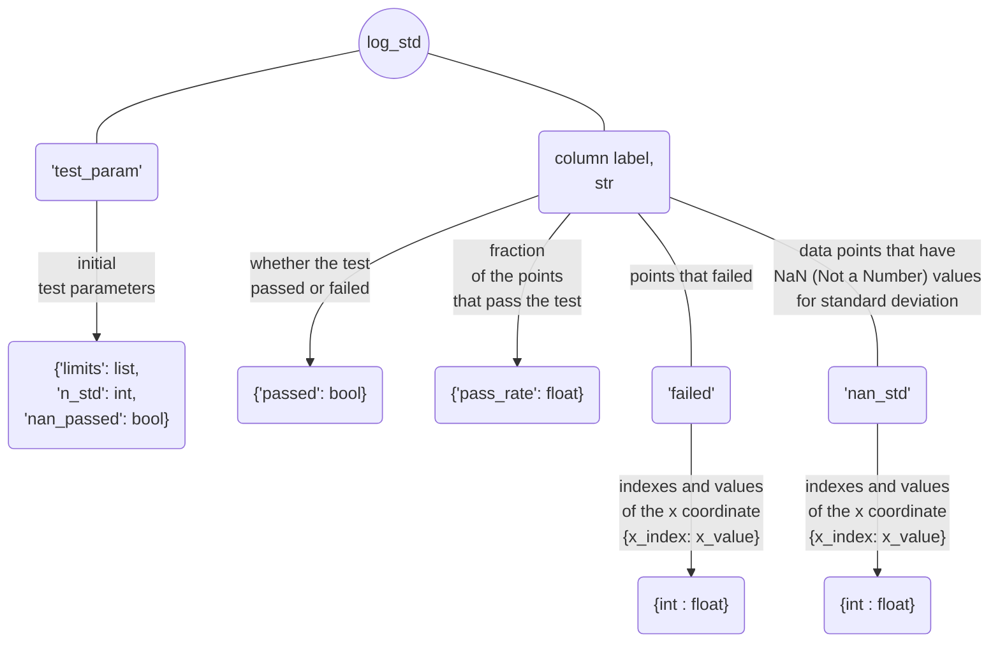

# Validation

The 'validation' module provides a set of tests check the simulation results. These tests include:

 - [**std_bound_test()**](documentation/validation.md#method-std_bound_test-citros_data_analysisvalidationvalidationstd_bound_test) - verifies whether the n-$\sigma$ standard deviation boundary falls within the specified limits;

 - [**mean_test()**](documentation/validation.md#method-mean_test-citros_data_analysisvalidationvalidationmean_test) - checks if the mean value is within the given limits;

 - [**sid_test()**](documentation/validation.md#method-sid_test-citros_data_analysisvalidationvalidationsid_test) - examines if the simulation values do not exceed the limits;

 - [**norm_test**](documentation/validation.md#method-norm_test-citros_data_analysisvalidationvalidationnorm_test) - evaluates norm of each simulation and compares it with the specified limit;

Number and type of tests may be set by [**set_tests()**](documentation/validation.md#method-set_tests-citros_data_analysisvalidationvalidationset_tests) method that allows to specify the desired tests by providing their names and corresponding parameters and produces a consolidated report.

## Query and prepare data

To connect to the database [**CitrosDB**](documentation/data_access.md#citros_data_analysis.data_access.CitrosDB) object is created:
```python
citros = da.CitrosDB()
```
To learn more about connection parameters, see [examples of data_access module](data_access_examples.md#connection-to-the-database).

Let's assume, that data for topic 'A' looks like:

||sid	|rid	|time	|topic	|type	|data
|--|--|--|--|--|--|--
0	|1	|0	|0.313	|A	|a	|{'x': {'x_1': 0.0, 'x_2': 0.08, 'x_3': 154.47}, 'time': 10.0}
1	|1	|1	|0.407	|A	|a	|{'x': {'x_1': 0.008, 'x_2': 0.08, 'x_3': 130.97}, 'time': 17.9}
2	|1	|2	|0.951	|A	|a	|{'x': {'x_1': 0.016, 'x_2': 0.078, 'x_3': 117.66}, 'time': 20.3}
...|...|...|...|...|...|...|

A json-data column containes information about time and vector x, that has elements x_1, x_2 and x_3. Let's query these columns:

```python
df = citros.topic('A').data(['data.x', 'data.time'])
```
The output is a [**pandas.DataFrame**](https://pandas.pydata.org/docs/reference/api/pandas.DataFrame.html):

||sid	|rid	|time	|topic	|type	|data.x|	data.time
|--|--|--|--|--|--|--|--|
0	|1	|0	|0.313	|A	|a	|{'x_1': 0.0, 'x_2': 0.08, 'x_3': 154.47}	|10.0
1	|1	|1	|0.407	|A	|a	|{'x_1': 0.008, 'x_2': 0.08, 'x_3': 130.97}	|17.9
2	|1	|2	|0.951	|A	|a	|{'x_1': 0.016, 'x_2': 0.078, 'x_3': 117.66}	|20.3
...|...|...|...|...|...|...|...

Analysis of data from multiple simulations may be performed if the correspondence between data values from different simulation is set. It may be done through an independent variable that is shared between simulations. Indexes are assigned based on this variable, connecting data values across simulations.

There are two methods to handle index assignment:

 - to divides the independent variable into `num` ranges, assign an index to each interval, and calculate data value averages for each simulation within each range (see [**bin_data()**](documentation/error_analysis.md#method-bin_data-citros_data_analysiserror_analysiscitrosdatabin_data))
 - to scale for each simulation the independent variable to the interval [0,1], defines `num` uniformly distributed points from 0 to 1, and interpolates data points over this new interval (see [**scale_data()**](documentation/error_analysis.md#method-scale_data-citros_data_analysiserror_analysiscitrosdatascale_data)).

This preparation may be done by creating [**Validation**](documentation/validation.md#class-validation-citros_data_analysisvalidationvalidation) object, that is able to store apply mentioned above approaches to assign indexes and calculate statistics over different simulations. Let's choose 'data.time' as an independent variable and use it to assign indexes and connect 'data.x' values of different simulations. The method of index setting is specified by `method`: 'scale' or 'bin', the number of points (bins) is passed by `num`:

```python
V = va.Validation(df, data_label = ['data.x'], param_label = 'data.time', 
                  method = 'scale', num = 20, units = 'm')
```
`units` are specified to make plots more informative.

After initialisation, [**Validation**](documentation/validation.md#class-validation-citros_data_analysisvalidationvalidation) object stores statistics as a [**CitrosStat**](documentation/error_analysis.md#class-citrosstat-citros_data_analysiserror_analysiscitrosstat) in `stat` attribute. For example, to get mean values:

```python
>>> print(V.stat.mean)
              data.x.x_1   data.x.x_2   data.x.x_3
data.time_id
0             -0.045667    0.044667     93.706667
1             0.007875     0.069515     95.639414
2             0.056261     0.043401     33.128443
...
```
In the same it is possible to access scaled 'data.time' range (`V.stat.x`), standard deviation (`V.stat.sigma`) and covarian matrix (`V.stat.covar_matrix`).

## Standard deviation boundary test

[**std_bound_test()**](documentation/validation.md#method-std_bound_test-citros_data_analysisvalidationvalidationstd_bound_test) test whether `n_std`-standard deviation boundary is within the given limits, where boundary is defined as mean value $\pm$ `n_std` * standard deviation. 

```python
log, table, fig = V.std_bound_test(limits = [0.25, 0.3, [-300, 400]], n_std = 3)
```
### limits

Limits may be set in a different way.
  
  - if `limits` are set as a one value, for example `limits` = 1, then it will be applied to all columns and considered as an test interval [-1, 1];
  - if `limits` are set as a list of two values, for example `limits` = [-2, 3], then they will be applied to all columns as an test interval [-2, 3];
  - `limits` may be set separetly for each column, as in the example above: `limits` = [0.25, 0.3, [-300, 400]] that means that for the first column boundaries are [-0.25, 0.25], for the second one are [-0.3, 0.3] and for the last column [[-300, 400]]. That way length of the `limits` must be equal to the number of columns.
  - if number of column equals two, then `limits` = [1, 3] will be considered as common limits [1, 3] for both columns. If separate limits [-1, 1] for the first column and [-3, 3] for the second one are needed, they must be passed as `limits` = [[-1, 1],  [-3, 3]].

### Returning parameters

The method returns three parameters: 
- `log` : [**CitrosDict**](documentation/data_access.md#class-citrosdict-citros_data_analysisdata_accesscitrosdict) - dictionary with test result summary;



- `table` : [**pandas.DataFrame**](https://pandas.pydata.org/docs/reference/api/pandas.DataFrame.html) - table that specifies whether the corresponding standard deviation boundary point pass the test (True) or not (False).

- `fig` : [**matplotlib.figure.Figure**](https://matplotlib.org/stable/api/figure_api.html#matplotlib.figure.Figure)

Let's inspect the output of the example above:

```python
fig.show()
```


```python
print(table)
```
||	data.time| data.x.x_1 |data.x.x_2 |data.x.x_3
|--|--|--|--|--|
data.time_id||||
0   | 0.000000| True|True| False
1   | 0.052632| True|True| False
2   | 0.105263| True|True| True
...|...|...|...|...

`log` can be accessed like a regular python dictionary and can be printed using the [**print()**](documentation/data_access.md#method-print-citros_data_analysisdata_accesscitrosdictprint) method to display it as a JSON object:

```python
log.print()
```
    {
     'test_param': {
       'limits': [0.25, 0.3, [-150, 300]],
       'n_std': 3,
       'nan_passed': True
     },
     'data.x.x_1': {
       'passed': True,
       'pass_rate': 1.0,
       'failed': {
       },
       'nan_std': {
       }
     },
     'data.x.x_2': {
       'passed': True,
       'pass_rate': 1.0,
       'failed': {
       },
       'nan_std': {
       }
     },
     'data.x.x_3': {
       'passed': False,
       'pass_rate': 0.55,
       'failed': {
          0: 0.0,
          1: 0.052,
          5: 0.263,
          6: 0.315,
          8: 0.421,
          11: 0.578,
          12: 0.631,
          18: 0.947,
          19: 1.0
       },
       'nan_std': {
       }
     }
    }

`log` containes summary of the test result: 
  - initial test parameters:
  ```python
  log['test_param'].print()
  ```
    {
     'limits': [0.25, 0.3, [-300, 400]],
     'n_std': 3,
     'nan_passed': True
    }
  - Information for each of the column, let's take a look at the 'data.x.x_1':
    - 'passed' - whether the test for the column was passed (True) or not (False):
      ```python
      >>> print(log['data.x.x_1']['passed'])
      True
      ``` 
    - 'pass_rate' - fraction of the points that pass the test, 0 < pass_rate < 1:
      ```python
      >>> print(log['data.x.x_1']['pass_rate'])
      1.0
      ```
    - 'failed' - dictionaries with indexes and corresponding them values of the x axis ('data.time' in this case). Since all points of 'data.x.x_1' passed the test, log['data.x.x_1']['failed'] is empty:
      ```python
      log['data.x.x_1']['failed'].print()
      ```
          {
          }

      whereas column 'data.x.x_3' has a series of points that exceed the limits:
      ```python
      log['data.x.x_3']['failed'].print()
      ```
          {
           0: 0.0,
           1: 0.052,
           5: 0.263,
           6: 0.315,
           8: 0.421,
           11: 0.578,
           12: 0.631,
           18: 0.947,
           19: 1.0
          }
    - 'nan_std' - if some of the standard deviations points could not be calculated (for example, number of simulations for this index is less then two, that may occurs if the method of data assignment `method` = 'bin' has been chosen), their indexes and values of the x axis will be stored in the same way, as in the section 'failed'.

## Mean test

[**mean_test()**](documentation/validation.md#method-mean_test-citros_data_analysisvalidationvalidationmean_test) test whether `n_std`-standard deviation boundary is within the given limits, where boundary is defined as mean value $\pm$ `n_std` * standard deviation. 

```python
log, table, fig = V.std_bound_test(limits = [0.25, 0.3, [-300, 400]], n_std = 3)
```
