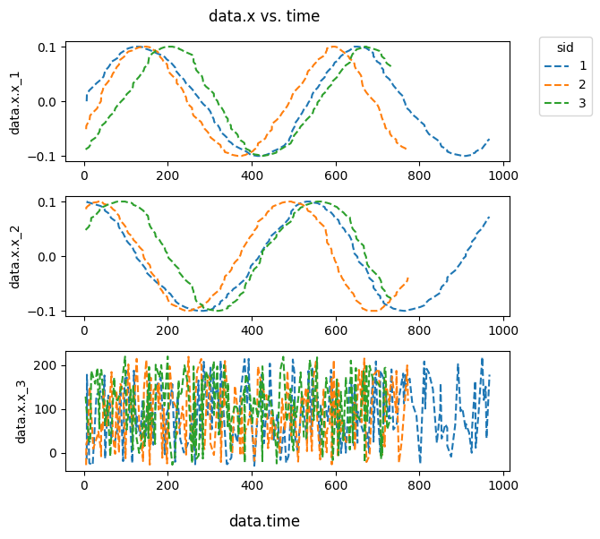
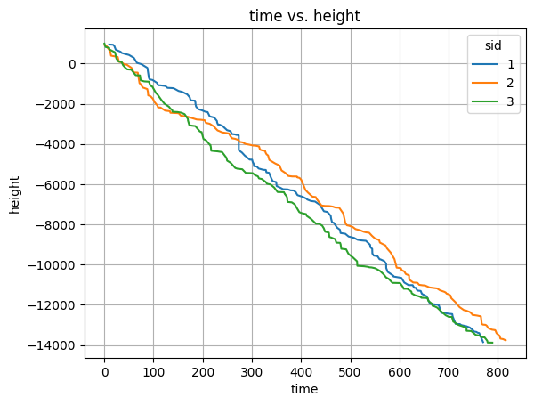

[](https://github.com/lulav/citros_data_analysis/actions/workflows/gcr.yml)


# Data Access

In order to get information about the data of the specific table in the database, to look through the main features and to query the selected parts the module [**data_access**](documentation/data_access.md) from the package **citros_data_analysis** is used. Module is imported by:

```python
from citros_data_analysis import data_access as da
```
Current version can be checked by:
```python
da.get_version()
```
## Connection to the database

To connect to the database [**CitrosDB**](documentation/data_access.md#citros_data_analysis.data_access.CitrosDB) object is created:
```python
citros = da.CitrosDB()
```
<details>
  <summary>Advanced CitrosDB parameters</summary>

If no parameters are passed, the following predefined ENV parameters are used:
 - host: 'PG_HOST'
 - user: 'PG_USER',
 - password: 'PG_PASSWORD',
 - database: 'PG_DATABASE',
 - schema: 'PG_SCHEMA' or 'data_bucket' if 'PG_SCHEMA' not specified,
 - batch: 'bid', 
 - port: 'PG_PORT', or '5432' if 'PG_PORT' is not specified,
 - sid: 'CITROS_SIMULATION_RUN_ID'

Say, we would like to connect to a database "myDatabase" with the user name "user" and password "myPassword", to work with batch "batchName" which is located in the schema "mySchema", using port '5432':

```python
citros = da.CitrosDB(host = 'hostName',
                     user = 'user',
                     password = 'myPassword',
                     database = 'myDatabase',
                     schema = 'mySchema',
                     batch = 'batchName',
                     port = '5432',
                     debug_flag = False)
```
When debug_flag is set to True, that will lead to code interruption if an error occurs while with debug_flag turned to False program will try to handle errors and only print error messages without code breaking. By default, debug_flag = False.

</details>

## Batch overview

The data is stored in the *batches* as *messages*. Each batch contains the following columns:

||user\_id | sid | rid | time | topic | type| data |
|--|--|--|--|--|--|--|--|
|description |user name | simulation id| run id| ros time message | topic name| type name | json-format data|
|type| uuid | int | int | int | str | str | json|

### Batch size

To check the batch sizes in the current schema method [**get_batch_size()**](documentation/data_access.md#citros_data_analysis.data_access.CitrosDB.get_batch_size) is used:

```python
citros.get_batch_size()
```
The result is a table that contains batch names, batch sizes and total sizes with indexes. The output might look something like this:

```python
+--------------------------+------------+------------+
| batch                    | size       | total size |
+--------------------------+------------+------------+
| spectroscopy             | 32 kB      | 64 kB      |
| photometry               | 8192 bytes | 16 kB      |
+--------------------------+------------+------------+
```

### General batch information

To get the overview about the batch, the function [**citros.info()**](documentation/data_access.md#citros_data_analysis.data_access.CitrosDB.info) is used:

```python
citros.info()
```
It returns dictionary, that contains:
* 'size': size of the selected data
* 'sid_count': number of sids
* 'sid_list': list of the sids
* 'topic_count': number of topics
* 'topic_list': list of topics
* 'message_count': number of messages

The result is a [**CitrosDict**](documentation/data_access.md#citros_data_analysis.data_access.CitrosDict) object, that inherits behaviour of an ordinary python dictionary, but has some additional methods.
[**CitrosDict**](documentation/data_access.md#citros_data_analysis.data_access.CitrosDict) object can be converted to json string by the method [**to_json**()](documentation/data_access.md#citros_data_analysis.data_access.CitrosDict.to_json):

```python
>>> citros.info().to_json()

'{\n  "size": "534 kB",\n  "sid_count": 3,\n  "sid_list": [\n    1,\n    2,\n    3\n  ],\n  "topic_count": 4,\n  "topic_list": [\n    "A",\n    "B",\n    "C",\n    "D"\n  ],\n  "message_count": 2000\n}'
```
or printed by the method [**print()**](documentation/data_access.md#citros_data_analysis.data_access.CitrosDict.print):

```python
>>> citros.info().print()

{
 'size': '534 kB',
 'sid_count': 3,
 'sid_list': [1, 2, 3],
 'topic_count': 4,
 'topic_list': ['A', 'B', 'C', 'D'],
 'message_count': 2000
}
```
If specific sid is set, [**citros.info()**](documentation/data_access.md#citros_data_analysis.data_access.CitrosDB.info) also appends dictionary 'sids', with the following structure:
* 'sids':
    * int:
        * 'topics': 
            * str:
               * 'message_count': number of messages
               * 'start_time': time when simulation started
               * 'end_time': time when simulation ended
               * 'duration': duration of the simalation process
               * 'frequency': frequency of the simulation process

sid may be passed during [**CitrosDB** initialization](#connection-to-the-database) or by [**citros.sid()**](#sid-constraints) method.

To get information about data with sid = 1 or 2 and print it:

```python
>>> citros.sid([1,2]).info().print()

{
 'size': '365 kB',
 'sid_count': 2,
 'sid_list': [1, 2],
 'topic_count': 4,
 'topic_list': ['A', 'B', 'C', 'D'],
 'message_count': 1369,
 'sids': {
   1: {
     'topics': {
       'A': {
         'message_count': 155,
         'start_time': 0.313,
         'end_time': 100.485,
         'duration': 100.172,
         'frequency': 0.01
       },
       'B': {
         'message_count': 178,
         'start_time': 0.345,
         'end_time': 100.752,
         'duration': 100.407,
         'frequency': 0.01
       },
       'C': {
...
     }
   }
 }
}
```

To set the specific topic, method [**topic()**](documentation/data_access.md#citros_data_analysis.data_access.CitrosDB.topic) is used.
This way, dictionary 'topics' is appended:
    
* 'topics':
    * str:
        * 'type': type
        * 'data_structure': structure of the data
        * 'message_count': number of messages

```python
>>> citros.topic('A').info().print()

{
 'size': '126 kB',
 'sid_count': 3,
 'sid_list': [1, 2, 3],
 'topic_count': 1,
 'topic_list': ['A'],
 'message_count': 474,
 'topics': {
   'A': {
     'type': 'a',
     'data_structure': {
       'data': {
         'x': {
           'x_1': 'float',
           'x_2': 'float',
           'x_3': 'float'
         },
         'note': 'list',
         'time': 'float',
         'height': 'float'
       }
     },
     'message_count': 474
   }
 }
}
```

The specific piece of information may be achieved by the keywords of the [**CitrosDict**](documentation/data_access.md#citros_data_analysis.data_access.CitrosDict), obtained by [**info()**](documentation/data_access.md#citros_data_analysis.data_access.CitrosDB.info) method.

<details>
  <summary>Examples</summary>

- Get total number of messages for sid = 1 or 2:

```python
#get information about sid equals 1 or 2 and assign the result to the variable 'inf_12':
inf_12 = citros.sid([1,2]).info()

#access number of messages by key 'message_count' and assign it to 'num':
num = inf_12['message_count']

#print:
print('total number of messages where sid = 1 or 2: {}'.format(num))
```
The result is:
```python
total number of messages where sid = 1 or 2: 1369
```

- Get number of messages for topic 'A' for each of these sids:
```python
#for sid equals 1, for topic 'A' get number of messages by 'message_count':
num_1 = inf_12['sids'][1]['topics']['A']['message_count']

#get numbe rof messages for sid = 2, topic 'A':
num_2 = inf_12['sids'][2]['topics']['A']['message_count']

#print both numbers:
print('Number of messages in "A" for sid = 1: {0}, for sid = 2: {1}'.format(num_1, num_2))
```
The output:
```python
Number of messages in "A" for sid = 1: 155, for sid = 2: 164
```
- Get structure of the topic 'A' and the total number of messages for this topic:
```python
#get information about topic 'A' and assign the resulting dictionary to the variable 'inf_A'
inf_A = citros.topic('A').info()

#get number of messages by 'message_count' keyword:
num = inf_A['message_count']

#print number of messages:
print('total number of messages in topic "A": {}'.format(num))

#print structure of the json-data column:
inf_A['topics']['A']['data_structure']['data'].print()
```
The result is:
```python
total number of messages in topic "A": 474
{
 'x': {
   'x_1': 'float',
   'x_2': 'float',
   'x_3': 'float'
 },
 'note': 'list',
 'time': 'float',
 'height': 'float'
}
```
</details>

## Query data

The general query scheme is as follows:


where [**topic()**](documentation/data_access.md#citros_data_analysis.data_access.CitrosDB.topic) and [**data()**](documentation/data_access.md#citros_data_analysis.data_access.CitrosDB.data) methods are nessesary methods and all other are optional to use.

The method [**data()**](documentation/data_access.md#citros_data_analysis.data_access.CitrosDB.data) of the [**CitrosDB**](#connection-to-the-database) object is dedicated to query data. Data is always querying for the specific topic, which is defined by [**topic()**](documentation/data_access.md#citros_data_analysis.data_access.CitrosDB.topic) method, which must be called before [**data()**](documentation/data_access.md#citros_data_analysis.data_access.CitrosDB.data) method. The result is returned as a [**DataFrame**](https://pandas.pydata.org/docs/reference/api/pandas.DataFrame.html) of the [**pandas** package](https://pandas.pydata.org/) - a widely used format in data science.

To query all data for the topic 'B':
```python
citros.topic('B').data()
```
<details>
  <summary>Show the output:</summary>

A pandas DataFrame.

||sid	|rid	|time	|topic	|type	|data.x.x_1	|data.x.x_2	|data.x.x_3	|data.time	|data.note	|data.height
|--|--|--|--|--|--|--|--|--|--|--|--|
0	|2	|0	|0.140	|B	|b	|-0.051	|0.086	|-27.93	|5.0	|[aa, ee, [45, 83], {'n': 31}]	|979.372
1	|2	|1	|0.195	|B	|b	|-0.045	|0.089	|19.85	|5.5	|[aa, cc, [12, 1], {'n': 68}]	|969.772
2	|2	|2	|0.265	|B	|b	|-0.039	|0.092	|33.61	|9.5	|[bb, ee, [92, 23], {'n': 96}]	|954.368
...|...|...|...|...|...|...|...|...|...|...|...
</details>

If no arguments are passed to the [**data()**](documentation/data_access.md#citros_data_analysis.data_access.CitrosDB.data) methods, all data from the json-data column is selected. The json-objects are splitted into columns, while json-arrays are retained as lists.

If the whole json-data column is desired as a json-object:

```python
citros.topic('B').data('data')
```
<details>
  <summary>The output table:</summary>

||sid	|rid|time	|topic	|type	|data
|--|--|--|--|--|--|--|
0	|2	|0	|0.140	|B	|b	|{'x': {'x_1': -0.051, 'x_2': 0.086, 'x_3': -27...
1	|2	|1	|0.195	|B	|b	|{'x': {'x_1': -0.045, 'x_2': 0.089, 'x_3': 19....
2	|2	|2	|0.265	|B	|b	|{'x': {'x_1': -0.039, 'x_2': 0.092, 'x_3': 33....
...|...|...|...|...|...|...
</details>

If only some of the json objects are needed, for example data.x.x_1 and data.time, list with their labels may be passed to [**data()**](documentation/data_access.md#citros_data_analysis.data_access.CitrosDB.data): 

```python
citros.topic('B').data(['data.x.x_1', 'data.time'])
```
<details>
  <summary>The result:</summary>

||sid	|rid|time|topic	|type	|data.x.x_1	|data.time
|--|--|--|--|--|--|--|--|
0	|2	|0	|0.140	|B	|b|	-0.051	|5.0
1	|2	|1	|0.195	|B	|b|	-0.045	|5.5
2	|2	|2	|0.265	|B	|b|	-0.039	|9.5
...|...|...|...|...|...|...|...
</details>

If there are json-arrays in the data and the values with the exact index is needed, this index may be passed in square brackets. For example, to collect the values of the first index of the json array "data.note": 

```python
citros.topic('B').data('data.note[0]')
```
<details>
  <summary>The query result:</summary>

||sid	|rid|	time	|topic	|type	|data.note[0]
|--|--|--|--|--|--|--|
0	|2	|0	|0.140	|B	|b	|aa
1	|2	|1	|0.195	|B	|b	|aa
2	|2	|2	|0.265	|B	|b	|bb
...|...|...|...|...|...|...
</details>

### sid constraints

To get data with the exact sid, method [**sid()**](documentation/data_access.md#citros_data_analysis.data_access.CitrosDB.sid) of the [**CitrosDB**](#connection-to-the-database) is used. It should be applied before [**data()**](documentation/data_access.md#citros_data_analysis.data_access.CitrosDB.data) method. It takes int or list of ints as an argument.

To query json-data column 'data.x.x_1' of the topic 'B' with sid = 1 or 3:

```python
citros.topic('B').sid([1,3]).data('data.x.x_1')
```
<details>
  <summary>The output table</summary>

||sid	|rid| time	|topic	|type	|data.x.x_1
|--|--|--|--|--|--|--|
0	|1	|0	|0.345	|B	|b	|0.000
1	|1	|1	|0.763	|B	|b	|0.007
2	|3	|1	|1.348	|B	|b	|-0.084
...|...|...|...|...|...|...
</details>

### rid constraints

To select only messages with the exact values of rid, the method [**rid()**](documentation/data_access.md#citros_data_analysis.data_access.CitrosDB.rid) of the [**CitrosDB**](#connection-to-the-database) is used. It should be applied before [**data()**](documentation/data_access.md#citros_data_analysis.data_access.CitrosDB.data) method. Limits of the rid values are defined by `start`, `end` and `count` arguments: `start` <= rid, rid <= `end` and rid < `start` + `count`.  `start`, `end` and  `count` values must be integers.

Since rid is always > 0, the default `start` being equal 0 means no constraints. 

rid is always >= 0, so the default `start` = 0 means no constraints. To set the upper limit for rid, only `end` may be specified. For example, to get json-daat column 'data.x.x_1' of the topic 'B' with rid <= 15:

```python
citros.topic('B').rid(end = 15).data('data.x.x_1')
```
<details>
  <summary>The output table:</summary>

||sid	|rid|	time	|topic	|type	|data.x.x_1
|--|--|--|--|--|--|--|
0	|2	|0	|0.140	|B	|b	|-0.051
1	|2	|1	|0.195	|B	|b	|-0.045
2	|2	|2	|0.265	|B	|b	|-0.039
...|...|...|...|...|...|...
</details>

To set 10 <= rid <= 15:

```python
citros.topic('B').rid(start = 10, end = 15).data('data.x.x_1')
```
<details>
  <summary>The result of the code above:</summary>

||sid	|rid|	time	|topic	|type	|data.x.x_1
|--|--|--|--|--|--|--|
0	|2	|11	|6.322	|B	|b	|0.020
1	|2	|10	|5.975	|B	|b	|0.013
2	|1	|12	|7.459	|B	|b	|0.072
...|...|...|...|...|...|...
</details>

Instead of the `end` value the upper limit of rid may be specified by `count` argument, that set it relative to the `start`. To set 10 <= rid <= 15 with the `count`:

```python
citros.topic('B').rid(start = 10, count = 6).data('data.x.x_1')
```

### time constraints

To apply constraints on time column, the [**time()**](documentation/data_access.md#citros_data_analysis.data_access.CitrosDB.time) method of the [**CitrosDB**](#connection-to-the-database) is used. It should be applied before [**data()**](documentation/data_access.md#citros_data_analysis.data_access.CitrosDB.data) method. [**time()**](documentation/data_access.md#citros_data_analysis.data_access.CitrosDB.time) method has `start`, `end` and  `duration` arguments to define the time limits (in seconds) of the query. Briefly, they set the following constraints on time: `start` <= time, time <= `end` and time < `start` + `duration`. `start`, `end` and  `duration` values must be integers.

Since time is always >= 0, the default `start` being equal 0 means no constraints. To set the upper limit in seconds for the time column, define `end` argument.
For example, for querying json-daat column 'data.x.x_1' of the topic 'B' with time <= 100s:

```python
citros.topic('B').time(end = 100).data('data.x.x_1')
```
<details>
  <summary>Show the output:</summary>

||sid	|rid|	time	|topic	|type	|data.x.x_1
|--|--|--|--|--|--|--|
0	|2	|0	|0.140	|B	|b	|-0.051
1	|2	|1	|0.195	|B	|b	|-0.045
2	|2	|2	|0.265	|B	|b	|-0.039
...|...|...|...|...|...|...
</details>

Lower limit is set by the `start` argument. To set 50s <= time <= 100s:

```python
citros.topic('B').time(start = 50, end = 100).data('data.x.x_1')
```
<details>
  <summary>Result:</summary>

||sid	|rid|	time	|topic	|type	|data.x.x_1
|--|--|--|--|--|--|--|
0	|1	|89	|50.461	|B	|b	|-0.034
1	|3	|72	|50.705	|B	|b	|-0.056
2	|3	|73	|50.838	|B	|b	|-0.061
...|...|...|...|...|...|...
</details>

Instead of the `end` value the duration (in seconds) may be specified, that defines the upper limit of time relative to the `start`. To set 50s <= time < 100s with `duration`:

```python
citros.topic('B').time(start = 50, duration = 50).data('data.x.x_1')
```
Note that when the `duration` istead of the `end` argumet is used, the upper limit that equals `start`+`duration` is not included in the query.

### json-data constraints

To apply constraints on a json-data columns, [**set_filter()**](documentation/data_access.md#citros_data_analysis.data_access.CitrosDB.set_filter) method of the [**CitrosDB**](#connection-to-the-database) is used. It should be applied before [**data()**](documentation/data_access.md#citros_data_analysis.data_access.CitrosDB.data) method. It takes a dictionary as an argument.

The argument has the following structure:
{Key: Value, Key1: Value1, ...}, where Key is a label of the column (for example, 'data.x') and Value defines the constraints, to apply on this column:

|case|Value form| meaning |example|example description
|--|--|--|--|--|
equality| [...] - list of exact values| = |[1, 2, 3]|equals 1 or 2 or 3
inequality|{'gt': val}| > val | {'gt': 5}| > 5
|| {'gte': val}| >= val | {'gte': 4.5}| >= 4.5
|| {'lt': val}| < val | {'lt': 0.55}| < 0.55
|| {'lte': val}| <= val | {'lte': -7}| <= -7

:::note
If one of the sampling method ([**skip()**](#skip), [**avg()**](#avarage), [**move_avg()**](#moving-average)) is used, constraints on all columns except json-data are applied BEFORE sampling while constraints on columns from json-data are applied AFTER sampling.
:::

- To query json-data columns 'data.x.x_1' and 'data.note[2]' from the topic 'B' that matches the condition 'data.x.x_1' < 40:

```python
citros.topic('B').set_filter({'data.x.x_1':{'lt':40}}).data(['data.x.x_1', 'data.note[2]'])
```
<details>
  <summary>Show the result:</summary>

||sid	|rid|	time	|topic	|type	|data.x.x_1	|data.note[2]
|--|--|--|--|--|--|--|--|
0	|2	|0	|0.140	|B	|b	|-0.051	|[45, 83]
1	|2	|1	|0.195	|B	|b	|-0.045	|[12, 1]
2	|2	|2	|0.265	|B	|b	|-0.039	|[92, 23]
...|...|...|...|...|...|...|...
</details>

- To query json-data columns 'data.x.x_1' and 'data.note[2]' from the topic 'B' that matches the condition 'data.note[2][0]' = 55 or 56:

```python
citros.topic('B').set_filter({'data.note[2][0]' :[55, 56]}).data(['data.x.x_1', 'data.note[2][0]'])
```
<details>
  <summary>The output:</summary>

||sid	|rid|	time	|topic	|type	|data.x.x_1	|data.note[2][0]
|--|--|--|--|--|--|--|--
0	|3	|2	|1.946	|B	|b	|-0.080|	55
1	|3	|6	|4.539	|B	|b	|-0.062|	56
2	|1	|33	|17.139	|B	|b	|0.081|	55
...|...|...|...|...|...|...|...
</details>

:::note
[**set_filter()**](documentation/data_access.md#citros_data_analysis.data_access.CitrosDB.set_filter) method may be used to apply constraints not only on json-data, but on any column. Conditions, passed here, have higher priority over those defined by [**topic()**](documentation/data_access.md#citros_data_analysis.data_access.CitrosDB.topic), [**rid()**](#rid-constraints), [**sid()**](#sid-constraints) and [**time()**](#time-constraints) methods and will override them.
:::

### Constraints combination

[**topic()**](documentation/data_access.md#citros_data_analysis.data_access.CitrosDB.topic), [**rid()**](#rid-constraints), [**sid()**](#sid-constraints), [**time()**](#time-constraints) and [**set_filter()**](#json-data-constraints) methods of the [**CitrosDB**](#connection-to-the-database) objects may be combined to precisely define the query:

```python
citros.topic('B')\
      .sid([1,2])\
      .rid(start = 10, end = 100)\
      .time(start = 15, end = 100)\
      .set_filter({'data.x.x_1': {'gt': 0, 'lte': 0.5}})\
      .data(['data.x.x_1', 'data.x.x_2'])
```
<details>
  <summary>Show the output:</summary>

||sid	|rid| time	|topic	|type	|data.x.x_1	|data.x.x_2
|--|--|--|--|--|--|--|--
0	|2	|29	|15.711	|B	|b	|0.099	|0.017
1	|2	|30	|15.915	|B	|b	|0.099	|0.010
2	|1	|33	|17.139	|B	|b	|0.081	|-0.059
...|...|...|...|...|...|...|...
</details>

### Sorting order

To sort the result of the query in ascending or descending order the [**set_order()**](documentation/data_access.md#citros_data_analysis.data_access.CitrosDB.set_order) method of the [**CitrosDB**](#connection-to-the-database) object is used. It should be applied before [**data()**](#query-data) method calling. It takes a dictionary as an argument, where the key is a label of the column and the dictionary value defines whether in ascending ('asc') or in descending ('desc') order to sort.

To query json-data columns 'data.height' of the topic 'A' and to sort the result by sid in ascending order and by this column 'data.height' in descending order:

```python
citros.topic('A').set_order({'sid': 'asc', 'data.height': 'desc'}).data('data.height')
```
<details>
  <summary>Show the result:</summary>

||sid	|rid|	time	|topic	|type	|data.height
|--|--|--|--|--|--|--
0	|1	|0	|0.313	|A	|a	|949.799
1	|1	|1	|0.407	|A	|a	|937.165
2	|1	|2	|0.951	|A	|a	|884.295
...|...|...|...|...|...|...
</details> 

### Sampling methods 

If the amount of output data is too huge, only part of it may be selected. It may be achived by sampling methods [**skip()**](#skip), [**avg()**](#avarage) and [**move_avg()**](#moving-average), applied before [**data()**](#query-data) method. Only one of this sampling function may be used at one query.

#### Skip

[**skip(n)**](documentation/data_access.md#citros_data_analysis.data_access.CitrosDB.skip) method is used to select `n`-th message of the each sid.

To query only each 5th message of the topic 'B':
```python
citros.topic('B')\
      .skip(5)\
      .data(['data.x.x_1', 'data.x.x_2'])
```
<details>
  <summary>Show table:</summary>

||sid	|rid|	time	|topic	|type	|data.x.x_1	|data.x.x_2
|--|--|--|--|--|--|--|--
0	|1	|0	|0.345	|B	|b	|0.000	|0.100
1	|1	|5	|3.387	|B	|b	|0.033	|0.094
2	|1	|10	|7.224	|B	|b	|0.062	|0.079
...|...|...|...|...|...|...|...
</details>

#### Avarage

To average each `n` messages of the each sid, [**avg(n)**](documentation/data_access.md#citros_data_analysis.data_access.CitrosDB.avg) method is used. Only numeric values may be averaged and the labels of the json-data columns with numeric content should be explicitly listed in [**data()**](#query-data). The value in 'rid' column is set as a minimum value among the 'rid' values of the averaged rows.

To average each 5 messages of the topic 'B':
```python
citros.topic('B')\
      .avg(5)\
      .data(['data.x.x_1', 'data.x.x_2'])
```
<details>
  <summary>The output:</summary>

||sid	|rid|	time	|topic	|type	|data.x.x_1	|data.x.x_2
|--|--|--|--|--|--|--|--
0	|1	|0	|1.127	|B	|b	|0.0132|	0.0986
1	|1	|5	|4.720	|B	|b	|0.0448|	0.0888
2	|1	|10	|7.442	|B	|b	|0.0714|	0.0696
...|...|...|...|...|...|...|...
</details>

#### Moving average

To apply moving average over `n` messages and than select each `m`-th row of the result, [**move_avg(n, m)**](documentation/data_access.md#citros_data_analysis.data_access.CitrosDB.move_avg) method is used. Only numeric values may be averaged and the labels of the json-data columns with numeric content should be explicitly listed in [**data()**](#query-data). The value in 'rid' column is set as a minimum value among the 'rid' values of the averaged rows.

To use moving average to average each 5 messages and query every second row of the result of the topic 'B':

```python
citros.topic('B')\
      .move_avg(5,2)\
      .data(['data.x.x_1', 'data.x.x_2'])
```
<details>
  <summary>The output table:</summary>

||sid	|rid|	time|	topic	|type|	data.x.x_1	|data.x.x_2
|--|--|--|--|--|--|--|--
0	|1	|0	|1.127	|B	|b	|0.0132	|0.0986
1	|1	|2	|2.361	|B	|b	|0.0262	|0.0958
2	|1	|4	|3.724	|B	|b	|0.0388	|0.0914
...|...|...|...|...|...|...|...
</details>

### Segregate data by sid

Method [**get_sid_tables(data_query)**](documentation/data_access.md#citros_data_analysis.data_access.CitrosDB.get_sid_tables) returns dict of tables, each of the tables corresponds to exact value of sid.
The returning dictionary containes sid as dictionary keys and tables as dictionary values.

For example, let's query json-data columns 'data.x.x_2', 'data.time' for topic 'A', where 'data.x.x_2' >= 0 and sid equals 1 or 2. And let's also average each 10 rows of the table:

```python
dfs = citros.topic('A').\
             sid([1,2]).\
             avg(10).\
             set_filter({'data.x.x_2': {'gte':0}}).\
             set_order({'data.x.x_2':'desc', 'time':'asc'}).\
             get_sid_tables(data_query = ['data.x.x_2', 'data.time'])

#print all sid values
print('sid values are: {}\n'.format(list(dfs.keys())))

#print DataFrame that corresponds to sid = 1:
print('data with sid = 1:')
print(dfs[1])
```
<details>
  <summary>Show the output:</summary>

```python
sid values are: [1, 2]

data with sid = 1:
```
||sid | rid |   time| topic  |data.x.x_2 | data.time
|--|--|--|--|--|--|--|
0|	1	|120|	83.744	|A	|0.0763|	629.48
1|	1	|60	|	43.003	|A	|0.0757|	322.95
2|	1	|0	|	2.893	|A	|0.0691|	35.84
...|...|...|...|...|...|...
</details>

## Plot data

Let's make query that select 'data.x.x_1' and 'data.x.x_2' from the json-data column of the topic 'B' with sids equals 1,2 or 3, where 10 <= rid <= 200, 0s <= time < 200s. Let's also apply moving average sampling, that averages over 5 messages and select each second row of the result and save the output in variable named **df**:

```python
df = citros.topic('B')\
           .sid([1,2,3])\
           .rid(start = 10, end = 200)\
           .time(start = 0, duration = 200)\
           .move_avg(5,2)\
           .data(['data.x.x_1', 'data.x.x_2'])
```

### Plot with pandas

Since the result of the query is a [**DataFrame**](https://pandas.pydata.org/docs/reference/api/pandas.DataFrame.html) of the [**pandas** package](https://pandas.pydata.org/), **pandas** methods of [plotting](https://pandas.pydata.org/docs/reference/api/pandas.DataFrame.plot.html) may be applied to it. It is possible to make separate plots for each of the sid presented in data.

To plot the graph 'data.x.x_1' vs. 'rid' for each sid:
```python
df.set_index(['rid','sid']).unstack()['data.x.x_1'].plot()
```
<details>
  <summary>Show figure:</summary>


</details>

To make one plot for both 'data.x.x_1' and 'data.x.x_2':

```python
df.set_index(['rid','sid']).unstack()[['data.x.x_1','data.x.x_2']].plot()
```
<details>
  <summary>Show figure:</summary>


</details>

It is also possible to query and plot all at once by a single command:
```python
citros.topic('B')\
      .sid([1,2,3])\
      .rid(start = 10, end = 200)\
      .time(start = 0, duration = 200)\
      .move_avg(5,2)\
      .data(['data.x.x_1', 'data.x.x_2'])\
      .set_index(['rid','sid']).unstack()['data.x.x_1'].plot()
```
<details>
  <summary>Show figure:</summary>


</details>

### plot_graph()

[**plot_graph(df, x_label, y_label, \*args, ax = None, legend = True, title = None, \*\*kwargs)**](documentation/data_access.md#citros_data_analysis.data_access.CitrosDB.plot_graph) method of the [**CitrosDB**](#connection-to-the-database) object makes separate graphs '`y_label` vs. `x_label`' for each sid, where `x_label` and `y_label` are the labels of columns of the table `df`. Some other additional arguments may be passed to customize the plot, see documentation for [matplotlib.axes.Axes.plot](https://matplotlib.org/stable/api/_as_gen/matplotlib.axes.Axes.plot.html).

To plot simple graph 'data.x.x_2' vs 'rid':

```python
citros.plot_graph(df, 'rid', 'data.x.x_2', '.', title = 'data.x.x_2 vs. rid')
```
<details>
  <summary>Show figure:</summary>


</details>

### plot_3dgraph()

[**plot_3dgraph(df, x_label, y_label, z_label, \*args, ax = None, scale = True, legend = True, title = None, \*\*kwargs)**](documentation/data_access.md#citros_data_analysis.data_access.CitrosDB.plot_3dgraph) method of the [**CitrosDB**](#connection-to-the-database) plots 3D graph '`z_label` vs. `x_label` and `y_label`' for each sid, where `x_label`, `y_label` and `z_label` are the labels of columns of the pandas.DataFrame `df`. Parameter `scale` is used to specify whether the axis range should be the same for all three axes.

Let's query for 'data.x.x_1', 'data.x.x_2' and 'data.x.x_3' columns of the topic 'B' and two sids:

```python
df = citros.topic('B')\
           .sid([1,2])\
           .data(['data.x.x_1', 'data.x.x_2', 'data.x.x_3'])
```
If no `ax` is passed, **plot_3dgraph()** creates pair of `fig` and `ax` and returns them:

```python
citros.plot_3dgraph(df, 'data.x.x_1', 'data.x.x_2', 'data.x.x_3', '--', scale = False, title = 'data.x.x_3 vs.\n data.x.x_1 and data.x.x_2', legend = True)

ax.set_box_aspect(aspect=None, zoom=0.9)

fig.tight_layout()
```
<details>
  <summary>Show figure:</summary>


</details>

The `ax` parameter allows the option to pass a pre-existing three-dimensional axes for plotting:

```python
import matplotlib.pyplot as plt
from mpl_toolkits import mplot3d

fig = plt.figure(figsize=(6, 6)) 
ax = fig.add_subplot(111, projection = '3d') 

citros.plot_3dgraph(df, 'data.x.x_1', 'data.x.x_2', 'data.x.x_3', '--', ax = ax, scale = False, legend = True, title = 'data.x.x_3 vs.\n data.x.x_1 and data.x.x_2')
```

### multiple_y_plot()

[**multiple_y_plot(self, df, x_label, y_labels, \*args, fig = None, title = None, legend = True,\*\*kwargs)**](documentation/data_access.md#citros_data_analysis.data_access.CitrosDB.multiple_y_plot) plots a series of vertically arranged graphs 'y vs. `x_label`', with the y-axis labels specified in the `y_labels` parameter.

Let's query 'data.x.x_1', 'data.x.x_2' and 'data.x.x_3' and plot them versus 'data.time':

```python
df = citros.topic('B')\
           .data(['data.x.x_1', 'data.x.x_2', 'data.x.x_3', 'data.time'])

fig, ax = citros.multiple_y_plot(df, 'data.time', ['data.x.x_1', 'data.x.x_2', 'data.x.x_3'], '--', legend = True, title = 'data.x vs. time')
```
<details>
  <summary>Show figure:</summary>


</details>

### multiplot()

[**multiplot(self, df, labels, *args, scale = True, fig = None, title = None, **kwargs)**](documentation/data_access.md#citros_data_analysis.data_access.CitrosDB.multiplot) method of the [**CitrosDB**](#connection-to-the-database) object plots a matrix of N x N graphs, each displaying either the histogram with values distribution (for graphs on the diogonal) or
the relationship between variables listed in `labels`, with N being the length of `labels` list. For non-diagonal graphs, colors are assigned to points according to sids.

```python
df = citros.topic('C').skip(10).data(['data.x.x_1', 'data.x.x_2', 'data.x.x_3'])

fig, ax = citros.multiplot(df, ['data.x.x_1','data.x.x_2', 'data.x.x_3'], '.' , legend = True, title = 'data.x', scale = True)
```
<details>
  <summary>Show figure:</summary>


</details>

### time_plot()

[**time_plot(ax, \*args, topic_name = None, var_name = None, time_step = 1.0, sids = None, y_label = None, title_text = None, legend = True, \*\*kwarg)**](documentation/data_access.md#citros_data_analysis.data_access.CitrosDB.time_plot) method of the [**CitrosDB**](#connection-to-the-database) object query column `var_name` of the topic `topic_name` and plots `var_name` vs. `Time` for each of the sids, where `Time` = `time_step` * rid. It is possible to specify sids by passing them as a list to `sid`. If `sid` is not specified, data for all sids is used. 

:::note
Also, such methods as [**topic()**](documentation/data_access.md#citros_data_analysis.data_access.CitrosDB.topic), [**rid()**](#rid-constraints), [**sid()**](#sid-constraints), [**time()**](#time-constraints) and [**set_filter()**](#json-data-constraints) may be used to put constraints on data before plotting (see [constraints combination](#constraints-combination)).
:::

```python
import matplotlib.pyplot as plt

fig, ax = plt.subplots()

citros.topic('A').time_plot(ax, 
                            var_name = 'data.x.x_1', 
                            time_step = 0.5, 
                            sids = [1,3],
                            y_label='x_1', title_text = 'x_1 vs. Time')
```
<details>
  <summary>Show figure:</summary>


</details>

### xy_plot()

[**xy_plot(ax, \*args, topic_name = None, var_x_name = None, var_y_name = None, sids = None, x_label = None, y_label = None, title_text = None, legend = True, \*\*kwargs)**](documentation/data_access.md#citros_data_analysis.data_access.CitrosDB.xy_plot) method of the [**CitrosDB**](#connection-to-the-database) object query columns `var_x_name` and `var_y_name` of the topic `topic_name` and plots `var_y_name` vs. `var_x_name` for each of the sids. It is possible to specify sids by passing them as a list to `sid`. If `sid` is not specified, data for all sids is used.

:::note
Also, such methods as [**topic()**](documentation/data_access.md#citros_data_analysis.data_access.CitrosDB.topic), [**rid()**](#rid-constraints), [**sid()**](#sid-constraints), [**time()**](#time-constraints) and [**set_filter()**](#json-data-constraints) may be used to put constraints on data before plotting (see [constraints combination](#constraints-combination)).
:::

```python
import matplotlib.pyplot as plt

fig, ax = plt.subplots()

citros.sid([1,2,3]).topic('A')\
                   .xy_plot(ax, 
                            var_x_name = 'data.time', 
                            var_y_name = 'data.height',
                            x_label='time', y_label = 'height', 
                            title_text='time vs. height')
```
<details>
  <summary>Show figure:</summary>


</details>

## Useful utilities

1. [Data structure](#data-structure)
2. [Unique values](#unique-values)
3. [Maximum and minimum values](#maximum-and-minimum-values)
4. [Number of messages](#number-of-messages)
5. [Number of the unique values](#number-of-the-unique-values)

### Data structure

[**get_data_structure(topic = None)**](documentation/data_access.md#citros_data_analysis.data_access.CitrosDB.get_data_structure) method of the [**CitrosDB**](#connection-to-the-database) object may be used to display json-data structure for specific topics, listed in `topic`. To get the result for all existing topics, leave `topic` = None:

```python
#leave only topics of interest or leave topic = None to see the information for all topics:
result = citros.get_data_structure(topic = ['A','C'])

#use prettytable to print the result:
header = ['topic', 'type', 'data']
table = PrettyTable(field_names=header, align='r')
table.align['data'] = 'l'
table.hrules = ALL
table.add_rows(result)
print(table)
```
<details>
  <summary>The result:</summary>

```
+-------+------+-----------------+
| topic | type | data            |
+-------+------+-----------------+
|     A |    a | {               |
|       |      |   x: {          |
|       |      |     x_1: float, |
|       |      |     x_2: float, |
|       |      |     x_3: float  |
|       |      |   },            |
|       |      |   note: list,   |
|       |      |   time: float,  |
|       |      |   height: float |
|       |      | }               |
+-------+------+-----------------+
|     C |    c | {               |
|       |      |   x: {          |
|       |      |     x_1: float, |
|       |      |     x_2: float, |
|       |      |     x_3: float  |
|       |      |   },            |
|       |      |   note: list,   |
|       |      |   time: float,  |
|       |      |   height: float |
|       |      | }               |
+-------+------+-----------------+
```
</details>

### Unique values

Method [**get_unique_values(column_names)**](documentation/data_access.md#citros_data_analysis.data_access.CitrosDB.get_unique_values) of the [**CitrosDB**](#connection-to-the-database) object is used to get the unique values or combination of values of the columns `column_names`.

:::note
Like in the case of [data querying](#data-access), such methods as [**topic()**](documentation/data_access.md#citros_data_analysis.data_access.CitrosDB.topic), [**rid()**](#rid-constraints), [**sid()**](#sid-constraints), [**time()**](#time-constraints) and [**set_filter()**](#json-data-constraints) may be applied too to define constraints.
:::

- Get the unique combination of "topic" and "type" and show it by **prettytable**:

```python
result = citros.get_unique_values(column_names = ['topic', 'type_name'])

table = PrettyTable(field_names=column_names, align='r')
table.add_rows(result)
print(table)
```
<details>
  <summary>The result:</summary>

```
+-------+------+
| topic | type |
+-------+------+
|     B |    b |
|     A |    a |
|     D |    d |
|     C |    c |
+-------+------+
```
</details>

- Get the unique values of the column "type", but only for specific "time" and "topic" values, for example 100 < "time" <= 200, "topic" = 'A':

```python
#get the unique values
result = citros.topic('A').set_filter({'time': {'gt': 100, 'lte': 200}}).get_unique_values(column_names = ['type'])

#print
table = PrettyTable(field_names=column_names, align='r')
table.add_rows(result)
print(table)
```
<details>
  <summary>The output:</summary>

```
+------+
| type |
+------+
|    a |
+------+
```
</details>

Another way to apply constraints is to use argument `filter_by`, that has the same syntax as [**set_filter()**](#json-data-constraints) method. This way, the query from the previous example will look like:

```python
result = citros.get_unique_values(column_names = ['type'], 
                                  filter_by = {'topic': 'A', 'time': {'gt': 100, 'lte': 200}})
```
:::note
Constraints passed by `filter_by` will override those defined by [**topic()**](documentation/data_access.md#citros_data_analysis.data_access.CitrosDB.topic), [**rid()**](#rid-constraints), [**sid()**](#sid-constraints), [**time()**](#time-constraints) and [**set_filter()**](#json-data-constraints) methods.
:::

### Maximum and minimum values

To find the maximum and the minimum values of the `column_name` methods [**get_max_value(column_name)**](documentation/data_access.md#citros_data_analysis.data_access.CitrosDB.get_max_value) and [**get_min_value(column_name)**](documentation/data_access.md#citros_data_analysis.data_access.CitrosDB.get_min_value) are used.

:::note
Use [**topic()**](documentation/data_access.md#citros_data_analysis.data_access.CitrosDB.topic), [**rid()**](#rid-constraints), [**sid()**](#sid-constraints), [**time()**](#time-constraints) and [**set_filter()**](#json-data-constraints) methods to apply constraints.
:::

Find the maximum and the minimum values of the column 'rid' for topic 'A':

```python
#specify column
column_name = 'rid'

#get max and min value for topic 'A":
result_max = citros.topic('A').get_max_value(column_name)
result_min = citros.topic('A').get_min_value(column_name)

#print
print("max value of the column '{}' : {}".format(column_name, result_max))
print("min value of the column '{}' : {}".format(column_name, result_min))
```
The output is:
```python
max value of the column 'rid' : 163
min value of the column 'rid' : 0
```

Another way to apply constraints is to use argument `filter_by`, that has the same syntax as [**set_filter()**](#json-data-constraints) method. If we rewrite the query from the previous example with `filter_by` argument:

```python
result_max = citros.get_max_value(column_name, filter_by = {'topic': 'A'})
result_min = citros.get_min_value(column_name, filter_by = {'topic': 'A'})
```
:::note
Constraints passed by `filter_by` will override those defined by [**topic()**](documentation/data_access.md#citros_data_analysis.data_access.CitrosDB.topic), [**rid()**](#rid-constraints), [**sid()**](#sid-constraints), [**time()**](#time-constraints) and [**set_filter()**](#json-data-constraints) methods.
:::

### Number of messages

To calculate the number of messages in the column `column_name` method [**get_counts(column_name, group_by = None)**](documentation/data_access.md#citros_data_analysis.data_access.CitrosDB.get_counts) is used.

:::note
Methods [**topic()**](documentation/data_access.md#citros_data_analysis.data_access.CitrosDB.topic), [**rid()**](#rid-constraints), [**sid()**](#sid-constraints), [**time()**](#time-constraints) and [**set_filter()**](#json-data-constraints) may be used to apply constraints.
:::

Let's find the number of the rows in column "rid", for messages which meet the following requirements: "type" is 'a' or 'b' and "time" <= 150. If we would like to see counts for each "type" separately, `group_by` argument may be used:

```python
#name of the column of interest
column_name = 'sid'

#Set "time" <= 150 and set "type" to be 'a' or 'b', group the counts by 'type':
counts = citros.time(end = 150).set_filter({'type': ['a', 'b']}).get_counts(column_name, group_by = ['type'])

#print the result:
print("number of messages in column '{}':".format(column_name))
table = PrettyTable(field_names=['type', 'counts'], align='r')
table.add_rows(counts)
print(table)
```
<details>
  <summary>The result is:</summary>

```
number of messages in column 'sid':
+------+--------+
| type | counts |
+------+--------+
|    b |    494 |
|    a |    474 |
+------+--------+
```
</details>

Another way to apply constraints is to use argument `filter_by`, that has the same syntax as [**set_filter()**](#json-data-constraints) method. This way, the query from the previous example will look like:

```python
counts = citros.get_counts(column_name, 
                           group_by = ['type'],
                           filter_by = {'time': {'lte': 150}, 'type': ['a', 'b']})
```

:::note
Constraints passed by `filter_by` will override those defined by [**topic()**](documentation/data_access.md#citros_data_analysis.data_access.CitrosDB.topic), [**rid()**](#rid-constraints), [**sid()**](#sid-constraints), [**time()**](#time-constraints) and [**set_filter()**](#json-data-constraints) methods.
:::

### Number of the unique values

To see the number of the unique values, the method [**get_unique_counts(column_name, group_by = None)**](documentation/data_access.md#citros_data_analysis.data_access.CitrosDB.get_unique_counts) is used.

:::note
[**topic()**](documentation/data_access.md#citros_data_analysis.data_access.CitrosDB.topic), [**rid()**](#rid-constraints), [**sid()**](#sid-constraints), [**time()**](#time-constraints) and [**set_filter()**](#json-data-constraints) methods are used to define constraints.
:::

Let's find the number of unique values in column "rid", for messages, which meet the following requirements: "type" is 'a' or 'b' and "time" <= 150. To see counts for each "type" separately, `group_by` argument may be used:

```python
#name of the column of interest
column_name = 'sid'

#Set "time" <= 150 and set "type" to be 'a' or 'b', group the counts by 'type':
counts = citros.time(end = 150)\
               .set_filter({'type': ['a', 'b']})\
               .get_unique_counts(column_name, group_by = ['type'])

#print the result:
print("number of unique values in column '{}':".format(column_name))
table = PrettyTable(field_names=['type', 'unique_counts'], align='r')
table.add_rows(counts)
print(table)
```
<details>
  <summary>The output of the code above:</summary>

```
number of unique values in column 'sid':
+------+---------------+
| type | unique_counts |
+------+---------------+
|    a |             3 |
|    b |             3 |
+------+---------------+
```
</details>

Another way to apply constraints is to use argument `filter_by`, that has the same syntax as [**set_filter()**](#json-data-constraints) method. This way, the query from the previous example will look like:

```python
counts = citros.get_unique_counts(column_name, group_by = ['type'], filter_by = {'time': {'lte': 150}, 'type': ['a', 'b']})
```

:::note
Constraints passed by `filter_by` will override those defined by [**topic()**](documentation/data_access.md#citros_data_analysis.data_access.CitrosDB.topic), [**rid()**](#rid-constraints), [**sid()**](#sid-constraints), [**time()**](#time-constraints) and [**set_filter()**](#json-data-constraints) methods.
:::