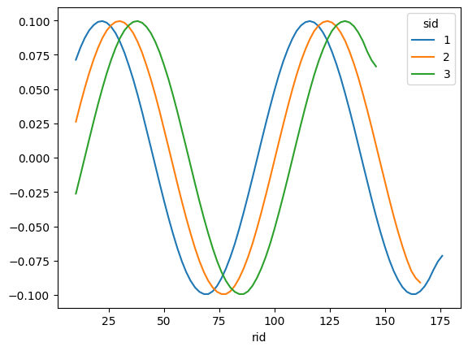
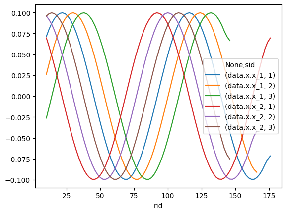
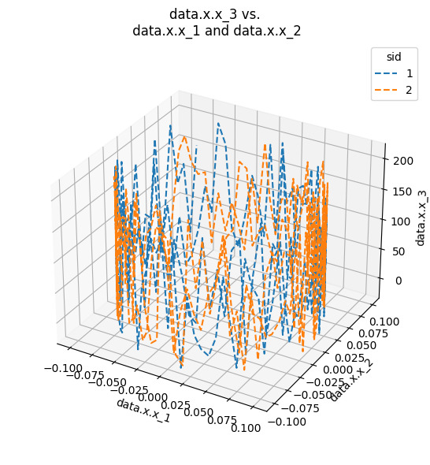
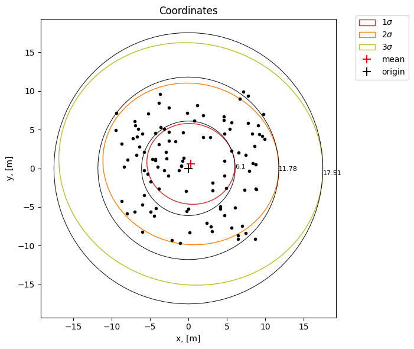
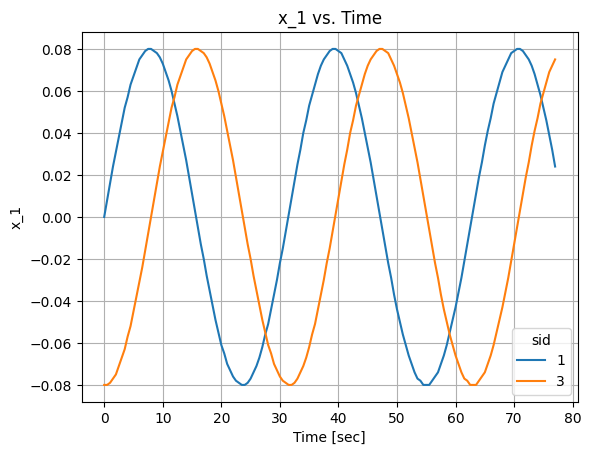

# Data Access

In order to get information about the data of the specific table in the database, to look through the main features and to query the selected parts the module [**data_access**](documentation/data_access.md) from the package **citros_data_analysis** is used. Module is imported by:

```python
from citros_data_analysis import data_access as da
```
Current version can be checked by the method [**get_version()**](documentation/data_access.md#citros_data_analysis.data_access.citros_db.get_version):
```python
da.get_version()
```
## Connection to the database

To connect to the database [**CitrosDB**](documentation/data_access.md#citros_data_analysis.data_access.citros_db.CitrosDB) object is created:
```python
citros = da.CitrosDB()
```
<details>
  <summary>Advanced CitrosDB parameters</summary>

If no parameters are passed, the following predefined ENV parameters are used:
 - host: 'PG_HOST'
 - user: 'PG_USER',
 - password: 'PG_PASSWORD',
 - database: 'PG_DATABASE',
 - schema: 'PG_SCHEMA' or 'data_bucket' if 'PG_SCHEMA' not specified,
 - batch: 'bid', 
 - port: 'PG_PORT', or '5432' if 'PG_PORT' is not specified,
 - sid: 'CITROS_SIMULATION_RUN_ID'

Say, we would like to connect to a database "myDatabase" with the user name "user" and password "myPassword", to work with batch "batchName" which is located in the schema "mySchema", using port '5432':

```python
citros = da.CitrosDB(host = 'hostName',
                     user = 'user',
                     password = 'myPassword',
                     database = 'myDatabase',
                     schema = 'mySchema',
                     batch = 'batchName',
                     port = '5432',
                     debug_flag = False)
```
When `debug_flag` is set to True, that will lead to code interruption if an error occurs, while with `debug_flag` turned to False program will try to handle errors and only print error messages without code breaking. By default, debug_flag = False.

</details>

## Repository overview

Projects are organized and stored within *repositories*. Each repository may comprise multiple [*batches* (tables)](#batch-overview), that contain specific datasets, divided by [*topics*](#query-data). Method [**repo_info()**](#repository-information) provides an overview of the existing repositories, offering insights into their properties and contents. When you wish to work with a specific repository, you can utilize the [**repo()**](#setting-repository) method to set the target repository. This can be particularly useful to narrow down searches or operations to batches within that chosen repository. Methods [**get_repo()** and **get_repo_id()**](#current-repository-name-and-id) return the name and the id of the current repository, respectively.

### Repository information

To display the main information about the repositories, such as repositories names, ids, times of creation and update, description and git source, method [**repo_info()**](documentation/data_access.md#citros_data_analysis.data_access.repo_info) is applied. The result is a [**CitrosDict**](documentation/data_access.md#citros_data_analysis.data_access.citros_dict.CitrosDict) object. It inherits behaviour of an ordinary python dictionary, but has some additional methods, like [**print()**](documentation/data_access.md#citros_data_analysis.data_access.citros_dict.CitrosDict.print) method. To display the information about all repositories:

```python
citros.repo_info().print()
```
```text
{
 'projects': {
   'repo_id': 'rrrrrrrr-1111-2222-aaaa-555555555555',
   'description': 'statistics',
   'created_at': '2023-05-18T12:55:41.144263+00:00',
   'updated_at': '2023-08-18T11:25:31.356987+00:00',
   'git': '...'
 },
 'citros_project': {
   'repo_id': 'rrrrrrrr-1111-2222-3333-444444444444',
   'description': 'citros runs',
   'created_at': '2023-05-20T09:57:44.632361+00:00',
   'updated_at': '2023-08-20T07:45:11.136632+00:00',
   'git': '...'
 }
}
```

<details>
  <summary>more about CitrosDict</summary>

`print()` method allows to print the output with proper indents, enhancing readability. However, it is always an option to display the result using the standard Python print method, displaying it as a regular dictionary:

```python
print(citros.repo_info())
```
```text
{'projects': {'repo_id': 'rrrrrrrr-1111-2222-aaaa-555555555555', 'description': 'statistics', ...}, 'citros_project': {'repo_id': 'rrrrrrrr-1111-2222-3333-444444444444', ...}}
 ```

[**CitrosDict**](documentation/data_access.md#citros_data_analysis.data_access.citros_dict.CitrosDict) object can be converted to json string by the method [**to_json()**](documentation/data_access.md#citros_data_analysis.data_access.citros_dict.CitrosDict.to_json) and printed:
```python
print(citros.repo_info().to_json())
```
```text
{
  "projects": {
    "repo_id": "rrrrrrrr-1111-2222-aaaa-555555555555",
    "description": "statistics",
    "created_at": "2023-05-18T12:55:41.144263+00:00",
    "updated_at": "2023-08-18T11:25:31.356987+00:00",
    "git": "..."
  },
  "citros_project": {
    "repo_id": "rrrrrrrr-1111-2222-3333-444444444444",
    "description": "citros runs",
    "created_at": "2023-05-20T09:57:44.632361+00:00",
    "updated_at": "2023-08-20T07:45:11.136632+00:00",
    "git": "..."
  }
}
```
or printed by the method [**print()**](documentation/data_access.md#citros_data_analysis.data_access.citros_dict.CitrosDict.print) as it was shown above.

</details>

There are several ways to search for the exact repository. Passing a string that matches the repository name, the search will yield all repositories whose names correspond to the provided string:

```python
citros.repo_info('citros').print()
```
```text
{
 'citros_project': {
   'repo_id': 'rrrrrrrr-1111-2222-3333-444444444444',
   'description': 'citros runs',
   'created_at': '2023-05-20T09:57:44.632361+00:00',
   'updated_at': '2023-08-20T07:45:11.136632+00:00',
   'git': '...'
 }
}
```

By providing the repository id:

```python
citros.repo_info('rrrrrrrr-1111-2222-aaaa-555555555555').print()
```
```text
{
 'projects': {
   'repo_id': 'rrrrrrrr-1111-2222-aaaa-555555555555',
   'description': 'statistics',
   'created_at': '2023-05-18T12:55:41.144263+00:00',
   'updated_at': '2023-08-18T11:25:31.356987+00:00',
   'git': '...'
 }
}
```

Or it is possible to select the last created repository by passing int value -1:

```python
citros.repo_info(-1).print()
```
```text
{
 'citros_project': {
   'repo_id': 'rrrrrrrr-1111-2222-3333-444444444444',
   'description': 'citros runs',
   'created_at': '2023-05-20T09:57:44.632361+00:00',
   'updated_at': '2023-08-20T07:45:11.136632+00:00',
   'git': '...'
 }
}
```

To retrieve the second-to-last created repository, provide -2 as an argument. Similarly, to select the repository that was created first, use 0; for the second created repository, use 1, and so on.

To perform search by another field, specify it by `search_by` argument and provide `search` argument of the appropriate format. Provide str to search by 'description' and 'git' fields, for example to display all repositories with word 'statistics' in 'description':

```python
citros.repo_info('statistics', search_by = 'description').print()
```
```text
{
 'projects': {
   'repo_id': 'rrrrrrrr-1111-2222-aaaa-555555555555',
   'description': 'statistics',
   'created_at': '2023-05-18T12:55:41.144263+00:00',
   'updated_at': '2023-08-18T11:25:31.356987+00:00',
   'git': '...'
 }
}
```

To search by date fields, choose one of the key word for `search_by` field - 'created_after', 'created_before', 'updated_after' or 'updated_before' - and specify date in `search` argument in the one of the following format:
- 'dd-mm-yyyy hh:mm:ss +hh:mm' - the full date, time and time zone: 
- 'dd-mm-yyyy hh:mm:ss' - date and time without time zone (by default timezone +00:00)
- 'dd-mm-yyyy' / 'dd-mm' / 'dd' - only date. This way, time in the search is set to be 00:00:00
- 'hh:mm:ss' / 'hh:mm' - only time, in this case the date is set as today.

For example, to display all the repositories that were created after 19 May:

```python
citros.repo_info('19-05', search_by = 'created_after').print()
```
```text
{
 'citros_project': {
   'repo_id': 'rrrrrrrr-1111-2222-3333-444444444444',
   'description': 'citros runs',
   'created_at': '2023-05-20T09:57:44.632361+00:00',
   'updated_at': '2023-08-20T07:45:11.136632+00:00',
   'git': '...'
 }
}
```

And to show the repositories that were updated before 11:00 of the current day, do the following:

```python
citros.repo_info('11:00', search_by = 'updated_before').print()     
```
```text
{
 'projects': {
   'repo_id': 'rrrrrrrr-1111-2222-aaaa-555555555555',
   'description': 'statistics',
   'created_at': '2023-05-18T12:55:41.144263+00:00',
   'updated_at': '2023-08-18T11:25:31.356987+00:00',
   'git': '...'
 },
 'citros_project': {
   'repo_id': 'rrrrrrrr-1111-2222-3333-444444444444',
   'description': 'citros runs',
   'created_at': '2023-05-20T09:57:44.632361+00:00',
   'updated_at': '2023-08-20T07:45:11.136632+00:00',
   'git': '...'
 }
}
```

The `order_by` parameter allows to define the sorting order of the output based on a chosen field. To display the output in ascending order by one or multiple fields, you can simply list those fields within the `order_by` parameter. If there's only one field, it can be directly passed as a string argument. For instance, in the previous example, you could use the following to arrange the output in ascending order by the repository names:

```python
citros.repo_info('11:00', search_by = 'updated_before', order_by = 'name').print()
```
```text 
{
 'citros_project': {
   'repo_id': 'rrrrrrrr-1111-2222-3333-444444444444',
   'description': 'citros runs',
   'created_at': '2023-05-20T09:57:44.632361+00:00',
   'updated_at': '2023-08-20T07:45:11.136632+00:00',
   'git': '...'
 },
 'projects': {
   'repo_id': 'rrrrrrrr-1111-2222-aaaa-555555555555',
   'description': 'statistics',
   'created_at': '2023-05-18T12:55:41.144263+00:00',
   'updated_at': '2023-08-18T11:25:31.356987+00:00',
   'git': '...'
 } 
}
```

To specify whether the descending or ascending order should be applied, pass argument as a dict. For example, to order by time of creation in descending order, so the last created will be the first in the output, do the following:

```python
citros.repo_info('11:00', search_by = 'updated_before', order_by = {'created_at': 'desc'}).print()
```
```text
{
 'citros_project': {
   'repo_id': 'rrrrrrrr-1111-2222-3333-444444444444',
   'description': 'citros runs',
   'created_at': '2023-05-20T09:57:44.632361+00:00',
   'updated_at': '2023-08-20T07:45:11.136632+00:00',
   'git': '...'
 },
 'projects': {
   'repo_id': 'rrrrrrrr-1111-2222-aaaa-555555555555',
   'description': 'statistics',
   'created_at': '2023-05-18T12:55:41.144263+00:00',
   'updated_at': '2023-08-18T11:25:31.356987+00:00',
   'git': '...'
 } 
}
```

By default, all repositories are displayed, regardless of the creator. To exclusively view the repositories that belong to you, set `user` = 'me'. To display 

```python
citros.repo_info('project', user = 'me').print()
```
```text
{
'citros_project': {
   'repo_id': 'rrrrrrrr-1111-2222-3333-444444444444',
   'description': 'citros runs',
   'created_at': '2023-05-20T09:57:44.632361+00:00',
   'updated_at': '2023-08-20T07:45:11.136632+00:00',
   'git': '...'
 }
}
```

### Setting repository

Althoug defining the repository is not necessary, since in different repositories there may be batches with the same name, applying method [**repo()**](documentation/data_access.md#citros_data_analysis.data_access.citros_db.CitrosDB.repo) ensures that only information that corresponds to the exact repository will be displayed. It also may be set when [**CitrosDB**](#connection-to-the-database) object is created (by passing an argument `repo`). 

If the exact repository id is known, it may be passed in the following way:

```python
citros = da.CitrosDB()
citros = citros.repo('rrrrrrrr-1111-2222-3333-444444444444')
```

By default, method [**repo()**](documentation/data_access.md#citros_data_analysis.data_access.citros_db.CitrosDB.repo) returns [**CitrosDB**](#connection-to-the-database) object with set `repo` parameter, which then can be used in a chain, for example, to [get information about batches](#batch-information), that belong to that repository. Alternatively, the repository may be set to the existing [**CitrosDB**](#connection-to-the-database) object if the parameter `inplace` = True:

```python
citros = da.CitrosDB()
print(f"current repository name: {citros.get_repo()},\ncurrent repository id: {citros.get_repo_id()}\n")
```
```text
current repository name:
current repository id:
```
```python
citros.repo('rrrrrrrr-1111-2222-3333-444444444444', inplace = True)
print(f"current repository name: {citros.get_repo()},\ncurrent repository id: {citros.get_repo_id()}")
```
```text
current repository name: citros_project
current repository id: rrrrrrrr-1111-2222-3333-444444444444
```
About methods [**get_repo()**](documentation/data_access.md#citros_data_analysis.data_access.citros_db.CitrosDB.get_repo) and [**get_repo_id()**](documentation/data_access.md#citros_data_analysis.data_access.citros_db.CitrosDB.get_repo_id) see in the next [subsection](#current-repository-name-and-id). 

Similar to the [**repo_info**](#repository-information), repository may be set by its name:

```python
citros = citros.repo('citros_project')
```

or its order of the creation:

 ```python
citros = citros.repo(-1)
```

In the above example, the most recently created repository is assigned. If the provided repository name has multiple matches, the clarification may be needed. This can be easily achieved by checking the list of repositories by [**repo_info()**](#repository-information) method.

### Current repository name and id

As it was demonstarted above, the current repository name and id may be checked by methods [**get_repo()**](documentation/data_access.md#citros_data_analysis.data_access.citros_db.CitrosDB.get_repo) and [**get_repo_id()**](documentation/data_access.md#citros_data_analysis.data_access.citros_db.CitrosDB.get_repo_id), respectively:

```python
citros = da.CitrosDB()
citros.repo('citros_project', inplace = True)
print(f"current repository name: {citros.get_repo()},\ncurrent repository id: {citros.get_repo_id()}\n")
```
```text
current repository name: citros_project
current repository id: rrrrrrrr-1111-2222-3333-444444444444
```

If the repository is not set, both id and name will be None.

## Batch overview

Different simulations are identified by their *sid* numbers, with each step of the simulation being sequentially numbered by *rid*. Batches typically containe multiple topics that encapsulate related datasets.

To get the information about all the existing batches the method [**batch_info**](#batch-information) is used. The batch is set when the [**CitrosDB**](#connection-to-the-database) object is created or by [**batch()**](#setting-batch) method. To display the sizes of all batches within the database or the size of the current batch, the methods [**get_batch_size()**](#batch-size) and [**get_current_batch_size**](#current-batch-size) are employed, respectively. Methods [**get_batch()** and **get_batch_id()**](#current-batch-name-and-id) return the name and the id of the current batch, if it was set previously.

Each batch contains the following columns:

||user\_id | sid | rid | time | topic | type| data |
|--|--|--|--|--|--|--|--|
|description |user name | simulation id| run id| ros time message | topic name| type name | json-format data|
|type| uuid | int | int | big int | str | str | jsonb|

Batch may have several *topic*s - to list them along with structure of the json-data column for the current batch the method [**get_data_structure()**](#data-structure) is used.

Each simulation in the batch has its own id - *sid*, and each message in the simulation is enumerated by run id - *rid*.

If there are infinite values in the data, they are stored as $\pm 10^{308}$.

### Batch information

Method [**batch_info**](documentation/data_access.md#citros_data_analysis.data_access.citros_db.CitrosDB.batch_info) is applied to show the general information about batches: its name, batch id, list of simulation ids (sids) and when the batch was created. The result is a [**CitrosDict**](documentation/data_access.md#citros_data_analysis.data_access.citros_dict.CitrosDict) object, that inherits behaviour of an ordinary python dictionary, but has some additional methods, like [**print()**](documentation/data_access.md#citros_data_analysis.data_access.citros_dict.CitrosDict.print) method. To display the information about all the existing batches adopt the following:

```python
citros.batch_info().print()
```
```js
{
  'kinematics': {
    'batch_id': '00000000-aaaa-1111-2222-333333333333',
    'sid': [1, 2, 3, 4, 5],
    'created_at': '2023-06-14T11:44:31.728585+00:00',
    'updated_at': '2023-06-14T11:44:31.728585+00:00',
    'status': 'DONE',
    'tag': 'latest',
    'simulation': 'simulation_parameters',
    'message': 'launch_params',
    'parallelism': 1,
    'completions': 1,
    'cpu': 2,
    'gpu': 0,
    'memory': '265',
    'repo': 'citros_project'
  },
  'kinematics_2': {
    'batch_id': '00000000-bbbb-1111-2222-333333333333',
    'sid': [0, 1, 2, 3],
    'created_at': '2023-06-21T13:51:47.29987+00:00',
    ...
  },
  'dynamics': {
    'batch_id': '00000000-dddd-1111-2222-333333333333',
    'sid': [1, 3, 2],
    'created_at': '2023-06-21T15:03:07.308498+00:00',
    ...
  }
}
```

<details>
  <summary>more about CitrosDict</summary>

`print()` method allows to print the output with proper indents, enhancing readability. However, it is always an option to display the result using the standard Python print method, displaying it as a regular dictionary:

```python
print(citros.batch_info())
{'kinematics': {'batch_id': ...}, 'kinematics_2': {'batch_id': ...}, 'dynamics': {'batch_id': ...}}
```

[**CitrosDict**](documentation/data_access.md#citros_data_analysis.data_access.citros_dict.CitrosDict) object can be converted to json string by the method [**to_json()**](documentation/data_access.md#citros_data_analysis.data_access.citros_dict.CitrosDict.to_json):
```python
print(citros.batch_info().to_json())
```
```js
{
  "kinematics": {
    "batch_id": "00000000-aaaa-1111-2222-333333333333",
    "sid": [
      1,
      2,
      3,
      4,
      5
    ],
    "created_at": "2023-06-14T11:44:31.728585+00:00",
    ...
  },
  "kinematics_2": {
    "batch_id": "00000000-bbbb-1111-2222-333333333333",
    "sid": [
      0,
      1,
      2,
      3
    ],
    "created_at": "2023-06-21T13:51:47.29987+00:00",
    ...
  },
  "dynamics": {
    "batch_id": "00000000-dddd-1111-2222-333333333333",
    "sid": [
    ...
    ],
    ...
  }
}
```
or printed by the method [**print()**](documentation/data_access.md#citros_data_analysis.data_access.citros_dict.CitrosDict.print) as it was shown above.

</details>

Simulation have different statuses: 'DONE', 'SCHEDULE', 'ERROR', 'CREATING', 'INIT', 'STARTING', 'RUNNING', 'TERMINATING' or 'STOPPING'.
To select only batches with the exact status of its simulations pass `sid_status` argument:

```python
citros.batch_info(sid_status = 'DONE')
```

There are several options that allows to search for the exact batch. Passing a string that matches the batch name, the search will yield all batches whose names correspond to the provided string:

```python
citros.batch_info('kinematics').print()
```
```js
{
  'kinematics': {
    'batch_id': '00000000-aaaa-1111-2222-333333333333',
    'sid': [1, 2, 3, 4, 5],
    'created_at': '2023-06-14T11:44:31.728585+00:00',
    ...
  },
  'kinematics_2': {
    'batch_id': '00000000-bbbb-1111-2222-333333333333',
    'sid': [0, 1, 2, 3],
    'created_at': '2023-06-21T13:51:47.29987+00:00',
    ...
  },
}
```

If the batch id is know, it can be provided as an argument to query information about this exact batch:

```python
citros.batch_info('00000000-dddd-1111-2222-333333333333').print()
```
```js
{
  'dynamics': {
    'batch_id': '00000000-dddd-1111-2222-333333333333',
    'sid': [1, 3, 2],
    'created_at': '2023-06-21T15:03:07.308498+00:00',
    ...
  }
}
```

Or it is possible to select the last created batch by passing int value -1:

```python
citros.batch_info(-1).print()
```
```js
{
  'dynamics': {
    'batch_id': '00000000-dddd-1111-2222-333333333333',
    'sid': [1, 3, 2],
    'created_at': '2023-06-21T15:03:07.308498+00:00',
    ...
  }
}
```

To retrieve the second-to-last created batch, provide -2 as an argument. Similarly, to select the batch created first, use 0; for the second batch created, use 1, and so forth.

To search by another field, provide it in `search_by` field along with the appropriate format for the `search` argument. To find batches with an exact match in the 'simulation', 'status', 'tag', and 'message' fields, simply provide the word as a string:

```python
citros.batch_info('launch', search_by = 'message').print()
```
```js
{
  'kinematics': {
    'batch_id': '00000000-aaaa-1111-2222-333333333333',
    'sid': [1, 2, 3, 4, 5],
    'created_at': '2023-06-14T11:44:31.728585+00:00',
    'updated_at': '2023-06-14T11:44:31.728585+00:00',
    'status': 'DONE',
    'tag': 'latest',
    'simulation': 'simulation_parameters',
    'message': 'launch_params',
    'parallelism': 1,
    'completions': 1,
    'cpu': 2,
    'gpu': 0,
    'memory': '265',
    'repo': 'citros_project'
  }
}
```

Similarly, provide `search` argument as int for 'parallelism', 'completions' and 'memory' fields and as float for 'cpu' and 'gpu' fields:

```python
citros.batch_info(2, search_by = 'parallelism').print()
```
```js
{
 'kinematics_2': {
  'batch_id': '00000000-bbbb-1111-2222-333333333333',
  'sid': [0, 1, 2, 3],
  'created_at': '2023-06-21T13:51:47.29987+00:00',
  'updated_at': '2023-06-21T13:51:47.29987+00:00',
  'status': 'DONE',
  'tag': 'latest',
  'simulation': 'simulation_parameters_2',
  'message': 'recalculation',
  'parallelism': 2,
  ...
  }
}
```

To perform a search based on date fields, select a keyword for the `search_by` field: 'created_after', 'created_before', 'updated_after', or 'updated_before'. Then, provide the date in the `search` argument using one of the following formats:
- 'dd-mm-yyyy hh:mm:ss +hh:mm' - the full date, time and time zone: 
- 'dd-mm-yyyy hh:mm:ss' - date and time without time zone (by default timezone +00:00)
- 'dd-mm-yyyy' / 'dd-mm' / 'dd' - only date. This way, time in the search is set to be 00:00:00
- 'hh:mm:ss' / 'hh:mm' - only time, in this case the date is set as today.

For example, to display all the batches that were created after 20 June:

```python
citros.batch_info('20-06', search_by = 'created_after').print()
```
```js
{
 'kinematics_2': {
    'batch_id': '00000000-bbbb-1111-2222-333333333333',
    'sid': [0, 1, 2, 3],
    'created_at': '2023-06-21T13:51:47.29987+00:00',
    ...
  },
  'dynamics': {
    'batch_id': '00000000-dddd-1111-2222-333333333333',
    'sid': [1, 3, 2],
    'created_at': '2023-06-21T15:03:07.308498+00:00',
    ...
  }
}
```

To get the information about the batches that were updated before 9:00 today, do the following:

```python
citros.batch_info('9:00', search_by = 'updated_before').print()
```
```js
{
  'kinematics': {
    'batch_id': '00000000-aaaa-1111-2222-333333333333',
    'sid': [1, 2, 3, 4, 5],
    'created_at': '2023-06-14T11:44:31.728585+00:00',
    ...
  },
  'kinematics_2': {
    'batch_id': '00000000-bbbb-1111-2222-333333333333',
    'sid': [0, 1, 2, 3],
    'created_at': '2023-06-21T13:51:47.29987+00:00',
    ...
  },
  'dynamics': {
    'batch_id': '00000000-dddd-1111-2222-333333333333',
    'sid': [1, 3, 2],
    'created_at': '2023-06-21T15:03:07.308498+00:00',
    ...
  }
}
```

The `order_by` argument enables to choose the order of the output by one of the field. To display the output in ascending order by one or more fields, list them in `order_by` argument. If the field is the only one, it may be passed directly as a str, for example, to order the output of the previous example in asccending order by name of the batches:

```python
citros.batch_info('9:00', search_by = 'updated_before', order_by = 'name').print()
```
```js
{
  'dynamics': {
    'batch_id': '00000000-dddd-1111-2222-333333333333',
    'sid': [1, 3, 2],
    'created_at': '2023-06-21T15:03:07.308498+00:00',
    ...
  },
  'kinematics': {
    'batch_id': '00000000-aaaa-1111-2222-333333333333',
    'sid': [1, 2, 3, 4, 5],
    'created_at': '2023-06-14T11:44:31.728585+00:00',
    ...
  },
  'kinematics_2': {
    'batch_id': '00000000-bbbb-1111-2222-333333333333',
    'sid': [0, 1, 2, 3],
    'created_at': '2023-06-21T13:51:47.29987+00:00',
    ...
  }
}
```

To indicate the desired order, whether descending or ascending, you can pass an argument as a dictionary. For instance, to arrange the output based on the creation time in descending order, placing the most recent first, use the following:

```python
citros.batch_info('11:00', search_by = 'updated_before', order_by = {'created_at': 'desc'}).print()
```
```js
{
  'dynamics': {
    'batch_id': '00000000-dddd-1111-2222-333333333333',
    'sid': [1, 3, 2],
    'created_at': '2023-06-21T15:03:07.308498+00:00',
    ...
  },
   'kinematics_2': {
    'batch_id': '00000000-bbbb-1111-2222-333333333333',
    'sid': [0, 1, 2, 3],
    'created_at': '2023-06-21T13:51:47.29987+00:00',
    ...
  }
  'kinematics': {
    'batch_id': '00000000-aaaa-1111-2222-333333333333',
    'sid': [1, 2, 3, 4, 5],
    'created_at': '2023-06-14T11:44:31.728585+00:00',
    ...
  }
}
```

By default, the displayed batches include all batches, regardless of their creator. You can limit the display to only show batches that belong to you by setting `user`` to 'me':

```python
citros.batch_info('kinematics', user = 'me').print()
```
```js
{
  'kinematics': {
    'batch_id': '00000000-aaaa-1111-2222-333333333333',
    'sid': [1, 2, 3, 4, 5],
    'created_at': '2023-06-14T11:44:31.728585+00:00',
    ...
  }
}
```

### Setting batch

The batch is set either when [**CitrosDB**](#connection-to-the-database) object is created (by passing an argument `batch` or automatically, getting id from the environment variable `bid`) or by method [**batch()**](documentation/data_access.md#citros_data_analysis.data_access.citros_db.CitrosDB.batch). 

If the exact batch id is known, it may be passed in the following way:

```python
citros = da.CitrosDB()
citros = citros.batch('00000000-1111-2222-3333-444444444444')
```

By default, method [**batch()**](documentation/data_access.md#citros_data_analysis.data_access.citros_db.CitrosDB.batch) returns [**CitrosDB**](#connection-to-the-database) object with set `batch` parameter, which then can be used in a chain, for example, to [query data](#query-data). Alternatively, the batch may be set to the existing [**CitrosDB**](#connection-to-the-database) object if the parameter `inplace` = True:

```python
citros = da.CitrosDB()
print(f"current batch name: {citros.get_batch()},\ncurrent batch id: {citros.get_batch_id()}\n")
```
```text
current batch name:
current batch id:
```
```python
citros.batch('00000000-1111-2222-3333-444444444444', inplace = True)
print(f"current batch name: {citros.get_batch()},\ncurrent batch id: {citros.get_batch_id()}")
```
```text
current batch name: spectroscopy
current batch id: 00000000-1111-2222-3333-444444444444
```

The name and the id of the current batch may be obtained by **get_batch()** and **get_batch_id()** [methods](#current-batch-name-and-id).

Similar to the[**batch_info**](#batch-information), you can also set the batch using its name:

```python
citros = citros.batch('kinematics')
```

or by its order of the creation:

```python
citros = citros.batch(-1)
```

In the above example, the most recently created batch is assigned. If the provided batch name has multiple matches, the clarification may be needed. This can be easily achieved by checking the list of batches by [**batch_info**](#batch-information) method.

### Current batch name and id

Name of the current batch and its id may be retrieved by [**get_batch()**](documentation/data_access.md#citros_data_analysis.data_access.citros_db.CitrosDB.get_batch) and [**get_batch_id()**](documentation/data_access.md#citros_data_analysis.data_access.citros_db.CitrosDB.get_batch_id) methods correspondingly:

```python
citros.batch('spectroscopy', inplace = True)
print(f"current batch name: {citros.get_batch()},\ncurrent batch id: {citros.get_batch_id()}")
```
```text
current batch name: spectroscopy
current batch id: 00000000-1111-2222-3333-444444444444
```

### Batch size

To check the batch sizes in the current schema method [**get_batch_size()**](documentation/data_access.md#citros_data_analysis.data_access.citros_db.CitrosDB.get_batch_size) is used:

```python
citros.get_batch_size()
```
The result is a table that contains batch names, batch ids, batch sizes and total sizes with indexes. The output might look something like this:

```text
+--------------+--------------------------------------+------------+------------+
| batch        | batch id                             | size       | total size |
+--------------+--------------------------------------+------------+------------+
| spectroscopy | 00000000-1111-2222-3333-444444444444 | 32 kB      | 64 kB      |
| photometry   | 00000000-aaaa-2222-3333-444444444444 | 8192 bytes | 16 kB      |
+--------------+--------------------------------------+------------+------------+
```

### Current batch size

Similar to [**get_batch_size()**](#batch-size) method, [**get_current_batch_size()**](documentation/data_access.md#citros_data_analysis.data_access.citros_db.CitrosDB.get_batch_size) method is used, with the difference that it shows the size for the current batch (if it is set):

```python
citros.batch('photo').get_current_batch_size()
```
The result is a table that contains batch names, batch sizes and total sizes with indexes. The output might look something like this:

```text
+--------------+--------------------------------------+------------+------------+
| batch        | batch id                             | size       | total size |
+--------------+--------------------------------------+------------+------------+
| photometry   | 00000000-aaaa-2222-3333-444444444444 | 8192 bytes | 16 kB      |
+--------------+--------------------------------------+------------+------------+
```

## Users overview

To display the main information about users of the organization, methods [**get_users()**](documentation/data_access.md#citros_data_analysis.data_access.citros_db.CitrosDB.get_users) and [**user_info()**](documentation/data_access.md#citros_data_analysis.data_access.citros_db.CitrosDB.user_info) are used. 

### Table with users' information

Method [**get_users()**](documentation/data_access.md#citros_data_analysis.data_access.citros_db.CitrosDB.get_users) display the table with users names and last names and their emails:

```python
citros.get_users()
```
```text
+--------+------------+-----------------------------+
| name   | last name  | email                       |
+--------+------------+-----------------------------+
| alex   | blanc      | alex@mail.com               |
| david  | gilbert    | david@mail.com              |
| mary   | stevenson  | mary@mail.com               |
+--------+------------+-----------------------------+
```

### Dictionary with users' information

The [**user_info()**](documentation/data_access.md#citros_data_analysis.data_access.citros_db.CitrosDB.user_info) method allows you to retrieve the main information about users in a [**CitrosDict**](documentation/data_access.md#citros_data_analysis.data_access.citros_dict.CitrosDict) format, that inherits behaviour of an ordinary python dictionary, but has some additional methods, like method [**print()**](documentation/data_access.md#citros_data_analysis.data_access.citros_dict.CitrosDict.print). The obtained information includes users' first names, last names, emails, as well as lists of repositories they've created and repositories in which they've created batches, with emails serving as the dictionary keys.

To view all users, sorted by their names, execute the following command:

```python
citros.user_info('order_by' = 'name').print()
```
```js
{
 'alex@mail.com': {
   'name': 'alex',
   'last_name': 'blanc',
   'create_repo': [],
   'create_batch_in_repo': ['automaton_lab']
 },
 'david@mail.com': {
   'name': 'david',
   'last_name': 'gilbert',
   'create_repo': ['robot_master', 'automaton_lab'],
   'create_batch_in_repo': ['robot_master']
 },
 'mary@mail.com': {
   'name': 'mary',
   'last_name': 'stevenson',
   'create_repo': ['mech_craft'],
   'create_batch_in_repo': ['mech_craft', 'robot_master']
 }
}
```
The order of the output may be set according to 'name', 'last_name' or 'email'.

In the example above, the organization has three members: David, Mary, and Alex. It is evident that David created two repositories, namely 'robot_master' and 'automaton_lab,' and generated batches in the former one. Mary established one repository, 'mech_craft,' and generated batches both in 'mech_craft' and 'robot_master' repositories. And Alex only created batches in the 'automaton_lab' repository.

To display information about a specific user, such as Alex, you can choose to search by email (the default search), by name or by last name. In the latter two cases, set the `search_by` parameter to 'name' and 'last_name,' respectively.

```python
citros.user_info('alex@mail.com').print()
citros.user_info('alex', search_by = 'name').print()
citros.user_info('blanc', search_by = 'last_name').print()
```
The output in all this cases will be:

```js
{
 'alex@mail.com': {
   'name': 'alex',
   'last_name': 'blanc',
   'create_repo': [],
   'create_batch_in_repo': ['automaton_lab']
 }
}
```

When a specific repository is set using the [**repo()**](#setting-repository) method, the method displays information only considered the set repository: about user who created this repository and the users who have created batches within it:

```python
citros.repo('robot_master').user_info().print()
```
```js
{
'david@mail.com': {
   'name': 'david',
   'last_name': 'gilbert',
   'create_repo': ['robot_master'],
   'create_batch_in_repo': ['robot_master']
 },
 'mary@mail.com': {
   'name': 'mary',
   'last_name': 'stevenson',
   'create_repo': [],
   'create_batch_in_repo': ['robot_master']
 }
}
```

If a particular batch is set using the [**batch()**](#setting-batch) method, it provides details about the user who created this specific batch. Let's assume that in 'robot_master' repository there is a batch 'stress_test'. To show the user, who created this batch, execute the following:

```python
citros.batch('stress_test').user_info().print()
```
```js
{
'mary@mail.com': {
   'name': 'mary',
   'last_name': 'stevenson',
   'create_repo': [],
   'create_batch_in_repo': ['robot_master']
 }
}
```

## Batch content

To get the overview about the exact batch, say 'dynamics', the function [**citros.info()**](documentation/data_access.md#citros_data_analysis.data_access.citros_db.CitrosDB.info) is used:

```python
citros.batch('dynamics').info()
```
It returns dictionary, that contains:
* 'size': size of the selected data
* 'sid_count': number of sids
* 'sid_list': list of the sids
* 'topic_count': number of topics
* 'topic_list': list of topics
* 'message_count': number of messages

The result is a [**CitrosDict**](documentation/data_access.md#citros_data_analysis.data_access.citros_dict.CitrosDict) object, that inherits behaviour of an ordinary python dictionary, but has some additional methods.

<details>
  <summary>more about CitrosDict:</summary>

[**CitrosDict**](documentation/data_access.md#citros_data_analysis.data_access.citros_dict.CitrosDict) object can be converted to json string by the method [**to_json()**](documentation/data_access.md#citros_data_analysis.data_access.citros_dict.CitrosDict.to_json):

```python
citros.batch('dynamics').info().to_json()
```
```js
{
  "size": "534 kB",
  "sid_count": 3,
  "sid_list": [
    1,
    2,
    3
  ],
  "topic_count": 4,
  "topic_list": [
    "A",
    "B",
    "C",
    "D"
  ],
  "message_count": 2000
}
```
or printed by the method [**print()**](documentation/data_access.md#citros_data_analysis.data_access.citros_dict.CitrosDict.print):

```python
citros.batch('dynamics').info().print()
```
```js
{
 'size': '534 kB',
 'sid_count': 3,
 'sid_list': [1, 2, 3],
 'topic_count': 4,
 'topic_list': ['A', 'B', 'C', 'D'],
 'message_count': 2000
}
```
</details>

:::note
It is not nessesary to call method [**batch()**](#setting-batch) every time to set batch id or name. By parameter `inplace` the batch may be set to current [**CitrosDB**](#connection-to-the-database) object:
```python
citros.batch('dynamics', inplace = True)
print(f"current batch name: {citros.get_batch()}")
```

```text
current batch name: dynamics
```

If specific sid is set, [**citros.info()**](documentation/data_access.md#citros_data_analysis.data_access.citros_db.CitrosDB.info) also appends dictionary 'sids', with the following structure:
* 'sids':
    * int:
        * 'topics': 
            * str:
               * 'message_count': number of messages
               * 'start_time': time when simulation started
               * 'end_time': time when simulation ended
               * 'duration': duration of the simalation process
               * 'frequency': frequency of the simulation process ('message_count'/ 'duration', in Hz)

sid may be passed during [**CitrosDB** initialization](#connection-to-the-database) or by [**citros.sid()**](#sid-constraints) method.

Let's assume that the batch has been already successfully set:

```python
citros.batch('dynamics', inplace = True)
```

To get information about data with sid = 1 or 2 and print it:

```python
citros.sid([1,2]).info().print()
```
```js
{
 'size': '365 kB',
 'sid_count': 2,
 'sid_list': [1, 2],
 'topic_count': 4,
 'topic_list': ['A', 'B', 'C', 'D'],
 'message_count': 1369,
 'sids': {
   1: {
     'topics': {
       'A': {
         'message_count': 155,
         'start_time': 312751159,
         'end_time': 100484965889,
         'duration': 100172214730,
         'frequency': 1.547
       },
       'B': {
         'message_count': 178,
         'start_time': 344594155,
         'end_time': 100752013600,
         'duration': 100407419445,
         'frequency': 1.773
       },
       'C': {
...
       }
     }
   }
 }
}
```

To set the specific topic, method [**topic()**](documentation/data_access.md#citros_data_analysis.data_access.citros_db.CitrosDB.topic) is used.
This way, dictionary 'topics' is appended:
    
* 'topics':
    * str:
        * 'type': type
        * 'data_structure': structure of the data
        * 'message_count': number of messages

```python
citros.topic('A').info().print()
```
```js
{
 'size': '126 kB',
 'sid_count': 3,
 'sid_list': [1, 2, 3],
 'topic_count': 1,
 'topic_list': ['A'],
 'message_count': 474,
 'topics': {
   'A': {
     'type': 'a',
     'data_structure': {
       'data': {
         'x': {
           'x_1': 'float',
           'x_2': 'float',
           'x_3': 'float'
         },
         'note': 'list',
         'time': 'float',
         'height': 'float'
       }
     },
     'message_count': 474
   }
 }
}
```

The specific piece of information may be achieved by the keywords of the [**CitrosDict**](documentation/data_access.md#citros_data_analysis.data_access.citros_dict.CitrosDict), obtained by [**info()**](documentation/data_access.md#citros_data_analysis.data_access.citros_db.CitrosDB.info) method.

<details>
  <summary>Examples</summary>

- Get total number of messages for sid = 1 or 2:

```python
#get information about sid equals 1 or 2 and assign the result to the variable 'inf_12':
inf_12 = citros.sid([1,2]).info()

#access number of messages by key 'message_count' and assign it to 'num':
num = inf_12['message_count']

#print:
print('total number of messages where sid = 1 or 2: {}'.format(num))
```
The result is:
```python
total number of messages where sid = 1 or 2: 1369
```

- Get number of messages for topic 'A' for each of these sids:
```python
#for sid equals 1, for topic 'A' get number of messages by 'message_count':
num_1 = inf_12['sids'][1]['topics']['A']['message_count']

#get numbe rof messages for sid = 2, topic 'A':
num_2 = inf_12['sids'][2]['topics']['A']['message_count']

#print both numbers:
print('Number of messages in "A" for sid = 1: {0}, for sid = 2: {1}'.format(num_1, num_2))
```
The output:
```python
Number of messages in "A" for sid = 1: 155, for sid = 2: 164
```
- Get structure of the topic 'A' and the total number of messages for this topic:
```python
#get information about topic 'A' and assign the resulting dictionary to the variable 'inf_A'
inf_A = citros.topic('A').info()

#get number of messages by 'message_count' keyword:
num = inf_A['message_count']

#print number of messages:
print('total number of messages in topic "A": {}'.format(num))

#print structure of the json-data column:
inf_A['topics']['A']['data_structure']['data'].print()
```
The result is:
```python
total number of messages in topic "A": 474
```
```js
{
 'x': {
   'x_1': 'float',
   'x_2': 'float',
   'x_3': 'float'
 },
 'note': 'list',
 'time': 'float',
 'height': 'float'
}
```
</details>


### Data structure

[**get_data_structure(topic = None)**](documentation/data_access.md#citros_data_analysis.data_access.citros_db.CitrosDB.get_data_structure) method of the [**CitrosDB**](#connection-to-the-database) object may be used to display json-data structure of the exact batch for the specific topics, set by [**topic**](documentation/data_access.md#citros_data_analysis.data_access.citros_db.CitrosDB.topic) or listed in `topic`:

```python
citros.batch('dynamics').topic(['A', 'C']).get_data_structure()
```
```text
+-------+------+-----------------+
| topic | type | data            |
+-------+------+-----------------+
|     A |    a | {               |
|       |      |   x: {          |
|       |      |     x_1: float, |
|       |      |     x_2: float, |
|       |      |     x_3: float  |
|       |      |   },            |
|       |      |   note: list,   |
|       |      |   time: float,  |
|       |      |   height: float |
|       |      | }               |
+-------+------+-----------------+
|     C |    c | {               |
|       |      |   x: {          |
|       |      |     x_1: float, |
|       |      |     x_2: float, |
|       |      |     x_3: float  |
|       |      |   },            |
|       |      |   note: list,   |
|       |      |   time: float,  |
|       |      |   height: float |
|       |      | }               |
+-------+------+-----------------+
```

To get the result for all the existing topics, leave `topic` = None. Also let's set batch to this [**CitrosDB**](#connection-to-the-database) object in advance:

```python
citros.batch('dynamics', inplace = True)
citros.get_data_structure()
```
<details>
  <summary>The result:</summary>

```text
+-------+------+-----------------+
| topic | type | data            |
+-------+------+-----------------+
|     A |    a | {               |
|       |      |   x: {          |
|       |      |     x_1: float, |
|       |      |     x_2: float, |
|       |      |     x_3: float  |
|       |      |   },            |
|       |      |   note: list,   |
|       |      |   time: float,  |
|       |      |   height: float |
|       |      | }               |
+-------+------+-----------------+
|     B |    b | {               |
|       |      |   x: {          |
|       |      |     x_1: float, |
|       |      |     x_2: float, |
|       |      |     x_3: float  |
|       |      |   },            |
|       |      |   note: list,   |
|       |      |   time: float,  |
|       |      |   height: float |
|       |      | }               |
+-------+------+-----------------+
|     C |    c | {               |
|       |      |   x: {          |
|       |      |     x_1: float, |
|       |      |     x_2: float, |
|       |      |     x_3: float  |
|       |      |   },            |
|       |      |   note: list,   |
|       |      |   time: float,  |
|       |      |   height: float |
|       |      | }               |
+-------+------+-----------------+
```
</details>

## Query data

Assuming, that the batch has already been set (see [**batch()**](#setting-batch) method, `inplace` = True), the general query scheme is as follows:


where [**topic()**](documentation/data_access.md#citros_data_analysis.data_access.citros_db.CitrosDB.topic) and [**data()**](documentation/data_access.md#citros_data_analysis.data_access.citros_db.CitrosDB.data) methods are nessesary methods and all other are optional to use.

The method [**data()**](documentation/data_access.md#citros_data_analysis.data_access.citros_db.CitrosDB.data) of the [**CitrosDB**](#connection-to-the-database) object is dedicated to query data. Data is always querying for the specific topic, which is defined by [**topic()**](documentation/data_access.md#citros_data_analysis.data_access.citros_db.CitrosDB.topic) method, which must be called before [**data()**](documentation/data_access.md#citros_data_analysis.data_access.citros_db.CitrosDB.data) method. The result is returned as a [**DataFrame**](https://pandas.pydata.org/docs/reference/api/pandas.DataFrame.html) of the [**pandas** package](https://pandas.pydata.org/) - a widely used format in data science.

To query all data for the topic 'B':
```python
citros.topic('B').data()
```
<details>
  <summary>Show the output:</summary>

A pandas DataFrame.

||sid	|rid	|time	|topic	|type	|data.x.x_1	|data.x.x_2	|data.x.x_3	|data.time	|data.note	|data.height
|--|--|--|--|--|--|--|--|--|--|--|--|
0	|2	|0	|0.140	|B	|b	|-0.051	|0.086	|-27.93	|5.0	|[aa, ee, [45, 83], {'n': 31}]	|979.372
1	|2	|1	|0.195	|B	|b	|-0.045	|0.089	|19.85	|5.5	|[aa, cc, [12, 1], {'n': 68}]	|969.772
2	|2	|2	|0.265	|B	|b	|-0.039	|0.092	|33.61	|9.5	|[bb, ee, [92, 23], {'n': 96}]	|954.368
...|...|...|...|...|...|...|...|...|...|...|...
</details>

If no arguments are passed to the [**data()**](documentation/data_access.md#citros_data_analysis.data_access.citros_db.CitrosDB.data) methods, all data from the json-data column is selected. The json-objects are splitted into columns, while json-arrays are retained as lists.

If the whole json-data column is desired as a json-object:

```python
citros.topic('B').data('data')
```
<details>
  <summary>The output table:</summary>

||sid	|rid|time	|topic	|type	|data
|--|--|--|--|--|--|--|
0	|2	|0	|0.140	|B	|b	|{'x': {'x_1': -0.051, 'x_2': 0.086, 'x_3': -27...
1	|2	|1	|0.195	|B	|b	|{'x': {'x_1': -0.045, 'x_2': 0.089, 'x_3': 19....
2	|2	|2	|0.265	|B	|b	|{'x': {'x_1': -0.039, 'x_2': 0.092, 'x_3': 33....
...|...|...|...|...|...|...
</details>

If only some of the json objects are needed, for example data.x.x_1 and data.time, list with their labels may be passed to [**data()**](documentation/data_access.md#citros_data_analysis.data_access.citros_db.CitrosDB.data): 

```python
citros.topic('B').data(['data.x.x_1', 'data.time'])
```
<details>
  <summary>The result:</summary>

||sid	|rid|time|topic	|type	|data.x.x_1	|data.time
|--|--|--|--|--|--|--|--|
0	|2	|0	|0.140	|B	|b|	-0.051	|5.0
1	|2	|1	|0.195	|B	|b|	-0.045	|5.5
2	|2	|2	|0.265	|B	|b|	-0.039	|9.5
...|...|...|...|...|...|...|...
</details>

If there are json-arrays in the data and the values with the exact index is needed, this index may be passed in square brackets. For example, to collect the values of the first index of the json array "data.note": 

```python
citros.topic('B').data('data.note[0]')
```
<details>
  <summary>The query result:</summary>

||sid	|rid|	time	|topic	|type	|data.note[0]
|--|--|--|--|--|--|--|
0	|2	|0	|0.140	|B	|b	|aa
1	|2	|1	|0.195	|B	|b	|aa
2	|2	|2	|0.265	|B	|b	|bb
...|...|...|...|...|...|...
</details>

Since the output is a pandas [**DataFrame**](https://pandas.pydata.org/docs/reference/api/pandas.DataFrame.html), all its methods may be applied after [**data()**](#query-data) querying. For example, to create a new column named 'Time' based on the values of the 'rid' column using the formula 'Time' = 'rid' * 0.1, and to modify the 'data.x.x_1' column by subtracting the mean from each value, the pandas [**DataFrame**](https://pandas.pydata.org/docs/reference/api/pandas.DataFrame.html) method [**assign**](https://pandas.pydata.org/docs/reference/api/pandas.DataFrame.assign.html) may be used as follows:

```python
df = citros.topic('B').data('data.x.x_1')\
                      .assign(**{'Time': lambda F: F['rid']*0.1,
                                 'data.x.x_1': lambda F: F['data.x.x_1'] - F['data.x.x_1'].mean()})
print(df)
```
<details>
  <summary>The output:</summary>

||sid	|rid|time|topic	|type	|data.x.x_1	|Time
|--|--|--|--|--|--|--|--|
0	|2	|0	|0.140	|B	|b|	-0.059	|0.0
1	|2	|1	|0.195	|B	|b|	-0.053	|0.1
2	|2	|2	|0.265	|B	|b|	-0.047	|0.2
...|...|...|...|...|...|...|...
</details>

### sid constraints

To get data with the exact sid, method [**sid()**](documentation/data_access.md#citros_data_analysis.data_access.citros_db.CitrosDB.sid) of the [**CitrosDB**](#connection-to-the-database) is used. It should be applied before [**data()**](documentation/data_access.md#citros_data_analysis.data_access.citros_db.CitrosDB.data) method. To query for the data with the exact simulation ids pass them as a list of ints, for example:

To query json-data column 'data.x.x_1' of the topic 'B' with sid = 1 or 3:

```python
citros.topic('B').sid([1,3]).data('data.x.x_1')
```
<details>
  <summary>The output table</summary>

||sid	|rid| time	|topic	|type	|data.x.x_1
|--|--|--|--|--|--|--|
0	|1	|0	|0.345	|B	|b	|0.000
1	|1	|1	|0.763	|B	|b	|0.007
2	|3	|1	|1.348	|B	|b	|-0.084
...|...|...|...|...|...|...
</details>

Anothe way to set limits is by `start`, `end` and `count` arguments: `start` <= sid, sid <= `end` and sid < `start` + `count`.  `start`, `end` and  `count` values must be integers.

To query json-data column 'data.x.x_1' of the topic 'B' for sid 3, 4, 5:

```python
citros.topic('B').sid(start = 3, end = 5).data('data.x.x_1')
```
<details>
  <summary>The output table</summary>

||sid	|rid| time	|topic	|type	|data.x.x_1
|--|--|--|--|--|--|--|
0	|3	|0	|1.348	|B	|b	|-0.084
1	|4	|0	|1.582	|B	|b	|0.011
2	|5	|0	|2.166	|B	|b	|-0.031
...|...|...|...|...|...|...
</details>

### rid constraints

To select only messages with the exact values of rid, the method [**rid()**](documentation/data_access.md#citros_data_analysis.data_access.citros_db.CitrosDB.rid) of the [**CitrosDB**](#connection-to-the-database) is used. It should be applied before [**data()**](documentation/data_access.md#citros_data_analysis.data_access.citros_db.CitrosDB.data) method. 

Similar to the application of [**sid()**](#sid-constraints) method, the list of ints may be passed to query for the exact rid values:

```python
citros.topic('B').rid([6, 7]).data('data.x.x_1')
```
<details>
  <summary>The output table:</summary>

||sid	|rid|	time	|topic	|type	|data.x.x_1
|--|--|--|--|--|--|--|
0	|2	|6	|0.503	|B	|b	|-0.001
1	|2	|7	|0.557	|B	|b	|0.035
2	|3	|6	|1.265	|B	|b	|-0.012
...|...|...|...|...|...|...
</details>

To define the range of limits arguments `start`, `end` and `count` are used: `start` <= rid, rid <= `end` and rid < `start` + `count`.  `start`, `end` and  `count` values must be integers.

Since rid is always > 0, the default `start` being equal 0 means no constraints. 

rid is always >= 0, so the default `start` = 0 means no constraints. To set the upper limit for rid, only `end` may be specified. For example, to get json-daat column 'data.x.x_1' of the topic 'B' with rid <= 15:

```python
citros.topic('B').rid(end = 15).data('data.x.x_1')
```
<details>
  <summary>The output table:</summary>

||sid	|rid|	time	|topic	|type	|data.x.x_1
|--|--|--|--|--|--|--|
0	|2	|0	|0.140	|B	|b	|-0.051
1	|2	|1	|0.195	|B	|b	|-0.045
2	|2	|2	|0.265	|B	|b	|-0.039
...|...|...|...|...|...|...
</details>

To set 10 <= rid <= 15:

```python
citros.topic('B').rid(start = 10, end = 15).data('data.x.x_1')
```
<details>
  <summary>The result of the code above:</summary>

||sid	|rid|	time	|topic	|type	|data.x.x_1
|--|--|--|--|--|--|--|
0	|2	|11	|6.322	|B	|b	|0.020
1	|2	|10	|5.975	|B	|b	|0.013
2	|1	|12	|7.459	|B	|b	|0.072
...|...|...|...|...|...|...
</details>

Instead of the `end` value the upper limit of rid may be specified by `count` argument, that set it relative to the `start`. To set 10 <= rid <= 15 with the `count`:

```python
citros.topic('B').rid(start = 10, count = 6).data('data.x.x_1')
```

### time constraints

To apply constraints on time column, the [**time()**](documentation/data_access.md#citros_data_analysis.data_access.citros_db.CitrosDB.time) method of the [**CitrosDB**](#connection-to-the-database) is used. It should be applied before [**data()**](documentation/data_access.md#citros_data_analysis.data_access.citros_db.CitrosDB.data) method. [**time()**](documentation/data_access.md#citros_data_analysis.data_access.citros_db.CitrosDB.time) method has `start`, `end` and  `duration` arguments to define the time limits (in nanoseconds) of the query. Briefly, they set the following constraints on time: `start` <= time, time <= `end` and time < `start` + `duration`. `start`, `end` and  `duration` values must be integers.

Since time is always >= 0, the default `start` being equal 0 means no constraints. To set the upper limit in nanoseconds for the time column, define `end` argument.
For example, for querying json-daat column 'data.x.x_1' of the topic 'B' with time <= 100ns:

```python
citros.topic('B').time(end = 100).data('data.x.x_1')
```
<details>
  <summary>Show the output:</summary>

||sid	|rid|	time	|topic	|type	|data.x.x_1
|--|--|--|--|--|--|--|
0	|2	|0	|0.140	|B	|b	|-0.051
1	|2	|1	|0.195	|B	|b	|-0.045
2	|2	|2	|0.265	|B	|b	|-0.039
...|...|...|...|...|...|...
</details>

Lower limit is set by the `start` argument. To set 50ns <= time <= 100ns:

```python
citros.topic('B').time(start = 50, end = 100).data('data.x.x_1')
```
<details>
  <summary>Result:</summary>

||sid	|rid|	time	|topic	|type	|data.x.x_1
|--|--|--|--|--|--|--|
0	|1	|89	|50.461	|B	|b	|-0.034
1	|3	|72	|50.705	|B	|b	|-0.056
2	|3	|73	|50.838	|B	|b	|-0.061
...|...|...|...|...|...|...
</details>

Instead of the `end` value the duration (in nanoseconds) may be specified, that defines the upper limit of time relative to the `start`. To set 50ns <= time < 100ns with `duration`:

```python
citros.topic('B').time(start = 50, duration = 50).data('data.x.x_1')
```
Note that when the `duration` istead of the `end` argumet is used, the upper limit that equals `start`+`duration` is not included in the query.

### json-data constraints

To apply constraints on a json-data columns, [**set_filter()**](documentation/data_access.md#citros_data_analysis.data_access.citros_db.CitrosDB.set_filter) method of the [**CitrosDB**](#connection-to-the-database) is used. It should be applied before [**data()**](documentation/data_access.md#citros_data_analysis.data_access.citros_db.CitrosDB.data) method. It takes a dictionary as an argument.

The argument has the following structure:
{Key: Value, Key1: Value1, ...}, where Key is a label of the column (for example, 'data.x') and Value defines the constraints, to apply on this column:

|case|Value form| meaning |example|example description
|--|--|--|--|--|
equality| [...] - list of exact values| = |[1, 2, 3]|equals 1 or 2 or 3
inequality|{'>': val}| > val | {'>': 5}| > 5
|| {'>=': val}| >= val | {'>=': 4.5}| >= 4.5
|| {'<': val}| < val | {'<': 0.55}| < 0.55
|| {'<=': val}| <= val | {'<=': -7}| <= -7

:::note
If one of the sampling method ([**skip()**](#skip), [**avg()**](#avarage), [**move_avg()**](#moving-average)) is used, constraints on all columns except json-data are applied BEFORE sampling while constraints on columns from json-data are applied AFTER sampling.
:::

- To query json-data columns 'data.x.x_1' and 'data.note[2]' from the topic 'B' that matches the condition 'data.x.x_1' < 40:

```python
citros.topic('B').set_filter({'data.x.x_1':{'<':40}}).data(['data.x.x_1', 'data.note[2]'])
```
<details>
  <summary>Show the result:</summary>

||sid	|rid|	time	|topic	|type	|data.x.x_1	|data.note[2]
|--|--|--|--|--|--|--|--|
0	|2	|0	|0.140	|B	|b	|-0.051	|[45, 83]
1	|2	|1	|0.195	|B	|b	|-0.045	|[12, 1]
2	|2	|2	|0.265	|B	|b	|-0.039	|[92, 23]
...|...|...|...|...|...|...|...
</details>

- To query json-data columns 'data.x.x_1' and 'data.note[2]' from the topic 'B' that matches the condition 'data.note[2][0]' = 55 or 56:

```python
citros.topic('B').set_filter({'data.note[2][0]' :[55, 56]}).data(['data.x.x_1', 'data.note[2][0]'])
```
<details>
  <summary>The output:</summary>

||sid	|rid|	time	|topic	|type	|data.x.x_1	|data.note[2][0]
|--|--|--|--|--|--|--|--
0	|3	|2	|1.946	|B	|b	|-0.080|	55
1	|3	|6	|4.539	|B	|b	|-0.062|	56
2	|1	|33	|17.139	|B	|b	|0.081|	55
...|...|...|...|...|...|...|...
</details>

:::note
[**set_filter()**](documentation/data_access.md#citros_data_analysis.data_access.citros_db.CitrosDB.set_filter) method may be used to apply constraints not only on json-data, but on any column. Conditions, passed here, have higher priority over those defined by [**topic()**](documentation/data_access.md#citros_data_analysis.data_access.citros_db.CitrosDB.topic), [**rid()**](#rid-constraints), [**sid()**](#sid-constraints) and [**time()**](#time-constraints) methods and will override them.
:::

### Constraints combination

[**topic()**](documentation/data_access.md#citros_data_analysis.data_access.citros_db.CitrosDB.topic), [**rid()**](#rid-constraints), [**sid()**](#sid-constraints), [**time()**](#time-constraints) and [**set_filter()**](#json-data-constraints) methods of the [**CitrosDB**](#connection-to-the-database) objects may be combined to precisely define the query:

```python
citros.topic('B')\
      .sid([1,2])\
      .rid(start = 10, end = 100)\
      .time(start = 15, end = 100)\
      .set_filter({'data.x.x_1': {'>': 0, '<=': 0.5}})\
      .data(['data.x.x_1', 'data.x.x_2'])
```
<details>
  <summary>Show the output:</summary>

||sid	|rid| time	|topic	|type	|data.x.x_1	|data.x.x_2
|--|--|--|--|--|--|--|--
0	|2	|29	|15.711	|B	|b	|0.099	|0.017
1	|2	|30	|15.915	|B	|b	|0.099	|0.010
2	|1	|33	|17.139	|B	|b	|0.081	|-0.059
...|...|...|...|...|...|...|...
</details>

### Sorting order

By default, the data is returned in ascending order based on the 'sid' and 'rid' columns. To sort the result of the query in ascending or descending order based on other columns, the [**set_order()**](documentation/data_access.md#citros_data_analysis.data_access.citros_db.CitrosDB.set_order) method of the [**CitrosDB**](#connection-to-the-database) object is used. It should be applied before [**data()**](#query-data) method calling. It takes a dictionary as an argument, where the key is a label of the column and the dictionary value defines whether in ascending ('asc') or in descending ('desc') order to sort. 

To query json-data columns 'data.height' of the topic 'A' and to sort the result by sid in ascending order and by this column 'data.height' in descending order:

```python
citros.topic('A').set_order({'sid': 'asc', 'data.height': 'desc'}).data('data.height')
```
<details>
  <summary>Show the result:</summary>

||sid	|rid|	time	|topic	|type	|data.height
|--|--|--|--|--|--|--
0	|1	|0	|0.313	|A	|a	|949.799
1	|1	|1	|0.407	|A	|a	|937.165
2	|1	|2	|0.951	|A	|a	|884.295
...|...|...|...|...|...|...
</details> 

### Sampling methods 

If the amount of output data is too huge, only part of it may be selected. It may be achived by sampling methods [**skip()**](#skip), [**avg()**](#avarage) and [**move_avg()**](#moving-average), applied before [**data()**](#query-data) method. Only one of this sampling function may be used at one query.

#### Skip

[**skip(n)**](documentation/data_access.md#citros_data_analysis.data_access.citros_db.CitrosDB.skip) method is used to select `n`-th message of the each sid.

To query only each 5th message of the topic 'B':
```python
citros.topic('B')\
      .skip(5)\
      .data(['data.x.x_1', 'data.x.x_2'])
```
<details>
  <summary>Show table:</summary>

||sid	|rid|	time	|topic	|type	|data.x.x_1	|data.x.x_2
|--|--|--|--|--|--|--|--
0	|1	|0	|0.345	|B	|b	|0.000	|0.100
1	|1	|5	|3.387	|B	|b	|0.033	|0.094
2	|1	|10	|7.224	|B	|b	|0.062	|0.079
...|...|...|...|...|...|...|...
</details>

#### Avarage

To average each `n` messages of the each sid, [**avg(n)**](documentation/data_access.md#citros_data_analysis.data_access.citros_db.CitrosDB.avg) method is used. Only numeric values may be averaged and the labels of the json-data columns with numeric content should be explicitly listed in [**data()**](#query-data). The value in 'rid' column is set as a minimum value among the 'rid' values of the averaged rows.

To average each 5 messages of the topic 'B':
```python
citros.topic('B')\
      .avg(5)\
      .data(['data.x.x_1', 'data.x.x_2'])
```
<details>
  <summary>The output:</summary>

||sid	|rid|	time	|topic	|type	|data.x.x_1	|data.x.x_2
|--|--|--|--|--|--|--|--
0	|1	|0	|1.127	|B	|b	|0.0132|	0.0986
1	|1	|5	|4.720	|B	|b	|0.0448|	0.0888
2	|1	|10	|7.442	|B	|b	|0.0714|	0.0696
...|...|...|...|...|...|...|...
</details>

#### Moving average

To apply moving average over `n` messages and than select each `m`-th row of the result, [**move_avg(n, m)**](documentation/data_access.md#citros_data_analysis.data_access.citros_db.CitrosDB.move_avg) method is used. Only numeric values may be averaged and the labels of the json-data columns with numeric content should be explicitly listed in [**data()**](#query-data). The value in 'rid' column is set as a minimum value among the 'rid' values of the averaged rows.

To use moving average to average each 5 messages and query every second row of the result of the topic 'B':

```python
citros.topic('B')\
      .move_avg(5,2)\
      .data(['data.x.x_1', 'data.x.x_2'])
```
<details>
  <summary>The output table:</summary>

||sid	|rid|	time|	topic	|type|	data.x.x_1	|data.x.x_2
|--|--|--|--|--|--|--|--
0	|1	|0	|1.127	|B	|b	|0.0132	|0.0986
1	|1	|2	|2.361	|B	|b	|0.0262	|0.0958
2	|1	|4	|3.724	|B	|b	|0.0388	|0.0914
...|...|...|...|...|...|...|...
</details>

### Segregate data by sid

Method [**get_sid_tables(data_query)**](documentation/data_access.md#citros_data_analysis.data_access.citros_db.CitrosDB.get_sid_tables) returns dict of tables, each of the tables corresponds to exact value of sid.
The returning dictionary containes sid as dictionary keys and tables as dictionary values.

For example, let's query json-data columns 'data.x.x_2', 'data.time' for topic 'A', where 'data.x.x_2' >= 0 and sid equals 1 or 2. And let's also average each 10 rows of the table:

```python
dfs = citros.topic('A').\
             sid([1,2]).\
             avg(10).\
             set_filter({'data.x.x_2': {'>=':0}}).\
             set_order({'data.x.x_2':'desc', 'time':'asc'}).\
             get_sid_tables(data_query = ['data.x.x_2', 'data.time'])

#print all sid values
print('sid values are: {}\n'.format(list(dfs.keys())))

#print DataFrame that corresponds to sid = 1:
print('data with sid = 1:')
print(dfs[1])
```
<details>
  <summary>Show the output:</summary>

```text
sid values are: [1, 2]

data with sid = 1:
```
||sid | rid |   time| topic  |data.x.x_2 | data.time
|--|--|--|--|--|--|--|
0|	1	|120|	83.744	|A	|0.0763|	629.48
1|	1	|60	|	43.003	|A	|0.0757|	322.95
2|	1	|0	|	2.893	|A	|0.0691|	35.84
...|...|...|...|...|...|...
</details>

## Plot data

Let's make query that select 'data.x.x_1' and 'data.x.x_2' from the json-data column of the topic 'B' with sids equals 1,2 or 3, where 10 <= rid <= 200, 0ns <= time < 200ns. Let's also apply moving average sampling, that averages over 5 messages and select each second row of the result and save the output in variable named **df**:

```python
df = citros.topic('B')\
           .sid([1,2,3])\
           .rid(start = 10, end = 200)\
           .time(start = 0, duration = 200)\
           .move_avg(5,2)\
           .data(['data.x.x_1', 'data.x.x_2'])
```

### Plot with pandas

Since the result of the query is a [**DataFrame**](https://pandas.pydata.org/docs/reference/api/pandas.DataFrame.html) of the [**pandas** package](https://pandas.pydata.org/), **pandas** methods of [plotting](https://pandas.pydata.org/docs/reference/api/pandas.DataFrame.plot.html) may be applied to it. It is possible to make separate plots for each of the sid presented in data.

To plot the graph 'data.x.x_1' vs. 'rid' for each sid:
```python
df.set_index(['rid','sid']).unstack()['data.x.x_1'].plot()
```
<details>
  <summary>Show figure:</summary>


</details>

To make one plot for both 'data.x.x_1' and 'data.x.x_2':

```python
df.set_index(['rid','sid']).unstack()[['data.x.x_1','data.x.x_2']].plot()
```
<details>
  <summary>Show figure:</summary>


</details>

It is also possible to query and plot all at once by a single command:
```python
citros.topic('B')\
      .sid([1,2,3])\
      .rid(start = 10, end = 200)\
      .time(start = 0, duration = 200)\
      .move_avg(5,2)\
      .data(['data.x.x_1', 'data.x.x_2'])\
      .set_index(['rid','sid']).unstack()['data.x.x_1'].plot()
```
<details>
  <summary>Show figure:</summary>


</details>

### plot_graph()

[**plot_graph(df, x_label, y_label, \*args, ax = None, legend = True, title = None, set_x_label = None, set_y_label = None, remove_nan = True, inf_vals = 1e308, \*\*kwargs)**](documentation/data_access.md#citros_data_analysis.data_access.citros_db.CitrosDB.plot_graph) method of the [**CitrosDB**](#connection-to-the-database) object makes separate graphs '`y_label` vs. `x_label`' for each sid, where `x_label` and `y_label` are the labels of columns of the table `df`. Some other additional arguments may be passed to customize the plot, see documentation for [matplotlib.axes.Axes.plot](https://matplotlib.org/stable/api/_as_gen/matplotlib.axes.Axes.plot.html).

To plot simple graph 'data.x.x_2' vs 'rid':

```python
citros.plot_graph(df, 'rid', 'data.x.x_2', '.', title = 'data.x.x_2 vs. rid')
```
<details>
  <summary>Show figure:</summary>


</details>

### plot_3dgraph()

[**plot_3dgraph(df, x_label, y_label, z_label, \*args, ax = None, scale = True, legend = True, title = None, set_x_label = None, set_y_label = None, set_z_label = None, remove_nan = True, inf_vals = 1e308, \*\*kwargs)**](documentation/data_access.md#citros_data_analysis.data_access.citros_db.CitrosDB.plot_3dgraph) method of the [**CitrosDB**](#connection-to-the-database) plots 3D graph '`z_label` vs. `x_label` and `y_label`' for each sid, where `x_label`, `y_label` and `z_label` are the labels of columns of the pandas.DataFrame `df`. Parameter `scale` is used to specify whether the axis range should be the same for all three axes.

Let's query for 'data.x.x_1', 'data.x.x_2' and 'data.x.x_3' columns of the topic 'B' and two sids:

```python
df = citros.topic('B')\
           .sid([1,2])\
           .data(['data.x.x_1', 'data.x.x_2', 'data.x.x_3'])
```
If no `ax` is passed, **plot_3dgraph()** creates pair of `fig` and `ax` and returns them:

```python
fig, ax = citros.plot_3dgraph(df, 'data.x.x_1', 'data.x.x_2', 'data.x.x_3', '--', 
                 scale = False, title = 'data.x.x_3 vs.\n data.x.x_1 and data.x.x_2', 
                 legend = True)

ax.set_box_aspect(aspect=None, zoom=0.9)

fig.tight_layout()
```
<details>
  <summary>Show figure:</summary>


</details>

The `ax` parameter allows the option to pass a pre-existing three-dimensional axes for plotting:

```python
import matplotlib.pyplot as plt
from mpl_toolkits import mplot3d

fig = plt.figure(figsize=(6, 6)) 
ax = fig.add_subplot(111, projection = '3d') 

citros.plot_3dgraph(df, 'data.x.x_1', 'data.x.x_2', 'data.x.x_3', '--', ax = ax, 
                    scale = False, legend = True, 
                    title = 'data.x.x_3 vs.\n data.x.x_1 and data.x.x_2')
```

### multiple_y_plot()

[**multiple_y_plot(df, x_label, y_labels, \*args, fig = None, legend = True, title = None, set_x_label = None, set_y_label = None, remove_nan = True, inf_vals = 1e308, \*\*kwargs)**](documentation/data_access.md#citros_data_analysis.data_access.citros_db.CitrosDB.multiple_y_plot) plots a series of vertically arranged graphs 'y vs. `x_label`', with the y-axis labels specified in the `y_labels` parameter.

Let's query 'data.x.x_1', 'data.x.x_2' and 'data.x.x_3' and plot them versus 'data.time':

```python
df = citros.topic('B')\
           .data(['data.x.x_1', 'data.x.x_2', 'data.x.x_3', 'data.time'])

fig, ax = citros.multiple_y_plot(df, 'data.time', ['data.x.x_1', 'data.x.x_2', 'data.x.x_3'], '--', 
                                 legend = True, title = 'data.x vs. time')
```
<details>
  <summary>Show figure:</summary>


</details>

### multiplot()

[**multiplot(df, labels, \*args, scale = True, fig = None, legend = True, title = None, set_x_label = None, set_y_label = None, remove_nan = True, inf_vals = 1e308, label_all_xaxis = False, label_all_yaxis = False, \*\*kwargs)**](documentation/data_access.md#citros_data_analysis.data_access.citros_db.CitrosDB.multiplot) method of the [**CitrosDB**](#connection-to-the-database) object plots a matrix of N x N graphs, each displaying either the histogram with values distribution (for graphs on the diogonal) or
the relationship between variables listed in `labels`, with N being the length of `labels` list. For non-diagonal graphs, colors are assigned to points according to sids.

```python
df = citros.topic('C').skip(10).data(['data.x.x_1', 'data.x.x_2', 'data.x.x_3'])

fig, ax = citros.multiplot(df, ['data.x.x_1','data.x.x_2', 'data.x.x_3'], '.' , 
                           legend = True, title = 'data.x', scale = True)
```
<details>
  <summary>Show figure:</summary>


</details>

### plot_sigma_ellipse()

[**plot_sigma_ellipse(df, x_label, y_label, ax = None, n_std = 3, plot_origin = True, bounding_error = False, inf_vals = 1e308, legend = True, title = None, set_x_label = None, set_y_label = None, scale = False), return_ellipse_param = False**](documentation/data_access.md#citros_data_analysis.data_access.citros_db.CitrosDB.plot_sigma_ellipse) method of the [**CitrosDB**](#connection-to-the-database) object plots covariance ellipses for the `x_label` vs. `y_label` columns of the pandas [**DataFrame**](https://pandas.pydata.org/docs/reference/api/pandas.DataFrame.html) `df`. 

```python
df = citros.topic('A').data(['data.x.x_1', 'data.x.x_2'])

fig, ax = citros.plot_sigma_ellipse(df, x_label = 'data.x.x_1', y_label = 'data.x.x_2', 
                                    n_std = 2, plot_origin=True, scale = True)
```
<details>
  <summary>Show figure:</summary>


</details>

To plot multiple error ellipses, such as 1-$\sigma$, 2-$\sigma$, and 3-$\sigma$ ellipses, pass a list to the n_std parameter, like 'n_std=[1, 2, 3]'. By setting bounding_error to True, the bounding error will be plotted for all of these ellipses. Additionally, you have the flexibility to customize labels and titles of the plot as desired.

```python
fig, ax = citros.plot_sigma_ellipse(df, x_label = 'data.x.x_1', y_label = 'data.x.x_2', 
                                    n_std = [1,2,3], plot_origin=True, bounding_error=True,
                                    set_x_label='x, [m]', set_y_label = 'y, [m]', 
                                    title = 'Coordinates')
```
<details>
  <summary>Show figure:</summary>


</details>

If `return_ellipse_param` = True, the dictionary with ellipse parameters is also returned:

```python
fig, ax, ellipse_param = citros.plot_sigma_ellipse(df, x_label = 'data.x.x_1', y_label = 'data.x.x_2', 
                                    n_std = [1,2,3], plot_origin=True, bounding_error=True,
                                    set_x_label='x, [m]', set_y_label = 'y, [m]', 
                                    title = 'Coordinates', return_ellipse_param = True)
```
 The output containes:
- 'x' - x coordinate of the center;
- 'y' - y coordinate of the center;
- 'width' - ellipse width (along the longer axis);
- 'height' - ellipse height (along the shorter axis);
- 'alpha' - angle of rotation, in degrees.
            
And if `bounding_error` set True:
- bounding_error -radius of the error circle.

If the number of error elippses more then 1, the output is the list of dict.

### time_plot()

[**time_plot(ax, \*args, topic_name = None, var_name = None, time_step = 1.0, sids = None, y_label = None, title_text = None, legend = True,  remove_nan = True, inf_vals = 1e308, \*\*kwarg)**](documentation/data_access.md#citros_data_analysis.data_access.citros_db.CitrosDB.time_plot) method of the [**CitrosDB**](#connection-to-the-database) object query column `var_name` of the topic `topic_name` and plots `var_name` vs. `Time` for each of the sids, where `Time` = `time_step` * rid. It is possible to specify sids by passing them as a list to `sid`. If `sid` is not specified, data for all sids is used. 

:::note
Such methods as [**topic()**](documentation/data_access.md#citros_data_analysis.data_access.citros_db.CitrosDB.topic), [**rid()**](#rid-constraints), [**sid()**](#sid-constraints), [**time()**](#time-constraints) and [**set_filter()**](#json-data-constraints) may be used to put constraints on data before plotting (see [constraints combination](#constraints-combination)).
:::

```python
import matplotlib.pyplot as plt

fig, ax = plt.subplots()

citros.topic('A').time_plot(ax, 
                            var_name = 'data.x.x_1', 
                            time_step = 0.5, 
                            sids = [1,3],
                            y_label='x_1', title_text = 'x_1 vs. Time')
```
<details>
  <summary>Show figure:</summary>


</details>

### xy_plot()

[**xy_plot(ax, \*args, topic_name = None, var_x_name = None, var_y_name = None, sids = None, x_label = None, y_label = None, title_text = None, legend = True, remove_nan = True, inf_vals = 1e308, \*\*kwargs)**](documentation/data_access.md#citros_data_analysis.data_access.citros_db.CitrosDB.xy_plot) method of the [**CitrosDB**](#connection-to-the-database) object query columns `var_x_name` and `var_y_name` of the topic `topic_name` and plots `var_y_name` vs. `var_x_name` for each of the sids. It is possible to specify sids by passing them as a list to `sid`. If `sid` is not specified, data for all sids is used.

:::note
Such methods as [**topic()**](documentation/data_access.md#citros_data_analysis.data_access.citros_db.CitrosDB.topic), [**rid()**](#rid-constraints), [**sid()**](#sid-constraints), [**time()**](#time-constraints) and [**set_filter()**](#json-data-constraints) may be used to put constraints on data before plotting (see [constraints combination](#constraints-combination)).
:::

```python
import matplotlib.pyplot as plt

fig, ax = plt.subplots()

citros.sid([1,2,3]).topic('A')\
                   .xy_plot(ax, 
                            var_x_name = 'data.time', 
                            var_y_name = 'data.height',
                            x_label='time', y_label = 'height', 
                            title_text='time vs. height')
```
<details>
  <summary>Show figure:</summary>


</details>

## Useful utilities

1. [Unique values](#unique-values)
2. [Maximum and minimum values](#maximum-and-minimum-values)
3. [Number of messages](#number-of-messages)
4. [Number of the unique values](#number-of-the-unique-values)

### Unique values

Method [**get_unique_values(column_names)**](documentation/data_access.md#citros_data_analysis.data_access.citros_db.CitrosDB.get_unique_values) of the [**CitrosDB**](#connection-to-the-database) object is used to get the unique values or combination of values of the columns `column_names`.

:::note
Like in the case of [data querying](#data-access), such methods as [**topic()**](documentation/data_access.md#citros_data_analysis.data_access.citros_db.CitrosDB.topic), [**rid()**](#rid-constraints), [**sid()**](#sid-constraints), [**time()**](#time-constraints) and [**set_filter()**](#json-data-constraints) may be applied too to define constraints.
:::

- Get the unique combination of "topic" and "type" and show it by **prettytable**:

```python
result = citros.get_unique_values(column_names = ['topic', 'type_name'])

table = PrettyTable(field_names=column_names, align='r')
table.add_rows(result)
print(table)
```
<details>
  <summary>The result:</summary>

```text
+-------+------+
| topic | type |
+-------+------+
|     B |    b |
|     A |    a |
|     D |    d |
|     C |    c |
+-------+------+
```
</details>

- Get the unique values of the column "type", but only for specific "time" and "topic" values, for example 100 < "time" <= 200, "topic" = 'A':

```python
#get the unique values
result = citros.topic('A').set_filter({'time': {'>': 100, '<=': 200}}).get_unique_values(column_names = ['type'])

#print
table = PrettyTable(field_names=column_names, align='r')
table.add_rows(result)
print(table)
```
<details>
  <summary>The output:</summary>

```text
+------+
| type |
+------+
|    a |
+------+
```
</details>

Another way to apply constraints is to use argument `filter_by`, that has the same syntax as [**set_filter()**](#json-data-constraints) method. This way, the query from the previous example will look like:

```python
result = citros.get_unique_values(column_names = ['type'], 
                                  filter_by = {'topic': 'A', 'time': {'>': 100, '<=': 200}})
```
:::note
Constraints passed by `filter_by` will override those defined by [**topic()**](documentation/data_access.md#citros_data_analysis.data_access.citros_db.CitrosDB.topic), [**rid()**](#rid-constraints), [**sid()**](#sid-constraints), [**time()**](#time-constraints) and [**set_filter()**](#json-data-constraints) methods.
:::

### Maximum and minimum values

To find the maximum and the minimum values of the `column_name` methods [**get_max_value(column_name)**](documentation/data_access.md#citros_data_analysis.data_access.citros_db.CitrosDB.get_max_value) and [**get_min_value(column_name)**](documentation/data_access.md#citros_data_analysis.data_access.citros_db.CitrosDB.get_min_value) are used.

:::note
Use [**topic()**](documentation/data_access.md#citros_data_analysis.data_access.citros_db.CitrosDB.topic), [**rid()**](#rid-constraints), [**sid()**](#sid-constraints), [**time()**](#time-constraints) and [**set_filter()**](#json-data-constraints) methods to apply constraints.
:::

Find the maximum and the minimum values of the column 'rid' for topic 'A':

```python
#specify column
column_name = 'rid'

#get max and min value for topic 'A":
result_max = citros.topic('A').get_max_value(column_name)
result_min = citros.topic('A').get_min_value(column_name)

#print
print("max value of the column '{}' : {}".format(column_name, result_max))
print("min value of the column '{}' : {}".format(column_name, result_min))
```
The output is:
```text
max value of the column 'rid' : 163
min value of the column 'rid' : 0
```

Another way to apply constraints is to use argument `filter_by`, that has the same syntax as [**set_filter()**](#json-data-constraints) method. If we rewrite the query from the previous example with `filter_by` argument:

```python
result_max = citros.get_max_value(column_name, filter_by = {'topic': 'A'})
result_min = citros.get_min_value(column_name, filter_by = {'topic': 'A'})
```
:::note
Constraints passed by `filter_by` will override those defined by [**topic()**](documentation/data_access.md#citros_data_analysis.data_access.citros_db.CitrosDB.topic), [**rid()**](#rid-constraints), [**sid()**](#sid-constraints), [**time()**](#time-constraints) and [**set_filter()**](#json-data-constraints) methods.
:::

### Number of messages

To calculate the number of messages in the column `column_name` method [**get_counts(column_name, group_by = None)**](documentation/data_access.md#citros_data_analysis.data_access.citros_db.CitrosDB.get_counts) is used.

:::note
Methods [**topic()**](documentation/data_access.md#citros_data_analysis.data_access.citros_db.CitrosDB.topic), [**rid()**](#rid-constraints), [**sid()**](#sid-constraints), [**time()**](#time-constraints) and [**set_filter()**](#json-data-constraints) may be used to apply constraints.
:::

To display the total number of rows in the table call [**get_counts(column_name, group_by = None)**](documentation/data_access.md#citros_data_analysis.data_access.citros_db.CitrosDB.get_counts) without arguments. It is possible to group the results by topics or get the number of rows for the spicific topic:

```python
citros.get_counts()
```
```text
[(2000,)]
```
```python
citros.get_counts(group_by = 'topic')
```
```text
[('D', 519), ('A', 474), ('B', 494), ('C', 513)]
```
```python
citros.topic('A').get_counts()
```
```text
[(474,)]
```

Let's find the number of the rows in column "rid", for messages which meet the following requirements: "type" is 'a' or 'b' and "time" <= 150. If we would like to see counts for each "type" separately, `group_by` argument may be used:

```python
#name of the column of interest
column_name = 'sid'

#Set "time" <= 150 and set "type" to be 'a' or 'b', group the counts by 'type':
counts = citros.time(end = 150).set_filter({'type': ['a', 'b']}).get_counts(column_name, group_by = ['type'])

#print the result:
print("number of messages in column '{}':".format(column_name))
table = PrettyTable(field_names=['type', 'counts'], align='r')
table.add_rows(counts)
print(table)
```
<details>
  <summary>The result is:</summary>

```text
number of messages in column 'sid':
+------+--------+
| type | counts |
+------+--------+
|    b |    494 |
|    a |    474 |
+------+--------+
```
</details>

Another way to apply constraints is to use argument `filter_by`, that has the same syntax as [**set_filter()**](#json-data-constraints) method. This way, the query from the previous example will look like:

```python
counts = citros.get_counts(column_name, 
                           group_by = ['type'],
                           filter_by = {'time': {'<=': 150}, 'type': ['a', 'b']})
```

:::note
Constraints passed by `filter_by` will override those defined by [**topic()**](documentation/data_access.md#citros_data_analysis.data_access.citros_db.CitrosDB.topic), [**rid()**](#rid-constraints), [**sid()**](#sid-constraints), [**time()**](#time-constraints) and [**set_filter()**](#json-data-constraints) methods.
:::

### Number of the unique values

To see the number of the unique values, the method [**get_unique_counts(column_name, group_by = None)**](documentation/data_access.md#citros_data_analysis.data_access.citros_db.CitrosDB.get_unique_counts) is used.

:::note
[**topic()**](documentation/data_access.md#citros_data_analysis.data_access.citros_db.CitrosDB.topic), [**rid()**](#rid-constraints), [**sid()**](#sid-constraints), [**time()**](#time-constraints) and [**set_filter()**](#json-data-constraints) methods are used to define constraints.
:::

Let's find the number of unique values in column "rid", for messages, which meet the following requirements: "type" is 'a' or 'b' and "time" <= 150. To see counts for each "type" separately, `group_by` argument may be used:

```python
#name of the column of interest
column_name = 'sid'

#Set "time" <= 150 and set "type" to be 'a' or 'b', group the counts by 'type':
counts = citros.time(end = 150)\
               .set_filter({'type': ['a', 'b']})\
               .get_unique_counts(column_name, group_by = ['type'])

#print the result:
print("number of unique values in column '{}':".format(column_name))
table = PrettyTable(field_names=['type', 'unique_counts'], align='r')
table.add_rows(counts)
print(table)
```
<details>
  <summary>The output of the code above:</summary>

```text
number of unique values in column 'sid':
+------+---------------+
| type | unique_counts |
+------+---------------+
|    a |             3 |
|    b |             3 |
+------+---------------+
```
</details>

Another way to apply constraints is to use argument `filter_by`, that has the same syntax as [**set_filter()**](#json-data-constraints) method. This way, the query from the previous example will look like:

```python
counts = citros.get_unique_counts(column_name, group_by = ['type'], filter_by = {'time': {'<=': 150}, 'type': ['a', 'b']})
```

:::note
Constraints passed by `filter_by` will override those defined by [**topic()**](documentation/data_access.md#citros_data_analysis.data_access.citros_db.CitrosDB.topic), [**rid()**](#rid-constraints), [**sid()**](#sid-constraints), [**time()**](#time-constraints) and [**set_filter()**](#json-data-constraints) methods.
:::