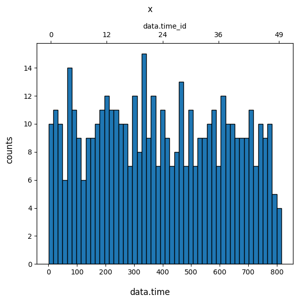
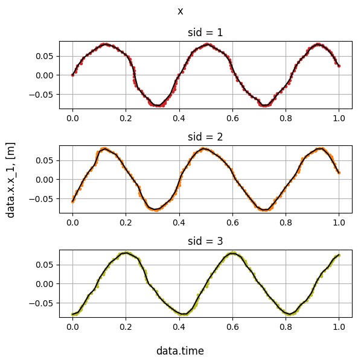
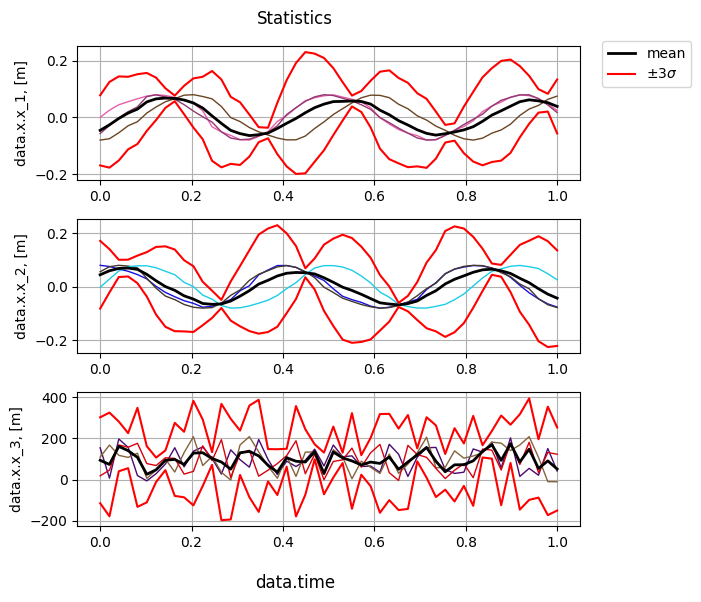
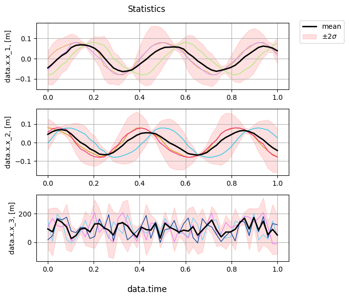

## Bin, interpolate and calculate statistics

### **CitrosData** object

To perform data analysis the [**CitrosData**](../documentation/error_analysis/citros_data.md#citros_data_analysis.error_analysis.citros_data.CitrosData) object is used.
Say, we would like to investigate the 'x' vector and its behaviour depending on the time. Let's query data:
```python
>>> df = citros.topic('A').data(['data.x', 'data.time'])
>>> print(df)
```
<details>
    <summary>Show the output table:</summary>

||sid	|rid	|time	|topic	|type	|data.x | data.time
|--|--|--|--|--|--|--|--
0	|3	|0	|105036927	|A	|a	| {'x_1': -0.08, 'x_2': -0.002, 'x_3': 17.7}|0.3
1	|1	|0	|312751159	|A	|a	| {'x_1': 0.0, 'x_2': 0.08, 'x_3': 154.47}|10.0
...|...|...|...|...|...|...|...
</details>

[**CitrosData**](../documentation/error_analysis/citros_data.md#citros_data_analysis.error_analysis.citros_data.CitrosData) object has two main attributes - 'data' - the depending variables whose behavior we would like to study, and all other additional columns - 'addData'. It is possible to specify which column(s) to treat as data by `data_label`. You may also specify `units` of the data to make future plots more informative.

```python
>>> dataset = analysis.CitrosData(df,
                                  data_label=['data.x'],
                                  units = 'm')
```
When [**CitrosData**](../documentation/error_analysis/citros_data.md#citros_data_analysis.error_analysis.citros_data.CitrosData) object is created, it will turn all dicts or lists, if there were any in **df** rows, into separate columns and store them in 'data' attribute as a [**DataFrame**](https://pandas.pydata.org/docs/reference/api/pandas.DataFrame.html):

```python
>>> print(dataset.data)
```
<details>
    <summary>Show the content of the 'data' attribute:</summary>

||data.x.x_1	|data.x.x_2	|data.x.x_3
|--|--|--|--|
0	|-0.080	|-0.002	|17.70
1	|0.000	|0.080	|154.47
...|...|...|...
</details>

All other data is stored in 'addData' attribute:

```python
>>> print(dataset.addData)
```
<details>
    <summary>Show the content of the 'addData' attribute:</summary>

||sid	|rid	|time	|topic	|type	|data.time
|--|--|--|--|--|--|--|
0	|3	|0	|105036927	|A	|a	|0.3
1	|1	|0	|312751159	|A	|a	|10.0
...|...|...|...|...|...|...
</details>

It is possible to turn data of **CitrosData** object back to pandas.DataFrame. Method [**to_pandas()**](../documentation/error_analysis/citros_data.md#citros_data_analysis.error_analysis.citros_data.CitrosData.to_pandas) concatenate 'data' and 'addData' attributes and return the result table as a pandas.DataFrame:

```python
>>> F = dataset.to_pandas()
```
<details>
    <summary>The result of the concatenation:</summary>

||data.x.x_1	|data.x.x_2	|data.x.x_3	|sid	|rid	|time	|topic	|type	|data.time
|--|--|--|--|--|--|--|--|--|--
0	|-0.080|-0.002|	17.70	|3	|0	|105036927	|A	|a	|0.3
1	|0.000|	0.080|	154.47	|1	|0	|312751159	|A	|a	|10.0
...|...|...|...|...|...|...|...|...|...
</details>

### Assigning indexes

To analyze data of multiple simulations it is necessary to establish a correspondence between the values of the data from these different simulations. One approach is to select an independent variable, define a scale that is common to all simulations and assign indexes on this scale. Then, the values of variables from different simulations will be connected by this independent variable.

There are two ways to perform index assignment. The first one is to divide the independent variable into N ranges, assign an index to each interval, and calculate the averages of the data values for each simulation in each range. The second approach is to scale the independent variable to the interval [0,1], define a new range of N points uniformly distributed from 0 to 1, and interpolate data points over this new interval. The first approach corresponds to the [**bin_data()**](#bin-data) method, while the second is implemented by the [**scale_data()**](#scale-data) method.

#### Bin data
Let's choose one of the parameter, say 'data.time', divide it into `n_bins` intervals and assign index to each of the interval. Then let's group values of the 'x' vector from the [previous example](#citrosdata-object) according to this binning and calculate the mean values of 'x' for the each group. This procedure may be done by function [**bin_data()**](../documentation/error_analysis/citros_data.md#citros_data_analysis.error_analysis.citros_data.CitrosData.bin_data). To see the histogram and control number of counts falling in each bin, pass `show_fig` = True:

```python
>>> db_bin = dataset.bin_data(n_bins = 50,
                              param_label = 'data.time',
                              show_fig = True)
```
<details>
    <summary>Show the distribution:</summary>


</details>

The result is a [**CitrosData**](../documentation/error_analysis/citros_data.md#citros_data_analysis.error_analysis.citros_data.CitrosData) object too, whose `data` and `addData` attributes have two levels of indexes - the new obtained after binning indexes and 'sid'. Mean values of the vector 'x' are stored in 'data' attribute and values of the bin centers are stored in 'addData' attribute.

```python
>>> print(db_bin.data)
```
<details>
    <summary>Show the content of the 'data' attribute:</summary>

|||data.x.x_1	|data.x.x_2	|data.x.x_3
|--|--|--|--|--
|data.time_id|	sid | | | |
|0|	1	|0.00000	|0.08000	|154.470000
| |   2	|-0.04460	|0.06540	|87.728000
| |   3	|-0.07900	|0.00975	|68.055000
|1|	1	|0.01600	|0.07800	|74.453333
| |   2	|-0.01600	|0.07800	|65.020000
...|...|...|...|...|
</details>


```python
>>> print(db_bin.addData)
```
<details>
    <summary>Show the content of the 'addData' attribute:</summary>

|||data.time
|--|--|--|
|data.time_id|	sid	
|0	|1	|8.458
|    |2	|8.458
|    |3	|8.458
|1	|1	|24.774
|    |2	|24.774
|...	|...|	...
</details>

#### Scale data
Another approach besides from binning is to scale parameter to [0,1] interval and interpolate data on this new interval with equally spaced points. Data of different 'sid' values processed independently. The function to perform this is [**scale_data**](../documentation/error_analysis/citros_data.md#citros_data_analysis.error_analysis.citros_data.CitrosData.scale_data). It's syntax is pretty similar to [**bin_data()**](#bin-data):

```python
>>> db_sc = dataset.scale_data(n_points = 50,
                               param_label = 'data.time', 
                               show_fig = False)
```
Structure of the output is similar too:

```python
>>> print(db_sc.data)
```
<details>
    <summary>Show the content of the 'data' attribute:</summary>

|||data.x.x_1	|data.x.x_2	|data.x.x_3
|--|--|--|--|--
|data.time_id|	sid | | | |
|0	|1	|0.000000	|0.080000	|154.470000
|   | 2	|-0.057000  |0.056000	|108.950000
|   | 3	|-0.080000  |-0.002000|17.700000
|1	|1	|0.025494	|0.075573	|6.569425
|   | 2	|-0.028482  |0.074719	|167.725144
|...|...|...	    |...	   |...
</details>

```python
>>> print(db_sc.addData)
```
<details>
    <summary>Show the content of the 'addData' attribute:</summary>

|||data.time
|--|--|--|
|data.time_id|	sid	
|0	|1	|0.000000
|   |2	|0.000000
|   |3	|0.000000
|1	|1	|0.020408
|   |2	|0.020408
|...|...|...
</details>

As previously in the case of [**bin_data()**](#bin-data) method, to controll if the number of point should be increased, pass `show_fig` = True and the result of interpolation for each of the vector's component will be shown. Plots are shown for the first five 'sid' values.

<details>
    <summary>Show the result of the interpolation for 'x_1':</summary>


</details>

### Statistics

#### Get statistics

Now, when we bin or scale data over one of the independent parameter and set new indices according to these procedures, we are able to study statistics for each of these indices.
[**get_statistics()**](../documentation/error_analysis/citros_data.md#citros_data_analysis.error_analysis.citros_data.CitrosData.get_statistics) method is dedicated to do it:

```python
>>> stat = db_sc.get_statistics(return_format='citrosStat')
```
It returns [**CitrosStat**](../documentation/error_analysis/citros_stat.md#citros_data_analysis.error_analysis.citros_stat.CitrosStat) object. Its attributes store independent parameter (stat.x), mean values (stat.mean), covariant matrix (stat.covar_matrix) and standard deviation (stat.sigma, the square root of its diagonal elements) calculated over sids for each index. Each attribute is a [**pandas.DataFrame**](https://pandas.pydata.org/docs/reference/api/pandas.DataFrame.html), except for covariant matrix, which is a [**pandas.Series**](https://pandas.pydata.org/docs/reference/api/pandas.Series.html):

```python
>>> print(stat.mean)
```
||data.x.x_1|	data.x.x_2	|data.x.x_3
|--|--|--|--
|data.time_id||||
0|-4.56666667e-02  |4.46666667e-02| 9.37066667e+01
...|...|...|...
   
```python
>>> print(stat.x)
```
||data.time|
|--|--|
|data.time_id|
0|	0.000000
1|	0.020408 
...|...

```python
>>> print(stat.sigma)
```
||data.x.x_1|	data.x.x_2	|data.x.x_3
|--|--|--|--
|data.time_id||||
0|4.11865674e-02  |4.21584313e-02| 6.96475242e+01
...|...|...|...

Covariant matrix containes N x N numpy.ndarray, with N being the dimension of the data:
```python
>>> print(stat.covar_matrix.iloc[0])
```
```js
array([[1.69633333e-03, 1.54366667e-03, 2.60583167e+00],
       [1.54366667e-03, 1.77733333e-03, 2.93335333e+00],
       [2.60583167e+00, 2.93335333e+00, 4.85077763e+03]])
```

[**get_statistics()**](../documentation/error_analysis/citros_data.md#citros_data_analysis.error_analysis.citros_data.CitrosData.get_statistics) method may return statistics as a single [**DataFrame**](https://pandas.pydata.org/docs/reference/api/pandas.DataFrame.html):

```python
>>> stat = db_sc.get_statistics(return_format='pandas')
>>> print(stat)
```
||data.time|	mean|	covar_matrix	|sigma
|--|--|--|--|--
|data.time_id||||
0|	0.000000|array([...]) |array([[...]])| array([...])
1|	0.020408 | array([...]) |array([[...]]) | array([...])
...|...|...|...|...

That way, the type of 'mean', 'covar_matrix' and 'sigma' values in each row are numpy.ndarray:

```python
>>> print(stat['covar_matrix'].iloc[0])
```
```js
array([[1.69633333e-03, 1.54366667e-03, 2.60583167e+00],
       [1.54366667e-03, 1.77733333e-03, 2.93335333e+00],
       [2.60583167e+00, 2.93335333e+00, 4.85077763e+03]])
```

```python
>>> print(stat['mean'].iloc[0])
```
```js
array[-4.56666667e-02  4.46666667e-02  9.37066667e+01]
```

```python
>>> print(stat['sigma'].iloc[0])
```
```js
array([4.11865674e-02, 4.21584313e-02, 6.96475242e+01])
```

#### Plot statistics

To visualize statistics [**show_statistics()**](../documentation/error_analysis/citros_data.md#citros_data_analysis.error_analysis.citros_data.CitrosData.show_statistics) function is used. It plots values from `data` attribute vs. independent parameter for each of the sid, the mean value over all sids and 3 $\sigma$ interval. If 'data' has several components, like in the example above ('x_1', 'x_1', 'x_3'), it makes separate plots for each of the component: 

```python
>>> db_sc.show_statistics()
```
<details>
    <summary>Show the statistics plot:</summary>


</details>

3 $\sigma$ standard deviation interval is represented by red lines. To change the number of standard deviations, for example to plot 2 $\sigma$ boundary, pass `n_std` = 2. Set parameter `std_area` = True to fill the area the boundary and `std_lines` = False to remove the border lines:

```python
>>> db_sc.show_statistics(std_area = True, std_lines = False, n_std = 2)
```



To study in details the features at the exact 'data.time' value see about [**show_correlation()**](correlation.md#correlation) method.