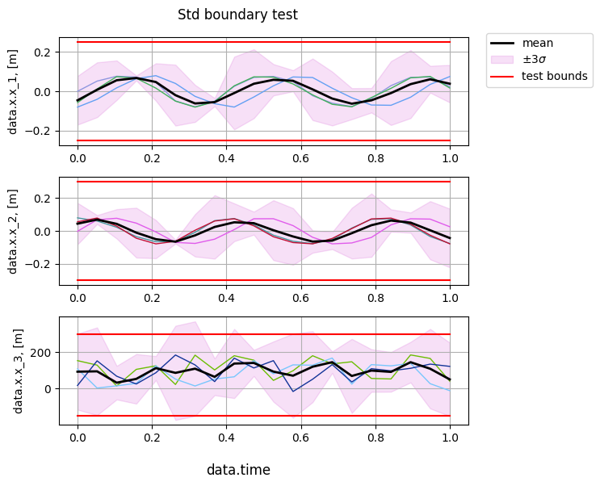

# Standard Deviation Boundary Test

[**std_bound_test()**](../documentation/validation/validation.md#citros_data_analysis.validation.validation.Validation.std_bound_test) test whether `n_std`-standard deviation boundary is within the given limits, where boundary is defined as mean value $\pm$ `n_std` * standard deviation. In case there are NaN (Not a Number) values of standard deviation, to specify whether they should be considered as passing the test, set `nan_passed` = True or False (True by default).

Let's query data for a 3 dimensional vector, assign indexes to data to set correspondence between different simulations (see [Getting started](getting_started.md) page) and test whether the 3 standard deviation boundary is within the set limits:

```python
>>> df = citros.topic('A').data(['data.x.x_1', 'data.x.x_2', 'data.x.x_3', 'data.time'])
>>> V = va.Validation(df, data_label = ['data.x.x_1', 'data.x.x_2', 'data.x.x_3'], 
                      param_label = 'data.time', method = 'scale', num = 20, units = 'm')
                      
>>> log, table, fig = V.std_bound_test(limits = [0.25, 0.3, [-150, 300]], n_std = 3, 
                                       nan_passed = True)
```
## Setting Limits

Ways to set limits are the same as for [**mean_test**](mean_value_test.md) and [**sid_test()**](testing_each_simulation.md):
  
  - if `limits` are set as a one value, for example `limits` = 1, then it will be applied to all columns and considered as an test interval [-1, 1];
  - if `limits` are set as a list of two values, for example `limits` = [-2, 3], then they will be applied to all columns as an test interval [-2, 3];
  - `limits` may be set separately for each column, as in the example above: `limits` = [0.25, 0.3, [-150, 300]] means that for the first column boundaries are [-0.25, 0.25], for the second one are [-0.3, 0.3] and for the last column [-150, 300]. That way length of the `limits` must be equal to the number of columns.
  - if number of column equals two, then `limits` = [1, 3] will be considered as common limits [1, 3] for both columns. If separate limits [-1, 1] for the first column and [-3, 3] for the second one are needed, they must be passed as `limits` = [[-1, 1],  [-3, 3]].

## Returning Parameters

The method returns three parameters: 
- `log` : [**CitrosDict**](../documentation/data_access/citros_dict.md#citros_data_analysis.data_access.citros_dict.CitrosDict) - dictionary with test result summary;

```mermaid
flowchart TD
log_std((log_std)) --- init1("'test_param'") --> |initial \ntest parameters| init1_("{'limits': list,
'n_std': int,
'nan_passed': bool}")

log_std --- col1("column label,
    str") -->|whether the test\n passed or failed| B1("{'passed': bool}")

col1 --> |fraction\n of the points\n that pass the test| C1("{'pass_rate': float}")

col1 ---|points that failed| D1('failed') --> |"indexes and values\nof the x coordinate\n {x_index: x_value}"|D1a("{int : float}")

col1 ---|"data points that have\n NaN (Not a Number) values\n for standard deviation"| E1('nan_std') --> |"indexes and values\nof the x coordinate\n {x_index: x_value}"|E1a("{int : float}")
```

- `table` : [**pandas.DataFrame**](https://pandas.pydata.org/docs/reference/api/pandas.DataFrame.html) - table that specifies whether the corresponding standard deviation boundary point passes the test (True) or not (False).

- `fig` : [**matplotlib.figure.Figure**](https://matplotlib.org/stable/api/figure_api.html#matplotlib.figure.Figure)

Let's inspect the output of the example above:

```python
>>> fig.show()
```


It is evident that the 3-$\sigma$ standard deviation boundaries remain within the limits for the 'data.x.x_1' and 'data.x.x_2' values, while in case of the 'data.x.x_3' column, certain points exceed the given limit.

To change the standard deviation boundery style, paramters `std_area`, `std_lines` and `std_color` may be used: setting `std_area` = True to fill the area within the boundary, `std_lines` = False to remove the borders and `std_color` change the color of the standard deviation boundary:

```python
>>> log, table, fig = V.std_bound_test(limits = [0.25, 0.3, [-150, 300]], n_std = 3,
                            nan_passed = True, std_area = True, std_lines = False, std_color = 'm')
```


```python
>>> print(table)
```
||	data.time| data.x.x_1 |data.x.x_2 |data.x.x_3
|--|--|--|--|--|
data.time_id||||
0   | 0.000000| True|True| False
1   | 0.052632| True|True| False
2   | 0.105263| True|True| True
...|...|...|...|...

`log` can be accessed like a regular python dictionary and can be printed using the [**print()**](../documentation/data_access/citros_dict.md#citros_data_analysis.data_access.citros_dict.CitrosDict.print) method to display it as a JSON object:

```python
>>> log.print()
```
```js
{
 'test_param': {
   'limits': [0.25, 0.3, [-150, 300]],
   'n_std': 3,
   'nan_passed': True
 },
 'data.x.x_1': {
   'passed': True,
   'pass_rate': 1.0,
   'failed': {
   },
   'nan_std': {
   }
 },
 'data.x.x_2': {
   'passed': True,
   'pass_rate': 1.0,
   'failed': {
   },
   'nan_std': {
   }
 },
 'data.x.x_3': {
   'passed': False,
   'pass_rate': 0.55,
   'failed': {
      0: 0.0,
      1: 0.052,
      5: 0.263,
      6: 0.315,
      8: 0.421,
      11: 0.578,
      12: 0.631,
      18: 0.947,
      19: 1.0
   },
   'nan_std': {
   }
 }
}

```

`log` containes summary of the test result: 
  - initial test parameters:
  ```python
  >>> log['test_param'].print()
  ```
  ```js
  {
   'limits': [0.25, 0.3, [-300, 400]],
   'n_std': 3,
   'nan_passed': True
  }
  ```

  - Information about the test results of each column, let's take a look at the 'data.x.x_1':
    - 'passed' - whether the test for the column was passed (True) or not (False):

      ```python
      >>> print(log['data.x.x_1']['passed'])
      ```
      ```js
      True
      ``` 

    - 'pass_rate' - fraction of the points that pass the test, 0 < 'pass_rate' < 1:

      ```python
      >>> print(log['data.x.x_1']['pass_rate'])
      ```
      ```js
      1.0
      ```

    - 'failed' - dictionaries with indexes and corresponding them values of the x axis ('data.time' in this case) for points that failed the test. Since all points of 'data.x.x_1' passed the test, log['data.x.x_1']['failed'] is empty:
      
      ```python
      >>> log['data.x.x_1']['failed'].print()
      ```
      ```js
      {
      }
      ```

      whereas column 'data.x.x_3' has a series of points that exceed the limits:

      ```python
      >>> log['data.x.x_3']['failed'].print()
      ```
      ```js
      {
       0: 0.0,
       1: 0.052,
       5: 0.263,
       6: 0.315,
       8: 0.421,
       11: 0.578,
       12: 0.631,
       18: 0.947,
       19: 1.0
      }
      ```

    - 'nan_std' - if some of the standard deviations points could not be calculated (for example, number of simulations for this index is less then two, that may occurs if the method of data assignment `method` = 'bin' has been chosen), their indexes and values of the x axis will be stored in the same way, as in the section 'failed'.