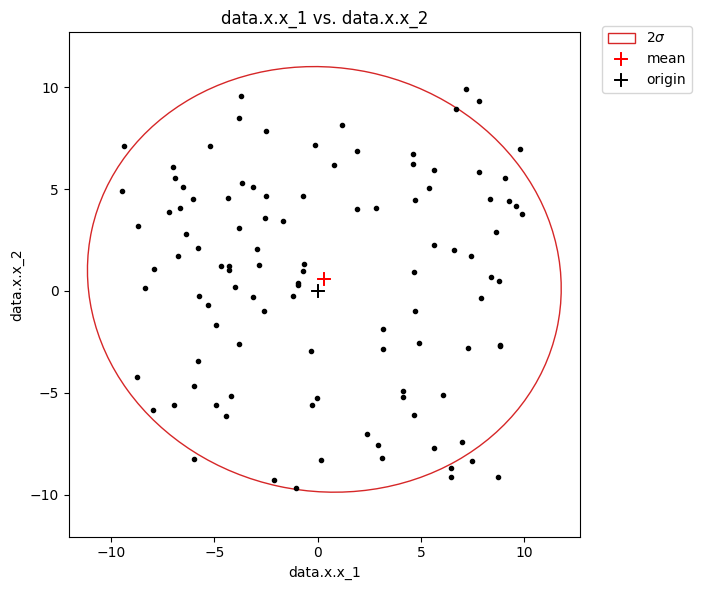

# Plot Data

Let's make query that select 'data.x.x_1' and 'data.x.x_2' from the json-data column of the topic 'B' with sids equals 1,2 or 3, where 10 <= rid <= 200, 0ns <= time < 200ns. Let's also apply moving average sampling, that averages over 5 messages and select each second row of the result and save the output in variable named **df**:

```python
>>> df = citros.topic('B')\
               .sid([1,2,3])\
               .rid(start = 10, end = 200)\
               .time(start = 0, duration = 200)\
               .move_avg(5,2)\
               .data(['data.x.x_1', 'data.x.x_2'])
```

## Plot with pandas

Since the result of the query is a [**DataFrame**](https://pandas.pydata.org/docs/reference/api/pandas.DataFrame.html) of the [**pandas** package](https://pandas.pydata.org/), **pandas** methods of [plotting](https://pandas.pydata.org/docs/reference/api/pandas.DataFrame.plot.html) may be applied to it. It is possible to make separate plots for each of the sid presented in data.

To plot the graph 'data.x.x_1' vs. 'rid' for each sid:
```python
>>> df.set_index(['rid','sid']).unstack()['data.x.x_1'].plot()
```
<details>
  <summary>Show figure:</summary>


</details>

To make one plot for both 'data.x.x_1' and 'data.x.x_2':

```python
>>> df.set_index(['rid','sid']).unstack()[['data.x.x_1','data.x.x_2']].plot()
```
<details>
  <summary>Show figure:</summary>


</details>

It is also possible to query and plot all at once by a single command:
```python
>>> citros.topic('B')\
          .sid([1,2,3])\
          .rid(start = 10, end = 200)\
          .time(start = 0, duration = 200)\
          .move_avg(5,2)\
          .data(['data.x.x_1', 'data.x.x_2'])\
          .set_index(['rid','sid']).unstack()['data.x.x_1'].plot()
```
<details>
  <summary>Show figure:</summary>


</details>

## plot_graph()

[**plot_graph(df, x_label, y_label, \*args, ax = None, legend = True, title = None, set_x_label = None, set_y_label = None, remove_nan = True, inf_vals = 1e308, \*\*kwargs)**](../documentation/data_access/citros_db.md#citros_data_analysis.data_access.citros_db.CitrosDB.plot_graph) method of the [**CitrosDB**](getting_started.md#connection-to-the-database) object makes separate graphs '`y_label` vs. `x_label`' for each sid, where `x_label` and `y_label` are the labels of columns of the table `df`. Some other additional arguments may be passed to customize the plot, see documentation for [matplotlib.axes.Axes.plot](https://matplotlib.org/stable/api/_as_gen/matplotlib.axes.Axes.plot.html).

To plot simple graph 'data.x.x_2' vs 'rid':

```python
>>> citros.plot_graph(df, 'rid', 'data.x.x_2', '.', title = 'data.x.x_2 vs. rid')
```
<details>
  <summary>Show figure:</summary>


</details>

## plot_3dgraph()

[**plot_3dgraph(df, x_label, y_label, z_label, \*args, ax = None, scale = True, legend = True, title = None, set_x_label = None, set_y_label = None, set_z_label = None, remove_nan = True, inf_vals = 1e308, \*\*kwargs)**](../documentation/data_access/citros_db.md#citros_data_analysis.data_access.citros_db.CitrosDB.plot_3dgraph) method of the [**CitrosDB**](getting_started.md#connection-to-the-database) plots 3D graph '`z_label` vs. `x_label` and `y_label`' for each sid, where `x_label`, `y_label` and `z_label` are the labels of columns of the pandas.DataFrame `df`. Parameter `scale` is used to specify whether the axis range should be the same for all three axes.

Let's query for 'data.x.x_1', 'data.x.x_2' and 'data.x.x_3' columns of the topic 'B' and two sids:

```python
>>> df = citros.topic('B')\
               .sid([1,2])\
               .data(['data.x.x_1', 'data.x.x_2', 'data.x.x_3'])
```
If no `ax` is passed, **plot_3dgraph()** creates pair of `fig` and `ax` and returns them:

```python
>>> fig, ax = citros.plot_3dgraph(df, 'data.x.x_1', 'data.x.x_2', 'data.x.x_3', '--', 
                 scale = False, title = 'data.x.x_3 vs.\n data.x.x_1 and data.x.x_2', 
                 legend = True)
>>> ax.set_box_aspect(aspect=None, zoom=0.9)
>>> fig.tight_layout()
```
<details>
  <summary>Show figure:</summary>


</details>

The `ax` parameter allows the option to pass a pre-existing three-dimensional axes for plotting:

```python
import matplotlib.pyplot as plt
from mpl_toolkits import mplot3d

>>> fig = plt.figure(figsize=(6, 6)) 
>>> ax = fig.add_subplot(111, projection = '3d') 
>>> citros.plot_3dgraph(df, 'data.x.x_1', 'data.x.x_2', 'data.x.x_3', '--', ax = ax, 
                        scale = False, legend = True, 
                        title = 'data.x.x_3 vs.\n data.x.x_1 and data.x.x_2')
```

## multiple_y_plot()

[**multiple_y_plot(df, x_label, y_labels, \*args, fig = None, legend = True, title = None, set_x_label = None, set_y_label = None, remove_nan = True, inf_vals = 1e308, \*\*kwargs)**](../documentation/data_access/citros_db.md#citros_data_analysis.data_access.citros_db.CitrosDB.multiple_y_plot) plots a series of vertically arranged graphs 'y vs. `x_label`', with the y-axis labels specified in the `y_labels` parameter.

Let's query 'data.x.x_1', 'data.x.x_2' and 'data.x.x_3' and plot them versus 'data.time':

```python
>>> df = citros.topic('B')\
               .data(['data.x.x_1', 'data.x.x_2', 'data.x.x_3', 'data.time'])
>>> fig, ax = citros.multiple_y_plot(df, 'data.time', ['data.x.x_1', 'data.x.x_2', 'data.x.x_3'], 
                                     '--', legend = True, title = 'data.x vs. time')
```
<details>
  <summary>Show figure:</summary>


</details>

## multiplot()

[**multiplot(df, labels, \*args, scale = True, fig = None, legend = True, title = None, set_x_label = None, set_y_label = None, remove_nan = True, inf_vals = 1e308, label_all_xaxis = False, label_all_yaxis = False, \*\*kwargs)**](../documentation/data_access/citros_db.md#citros_data_analysis.data_access.citros_db.CitrosDB.multiplot) method of the [**CitrosDB**](getting_started.md#connection-to-the-database) object plots a matrix of N x N graphs, each displaying either the histogram with values distribution (for graphs on the diagonal) or
the relationship between variables listed in `labels`, with N being the length of `labels` list. For non-diagonal graphs, colors are assigned to points according to sids.

```python
>>> df = citros.topic('C').skip(10).data(['data.x.x_1', 'data.x.x_2', 'data.x.x_3'])
>>> fig, ax = citros.multiplot(df, ['data.x.x_1','data.x.x_2', 'data.x.x_3'], '.' , 
                               legend = True, title = 'data.x', scale = True)
```
<details>
  <summary>Show figure:</summary>


</details>

## plot_sigma_ellipse()

[**plot_sigma_ellipse(df, x_label, y_label, ax = None, n_std = 3, plot_origin = True, bounding_error = False, inf_vals = 1e308, legend = True, title = None, set_x_label = None, set_y_label = None, scale = False), return_ellipse_param = False**](../documentation/data_access/citros_db.md#citros_data_analysis.data_access.citros_db.CitrosDB.plot_sigma_ellipse) method of the [**CitrosDB**](getting_started.md#connection-to-the-database) object plots covariance ellipses for the `x_label` vs. `y_label` columns of the pandas [**DataFrame**](https://pandas.pydata.org/docs/reference/api/pandas.DataFrame.html) `df`. 

```python
>>> df = citros.topic('A').data(['data.x.x_1', 'data.x.x_2'])
>>> fig, ax = citros.plot_sigma_ellipse(df, x_label = 'data.x.x_1', y_label = 'data.x.x_2', 
                                        n_std = 2, plot_origin=True, scale = True)
```
<details>
  <summary>Show figure:</summary>


</details>

To plot multiple error ellipses, such as 1-$\sigma$, 2-$\sigma$, and 3-$\sigma$ ellipses, pass a list to the n_std parameter, like 'n_std=[1, 2, 3]'. By setting bounding_error to True, the bounding error will be plotted for all of these ellipses. Additionally, you have the flexibility to customize labels and titles of the plot as desired.

```python
>>> fig, ax = citros.plot_sigma_ellipse(df, x_label = 'data.x.x_1', y_label = 'data.x.x_2', 
                                        n_std = [1,2,3], plot_origin=True, bounding_error=True,
                                        set_x_label='x, [m]', set_y_label = 'y, [m]', 
                                        title = 'Coordinates')
```
<details>
  <summary>Show figure:</summary>


</details>

If `return_ellipse_param` = True, the dictionary with ellipse parameters is also returned:

```python
>>> fig, ax, ellipse_param = citros.plot_sigma_ellipse(df, x_label = 'data.x.x_1', y_label = 'data.x.x_2', 
                                    n_std = [1,2,3], plot_origin=True, bounding_error=True,
                                    set_x_label='x, [m]', set_y_label = 'y, [m]', 
                                    title = 'Coordinates', return_ellipse_param = True)
```
 The output contains:
- 'x' - x coordinate of the center;
- 'y' - y coordinate of the center;
- 'width' - ellipse width (along the longer axis);
- 'height' - ellipse height (along the shorter axis);
- 'alpha' - angle of rotation, in degrees.
            
And if `bounding_error` set True:
- bounding_error -radius of the error circle.

If the number of error ellipses is more then 1, the output is the list of dict.

## time_plot()

[**time_plot(ax, \*args, topic_name = None, var_name = None, time_step = 1.0, sids = None, y_label = None, title_text = None, legend = True,  remove_nan = True, inf_vals = 1e308, \*\*kwarg)**](../documentation/data_access/citros_db.md#citros_data_analysis.data_access.citros_db.CitrosDB.time_plot) method of the [**CitrosDB**](getting_started.md#connection-to-the-database) object query column `var_name` of the topic `topic_name` and plots `var_name` vs. `Time` for each of the sids, where `Time` = `time_step` * rid. It is possible to specify sids by passing them as a list to `sid`. If `sid` is not specified, data for all sids is used. 

:::note
Such methods as [**topic()**](../documentation/data_access/citros_db.md#citros_data_analysis.data_access.citros_db.CitrosDB.topic), [**rid()**](query_data.md#rid-constraints), [**sid()**](query_data.md#sid-constraints), [**time()**](query_data.md#time-constraints) and [**set_filter()**](query_data.md#json-data-constraints) may be used to put constraints on data before plotting (see [constraints combination](query_data.md#constraints-combination)).
:::

```python
import matplotlib.pyplot as plt

>>> fig, ax = plt.subplots()
>>> citros.topic('A').time_plot(ax, 
                                var_name = 'data.x.x_1', 
                                time_step = 0.5, 
                                sids = [1,3],
                                y_label='x_1', title_text = 'x_1 vs. Time')
```
<details>
  <summary>Show figure:</summary>


</details>

## xy_plot()

[**xy_plot(ax, \*args, topic_name = None, var_x_name = None, var_y_name = None, sids = None, x_label = None, y_label = None, title_text = None, legend = True, remove_nan = True, inf_vals = 1e308, \*\*kwargs)**](../documentation/data_access/citros_db.md#citros_data_analysis.data_access.citros_db.CitrosDB.xy_plot) method of the [**CitrosDB**](getting_started.md#connection-to-the-database) object query columns `var_x_name` and `var_y_name` of the topic `topic_name` and plots `var_y_name` vs. `var_x_name` for each of the sids. It is possible to specify sids by passing them as a list to `sid`. If `sid` is not specified, data for all sids is used.

:::note
Such methods as [**topic()**](../documentation/data_access/citros_db.md#citros_data_analysis.data_access.citros_db.CitrosDB.topic), [**rid()**](query_data.md#rid-constraints), [**sid()**](query_data.md#sid-constraints), [**time()**](query_data.md#time-constraints) and [**set_filter()**](query_data.md#json-data-constraints) may be used to put constraints on data before plotting (see [constraints combination](query_data.md#constraints-combination)).
:::

```python
import matplotlib.pyplot as plt

>>> fig, ax = plt.subplots()
>>> citros.sid([1,2,3]).topic('A')\
                       .xy_plot(ax, 
                                var_x_name = 'data.time', 
                                var_y_name = 'data.height',
                                x_label='time', y_label = 'height', 
                                title_text='time vs. height')
```
<details>
  <summary>Show figure:</summary>


</details>
