# Query Data

Assuming, that the batch has already been set (see [**batch()**](batch_overview.md#setting-batch) method, `inplace` = True), the general query scheme is as follows:

```mermaid
flowchart LR
    id1((CitrosDB<br>object)) ---id2((" ")) --- B{{"topic()"}}
    B ---id3((" ")) ---C(["sid()"])
    C ---id4((" ")) ---D(["rid()"])
    D ---id5((" ")) --- E(["time()"])
    E ---id6((" ")) 
    id6 --- skip(["skip()"])
    id6 --- avg(["avg()"])
    id6 --- move_avg(["move_avg()"])
    skip ---id7((" ")) 
    id7((" ")) --- F(["set_filter()"])
    avg --- id7((" "))
    move_avg --- id7((" "))
    F --- id8((" ")) --- G(["set_order()"])
    G --- id9((" ")) --- M{{"data()"}}
    classDef dot fill:#000
    class id2,id3,id4,id5,id6,id7,id8,id9 dot;
```


where [**topic()**](../documentation/data_access/citros_db.md#citros_data_analysis.data_access.citros_db.CitrosDB.topic) and [**data()**](../documentation/data_access/citros_db.md#citros_data_analysis.data_access.citros_db.CitrosDB.data) methods are necessary methods and all other are optional to use.

The method [**data()**](../documentation/data_access/citros_db.md#citros_data_analysis.data_access.citros_db.CitrosDB.data) of the [**CitrosDB**](getting_started.md#connection-to-the-database) object is dedicated to query data. Data is always querying for the specific topic, which is defined by [**topic()**](../documentation/data_access/citros_db.md#citros_data_analysis.data_access.citros_db.CitrosDB.topic) method, which must be called before [**data()**](../documentation/data_access/citros_db.md#citros_data_analysis.data_access.citros_db.CitrosDB.data) method. The result is returned as a [**DataFrame**](https://pandas.pydata.org/docs/reference/api/pandas.DataFrame.html) of the [**pandas** package](https://pandas.pydata.org/) - a widely used format in data science.

To query all data for the topic 'B':
```python
>>> citros.topic('B').data()
```
<details>
  <summary>Show the output:</summary>

A pandas DataFrame.

||sid	|rid	|time	|topic	|type	|data.x.x_1	|data.x.x_2	|data.x.x_3	|data.time	|data.note	|data.height
|--|--|--|--|--|--|--|--|--|--|--|--|
0	|0	|0	|0.140	|B	|b	|-0.051	|0.086	|-27.93	|5.0	|[aa, ee, [45, 83], {'n': 31}]	|979.372
1	|0	|1	|0.195	|B	|b	|-0.045	|0.089	|19.85	|5.5	|[aa, cc, [12, 1], {'n': 68}]	|969.772
2	|0	|2	|0.265	|B	|b	|-0.039	|0.092	|33.61	|9.5	|[bb, ee, [92, 23], {'n': 96}]	|954.368
...|...|...|...|...|...|...|...|...|...|...|...
</details>

If no arguments are passed to the [**data()**](../documentation/data_access/citros_db.md#citros_data_analysis.data_access.citros_db.CitrosDB.data) methods, all data from the json-data column is selected. The json-objects are split into columns, while json-arrays are retained as lists.

If the whole json-data column is desired as a json-object:

```python
>>> citros.topic('B').data('data')
```
<details>
  <summary>The output table:</summary>

||sid	|rid|time	|topic	|type	|data
|--|--|--|--|--|--|--|
0	|0	|0	|0.140	|B	|b	|{'x': {'x_1': -0.051, 'x_2': 0.086, 'x_3': -27...
1	|0	|1	|0.195	|B	|b	|{'x': {'x_1': -0.045, 'x_2': 0.089, 'x_3': 19....
2	|0	|2	|0.265	|B	|b	|{'x': {'x_1': -0.039, 'x_2': 0.092, 'x_3': 33....
...|...|...|...|...|...|...
</details>

If only some of the json objects are needed, for example data.x.x_1 and data.time, list with their labels may be passed to [**data()**](../documentation/data_access/citros_db.md#citros_data_analysis.data_access.citros_db.CitrosDB.data): 

```python
>>> citros.topic('B').data(['data.x.x_1', 'data.time'])
```
<details>
  <summary>The result:</summary>

||sid	|rid|time|topic	|type	|data.x.x_1	|data.time
|--|--|--|--|--|--|--|--|
0	|0	|0	|0.140	|B	|b|	-0.051	|5.0
1	|0	|1	|0.195	|B	|b|	-0.045	|5.5
2	|0	|2	|0.265	|B	|b|	-0.039	|9.5
...|...|...|...|...|...|...|...
</details>

If there are json-arrays in the data and the values with the exact index is needed, this index may be passed in square brackets. For example, to collect the values of the first index of the json array "data.note": 

```python
>>> citros.topic('B').data('data.note[0]')
```
<details>
  <summary>The query result:</summary>

||sid	|rid|	time	|topic	|type	|data.note[0]
|--|--|--|--|--|--|--|
0	|0	|0	|0.140	|B	|b	|aa
1	|0	|1	|0.195	|B	|b	|aa
2	|0	|2	|0.265	|B	|b	|bb
...|...|...|...|...|...|...
</details>

By default columns `sid` (simulation run id), `rid`, `time`, `topic` and `type` are returned in the output pandas.DataFrame. If you would like to select only some of these columns use `additional_columns` parameter. The `sid` column is always queried. For example, to reduce the size of the output and leave only `rid` and `topic` columns the previous query may be altered in the following way:

```python
>>> citros.topic('B').data('data.note[0]', additional_columns = ['rid', 'topic'])
```
<details>
  <summary>The query result:</summary>

||sid	|rid| topic	|data.note[0]
|--|--|--|--|--
0	|0	|0	|B	|aa
1	|0	|1	|B	|aa
2	|0	|2	|B	|bb
...|...|...|...|...
</details>

Since the output is a pandas [**DataFrame**](https://pandas.pydata.org/docs/reference/api/pandas.DataFrame.html), all its methods may be applied after [**data()**](#query-data) querying. For example, to create a new column named 'Time' based on the values of the 'rid' column using the formula 'Time' = 'rid' * 0.1, and to modify the 'data.x.x_1' column by subtracting the mean from each value, the pandas [**DataFrame**](https://pandas.pydata.org/docs/reference/api/pandas.DataFrame.html) method [**assign**](https://pandas.pydata.org/docs/reference/api/pandas.DataFrame.assign.html) may be used as follows:

```python
>>> df = citros.topic('B').data('data.x.x_1')\
                          .assign(**{'Time': lambda F: F['rid']*0.1,
                                     'data.x.x_1': lambda F: F['data.x.x_1'] - F['data.x.x_1'].mean()})
>>> print(df)
```
<details>
  <summary>The output:</summary>

||sid	|rid|time|topic	|type	|data.x.x_1	|Time
|--|--|--|--|--|--|--|--|
0	|0	|0	|0.140	|B	|b|	-0.059	|0.0
1	|0	|1	|0.195	|B	|b|	-0.053	|0.1
2	|0	|2	|0.265	|B	|b|	-0.047	|0.2
...|...|...|...|...|...|...|...
</details>

## sid Constraints

To get data with the exact sid, method [**sid()**](../documentation/data_access/citros_db.md#citros_data_analysis.data_access.citros_db.CitrosDB.sid) of the [**CitrosDB**](getting_started.md#connection-to-the-database) is used. It should be applied before [**data()**](../documentation/data_access/citros_db.md#citros_data_analysis.data_access.citros_db.CitrosDB.data) method. To query for the data with the exact simulation ids pass them as a list of ints, for example:

To query json-data column 'data.x.x_1' of the topic 'B' with sid = 1 or 3:

```python
>>> citros.topic('B').sid([1,3]).data('data.x.x_1')
```
<details>
  <summary>The output table</summary>

||sid	|rid| time	|topic	|type	|data.x.x_1
|--|--|--|--|--|--|--|
0	|1	|0	|0.345	|B	|b	|0.000
1	|1	|1	|0.763	|B	|b	|0.007
2	|3	|1	|1.348	|B	|b	|-0.084
...|...|...|...|...|...|...
</details>

Another way to set limits is by `start`, `end` and `count` arguments: `start` <= sid, sid <= `end` and sid < `start` + `count`.  `start`, `end` and  `count` values must be integers.

To query json-data column 'data.x.x_1' of the topic 'B' for sid 3, 4, 5:

```python
>>> citros.topic('B').sid(start = 3, end = 5).data('data.x.x_1')
```
<details>
  <summary>The output table</summary>

||sid	|rid| time	|topic	|type	|data.x.x_1
|--|--|--|--|--|--|--|
0	|3	|0	|1.348	|B	|b	|-0.084
1	|4	|0	|1.582	|B	|b	|0.011
2	|5	|0	|2.166	|B	|b	|-0.031
...|...|...|...|...|...|...
</details>

## rid Constraints

To select only messages with the exact values of rid, the method [**rid()**](../documentation/data_access/citros_db.md#citros_data_analysis.data_access.citros_db.CitrosDB.rid) of the [**CitrosDB**](getting_started.md#connection-to-the-database) is used. It should be applied before [**data()**](../documentation/data_access/citros_db.md#citros_data_analysis.data_access.citros_db.CitrosDB.data) method. 

Similar to the application of [**sid()**](#sid-constraints) method, the list of ints may be passed to query for the exact rid values:

```python
>>> citros.topic('B').rid([6, 7]).data('data.x.x_1')
```
<details>
  <summary>The output table:</summary>

||sid	|rid|	time	|topic	|type	|data.x.x_1
|--|--|--|--|--|--|--|
0	|2	|6	|0.503	|B	|b	|-0.001
1	|2	|7	|0.557	|B	|b	|0.035
2	|3	|6	|1.265	|B	|b	|-0.012
...|...|...|...|...|...|...
</details>

To define the range of limits arguments `start`, `end` and `count` are used: `start` <= rid, rid <= `end` and rid < `start` + `count`.  `start`, `end` and  `count` values must be integers.

Since rid is always > 0, the default `start` being equal 0 means no constraints. 

rid is always >= 0, so the default `start` = 0 means no constraints. To set the upper limit for rid, only `end` may be specified. For example, to get json-data column 'data.x.x_1' of the topic 'B' with rid <= 15:

```python
>>> citros.topic('B').rid(end = 15).data('data.x.x_1')
```
<details>
  <summary>The output table:</summary>

||sid	|rid|	time	|topic	|type	|data.x.x_1
|--|--|--|--|--|--|--|
0	|2	|0	|0.140	|B	|b	|-0.051
1	|2	|1	|0.195	|B	|b	|-0.045
2	|2	|2	|0.265	|B	|b	|-0.039
...|...|...|...|...|...|...
</details>

To set 10 <= rid <= 15:

```python
>>> citros.topic('B').rid(start = 10, end = 15).data('data.x.x_1')
```
<details>
  <summary>The result of the code above:</summary>

||sid	|rid|	time	|topic	|type	|data.x.x_1
|--|--|--|--|--|--|--|
0	|2	|11	|6.322	|B	|b	|0.020
1	|2	|10	|5.975	|B	|b	|0.013
2	|1	|12	|7.459	|B	|b	|0.072
...|...|...|...|...|...|...
</details>

Instead of the `end` value the upper limit of rid may be specified by `count` argument, that set it relative to the `start`. To set 10 <= rid <= 15 with the `count`:

```python
>>> citros.topic('B').rid(start = 10, count = 6).data('data.x.x_1')
```

## time Constraints

To apply constraints on time column, the [**time()**](../documentation/data_access/citros_db.md#citros_data_analysis.data_access.citros_db.CitrosDB.time) method of the [**CitrosDB**](getting_started.md#connection-to-the-database) is used. It should be applied before [**data()**](../documentation/data_access/citros_db.md#citros_data_analysis.data_access.citros_db.CitrosDB.data) method. [**time()**](../documentation/data_access/citros_db.md#citros_data_analysis.data_access.citros_db.CitrosDB.time) method has `start`, `end` and  `duration` arguments to define the time limits (in nanoseconds) of the query. Briefly, they set the following constraints on time: `start` <= time, time <= `end` and time < `start` + `duration`. `start`, `end` and  `duration` values must be integers.

Since time is always >= 0, the default `start` being equal 0 means no constraints. To set the upper limit in nanoseconds for the time column, define `end` argument.
For example, for querying json-data column 'data.x.x_1' of the topic 'B' with time <= 100ns:

```python
>>> citros.topic('B').time(end = 100).data('data.x.x_1')
```
<details>
  <summary>Show the output:</summary>

||sid	|rid|	time	|topic	|type	|data.x.x_1
|--|--|--|--|--|--|--|
0	|2	|0	|0.140	|B	|b	|-0.051
1	|2	|1	|0.195	|B	|b	|-0.045
2	|2	|2	|0.265	|B	|b	|-0.039
...|...|...|...|...|...|...
</details>

Lower limit is set by the `start` argument. To set 50ns <= time <= 100ns:

```python
>>> citros.topic('B').time(start = 50, end = 100).data('data.x.x_1')
```
<details>
  <summary>Result:</summary>

||sid	|rid|	time	|topic	|type	|data.x.x_1
|--|--|--|--|--|--|--|
0	|1	|89	|50.461	|B	|b	|-0.034
1	|3	|72	|50.705	|B	|b	|-0.056
2	|3	|73	|50.838	|B	|b	|-0.061
...|...|...|...|...|...|...
</details>

Instead of the `end` value the duration (in nanoseconds) may be specified, that defines the upper limit of time relative to the `start`. To set 50ns <= time < 100ns with `duration`:

```python
>>> citros.topic('B').time(start = 50, duration = 50).data('data.x.x_1')
```
Note that when the `duration` is used instead of the `end` argument, the upper limit that equals `start`+`duration` is not included in the query.

## JSON-Data Constraints

To apply constraints on a json-data columns, [**set_filter()**](../documentation/data_access/citros_db.md#citros_data_analysis.data_access.citros_db.CitrosDB.set_filter) method of the [**CitrosDB**](getting_started.md#connection-to-the-database) is used. It should be applied before [**data()**](../documentation/data_access/citros_db.md#citros_data_analysis.data_access.citros_db.CitrosDB.data) method. It takes a dictionary as an argument.

The argument has the following structure:
{Key: Value, Key1: Value1, ...}, where Key is a label of the column (for example, 'data.x') and Value defines the constraints, to apply on this column:

|case|Value form| meaning |example|example description
|--|--|--|--|--|
equality| [...] - list of exact values| = |[1, 2, 3]|equals 1 or 2 or 3
inequality|{'>': val}| > val | {'>': 5}| > 5
|| {'>=': val}| >= val | {'>=': 4.5}| >= 4.5
|| {'<': val}| < val | {'<': 0.55}| < 0.55
|| {'<=': val}| <= val | {'<=': -7}| <= -7

:::note
If one of the sampling method ([**skip()**](#skip), [**avg()**](#average), [**move_avg()**](#moving-average)) is used, constraints on all columns except json-data are applied BEFORE sampling while constraints on columns from json-data are applied AFTER sampling.
:::

- To query json-data columns 'data.x.x_1' and 'data.note[2]' from the topic 'B' that matches the condition 'data.x.x_1' < 40:

```python
>>> citros.topic('B').set_filter({'data.x.x_1':{'<':40}}).data(['data.x.x_1', 'data.note[2]'])
```
<details>
  <summary>Show the result:</summary>

||sid	|rid|	time	|topic	|type	|data.x.x_1	|data.note[2]
|--|--|--|--|--|--|--|--|
0	|2	|0	|0.140	|B	|b	|-0.051	|[45, 83]
1	|2	|1	|0.195	|B	|b	|-0.045	|[12, 1]
2	|2	|2	|0.265	|B	|b	|-0.039	|[92, 23]
...|...|...|...|...|...|...|...
</details>

- To query json-data columns 'data.x.x_1' and 'data.note[2]' from the topic 'B' that matches the condition 'data.note[2][0]' = 55 or 56:

```python
>>> citros.topic('B').set_filter({'data.note[2][0]':[55, 56]}).data(['data.x.x_1', 'data.note[2][0]'])
```
<details>
  <summary>The output:</summary>

||sid	|rid|	time	|topic	|type	|data.x.x_1	|data.note[2][0]
|--|--|--|--|--|--|--|--
0	|3	|2	|1.946	|B	|b	|-0.080|	55
1	|3	|6	|4.539	|B	|b	|-0.062|	56
2	|1	|33	|17.139	|B	|b	|0.081|	55
...|...|...|...|...|...|...|...
</details>

:::note
[**set_filter()**](../documentation/data_access/citros_db.md#citros_data_analysis.data_access.citros_db.CitrosDB.set_filter) method may be used to apply constraints not only on json-data, but on any column. Conditions, passed here, have higher priority over those defined by [**topic()**](../documentation/data_access/citros_db.md#citros_data_analysis.data_access.citros_db.CitrosDB.topic), [**rid()**](#rid-constraints), [**sid()**](#sid-constraints) and [**time()**](#time-constraints) methods and will override them.
:::

## Constraints Combination

[**topic()**](../documentation/data_access/citros_db.md#citros_data_analysis.data_access.citros_db.CitrosDB.topic), [**rid()**](#rid-constraints), [**sid()**](#sid-constraints), [**time()**](#time-constraints) and [**set_filter()**](#json-data-constraints) methods of the [**CitrosDB**](getting_started.md#connection-to-the-database) objects may be combined to precisely define the query:

```python
>>> citros.topic('B')\
          .sid([1,2])\
          .rid(start = 10, end = 100)\
          .time(start = 15, end = 100)\
          .set_filter({'data.x.x_1': {'>': 0, '<=': 0.5}})\
          .data(['data.x.x_1', 'data.x.x_2'])
```
<details>
  <summary>Show the output:</summary>

||sid	|rid| time	|topic	|type	|data.x.x_1	|data.x.x_2
|--|--|--|--|--|--|--|--
0	|2	|29	|15.711	|B	|b	|0.099	|0.017
1	|2	|30	|15.915	|B	|b	|0.099	|0.010
2	|1	|33	|17.139	|B	|b	|0.081	|-0.059
...|...|...|...|...|...|...|...
</details>

## Sampling Methods 

If the amount of output data is too huge, only part of it may be selected. It may be achieved by sampling methods [**skip()**](#skip), [**avg()**](#average) and [**move_avg()**](#moving-average), applied before [**data()**](#query-data) method. Only one of this sampling function may be used at one query.

Sampling methods set the directive that are applied before actual retrieving data from the cloud for speed and resource conservation. 

Data from each simulation run (corresponds to different 'sid') processed separately.
If any constraints on 'sid', 'rid', 'time', 'topic' and 'type' columns are set, they are applied before sampling methods, while constraints on data from json column are applied after sampling.

### Skip

[**skip(n)**](../documentation/data_access/citros_db.md#citros_data_analysis.data_access.citros_db.CitrosDB.skip) method is used to select `n`-th message of the each sid.

To query only each 5th message of the topic 'B':
```python
>>> citros.topic('B')\
          .skip(5)\
          .data(['data.x.x_1', 'data.x.x_2'])
```
<details>
  <summary>Show table:</summary>

||sid	|rid|	time	|topic	|type	|data.x.x_1	|data.x.x_2
|--|--|--|--|--|--|--|--
0	|1	|0	|0.345	|B	|b	|0.000	|0.100
1	|1	|5	|3.387	|B	|b	|0.033	|0.094
2	|1	|10	|7.224	|B	|b	|0.062	|0.079
...|...|...|...|...|...|...|...
</details>

### Average

To group and average every set of `n` consecutive messages of the each queried sid [**avg(n)**](../documentation/data_access/citros_db.md#citros_data_analysis.data_access.citros_db.CitrosDB.avg) method is used. Only numeric values may be averaged and the labels of the json-data columns with numeric content should be explicitly listed in [**data()**](#query-data). The value in 'rid' column is set as a minimum value among the 'rid' values of the averaged rows.

To average each 5 messages of the topic 'B':
```python
>>> citros.topic('B')\
          .avg(5)\
          .data(['data.x.x_1', 'data.x.x_2'])
```
<details>
  <summary>The output:</summary>

||sid	|rid|	time	|topic	|type	|data.x.x_1	|data.x.x_2
|--|--|--|--|--|--|--|--
0	|1	|0	|1.127	|B	|b	|0.0132|	0.0986
1	|1	|5	|4.720	|B	|b	|0.0448|	0.0888
2	|1	|10	|7.442	|B	|b	|0.0714|	0.0696
...|...|...|...|...|...|...|...
</details>

### Moving Average

To compute moving average with the window size equals `n` and then during querying select each `s`-th message of the result, [**move_avg(n, s)**](../documentation/data_access/citros_db.md#citros_data_analysis.data_access.citros_db.CitrosDB.move_avg) method is used. Only numeric values may be averaged and the labels of the json-data columns with numeric content should be explicitly listed in [**data()**](#query-data). The value in 'rid' column is set as a minimum value among the 'rid' values of the averaged rows.

To use moving average to average each 5 messages and query every second row of the result of the topic 'B':

```python
>>> citros.topic('B')\
          .move_avg(5,2)\
          .data(['data.x.x_1', 'data.x.x_2'])
```
<details>
  <summary>The output table:</summary>

||sid	|rid|	time|	topic	|type|	data.x.x_1	|data.x.x_2
|--|--|--|--|--|--|--|--
0	|1	|0	|1.127	|B	|b	|0.0132	|0.0986
1	|1	|2	|2.361	|B	|b	|0.0262	|0.0958
2	|1	|4	|3.724	|B	|b	|0.0388	|0.0914
...|...|...|...|...|...|...|...
</details>

## Sorting Order

By default, the data is returned in ascending order based on the 'sid' and 'rid' columns. To sort the result of the query in ascending or descending order based on other columns, the [**set_order()**](../documentation/data_access/citros_db.md#citros_data_analysis.data_access.citros_db.CitrosDB.set_order) method of the [**CitrosDB**](getting_started.md#connection-to-the-database) object is used. It should be applied before [**data()**](#query-data) method calling. It takes a dictionary as an argument, where the key is a label of the column and the dictionary value defines whether in ascending ('asc') or in descending ('desc') order to sort. 

To query json-data columns 'data.height' of the topic 'A' and to sort the result by sid in ascending order and by this column 'data.height' in descending order:

```python
>>> citros.topic('A').set_order({'sid': 'asc', 'data.height': 'desc'}).data('data.height')
```
<details>
  <summary>Show the result:</summary>

||sid	|rid|	time	|topic	|type	|data.height
|--|--|--|--|--|--|--
0	|1	|0	|0.313	|A	|a	|949.799
1	|1	|1	|0.407	|A	|a	|937.165
2	|1	|2	|0.951	|A	|a	|884.295
...|...|...|...|...|...|...
</details> 

## Segregate Data by sid

Method [**data_dict()**](../documentation/data_access/citros_db.md#citros_data_analysis.data_access.citros_db.CitrosDB.data_dict) returns dict of tables, each of the tables corresponds to exact value of sid.
The returning dictionary contains sid as dictionary keys and pandas.DataFrames as dictionary values.

The way of writing query is the same as when [**data()**](#query-data) method is used. All methods of [setting constraints](#constraints-combination) and [sampling methods](#sampling-methods) can be applied.

For example, let's query json-data columns 'data.x.x_2', 'data.time' for topic 'A', where 'data.x.x_2' >= 0 and sid equals 1 or 2. And let's also average each 10 rows of the table:

```python
>>> dfs = citros.topic('A').\
                 sid([1,2]).\
                 avg(10).\
                 set_filter({'data.x.x_2': {'>=':0}}).\
                 set_order({'data.x.x_2':'desc', 'time':'asc'}).\
                 data_dict(['data.x.x_2', 'data.time'])

#print all sid values
>>> print(f'sid values are: {list(dfs.keys())}\n')

#print DataFrame that corresponds to sid = 1:
>>> print('data with sid = 1:')
>>> print(dfs[1])
```
<details>
  <summary>Show the output:</summary>

```text
sid values are: [1, 2]

data with sid = 1:
```
||sid | rid |   time| topic|  type|data.x.x_2 | data.time
|--|--|--|--|--|--|--|--|
0|	1	|120|	83.744	|A	|a |0.0763|	629.48
1|	1	|60	|	43.003	|A	|a |0.0757|	322.95
2|	1	|0	|	2.893	|A	|a |0.0691|	35.84
...|...|...|...|...|...|...|...
</details>

Similar to [**data()**](#query-data) method, in [**data_dict()**](../documentation/data_access/citros_db.md#citros_data_analysis.data_access.citros_db.CitrosDB.data_dict) you can specify by `additional_columns` which of the default columns (`rid`, `time`, `topic`, `type`) to query. `sid` column is always queried.

## Initial Parameters of the Simulation

Initial parameters of the simulation are written under the topic '/config'. Values of the parameters for each of the simulation as well as the overall information about this topic is accessed as any other topics. For example, if simulation named 'simulation_dynamics' requires 1 initial parameter, say 'mass', the initial values for the batch 'robotic_test' may be queried in the following way:

```python
>>> df = citros.batch('robotic_test').topic('/config').data()
```

Each row of the obtained DataFrame `df` corresponds to the separate simulation run. If, for instance, 3 simulation runs were set (sid = 0, 1, 2), the `df` content may look like:

||sid | rid |   time| topic|  type|data.dynamics.ros__parameters.mass 
|--|--|--|--|--|--|--
0|	0	|0|	0	|/config	|/var/lib/citros/runs... |10
1|	1	|0	|	0	|/config	|/var/lib/citros/runs... |15
2|	2	|0	|	0	|/config	|/var/lib/citros/runs... |20

To get the parameter used in the exact simulation, for example for the first one, set the constraints on sid:

```python
>>> df = citros.batch('robotic_test').topic('/config').sid(0).data()
```
||sid | rid |   time| topic|  type|data.dynamics.ros__parameters.mass 
|--|--|--|--|--|--|--
0|	0	|0|	0	|/config	|/var/lib/citros/runs... |10

Getting the initial parameters can be extremely useful, especially when they are set randomly in the simulation.

## Maximum and Minimum Values

To find the maximum and the minimum values of the `column_name` methods [**get_max_value(column_name)**](../documentation/data_access/citros_db.md#citros_data_analysis.data_access.citros_db.CitrosDB.get_max_value) and [**get_min_value(column_name)**](../documentation/data_access/citros_db.md#citros_data_analysis.data_access.citros_db.CitrosDB.get_min_value) are used.

:::note
Use [**topic()**](../documentation/data_access/citros_db.md#citros_data_analysis.data_access.citros_db.CitrosDB.topic), [**rid()**](#rid-constraints), [**sid()**](#sid-constraints), [**time()**](#time-constraints) and [**set_filter()**](#json-data-constraints) methods to apply constraints.
:::

Find the maximum and the minimum values of the column 'rid' for topic 'A':

```python
#specify column
>>> column_name = 'rid'

#get max and min value for topic 'A":
>>> result_max = citros.topic('A').get_max_value(column_name)
>>> result_min = citros.topic('A').get_min_value(column_name)

#print
>>> print(f"max value of the column '{column_name}' : {result_max}")
>>> print(f"min value of the column '{column_name}' : {result_min}")
```
The output is:
```text
max value of the column 'rid' : 163
min value of the column 'rid' : 0
```

To get also the values of simulation id (sid) and rid that correspond to the maximum or minimum value, set `return_index` = True:

```python
>>> column_name = 'data.height'
>>> result_max, sid_max, rid_max = citros.topic('A').get_max_value(column_name, return_index = True)
>>> result_min, sid_min, rid_min = citros.topic('A').get_min_value(column_name, return_index = True)

#print
>>> print(f"max value of the column '{column_name}' : {result_max} at sid = {sid_max}, rid = {rid_max}")
>>> print(f"min value of the column '{column_name}' : {result_min} at sid = {sid_min}, rid = {rid_min}")
```

```text
max value of the column 'data.height' : 995.926 at sid = 3, rid = 0
min value of the column 'data.height' : -13884.705 at sid = 3, rid = 154
```

If there are several cases when the maximum or minimum value is reached, the lists of corresponding sids and rids are returned.

Another way to apply constraints is to use argument `filter_by`, that has the same syntax as [**set_filter()**](#json-data-constraints) method. If we rewrite the query from the previous example with `filter_by` argument:

```python
>>> result_max = citros.get_max_value(column_name, filter_by = {'topic': 'A'})
>>> result_min = citros.get_min_value(column_name, filter_by = {'topic': 'A'})
```

:::note
Constraints passed by `filter_by` will override those defined by [**topic()**](../documentation/data_access/citros_db.md#citros_data_analysis.data_access.citros_db.CitrosDB.topic), [**rid()**](#rid-constraints), [**sid()**](#sid-constraints), [**time()**](#time-constraints) and [**set_filter()**](#json-data-constraints) methods.
:::

## Number of Messages

To calculate the number of messages in the column `column_name` method [**get_counts(column_name, group_by = None)**](../documentation/data_access/citros_db.md#citros_data_analysis.data_access.citros_db.CitrosDB.get_counts) is used.

:::note
Methods [**topic()**](../documentation/data_access/citros_db.md#citros_data_analysis.data_access.citros_db.CitrosDB.topic), [**rid()**](#rid-constraints), [**sid()**](#sid-constraints), [**time()**](#time-constraints) and [**set_filter()**](#json-data-constraints) may be used to apply constraints.
:::

To display the total number of rows in the table call [**get_counts(column_name, group_by = None)**](../documentation/data_access/citros_db.md#citros_data_analysis.data_access.citros_db.CitrosDB.get_counts) without arguments: 

```python
>>> citros.get_counts()
```
```text
[(2000,)]
```
It is possible to group the results, for example by topics:
```python
>>> citros.get_counts(group_by = 'topic')
```
```text
[('D', 519), ('A', 474), ('B', 494), ('C', 513)]
```
or get the number of rows for the specific topic:
```python
>>> citros.topic('A').get_counts()
```
```text
[(474,)]
```

Let's find the number of the rows in column "rid", for messages which meet the following requirements: "type" is 'a' or 'b' and "time" <= 150. If we would like to see counts for each "type" separately, `group_by` argument may be used:

```python
#specify name of the column
>>> column_name = 'sid'

#Set "time" <= 150 and set "type" to be 'a' or 'b', group the counts by 'type':
>>> counts = citros.time(end = 150).set_filter({'type': ['a', 'b']})\
                                   .get_counts(column_name, group_by = ['type'])

#print the result:
>>> print(f"number of messages in column '{column_name}':")
>>> table = PrettyTable(field_names=['type', 'counts'], align='r')
>>> table.add_rows(counts)
>>> print(table)
```

```text
number of messages in column 'sid':
+------+--------+
| type | counts |
+------+--------+
|    b |    494 |
|    a |    474 |
+------+--------+
```

Another way to apply constraints is to use argument `filter_by`, that has the same syntax as [**set_filter()**](#json-data-constraints) method. This way, the query from the previous example will look like:

```python
>>> counts = citros.get_counts(column_name, group_by = ['type'],
                               filter_by = {'time': {'<=': 150}, 'type': ['a', 'b']})
```

:::note
Constraints passed by `filter_by` will override those defined by [**topic()**](../documentation/data_access/citros_db.md#citros_data_analysis.data_access.citros_db.CitrosDB.topic), [**rid()**](#rid-constraints), [**sid()**](#sid-constraints), [**time()**](#time-constraints) and [**set_filter()**](#json-data-constraints) methods.
:::

## Unique Values

Method [**get_unique_values(column_names)**](../documentation/data_access/citros_db.md#citros_data_analysis.data_access.citros_db.CitrosDB.get_unique_values) of the [**CitrosDB**](getting_started.md#connection-to-the-database) object is used to get the unique values or combination of values of the columns `column_names`.

:::note
Like in the case of [data querying](#query-data), such methods as [**topic()**](../documentation/data_access/citros_db.md#citros_data_analysis.data_access.citros_db.CitrosDB.topic), [**rid()**](#rid-constraints), [**sid()**](#sid-constraints), [**time()**](#time-constraints) and [**set_filter()**](#json-data-constraints) may be applied too to define constraints.
:::

- Get the unique combination of "topic" and "type" and show it by **prettytable**:

```python
>>> result = citros.get_unique_values(column_names = ['topic', 'type_name'])
>>> table = PrettyTable(field_names=column_names, align='r')
>>> table.add_rows(result)
>>> print(table)
```

```text
+-------+------+
| topic | type |
+-------+------+
|     B |    b |
|     A |    a |
|     D |    d |
|     C |    c |
+-------+------+
```

- Get the unique values of the column "type", but only for specific "time" and "topic" values, for example 100 < "time" <= 200, "topic" = 'A':

```python
#get the unique values
>>> result = citros.topic('A').set_filter({'time': {'>': 100, '<=': 200}})\
                              .get_unique_values(column_names = ['type'])

#print
>>> table = PrettyTable(field_names=column_names, align='r')
>>> table.add_rows(result)
>>> print(table)
```

```text
+------+
| type |
+------+
|    a |
+------+
```

Another way to apply constraints is to use argument `filter_by`, that has the same syntax as [**set_filter()**](#json-data-constraints) method. This way, the query from the previous example will look like:

```python
>>> result = citros.get_unique_values(column_names = ['type'], 
                                      filter_by = {'topic': 'A', 'time': {'>': 100, '<=': 200}})
```
:::note
Constraints passed by `filter_by` will override those defined by [**topic()**](../documentation/data_access/citros_db.md#citros_data_analysis.data_access.citros_db.CitrosDB.topic), [**rid()**](#rid-constraints), [**sid()**](#sid-constraints), [**time()**](#time-constraints) and [**set_filter()**](#json-data-constraints) methods.
:::

## Number of the unique values

To see the number of the unique values, the method [**get_unique_counts(column_name, group_by = None)**](../documentation/data_access/citros_db.md#citros_data_analysis.data_access.citros_db.CitrosDB.get_unique_counts) is used.

:::note
[**topic()**](../documentation/data_access/citros_db.md#citros_data_analysis.data_access.citros_db.CitrosDB.topic), [**rid()**](#rid-constraints), [**sid()**](#sid-constraints), [**time()**](#time-constraints) and [**set_filter()**](#json-data-constraints) methods are used to define constraints.
:::

Let's find the number of unique values in column "rid", for messages, which meet the following requirements: "type" is 'a' or 'b' and "time" <= 150. To see counts for each "type" separately, `group_by` argument may be used:

```python
#specify name of the column
column_name = 'sid'

#Set "time" <= 150 and set "type" to be 'a' or 'b', group the counts by 'type':
>>> counts = citros.time(end = 150)\
                   .set_filter({'type': ['a', 'b']})\
                   .get_unique_counts(column_name, group_by = ['type'])

#print the result:
>>> print(f"number of unique values in column '{column_name}':")
>>> table = PrettyTable(field_names=['type', 'unique_counts'], align='r')
>>> table.add_rows(counts)
>>> print(table)
```

```text
number of unique values in column 'sid':
+------+---------------+
| type | unique_counts |
+------+---------------+
|    a |             3 |
|    b |             3 |
+------+---------------+
```

Another way to apply constraints is to use argument `filter_by`, that has the same syntax as [**set_filter()**](#json-data-constraints) method. This way, the query from the previous example will look like:

```python
>>> counts = citros.get_unique_counts(column_name, group_by = ['type'], 
                                      filter_by = {'time': {'<=': 150}, 'type': ['a', 'b']})
```

:::note
Constraints passed by `filter_by` will override those defined by [**topic()**](../documentation/data_access/citros_db.md#citros_data_analysis.data_access.citros_db.CitrosDB.topic), [**rid()**](#rid-constraints), [**sid()**](#sid-constraints), [**time()**](#time-constraints) and [**set_filter()**](#json-data-constraints) methods.
:::