---
# Display h3 headings
sidebar_label: 'Class CitrosDB'
toc_max_heading_level: 3
hide_title: true
description: 'Documentation'
---

# Class CitrosDB


    
## Class `CitrosDB` {#citros_data_analysis.data_access.citros_db.CitrosDB}


```python
class CitrosDB(
    repo=None,
    simulation=None,
    batch=None,
    sid=None,
    host=None,
    port=None,
    database=None,
    schema=None,
    user=None,
    password=None,
    debug=False,
    async_query=False,
    async_timeout=180
)
```


<details>
  <summary>Description</summary>

CitrosDB object allows to get general information about the batch and make queries.

#### Parameters

Name|Type|Description
--|--|--
|**```repo```**|**str** or **int**, optional|Repository name or id.<br />    If name is provided, searches for the exact match.<br />    If an integer value is provided, it determines the selection based on the order of repository creation (-1 for the last created, 0 for the first).<br />    Default is ENV variable "CITROS_REPO". When operating from a local environment and ENV variable is not set, **repo** is set to the 'name' field from the '.citros/project.json' file.
|**```simulation```**|**str**, optional|Name of the simulation. Default is ENV variable "CITROS_SIMULATION" if it is set or None if the variable is not defined.
|**```batch```**|**str** or **int**, optional|Batch name or id.<br />    If name is provided, searches for the exact match.<br />    If an integer value is provided, it determines the selection based on the order of batch creation (-1 for the last created, 0 for the first).<br />    Default is ENV variable "bid" if it is set or None if the variable is not defined.
|**```sid```**|**int**, optional|Simulation run id.<br />    Default is ENV variable "CITROS_SIMULATION_RUN_ID" if it is set or None if the variable is not defined.
|**```host```**|**str**|Database host address.<br />    Default is ENV variable "PG_HOST" if it is set or None if the variable is not defined.
|**```port```**|**str**, optional|Default is ENV variable "PG_PORT" if it is set or None if the variable is not defined.
|**```database```**|**str**, optional|Database name.<br />    Default is ENV variable "PG_DATABASE". When operating from a local environment and ENV variable is not set, defined by CITROS CLI authentication.
|**```schema```**|**str**, optional|Default is ENV variable "PG_SCHEMA" if it is set or None if the variable is not defined.
|**```user```**|**str**, optional|User name.<br />    Default is ENV variable "PG_USER". When operating from a local environment and ENV variable is not set, defined by CITROS CLI authentication.
|**```password```**|**str**, optional|Password.<br />    Default is ENV variable "PG_PASSWORD". When operating from a local environment and ENV variable is not set, defined by CITROS CLI authentication.
|**```debug```**|**bool**, default **False**|If **False**, program will try to handle errors and only print error messages without code breaking.<br />    If **True**, this will cause the code to abort if an error occurs.
|**```async_query```**|**bool**, default **False**|If **False** and the batch is not yet downloaded into the database, checks the status of the batch and tries to query it during the **async_timeout** time.
|**```async_timeout```**|**int**, default **180**|Time of waiting for the batch to be downloaded into the database.<br />    Used only if **async_query** is set **False**. During this time checks the status of the batch and tries to query it.

</details>


## Repositories
    
### Method `repo` {#citros_data_analysis.data_access.citros_db.CitrosDB.repo}


```python
def repo(
    repo=None,
    inplace=False,
    exact_match=False
)
```


<details>
  <summary>Description</summary>

Set repository to the CitrosDB object.

#### Parameters

Name|Type|Description
--|--|--
|**```repo```**|**int** or **str**|      &#8226; To set the repository with the exact id, provide the repository id as str.<br />      &#8226; To set a repository using its name, provide the name as a string. If the provided string matches multiple repository names, check the whole list by **search_repo()** method.<br />      &#8226; To query the first created / second created / etc repository, set **repo** = 0, **repo** = 1, etc.<br />      &#8226; To query the the last created / the second-to-last created / etc repository, set **repo** = -1, **repo** = -2, etc.
|**```inplace```**|**bool**, default **False**|If True, set repository id to the current CitrosDB object, otherwise returns new CitrosDB object with<br />    set repository id.
|**```exact_match```**|**bool**, default **False**|If True, search for the repository with exact match in name field.<br />    If False, searches for the occurrence of the provided string within the name field.
#### Returns

Name|Type|Description
--|--|--
|**```out```**|**[CitrosDB](#citros_data_analysis.data_access.citros_db.CitrosDB "citros_data_analysis.data_access.citros_db.CitrosDB")**|CitrosDB with set repository id or None, if **inplace** = True.
#### See Also

**[CitrosDB.search_repo()](#citros_data_analysis.data_access.citros_db.CitrosDB.search_repo "citros_data_analysis.data_access.citros_db.CitrosDB.search_repo")**


</details>
<details>
  <summary>Examples</summary>

Display information about all batches of the repository 'projects':

```python
>>> citros = da.CitrosDB()
>>> citros.repo('projects').search_batch().print()
{
 'dynamics': {
   'id': '00000000-dddd-1111-2222-333333333333',
   'sid': [1, 3, 2],
   'created_at': '2023-06-21T15:03:07.308498+00:00',
   ...
   'repo': 'projects',
   'link': <https://citros.io/...>
 }
}
```


By default, the **repo** method searches for occurrences of the provided string in repository names rather than exact matches. 
For instance, if there are multiple repositories with the word 'projects' in their names, such as 'projects' and 'projects_1', 
the **repo** method will indicate this and not set the repository. To search for an exact repository name, 
set the **exact_match** parameter to True.

```python
>>> citros.repo('projects', exact_name = True)
```


Show information about all batches of the last created repository:

```python
>>> citros = da.CitrosDB()
>>> citros.repo(-1).search_batch().print()
{
 'kinematics': {
   'id': '00000000-aaaa-1111-2222-333333333333',
   'sid': [1, 2, 3, 4, 5],
   'created_at': '2023-06-14T11:44:31.728585+00:00',
   ...
   'repo': 'citros_project',
   'link': <https://citros.io/...>
 },
 'kinematics_2': {
   'id': '00000000-bbbb-1111-2222-333333333333',
   'sid': [0, 1, 2, 3],
   'created_at': '2023-06-21T13:51:47.29987+00:00',
   ...
   'repo': 'citros_project',
   'link': <https://citros.io/...>
 }
}
```


Show information about all batches of the repository with id 'rrrrrrrr-1111-2222-3333-444444444444':

```python
>>> citros = da.CitrosDB()
>>> citros.repo('rrrrrrrr-1111-2222-3333-444444444444').search_batch().print()
{
 'kinematics': {
   'id': '00000000-aaaa-1111-2222-333333333333',
   'sid': [1, 2, 3, 4, 5],
   'created_at': '2023-06-14T11:44:31.728585+00:00',
   ...
   'repo': 'citros_project',
   'link': <https://citros.io/...>
 },
 'kinematics_2': {
   'id': '00000000-bbbb-1111-2222-333333333333',
   'sid': [0, 1, 2, 3],
   'created_at': '2023-06-21T13:51:47.29987+00:00',
   ...
   'repo': 'citros_project',
   'link': <https://citros.io/...>
 }
}
```


Assign the 'projects' repository to the existing CitrosDB object and show details for all its batches:

```python
>>> citros = da.CitrosDB()
>>> citros.repo('projects', inplace = True)
>>> citros.search_batch().print()
{
 'dynamics': {
   'id': '00000000-dddd-1111-2222-333333333333',
   'sid': [1, 3, 2],
   'created_at': '2023-06-21T15:03:07.308498+00:00',
   ...
   'repo': 'projects',
   'link': <https://citros.io/...>
 }
}
```

</details>


    
### Method `search_repo` {#citros_data_analysis.data_access.citros_db.CitrosDB.search_repo}


```python
def search_repo(
    search=None,
    search_by=None,
    order_by=None,
    exact_match=False,
    user='all'
)
```


<details>
  <summary>Description</summary>

Return information about repositories.

The output is a dictionary, that contains repository names as dictionary keys 
and repository ids, list of corresponding simulation ids and date of creation as dictionary values.

#### Parameters

Name|Type|Description
--|--|--
|**```search```**|**int** or **str**|      &#8226; To search for the  repository with the exact id, provide the repository id as str.<br />      &#8226; To search by  repository name or by words that partially match the  repository name, provide the corresponding word as str.<br />      &#8226; To query the first created / second created / etc  repository, set **search** = 0, **search** = 1, etc.<br />      &#8226; To query the the last created / the second-to-last created / etc  repository, set **search** = -1, **search** = -2, etc.<br />    <br />    To use another field for search, set the appropriate **search_by** parameter
|**```search_by```**|**str**|By default, the search is conducted based on name, repository id or ordinal number according to the creation time.<br />    To perform a search using an another field, set the **search_by** parameter to one of the following <br />    and provide the appropriate format to **search** field:<br />    Provide **search** as a **str** for the following fields:<br />      &#8226; 'description'<br />      &#8226; 'git'<br /><br />    Provide **search** as **str** that may contains date, time and timezone information, like: 'dd-mm-yyyy hh:mm:ss +hh:mm',<br />    or only date and time without timezone: 'dd-mm-yyyy hh:mm:ss', or only date: 'dd-mm-yyyy' / 'dd-mm' / 'dd'<br />    or only time: 'hh:mm:ss' / 'hh:mm' with or without timezone. <br />    Any missing date information is automatically set to today's date, and any missing time information is set to 0.<br />      &#8226; 'created_after'<br />      &#8226; 'created_before'<br />      &#8226; 'updated_after'<br />      &#8226; 'updated_before'
|**```order_by```**|**str** or **list** or **dict**|To obtain the output in ascending order, provide one or more of the following options as either a single value as str or a as a list:<br />      &#8226; 'name'<br />      &#8226; 'id' <br />      &#8226; 'description'<br />      &#8226; 'created_at'<br />      &#8226; 'updated_at'<br />      &#8226; 'git'<br /><br />    To specify whether to use descending or ascending order, create a dictionary where the keys correspond to the options mentioned above, <br />    and the values are either 'asc' for ascending or 'desc' for descending. For instance: {'name': 'asc', 'created_at': 'desc'}"
|**```exact_match```**|**bool**, default **False**|If True and **search** is str, looks for an exact match in the field defined by the 'search_by' parameter.<br />    If **search_by** is not defined, search is performed by name.<br />    If set to False, searches for the occurrences of the provided string within the field defined by the 'search_by' parameter.
|**```user```**|**str**, default `'all'`|Set **user** as 'me' to filter and display only the repositories that belong to you.<br />    To get the repositories that were created by another user, provide the email.
#### Returns

Name|Type|Description
--|--|--
|**```out```**|**[CitrosDict](citros_dict.md#citros_data_analysis.data_access.citros_dict.CitrosDict "citros_data_analysis.data_access.citros_dict.CitrosDict")**|Information about the repositories.

</details>
<details>
  <summary>Examples</summary>

Display the information about all repositories:

```python
>>> citros.search_repo().print()
{
 'citros_project': {
   'id': 'rrrrrrrr-1111-2222-3333-444444444444',
   'description': 'citros runs',
   'created_at': '2023-05-20T09:57:44.632361+00:00',
   'updated_at': '2023-08-20T07:45:11.136632+00:00',
   'git': '...'
 },
 'projects': {
   'id': 'rrrrrrrr-1111-2222-aaaa-555555555555',
   'description': 'statistics',
   'created_at': '2023-05-18T12:55:41.144263+00:00',
   'updated_at': '2023-08-18T11:25:31.356987+00:00',
   'git': '...'
 },
 'citros': {
   'id': 'rrrrrrrr-1111-2222-3333-444444666666',
   'description': 'project repository',
   'created_at': '2023-05-16T13:52:44.523112+00:00',
   'updated_at': '2023-05-26T15:25:17.321432+00:00',
   'git': '...'
 }
}
```


Print information about all repositories that have word 'citros' in their name, order them in descending order by time of creation:

```python
>>> citros.search_repo('citros', order_by = {'created_at': 'desc'}).print()
{
 'citros_project': {
   'id': 'rrrrrrrr-1111-2222-3333-444444444444',
   'description': 'citros runs',
   'created_at': '2023-05-20T09:57:44.632361+00:00',
   'updated_at': '2023-08-20T07:45:11.136632+00:00',
   'git': '...'
 },
 'citros': {
   'id': 'rrrrrrrr-1111-2222-3333-444444666666',
   'description': 'project repository',
   'created_at': '2023-05-16T13:52:44.523112+00:00',
   'updated_at': '2023-05-26T15:25:17.321432+00:00',
   'git': '...'
 }
}
```


By default, the **search_repo** method searches for occurrences of the provided string in repository names rather than exact matches. 
To select information for only 'citros' repository, set the **exact_match** parameter to True:

```python
>>> citros.search_repo('citros', exact_match = True).print()
{
 'citros': {
   'id': 'rrrrrrrr-1111-2222-3333-444444666666',
   'description': 'project repository',
   'created_at': '2023-05-22T13:52:44.523112+00:00',
   'updated_at': '2023-05-26T15:25:17.321432+00:00',
   'git': '...'
 }
}
```


Display the repository that was created the last:

```python
>>> citros.search_repo(-1).print()
{
 'citros_project': {
   'id': 'rrrrrrrr-1111-2222-3333-444444444444',
   'description': 'citros runs',
   'created_at': '2023-05-20T09:57:44.632361+00:00',
   'updated_at': '2023-08-20T07:45:11.136632+00:00',
   'git': '...'
 }
}
```


Display the repository with the repository id = 'rrrrrrrr-1111-2222-aaaa-555555555555':

```python
>>> citros.search_repo('rrrrrrrr-1111-2222-aaaa-555555555555').print()
{
'projects': {
   'id': 'rrrrrrrr-1111-2222-aaaa-555555555555',
   'description': 'statistics',
   'created_at': '2023-05-18T12:55:41.144263+00:00',
   'updated_at': '2023-08-18T11:25:31.356987+00:00',
   'git': '...'
 }
}
```


Show the repository with word 'citros' in the 'description' field:

```python
>>> citros.search_repo('citros', search_by = 'description').print()
{
 'citros_project': {
   'id': 'rrrrrrrr-1111-2222-3333-444444444444',
   'description': 'citros runs',
   'created_at': '2023-05-20T09:57:44.632361+00:00',
   'updated_at': '2023-08-20T07:45:11.136632+00:00',
   'git': '...'
 }
}
```


Display repositories that were updated earlier then 12:30 18 August 2023, timezone +0:00:

```python
>>> citros.search_repo('18-08-2023 12:30:00 +0:00', search_by = 'updated_before').print()
```


{
'projects': {
   'id': 'rrrrrrrr-1111-2222-aaaa-555555555555',
   'description': 'statistics',
   'created_at': '2023-05-18T12:55:41.144263+00:00',
   'updated_at': '2023-08-18T11:25:31.356987+00:00',
   'git': '...'
 }
}

Show repositories that were created after 19 May:

```python
>>> citros.search_repo('19-05', search_by = 'created_after').print()
{
 'citros_project': {
   'id': 'rrrrrrrr-1111-2222-3333-444444444444',
   'description': 'citros runs',
   'created_at': '2023-05-20T09:57:44.632361+00:00',
   'updated_at': '2023-08-20T07:45:11.136632+00:00',
   'git': '...'
 }
}
```


Display repositories that were last updated before 8:00 AM today:

```python
>>> citros.search_repo('8:00', search_by = 'updated_before').print()
```


{
 'citros_project': {
   'id': 'rrrrrrrr-1111-2222-3333-444444444444',
   'description': 'citros runs',
   'created_at': '2023-05-20T09:57:44.632361+00:00',
   'updated_at': '2023-08-20T07:45:11.136632+00:00',
   'git': '...'
 },
 'projects': {
   'id': 'rrrrrrrr-1111-2222-aaaa-555555555555',
   'description': 'statistics',
   'created_at': '2023-05-18T12:55:41.144263+00:00',
   'updated_at': '2023-08-18T11:25:31.356987+00:00',
   'git': '...'
 },
 'citros': {
   'id': 'rrrrrrrr-1111-2222-3333-444444666666',
   'description': 'project repository',
   'created_at': '2023-05-16T13:52:44.523112+00:00',
   'updated_at': '2023-05-26T15:25:17.321432+00:00',
   'git': '...'
 }
}

By default, all repositories are displayed, regardless of their creator. 
To show only the repositories that belong to you, set **user** = 'me':

```python
>>> citros.search_repo(user = 'me').print()
```


{
 'citros_project': {
   'id': 'rrrrrrrr-1111-2222-3333-444444444444',
   'description': 'citros runs',
   'created_at': '2023-05-20T09:57:44.632361+00:00',
   'updated_at': '2023-08-20T07:45:11.136632+00:00',
   'git': '...'
 }
}

To display repositories, that were created by another user, provide the email:

```python
>>> citros.search_repo(user = 'user@mail.com').print()
```


{
'citros': {
   'id': 'rrrrrrrr-1111-2222-3333-444444666666',
   'description': 'project repository',
   'created_at': '2023-05-16T13:52:44.523112+00:00',
   'updated_at': '2023-05-26T15:25:17.321432+00:00',
   'git': '...'
 }
}

Get list of the all existing repositories names as a list:

```python
>>> repos_names = list(citros.search_repo().keys())
>>> print(repo_names)
['projects', 'citros_project', 'citros']
```

</details>


    
### Method `repo_info` {#citros_data_analysis.data_access.citros_db.CitrosDB.repo_info}


```python
def repo_info(
    search=None,
    search_by=None,
    order_by=None,
    exact_match=False,
    user='all'
)
```


<details>
  <summary>Description</summary>

Return information about repositories.

:::cautionWarning

**Deprecated since version:&ensp;0.8.0:** 
Use **[CitrosDB.search_repo()](#citros_data_analysis.data_access.citros_db.CitrosDB.search_repo "citros_data_analysis.data_access.citros_db.CitrosDB.search_repo")** instead.

:::

The output is a dictionary, that contains repository names as dictionary keys 
and repository ids, list of corresponding simulation ids and date of creation as dictionary values.

#### Parameters

Name|Type|Description
--|--|--
|**```search```**|**int** or **str**|      &#8226; To search for the  repository with the exact id, provide the repository id as str.<br />      &#8226; To search by  repository name or by words that partially match the  repository name, provide the corresponding word as str.<br />      &#8226; To query the first created / second created / etc  repository, set **search** = 0, **search** = 1, etc.<br />      &#8226; To query the the last created / the second-to-last created / etc  repository, set **search** = -1, **search** = -2, etc.<br />    <br />    To use another field for search, set the appropriate **search_by** parameter
|**```search_by```**|**str**|By default, the search is conducted based on name, repository id or ordinal number according to the creation time.<br />    To perform a search using an another field, set the **search_by** parameter to one of the following <br />    and provide the appropriate format to **search** field:<br />    Provide **search** as a **str** for the following fields:<br />      &#8226; 'description'<br />      &#8226; 'git'<br /><br />    Provide **search** as **str** that may contains date, time and timezone information, like: 'dd-mm-yyyy hh:mm:ss +hh:mm',<br />    or only date and time without timezone: 'dd-mm-yyyy hh:mm:ss', or only date: 'dd-mm-yyyy' / 'dd-mm' / 'dd'<br />    or only time: 'hh:mm:ss' / 'hh:mm' with or without timezone. <br />    Any missing date information is automatically set to today's date, and any missing time information is set to 0.<br />      &#8226; 'created_after'<br />      &#8226; 'created_before'<br />      &#8226; 'updated_after'<br />      &#8226; 'updated_before'
|**```order_by```**|**str** or **list** or **dict**|To obtain the output in ascending order, provide one or more of the following options as either a single value as str or a as a list:<br />      &#8226; 'name'<br />      &#8226; 'id' <br />      &#8226; 'description'<br />      &#8226; 'created_at'<br />      &#8226; 'updated_at'<br />      &#8226; 'git'<br /><br />    To specify whether to use descending or ascending order, create a dictionary where the keys correspond to the options mentioned above, <br />    and the values are either 'asc' for ascending or 'desc' for descending. For instance: {'name': 'asc', 'created_at': 'desc'}"
|**```exact_match```**|**bool**, default **False**|If True and **search** is str, looks for an exact match in the field defined by the 'search_by' parameter.<br />    If **search_by** is not defined, search is performed by name.<br />    If set to False, searches for the occurrences of the provided string within the field defined by the 'search_by' parameter.
|**```user```**|**str**, default `'all'`|Set **user** as 'me' to filter and display only the repositories that belong to you.<br />    To get the repositories that were created by another user, provide the email.
#### Returns

Name|Type|Description
--|--|--
|**```out```**|**[CitrosDict](citros_dict.md#citros_data_analysis.data_access.citros_dict.CitrosDict "citros_data_analysis.data_access.citros_dict.CitrosDict")**|Information about the repositories.
#### See Also

**[CitrosDB.search_repo()](#citros_data_analysis.data_access.citros_db.CitrosDB.search_repo "citros_data_analysis.data_access.citros_db.CitrosDB.search_repo")**


</details>
<details>
  <summary>Examples</summary>

Display the information about all repositories:

```python
>>> citros.repo_info().print()
{
 'citros_project': {
   'id': 'rrrrrrrr-1111-2222-3333-444444444444',
   'description': 'citros runs',
   'created_at': '2023-05-20T09:57:44.632361+00:00',
   'updated_at': '2023-08-20T07:45:11.136632+00:00',
   'git': '...'
 },
 'projects': {
   'id': 'rrrrrrrr-1111-2222-aaaa-555555555555',
   'description': 'statistics',
   'created_at': '2023-05-18T12:55:41.144263+00:00',
   'updated_at': '2023-08-18T11:25:31.356987+00:00',
   'git': '...'
 },
 'citros': {
   'id': 'rrrrrrrr-1111-2222-3333-444444666666',
   'description': 'project repository',
   'created_at': '2023-05-16T13:52:44.523112+00:00',
   'updated_at': '2023-05-26T15:25:17.321432+00:00',
   'git': '...'
 }
}
```


Print information about all repositories that have word 'citros' in their name, order them in descending order by time of creation:

```python
>>> citros.repo_info('citros', order_by = {'created_at': 'desc'}).print()
{
 'citros_project': {
   'id': 'rrrrrrrr-1111-2222-3333-444444444444',
   'description': 'citros runs',
   'created_at': '2023-05-20T09:57:44.632361+00:00',
   'updated_at': '2023-08-20T07:45:11.136632+00:00',
   'git': '...'
 },
 'citros': {
   'id': 'rrrrrrrr-1111-2222-3333-444444666666',
   'description': 'project repository',
   'created_at': '2023-05-16T13:52:44.523112+00:00',
   'updated_at': '2023-05-26T15:25:17.321432+00:00',
   'git': '...'
 }
}
```


By default, the **repo_info** method searches for occurrences of the provided string in repository names rather than exact matches. 
To select information for only 'citros' repository, set the **exact_match** parameter to True:

```python
>>> citros.repo_info('citros', exact_match = True).print()
{
 'citros': {
   'id': 'rrrrrrrr-1111-2222-3333-444444666666',
   'description': 'project repository',
   'created_at': '2023-05-22T13:52:44.523112+00:00',
   'updated_at': '2023-05-26T15:25:17.321432+00:00',
   'git': '...'
 }
}
```


Display the repository that was created the last:

```python
>>> citros.repo_info(-1).print()
{
 'citros_project': {
   'id': 'rrrrrrrr-1111-2222-3333-444444444444',
   'description': 'citros runs',
   'created_at': '2023-05-20T09:57:44.632361+00:00',
   'updated_at': '2023-08-20T07:45:11.136632+00:00',
   'git': '...'
 }
}
```


Display the repository with the repository id = 'rrrrrrrr-1111-2222-aaaa-555555555555':

```python
>>> citros.repo_info('rrrrrrrr-1111-2222-aaaa-555555555555').print()
{
'projects': {
   'id': 'rrrrrrrr-1111-2222-aaaa-555555555555',
   'description': 'statistics',
   'created_at': '2023-05-18T12:55:41.144263+00:00',
   'updated_at': '2023-08-18T11:25:31.356987+00:00',
   'git': '...'
 }
}
```


Show the repository with word 'citros' in the 'description' field:

```python
>>> citros.repo_info('citros', search_by = 'description').print()
{
 'citros_project': {
   'id': 'rrrrrrrr-1111-2222-3333-444444444444',
   'description': 'citros runs',
   'created_at': '2023-05-20T09:57:44.632361+00:00',
   'updated_at': '2023-08-20T07:45:11.136632+00:00',
   'git': '...'
 }
}
```


Display repositories that were updated earlier then 12:30 18 August 2023, timezone +0:00:

```python
>>> citros.repo_info('18-08-2023 12:30:00 +0:00', search_by = 'updated_before').print()
```


{
'projects': {
   'id': 'rrrrrrrr-1111-2222-aaaa-555555555555',
   'description': 'statistics',
   'created_at': '2023-05-18T12:55:41.144263+00:00',
   'updated_at': '2023-08-18T11:25:31.356987+00:00',
   'git': '...'
 }
}

Show repositories that were created after 19 May:

```python
>>> citros.repo_info('19-05', search_by = 'created_after').print()
{
 'citros_project': {
   'id': 'rrrrrrrr-1111-2222-3333-444444444444',
   'description': 'citros runs',
   'created_at': '2023-05-20T09:57:44.632361+00:00',
   'updated_at': '2023-08-20T07:45:11.136632+00:00',
   'git': '...'
 }
}
```


Display repositories that were last updated before 8:00 AM today:

```python
>>> citros.repo_info('8:00', search_by = 'updated_before').print()
```


{
 'citros_project': {
   'id': 'rrrrrrrr-1111-2222-3333-444444444444',
   'description': 'citros runs',
   'created_at': '2023-05-20T09:57:44.632361+00:00',
   'updated_at': '2023-08-20T07:45:11.136632+00:00',
   'git': '...'
 },
 'projects': {
   'id': 'rrrrrrrr-1111-2222-aaaa-555555555555',
   'description': 'statistics',
   'created_at': '2023-05-18T12:55:41.144263+00:00',
   'updated_at': '2023-08-18T11:25:31.356987+00:00',
   'git': '...'
 },
 'citros': {
   'id': 'rrrrrrrr-1111-2222-3333-444444666666',
   'description': 'project repository',
   'created_at': '2023-05-16T13:52:44.523112+00:00',
   'updated_at': '2023-05-26T15:25:17.321432+00:00',
   'git': '...'
 }
}

By default, all repositories are displayed, regardless of their creator. 
To show only the repositories that belong to you, set **user** = 'me':

```python
>>> citros.repo_info(user = 'me').print()
```


{
 'citros_project': {
   'id': 'rrrrrrrr-1111-2222-3333-444444444444',
   'description': 'citros runs',
   'created_at': '2023-05-20T09:57:44.632361+00:00',
   'updated_at': '2023-08-20T07:45:11.136632+00:00',
   'git': '...'
 }
}

To display repositories, that were created by another user, provide the email:

```python
>>> citros.repo_info(user = 'user@mail.com').print()
```


{
'citros': {
   'id': 'rrrrrrrr-1111-2222-3333-444444666666',
   'description': 'project repository',
   'created_at': '2023-05-16T13:52:44.523112+00:00',
   'updated_at': '2023-05-26T15:25:17.321432+00:00',
   'git': '...'
 }
}

Get list of the all existing repositories names as a list:

```python
>>> repos_names = list(citros.repo_info().keys())
>>> print(repo_names)
['projects', 'citros_project', 'citros']
```

</details>


    
### Method `get_repo` {#citros_data_analysis.data_access.citros_db.CitrosDB.get_repo}


```python
def get_repo()
```


<details>
  <summary>Description</summary>

Get information about the current repository if the repository is set.

#### Returns

Name|Type|Description
--|--|--
|**```repo```**|**[CitrosDict](citros_dict.md#citros_data_analysis.data_access.citros_dict.CitrosDict "citros_data_analysis.data_access.citros_dict.CitrosDict")**|Information about the current repository. If the repository is not set, return None.

</details>
<details>
  <summary>Examples</summary>

Get information about the current repository:

```python
>>> citros = da.CitrosDB(repo = 'citros_project')
>>> df = citros.get_repo()
{
 'name': 'citros_project',
 'id': 'rrrrrrrr-1111-2222-3333-444444444444',
 'description': 'citros runs',
 'created_at': '2023-05-20T09:57:44.632361+00:00',
 'updated_at': '2023-08-20T07:45:11.136632+00:00',
 'git': '...'
}
```

</details>


    
### Method `get_repo_name` {#citros_data_analysis.data_access.citros_db.CitrosDB.get_repo_name}


```python
def get_repo_name()
```


<details>
  <summary>Description</summary>

Get the name of the current repository if the repository is set.

#### Returns

Name|Type|Description
--|--|--
|**```name```**|**str**|Name of the current repository. If the repository is not set, return None.

</details>
<details>
  <summary>Examples</summary>

Get the name of the last created repository:

```python
>>> citros = da.CitrosDB()
>>> df = citros.repo(-1).get_repo_name()
'citros_project'
```

</details>


    
### Method `get_repo_id` {#citros_data_analysis.data_access.citros_db.CitrosDB.get_repo_id}


```python
def get_repo_id()
```


<details>
  <summary>Description</summary>

Get the id of the current repository if the repository is set.

#### Returns

Name|Type|Description
--|--|--
|**```id```**|**str**|id of the current repository. If the repository is not set, return None.

</details>
<details>
  <summary>Examples</summary>

Get id of the repository 'citros_project':

```python
>>> citros = da.CitrosDB()
>>> df = citros.repo('citros_project').get_repo_id()
'rrrrrrrr-1111-2222-3333-444444444444'
```

</details>

## Simulations
    
### Method `simulation` {#citros_data_analysis.data_access.citros_db.CitrosDB.simulation}


```python
def simulation(
    simulation=None,
    inplace=False
)
```


<details>
  <summary>Description</summary>

Set batch to the CitrosDB object.

#### Parameters

Name|Type|Description
--|--|--
|**```simulation```**|**str**|Name of the simulation.
|**```inplace```**|**bool**, default **False**|If True, set simulation name to the current CitrosDB object, otherwise returns new CitrosDB <br />    object with set simulation.
#### Returns

Name|Type|Description
--|--|--
|**```out```**|**[CitrosDB](#citros_data_analysis.data_access.citros_db.CitrosDB "citros_data_analysis.data_access.citros_db.CitrosDB")**|CitrosDB with set simulation or None, if **inplace** = True.

</details>
<details>
  <summary>Examples</summary>

Show information about the batch 'test' that was created in 'simulation_cannon_analytic' simulation:

```python
>>> citros = da.CitrosDB()
>>> citros.simulation('simulation_cannon_analytic').search_batch('test').print()
{
  'test': {
    'id': '01318463-e2ce-4642-89db-0132f9ab49c2',
    'sid': [0],
    'created_at': '2023-05-16T20:20:13.932897+00:00',
    'updated_at': '2023-07-16T20:21:30.648711+00:00',
    'status': 'DONE',
    'tag': 'latest',
    'simulation': 'simulation_cannon_analytic',
 ...
}
```

</details>


    
### Method `get_simulation` {#citros_data_analysis.data_access.citros_db.CitrosDB.get_simulation}


```python
def get_simulation()
```


<details>
  <summary>Description</summary>

Get information about the current simulation if the simulation is set.

#### Returns

Name|Type|Description
--|--|--
|**```simulation```**|**[CitrosDict](citros_dict.md#citros_data_analysis.data_access.citros_dict.CitrosDict "citros_data_analysis.data_access.citros_dict.CitrosDict")**|Dict with the simulation name.

</details>
<details>
  <summary>Examples</summary>

Get the name of the simulation that was set during initialization of CitrosDB object:

```python
>>> citros = da.CitrosDB(simulation = 'simulation_cannon_analytic')
>>> citros.get_simulation()
{'name': 'simulation_cannon_analytic'}
```

</details>


    
### Method `get_simulation_name` {#citros_data_analysis.data_access.citros_db.CitrosDB.get_simulation_name}


```python
def get_simulation_name()
```


<details>
  <summary>Description</summary>

Get the simulation name if the simulation is set.

#### Returns

Name|Type|Description
--|--|--
|**```name```**|**str**|Name of the simulation. If the simulation is not set, return None.

</details>
<details>
  <summary>Examples</summary>

Get the name of the simulation that was set during initialization of CitrosDB object:

```python
>>> citros = da.CitrosDB(simulation = 'simulation_cannon_analytic')
>>> citros.get_simulation_name()
'simulation_cannon_analytic'
```

</details>

## Batches
    
### Method `batch` {#citros_data_analysis.data_access.citros_db.CitrosDB.batch}


```python
def batch(
    batch=None,
    inplace=False,
    exact_match=False,
    user='all'
)
```


<details>
  <summary>Description</summary>

Set batch to the CitrosDB object.

#### Parameters

Name|Type|Description
--|--|--
|**```batch```**|**int** or **str**|      &#8226; To set the batch with the exact id, provide the batch id as str.<br />      &#8226; To set a batch using its name, provide the name as a string. <br />    By default, searches for the occurrence of the provided string within the name field.<br />    If the provided string matches multiple batch names, the batch will not be set.<br />    This way you can set **exact_match** = **True** if you would like to set the exact name of the batch,<br />    specify repository and/or simulation by **repo()** and **simulation()** methods,<br />    or provide batch id instead of name (look for id by **search_batch()** method).<br />      &#8226; To query the first created / second created / etc batch, set **batch** = 0, **batch** = 1, etc.<br />      &#8226; To query the the last created / the second-to-last created / etc batch, set **batch** = -1, **batch** = -2, etc.
|**```inplace```**|**bool**, default **False**|If True, set batch id to the current CitrosDB object, otherwise returns new CitrosDB object with<br />    set batch id.
|**```exact_match```**|**bool**, default **False**|If **True**, search for the batch with exact match in name field. <br />    If **False**, searches for the occurrence of the provided string within the name field.
|**```user```**|**str**, default `'all'`|Set **user** = 'me' to search only among batches that were created by you. <br />    To display batches that were created by another user, provide the user's email.
#### Returns

Name|Type|Description
--|--|--
|**```out```**|**[CitrosDB](#citros_data_analysis.data_access.citros_db.CitrosDB "citros_data_analysis.data_access.citros_db.CitrosDB")**|CitrosDB with set batch id or None, if **inplace** = True.
#### See Also

**[CitrosDB.repo()](#citros_data_analysis.data_access.citros_db.CitrosDB.repo "citros_data_analysis.data_access.citros_db.CitrosDB.repo")**, **[CitrosDB.simulation()](#citros_data_analysis.data_access.citros_db.CitrosDB.simulation "citros_data_analysis.data_access.citros_db.CitrosDB.simulation")**, **[CitrosDB.search_batch()](#citros_data_analysis.data_access.citros_db.CitrosDB.search_batch "citros_data_analysis.data_access.citros_db.CitrosDB.search_batch")**


</details>
<details>
  <summary>Examples</summary>

Get data for topic 'A' from the batch '00000000-1111-2222-3333-444444aaaaaa':

```python
>>> citros = da.CitrosDB()
>>> df = citros.batch('00000000-1111-2222-3333-444444aaaaaa').topic('A').data()
```


Get data for topic 'B' from the batch last created batch:

```python
>>> citros = da.CitrosDB()
>>> df = citros.batch(-1).topic('B').data()
```


Get data for topic 'C' from the batch named 'dynamics':

```python
>>> citros = da.CitrosDB()
>>> df = citros.batch('dynamics').topic('C').data()
```


If there are several batches with word 'dynamics' in their name, for example 'dynamics' and 'aerodynamics', 
the batch will not be set, since the **batch** method searches for the occurrences of the provided string within repository names.
To force it to look for the exact match, set **exact_match** = True:

```python
>>> citros.batch('dynamics', exact_match = True)
```


Set batch id '00000000-1111-2222-3333-444444444444' to the already existing **[CitrosDB](#citros_data_analysis.data_access.citros_db.CitrosDB "citros_data_analysis.data_access.citros_db.CitrosDB")** object and query data from topic 'A':

```python
>>> citros = da.CitrosDB()
>>> citros.batch('00000000-1111-2222-3333-444444444444', inplace = True)
>>> df = citros.topic('A').data()
```

</details>


    
### Method `search_batch` {#citros_data_analysis.data_access.citros_db.CitrosDB.search_batch}


```python
def search_batch(
    search=None,
    search_by=None,
    sid_status=None,
    order_by={'created_at': 'desc'},
    exact_match=False,
    user='all'
)
```


<details>
  <summary>Description</summary>

Return information about batches.

The output is a dictionary, where the keys are the batch names and the corresponding values provide general information about each batch.

#### Parameters

Name|Type|Description
--|--|--
|**```search```**|**str, int** or **float**|      &#8226; To search for the batch with the exact id, provide the batch id as str.<br />      &#8226; To search by batch name or by words that occurred in the batch name, provide the corresponding word as str. For the exact match set **exact_match** = True.<br />      &#8226; To query the first created / second created / etc batch, set **search** = 0, **search** = 1, etc.<br />      &#8226; To query the the last created / the second-to-last created / etc batch, set **search** = -1, **search** = -2, etc.<br />    <br />    To use another field for search, set the appropriate **search_by** parameter
|**```search_by```**|**str**|By default, the search is conducted based on name, batch id or ordinal number according to the creation time.<br />    To perform a search using an another field, set the **search_by** parameter to one of the following<br />    and provide the appropriate format to **search** field:<br />    <br />    Provide **search** as a str for the following fields (looking for the occurrence of **search**, for the exact match set **exact_match** = True):<br />      &#8226; 'simulation'<br />      &#8226; 'tag'<br />      &#8226; 'message'<br /><br />      &#8226; 'status': search by the batch status: set **search_by** = 'status' and <br />    **search** = `'DONE'`, `'SCHEDULE'`, `'RUNNING'`, `'TERMINATING'` or `'ERROR'`<br /><br />      &#8226; 'data_status': search by the data status: set **search_by** = 'status' and <br />    **search** = `'LOADED'`, `'LOADING'`, `'UNLOADED'`, `'ERROR'`, `'UNKNOWN'`<br /><br />    Provide **search** as **str** that may contains date, time and timezone information, like: 'dd-mm-yyyy hh:mm:ss +hh:mm', <br />    or only date and time without timezone: 'dd-mm-yyyy hh:mm:ss', or only date: 'dd-mm-yyyy' / 'dd-mm' / 'dd'<br />    or only time: 'hh:mm:ss' / 'hh:mm' with or without timezone. <br />    Any missing date information is automatically set to today's date, and any missing time information is set to 0:<br />      &#8226; 'created_after'<br />      &#8226; 'created_before'<br />      &#8226; 'updated_after'<br />      &#8226; 'updated_before'<br />      &#8226; 'data_last_access_after'<br />      &#8226; 'data_last_access_after'<br /><br />    Provide **search** as an int for:<br />      &#8226; 'parallelism'<br />      &#8226; 'completions'<br />      &#8226; 'memory'<br /><br />    Provide **search** as float for:<br />      &#8226; 'cpu'<br />      &#8226; 'gpu'
|**```sid_status```**|**str**, optional|Select batches with the exact status of the simulation run: `'DONE'`, `'SCHEDULE'`, `'ERROR'`, `'CREATING'`, `'INIT'`, `'STARTING'`, `'RUNNING'`, `'TERMINATING'` or `'STOPPING'`.<br />    If the status is not specified, returns batches with sids with all statuses.
|**```order_by```**|**str** or **list** or **dict**, default `{'created_at': 'desc'}`|By default the output is ordered by the time of creation, with the most recent batch on top.<br />    To obtain the output in ascending order, provide one or more of the following options as either a single str or a as a list:<br />      &#8226; 'name'<br />      &#8226; 'id' <br />      &#8226; 'simulation'<br />      &#8226; 'status'<br />      &#8226; 'data_status'<br />      &#8226; 'data_last_access'<br />      &#8226; 'tag' <br />      &#8226; 'message'<br />      &#8226; 'created_at'<br />      &#8226; 'updated_at'<br />      &#8226; 'parallelism'<br />      &#8226; 'completions'<br />      &#8226; 'cpu'<br />      &#8226; 'gpu'<br />      &#8226; 'memory'           <br />    <br />    To specify whether to use descending or ascending order, create a dictionary where the keys correspond to the options mentioned above, <br />    and the values are either 'asc' for ascending or 'desc' for descending. For instance: {'name': 'asc', 'created_at': 'desc'}"
|**```exact_match```**|**bool**, default **False**|If True and **search** is a **str**, looks for an exact match in the field defined by the 'search_by' parameter.<br />    If **search_by** is not defined, search is performed by name.<br />    If set to False, searches for the occurrences of the provided string within the field defined by the 'search_by' parameter.
|**```user```**|**str**, default `'all'`|Set **user** = 'me' to filter and display only the batches that belong to you. <br />    To display batches that were created by another user, provide the user's email.
#### Returns

Name|Type|Description
--|--|--
|**```out```**|**[CitrosDict](citros_dict.md#citros_data_analysis.data_access.citros_dict.CitrosDict "citros_data_analysis.data_access.citros_dict.CitrosDict")**|Information about the batches.

</details>
<details>
  <summary>Examples</summary>

Display the information about all batches:

```python
>>> citros.search_batch().print()
{
 'kinematics': {
   'id': '00000000-aaaa-1111-2222-333333333333',
   'sid': [1, 2, 3, 4, 5],
   'created_at': '2023-06-14T11:44:31.728585+00:00',
   'updated_at': '2023-06-14T11:44:31.728585+00:00',
   'status': 'DONE',
   'data_status': 'LOADED',
   'data_last_access': '2023-06-15T13:24:0.368282+00:00',
   'tag': 'latest',
   'simulation': 'simulation_parameters',
   'message': 'launch_params',
   'parallelism': 1,
   'completions': 1,
   'cpu': 2,
   'gpu': 0,
   'memory': '265',
   'repo': 'citros_project',
   'link': <https://citros.io/...>
 },
 'kinematics_2': {
   'id': '00000000-bbbb-1111-2222-333333333333',
   'sid': [0, 1, 2, 3],
   'created_at': '2023-06-21T13:51:47.29987+00:00',
   'updated_at': '2023-06-21T13:51:47.29987+00:00',
   ...
 },
 'velocity': {
   'id': '00000000-cccc-1111-2222-333333333333',
   'sid': [0, 2],
   'created_at': '2023-06-18T20:57:27.830134+00:00',
   'updated_at': '2023-06-18T20:57:27.830134+00:00',
   ...
 },
 'dynamics': {
   'id': '00000000-dddd-1111-2222-333333333333',
   'sid': [1, 3, 2],
   'created_at': '2023-06-21T15:03:07.308498+00:00',
   'updated_at': '2023-06-21T15:03:07.308498+00:00',
   ...
 }
}
```


Print information about all kinematics batches, order them in descending order by time of creation:

```python
>>> citros.search_batch('kinematics', order_by = {'created_at': 'desc'}).print()
{
 'kinematics_2': {
   'id': '00000000-bbbb-1111-2222-333333333333',
   'sid': [0, 1, 2, 3],
   'created_at': '2023-06-21T13:51:47.29987+00:00',
   ...
 },
 'kinematics': {
   'id': '00000000-aaaa-1111-2222-333333333333',
   'sid': [1, 2, 3, 4, 5],
   'created_at': '2023-06-14T11:44:31.728585+00:00',
   ...
 }
}
```


If the information about only batch named exactly 'kinematics' is needed, **exact_match** = True:

```python
>>> citros.search_batch('kinematics', exact_match = True).print()
{
 'kinematics': {
   'id': '00000000-aaaa-1111-2222-333333333333',
   'sid': [1, 2, 3, 4, 5],
   'created_at': '2023-06-14T11:44:31.728585+00:00',
   ...
 }
}
```


Display the batch that was created the last:

```python
>>> citros.search_batch(-1).print()
{
 'dynamics': {
   'id': '00000000-dddd-1111-2222-333333333333',
   'sid': [1, 3, 2],
   'created_at': '2023-06-21T15:03:07.308498+00:00'
   ...
 }
}
```


Display the batch with the batch id = '00000000-cccc-1111-2222-333333333333':

```python
>>> citros.search_batch('00000000-cccc-1111-2222-333333333333').print()
{
 'velocity': {
   'id': '00000000-cccc-1111-2222-333333333333',
   'sid': [0, 2],
   'created_at': '2023-06-18T20:57:27.830134+00:00'
   ...
 }
}
```


Show the batch with word 'test' in the 'tag' field:

```python
>>> citros.search_batch('test', search_by = 'tag').print()
{
 'velocity': {
   'id': '00000000-cccc-1111-2222-333333333333',
   'sid': [0, 2],
   'created_at': '2023-06-18T20:57:27.830134+00:00',
   'updated_at': '2023-06-18T20:57:27.830134+00:00',
   'status': 'DONE',
   'data_status': 'LOADED',
   ...
 }
}
```


Display batches that were created before 15:00 21 June 2023, timezone +0:00:

```python
>>> citros.search_batch('21-06-2023 15:00:00 +0:00', search_by = 'created_after').print()
{
 'dynamics': {
   'id': '00000000-dddd-1111-2222-333333333333',
   'sid': [1, 3, 2],
   'created_at': '2023-06-21T15:03:07.308498+00:00',
   'updated_at': '2023-06-21T15:03:07.308498+00:00',
   ...
 }
}
```


Show batches that were created earlier then 15 June:

```python
>>> citros.search_batch('15-06', search_by = 'created_before').print()
{
 'kinematics': {
   'id': '00000000-aaaa-1111-2222-333333333333',
   'sid': [1, 2, 3, 4, 5],
   'created_at': '2023-06-14T11:44:31.728585+00:00',
   ...
 }
}
```


Show batches that were last updated before 9:00 PM today:

```python
>>> citros.search_batch('21:00', search_by = 'updated_before').print()
{
 'kinematics': {
   'id': '00000000-aaaa-1111-2222-333333333333',
   'sid': [1, 2, 3, 4, 5],
   'created_at': '2023-06-14T11:44:31.728585+00:00',
   'updated_at': '2023-06-14T11:44:31.728585+00:00',
   ...
 },
 'kinematics_2': {
   'id': '00000000-bbbb-1111-2222-333333333333',
   'sid': [0, 1, 2, 3],
   'created_at': '2023-06-21T13:51:47.29987+00:00',
   'updated_at': '2023-06-21T13:51:47.29987+00:00',
   ...
 },
 'velocity': {
   'id': '00000000-cccc-1111-2222-333333333333',
   'sid': [0, 2],
   'created_at': '2023-06-18T20:57:27.830134+00:00',
   'updated_at': '2023-06-18T20:57:27.830134+00:00',
   ...
 },
 'dynamics': {
   'id': '00000000-dddd-1111-2222-333333333333',
   'sid': [1, 3, 2],
   'created_at': '2023-06-21T15:03:07.308498+00:00',
   'updated_at': '2023-06-21T15:03:07.308498+00:00',
   ...
 }
}
```


By default, all batches are displayed, regardless of their creator. 
To view only the batches that belong to you, set **user** = 'me':

```python
>>> citros.search_batch(user = 'me').print()
```


{
'velocity': {
   'id': '00000000-cccc-1111-2222-333333333333',
   'sid': [0, 2],
   'created_at': '2023-06-18T20:57:27.830134+00:00',
   'updated_at': '2023-06-18T20:57:27.830134+00:00',
   ...
 }
}

To display batches, that were created by another user, provide the email:

```python
>>> citros.search_batch(user = 'user@mail.com').print()
```


{
'dynamics': {
   'id': '00000000-dddd-1111-2222-333333333333',
   'sid': [1, 3, 2],
   'created_at': '2023-06-21T15:03:07.308498+00:00',
   'updated_at': '2023-06-21T15:03:07.308498+00:00',
   ...
 }
}

Get list of the all existing batches names as a list:

```python
>>> batches_names = list(citros.search_batch().keys())
>>> print(batches_names)
['kinematics', 'kinematics_2', 'velocity', 'dynamics']
```

</details>


    
### Method `batch_info` {#citros_data_analysis.data_access.citros_db.CitrosDB.batch_info}


```python
def batch_info(
    search=None,
    search_by=None,
    sid_status=None,
    order_by=None,
    exact_match=False,
    user='all'
)
```


<details>
  <summary>Description</summary>

Return information about batches.

:::cautionWarning

**Deprecated since version:&ensp;0.8.0:** 
Use **[CitrosDB.search_batch()](#citros_data_analysis.data_access.citros_db.CitrosDB.search_batch "citros_data_analysis.data_access.citros_db.CitrosDB.search_batch")** instead.

:::

The output is a dictionary, where the keys are the batch names and the corresponding values provide general information about each batch.

#### Parameters

Name|Type|Description
--|--|--
|**```search```**|**str, int** or **float**|      &#8226; To search for the batch with the exact id, provide the batch id as str.<br />      &#8226; To search by batch name or by words that occurred in the batch name, provide the corresponding word as str. For the exact match set **exact_match** = True.<br />      &#8226; To query the first created / second created / etc batch, set **search** = 0, **search** = 1, etc.<br />      &#8226; To query the the last created / the second-to-last created / etc batch, set **search** = -1, **search** = -2, etc.<br />    <br />    To use another field for search, set the appropriate **search_by** parameter
|**```search_by```**|**str**|By default, the search is conducted based on name, batch id or ordinal number according to the creation time.<br />    To perform a search using an another field, set the **search_by** parameter to one of the following<br />    and provide the appropriate format to **search** field:<br />    <br />    Provide **search** as a str for the following fields (looking for the occurrence of **search**, for the exact match set **exact_match** = True):<br />      &#8226; 'simulation'<br />      &#8226; 'tag'<br />      &#8226; 'message'<br /><br />      &#8226; 'status': search by the batch status: set **search_by** = 'status' and <br />    **search** = 'DONE', 'SCHEDULE', 'RUNNING', 'TERMINATING' or 'ERROR'<br />    <br />      &#8226; 'data_status': search by the data status: set **search_by** = 'status' and <br />    **search** = `'LOADED'`, `'LOADING'`, `'UNLOADED'`, `'ERROR'`, `'UNKNOWN'`<br /><br />    Provide **search** as **str** that may contains date, time and timezone information, like: 'dd-mm-yyyy hh:mm:ss +hh:mm', <br />    or only date and time without timezone: 'dd-mm-yyyy hh:mm:ss', or only date: 'dd-mm-yyyy' / 'dd-mm' / 'dd'<br />    or only time: 'hh:mm:ss' / 'hh:mm' with or without timezone. <br />    Any missing date information is automatically set to today's date, and any missing time information is set to 0:<br />      &#8226; 'created_after'<br />      &#8226; 'created_before'<br />      &#8226; 'updated_after'<br />      &#8226; 'updated_before'<br />      &#8226; 'data_last_access_after'<br />      &#8226; 'data_last_access_after'<br /><br />    Provide **search** as an int for:<br />      &#8226; 'parallelism'<br />      &#8226; 'completions'<br />      &#8226; 'memory'<br /><br />    Provide **search** as float for:<br />      &#8226; 'cpu'<br />      &#8226; 'gpu'
|**```sid_status```**|**str**, optional|Select batches with the exact status of the simulation run: 'DONE', 'SCHEDULE', 'ERROR', 'CREATING', 'INIT', 'STARTING', 'RUNNING', 'TERMINATING' or 'STOPPING'.<br />    If the status is not specified, returns batches with sids with all statuses.
|**```order_by```**|**str** or **list** or **dict**|To obtain the output in ascending order, provide one or more of the following options as either a single str or a as a list:<br />      &#8226; 'name'<br />      &#8226; 'id' <br />      &#8226; 'simulation'<br />      &#8226; 'status'<br />      &#8226; 'tag' <br />      &#8226; 'message'<br />      &#8226; 'created_at'<br />      &#8226; 'updated_at'<br />      &#8226; 'parallelism'<br />      &#8226; 'completions'<br />      &#8226; 'cpu'<br />      &#8226; 'gpu'<br />      &#8226; 'memory'           <br />    <br />    To specify whether to use descending or ascending order, create a dictionary where the keys correspond to the options mentioned above, <br />    and the values are either 'asc' for ascending or 'desc' for descending. For instance: {'name': 'asc', 'created_at': 'desc'}"
|**```exact_match```**|**bool**, default **False**|If True and **search** is a **str**, looks for an exact match in the field defined by the 'search_by' parameter.<br />    If **search_by** is not defined, search is performed by name.<br />    If set to False, searches for the occurrences of the provided string within the field defined by the 'search_by' parameter.
|**```user```**|**str**, default `'all'`|Set **user** = 'me' to filter and display only the batches that belong to you. <br />    To display batches that were created by another user, provide the user's email.
#### Returns

Name|Type|Description
--|--|--
|**```out```**|**[CitrosDict](citros_dict.md#citros_data_analysis.data_access.citros_dict.CitrosDict "citros_data_analysis.data_access.citros_dict.CitrosDict")**|Information about the batches.
#### See Also

**[CitrosDB.search_batch()](#citros_data_analysis.data_access.citros_db.CitrosDB.search_batch "citros_data_analysis.data_access.citros_db.CitrosDB.search_batch")**


</details>
<details>
  <summary>Examples</summary>

Display the information about all batches:

```python
>>> citros.batch_info().print()
{
 'kinematics': {
   'id': '00000000-aaaa-1111-2222-333333333333',
   'sid': [1, 2, 3, 4, 5],
   'created_at': '2023-06-14T11:44:31.728585+00:00',
   'updated_at': '2023-06-14T11:44:31.728585+00:00',
   'status': 'DONE',
   'data_status': 'LOADED',
   'data_last_access': '2023-06-15T13:24:0.368282+00:00',
   'tag': 'latest',
   'simulation': 'simulation_parameters',
   'message': 'launch_params',
   'parallelism': 1,
   'completions': 1,
   'cpu': 2,
   'gpu': 0,
   'memory': '265',
   'repo': 'citros_project',
   'link': <https://citros.io/...>
 },
 'kinematics_2': {
   'id': '00000000-bbbb-1111-2222-333333333333',
   'sid': [0, 1, 2, 3],
   'created_at': '2023-06-21T13:51:47.29987+00:00',
   'updated_at': '2023-06-21T13:51:47.29987+00:00',
   ...
 },
 'velocity': {
   'id': '00000000-cccc-1111-2222-333333333333',
   'sid': [0, 2],
   'created_at': '2023-06-18T20:57:27.830134+00:00',
   'updated_at': '2023-06-18T20:57:27.830134+00:00',
   ...
 },
 'dynamics': {
   'id': '00000000-dddd-1111-2222-333333333333',
   'sid': [1, 3, 2],
   'created_at': '2023-06-21T15:03:07.308498+00:00',
   'updated_at': '2023-06-21T15:03:07.308498+00:00',
   ...
 }
}
```


Print information about all kinematics batches, order them in descending order by time of creation:

```python
>>> citros.batch_info('kinematics', order_by = {'created_at': 'desc'}).print()
{
 'kinematics_2': {
   'id': '00000000-bbbb-1111-2222-333333333333',
   'sid': [0, 1, 2, 3],
   'created_at': '2023-06-21T13:51:47.29987+00:00',
   ...
 },
 'kinematics': {
   'id': '00000000-aaaa-1111-2222-333333333333',
   'sid': [1, 2, 3, 4, 5],
   'created_at': '2023-06-14T11:44:31.728585+00:00',
   ...
 }
}
```


If the information about only batch named exactly 'kinematics' is needed, **exact_match** = True:

```python
>>> citros.batch_info('kinematics', exact_match = True).print()
{
 'kinematics': {
   'id': '00000000-aaaa-1111-2222-333333333333',
   'sid': [1, 2, 3, 4, 5],
   'created_at': '2023-06-14T11:44:31.728585+00:00',
   ...
 }
}
```


Display the batch that was created the last:

```python
>>> citros.batch_info(-1).print()
{
 'dynamics': {
   'id': '00000000-dddd-1111-2222-333333333333',
   'sid': [1, 3, 2],
   'created_at': '2023-06-21T15:03:07.308498+00:00'
   ...
 }
}
```


Display the batch with the batch id = '00000000-cccc-1111-2222-333333333333':

```python
>>> citros.batch_info('00000000-cccc-1111-2222-333333333333').print()
{
 'velocity': {
   'id': '00000000-cccc-1111-2222-333333333333',
   'sid': [0, 2],
   'created_at': '2023-06-18T20:57:27.830134+00:00'
   ...
 }
}
```


Show the batch with word 'test' in the 'tag' field:

```python
>>> citros.batch_info('test', search_by = 'tag').print()
{
 'velocity': {
   'id': '00000000-cccc-1111-2222-333333333333',
   'sid': [0, 2],
   'created_at': '2023-06-18T20:57:27.830134+00:00',
   'updated_at': '2023-06-18T20:57:27.830134+00:00',
   'status': 'DONE',
   'data_status': 'LOADED',
   ...
 }
}
```


Display batches that were created before 15:00 21 June 2023, timezone +0:00:

```python
>>> citros.batch_info('21-06-2023 15:00:00 +0:00', search_by = 'created_after').print()
{
 'dynamics': {
   'id': '00000000-dddd-1111-2222-333333333333',
   'sid': [1, 3, 2],
   'created_at': '2023-06-21T15:03:07.308498+00:00',
   'updated_at': '2023-06-21T15:03:07.308498+00:00',
   ...
 }
}
```


Show batches that were created earlier then 15 June:

```python
>>> citros.batch_info('15-06', search_by = 'created_before').print()
{
 'kinematics': {
   'id': '00000000-aaaa-1111-2222-333333333333',
   'sid': [1, 2, 3, 4, 5],
   'created_at': '2023-06-14T11:44:31.728585+00:00',
   ...
 }
}
```


Show batches that were last updated before 9:00 PM today:

```python
>>> citros.batch_info('21:00', search_by = 'updated_before').print()
{
 'kinematics': {
   'id': '00000000-aaaa-1111-2222-333333333333',
   'sid': [1, 2, 3, 4, 5],
   'created_at': '2023-06-14T11:44:31.728585+00:00',
   'updated_at': '2023-06-14T11:44:31.728585+00:00',
   ...
 },
 'kinematics_2': {
   'id': '00000000-bbbb-1111-2222-333333333333',
   'sid': [0, 1, 2, 3],
   'created_at': '2023-06-21T13:51:47.29987+00:00',
   'updated_at': '2023-06-21T13:51:47.29987+00:00',
   ...
 },
 'velocity': {
   'id': '00000000-cccc-1111-2222-333333333333',
   'sid': [0, 2],
   'created_at': '2023-06-18T20:57:27.830134+00:00',
   'updated_at': '2023-06-18T20:57:27.830134+00:00',
   ...
 },
 'dynamics': {
   'id': '00000000-dddd-1111-2222-333333333333',
   'sid': [1, 3, 2],
   'created_at': '2023-06-21T15:03:07.308498+00:00',
   'updated_at': '2023-06-21T15:03:07.308498+00:00',
   ...
 }
}
```


By default, all batches are displayed, regardless of their creator. 
To view only the batches that belong to you, set **user** = 'me':

```python
>>> citros.batch_info(user = 'me').print()
```


{
'velocity': {
   'id': '00000000-cccc-1111-2222-333333333333',
   'sid': [0, 2],
   'created_at': '2023-06-18T20:57:27.830134+00:00',
   'updated_at': '2023-06-18T20:57:27.830134+00:00',
   ...
 }
}

To display batches, that were created by another user, provide the email:

```python
>>> citros.batch_info(user = 'user@mail.com').print()
```


{
'dynamics': {
   'id': '00000000-dddd-1111-2222-333333333333',
   'sid': [1, 3, 2],
   'created_at': '2023-06-21T15:03:07.308498+00:00',
   'updated_at': '2023-06-21T15:03:07.308498+00:00',
   ...
 }
}

Get list of the all existing batches names as a list:

```python
>>> batches_names = list(citros.batch_info().keys())
>>> print(batches_names)
['kinematics', 'kinematics_2', 'velocity', 'dynamics']
```

</details>


    
### Method `get_batch` {#citros_data_analysis.data_access.citros_db.CitrosDB.get_batch}


```python
def get_batch()
```


<details>
  <summary>Description</summary>

Get information about the current batch if the batch is set.

#### Returns

Name|Type|Description
--|--|--
|**```batch```**|**[CitrosDict](citros_dict.md#citros_data_analysis.data_access.citros_dict.CitrosDict "citros_data_analysis.data_access.citros_dict.CitrosDict")**|Information about the current batch. If the batch is not set, return None.

</details>
<details>
  <summary>Examples</summary>

Get information about the current batch:

```python
>>> citros = da.CitrosDB(batch = 'kinematics')
>>> citros.get_batch()
{
 'name': 'kinematics',
 'id': '00000000-aaaa-1111-2222-333333333333',
 'sid': [1, 2, 3, 4, 5],
 'created_at': '2023-06-14T11:44:31.728585+00:00',
 'updated_at': '2023-06-14T11:44:31.728585+00:00',
 'status': 'DONE',
 'data_status': 'LOADED',
 'data_last_access': '2023-06-15T13:24:0.368282+00:00',
 'tag': 'latest',
 'simulation': 'simulation_parameters',
 'message': 'launch_params',
 'parallelism': 1,
 'completions': 1,
 'cpu': 2,
 'gpu': 0,
 'memory': '265',
 'repo': 'citros_project',
 'link': <https://citros.io/...>
}
```

</details>


    
### Method `get_batch_name` {#citros_data_analysis.data_access.citros_db.CitrosDB.get_batch_name}


```python
def get_batch_name()
```


<details>
  <summary>Description</summary>

Get the name of the current batch if the batch is set.

#### Returns

Name|Type|Description
--|--|--
|**```name```**|**str**|Name of the current batch. If the batch is not set, return None.

</details>
<details>
  <summary>Examples</summary>

Get name of the most recently created batch:

```python
>>> citros = da.CitrosDB()
>>> citros.batch(-1).get_batch_name()
'dynamics'
```

</details>


    
### Method `get_batch_id` {#citros_data_analysis.data_access.citros_db.CitrosDB.get_batch_id}


```python
def get_batch_id()
```


<details>
  <summary>Description</summary>

Get the id of the current batch if the batch is set.

#### Returns

Name|Type|Description
--|--|--
|**```id```**|**str**|id of the current batch. If the batch is not set, return None.

</details>
<details>
  <summary>Examples</summary>

Get id of the batch 'dynamics':

```python
>>> citros = da.CitrosDB()
>>> citros.batch('dynamics').get_batch_id()
'00000000-dddd-1111-2222-333333333333'
```

</details>


    
### Method `get_batch_size` {#citros_data_analysis.data_access.citros_db.CitrosDB.get_batch_size}


```python
def get_batch_size()
```


<details>
  <summary>Description</summary>

Print sizes of the all batches in the current schema that are downloaded in the database.

:::cautionWarning

**Deprecated since version:&ensp;0.8.0:** 
Use **[CitrosDB.search_batch()](#citros_data_analysis.data_access.citros_db.CitrosDB.search_batch "citros_data_analysis.data_access.citros_db.CitrosDB.search_batch")** or **[CitrosDB.info()](#citros_data_analysis.data_access.citros_db.CitrosDB.info "citros_data_analysis.data_access.citros_db.CitrosDB.info")** methods instead.

:::

Print table with batch ids, batch size and total batch size with indexes.

#### See Also

**[CitrosDB.search_batch()](#citros_data_analysis.data_access.citros_db.CitrosDB.search_batch "citros_data_analysis.data_access.citros_db.CitrosDB.search_batch")**


</details>
<details>
  <summary>Examples</summary>

Print the table with information about batch sizes:

```python
>>> citros = da.CitrosDB()
>>> citros.get_batch_size()
+-----------+--------------------------------------+-------------+------------+
| batch     | batch id                             | size        | total size |
+-----------+--------------------------------------+-------------+------------+
| stars     | 00000000-1111-2222-3333-444444444444 | 32 kB       | 64 kB      |
| galaxies  | 00000000-aaaa-2222-3333-444444444444 | 8192 bytes  | 16 kB      |
+-----------+--------------------------------------+-------------+------------+
```

</details>


    
### Method `get_current_batch_size` {#citros_data_analysis.data_access.citros_db.CitrosDB.get_current_batch_size}


```python
def get_current_batch_size()
```


<details>
  <summary>Description</summary>

Print size of the current batch, if it is set.

:::cautionWarning

**Deprecated since version:&ensp;0.8.0:** 
Use **[CitrosDB.get_batch()](#citros_data_analysis.data_access.citros_db.CitrosDB.get_batch "citros_data_analysis.data_access.citros_db.CitrosDB.get_batch")** or **[CitrosDB.info()](#citros_data_analysis.data_access.citros_db.CitrosDB.info "citros_data_analysis.data_access.citros_db.CitrosDB.info")** methods instead.

:::

Print table with batch name, batch size and total batch size with indexes.

#### See Also

**[CitrosDB.get_batch()](#citros_data_analysis.data_access.citros_db.CitrosDB.get_batch "citros_data_analysis.data_access.citros_db.CitrosDB.get_batch")**, **[CitrosDB.info()](#citros_data_analysis.data_access.citros_db.CitrosDB.info "citros_data_analysis.data_access.citros_db.CitrosDB.info")**


</details>
<details>
  <summary>Examples</summary>

Print the table with information about batch sizes:

```python
>>> citros = da.CitrosDB(batch = 'galaxies')
>>> citros.get_current_batch_size()
+-----------+--------------------------------------+-------------+------------+
| batch     | batch id                             | size        | total size |
+-----------+--------------------------------------+-------------+------------+
| galaxies  | 00000000-1111-2222-3333-444444444444 | 8192 bytes  | 16 kB      |
+-----------+--------------------------------------+-------------+------------+
```

</details>

## Users
    
### Method `get_users` {#citros_data_analysis.data_access.citros_db.CitrosDB.get_users}


```python
def get_users(
    show_all=True
)
```


<details>
  <summary>Description</summary>

Display a table that presents key users information, including their first names, last names, and email addresses.

By default displays all users. 

If **show_all** = **False** and if the repository is set (using the **repo()** method 
or during initialization of CitrosDB object), displays information only about users who have been 
involved in work with this repository (user who created the repository and users who have created batches within it).

If **show_all** = **False** and if the batch is set (using the **batch()** method or during initialization of CitrosDB object), 
shows information about the user who created that specific batch.

#### Parameters

Name|Type|Description
--|--|--
|**```show_all```**|**bool**, default **True**|If **True**, shows all users without filtering according to set repositories and batches.
#### See Also

**[CitrosDB.batch()](#citros_data_analysis.data_access.citros_db.CitrosDB.batch "citros_data_analysis.data_access.citros_db.CitrosDB.batch")**, **[CitrosDB.repo()](#citros_data_analysis.data_access.citros_db.CitrosDB.repo "citros_data_analysis.data_access.citros_db.CitrosDB.repo")**, **[CitrosDB.user_info()](#citros_data_analysis.data_access.citros_db.CitrosDB.user_info "citros_data_analysis.data_access.citros_db.CitrosDB.user_info")**


</details>
<details>
  <summary>Examples</summary>

Display information about users:

```python
>>> citros.get_users()
+--------+------------+-----------------------------+
| name   | last name  | email                       |
+--------+------------+-----------------------------+
| alex   | blanc      | alex@mail.com               |
| david  | gilbert    | david@mail.com              |
| mary   | stevenson  | mary@mail.com               |
+--------+------------+-----------------------------+
```

</details>


    
### Method `search_user` {#citros_data_analysis.data_access.citros_db.CitrosDB.search_user}


```python
def search_user(
    search=None,
    search_by=None,
    order_by=None,
    show_all=True
)
```


<details>
  <summary>Description</summary>

Retrieve information about users, including their first names, last names, emails and the lists of repositories 
they have created, along with the repositories in which these users have created batches.

By default return all users. 

If **show_all** = **False** and if the repository is set (using the **repo()** method 
or during initialization of CitrosDB object), displays information only about users who have been 
involved in work with this repository (user who created the repository and users who have created batches within it).

If **show_all** = **False** and if the batch is set (using the **batch()** method or during initialization of CitrosDB object), 
shows information about the user who created that specific batch.

#### Parameters

Name|Type|Description
--|--|--
|**```search```**|**str**, optional|      &#8226; By default, it displays information about all users within the organization.<br />      &#8226; Provide email to display information about the exact user.<br />      &#8226; To search user by their name, provide user's name and set **search_by** = 'name'<br />      &#8226; To search by the last name, provide user's last name and set **search_by** = 'last_name'
|**```search_by```**|**str**, optional|      &#8226; By default, if the **search** is provided, performs search by email.<br />      &#8226; To search by the name, set **search_by** = 'name'.<br />      &#8226; To search by the last name, set **search_by** = 'last_name'.
|**```order_by```**|**str** or **list** or **dict**|To obtain the output in ascending order, provide one or more of the following options as either a single str or a as a list:<br />      &#8226; 'name'<br />      &#8226; 'last_name' <br />      &#8226; 'email'           <br />    <br />    To specify whether to use descending or ascending order, create a dictionary where the keys correspond to the options mentioned above, <br />    and the values are either 'asc' for ascending or 'desc' for descending. For instance: {'name': 'asc', 'last_name': 'desc'}"
|**```show_all```**|**bool**, default **True**|If **True**, shows all users without filtering according to set repositories and batches.
#### Returns

Name|Type|Description
--|--|--
|**```out```**|**[CitrosDict](citros_dict.md#citros_data_analysis.data_access.citros_dict.CitrosDict "citros_data_analysis.data_access.citros_dict.CitrosDict")**|Information about the users.
#### See Also

**[CitrosDB.repo()](#citros_data_analysis.data_access.citros_db.CitrosDB.repo "citros_data_analysis.data_access.citros_db.CitrosDB.repo")**, **[CitrosDB.batch()](#citros_data_analysis.data_access.citros_db.CitrosDB.batch "citros_data_analysis.data_access.citros_db.CitrosDB.batch")**, **[CitrosDB.get_users()](#citros_data_analysis.data_access.citros_db.CitrosDB.get_users "citros_data_analysis.data_access.citros_db.CitrosDB.get_users")**


</details>
<details>
  <summary>Examples</summary>

Display all users of your organization, order the output by names:

```python
>>> citros.search_user('order_by' = 'name').print()
{
 {
 'david@mail.com': {
   'name': 'david',
   'last_name': 'gilbert',
   'create_repo': ['robot_master', 'automaton_lab'],
   'create_batch_in_repo': ['robot_master']
 },
 'mary@mail.com': {
   'name': 'mary',
   'last_name': 'stevenson',
   'create_repo': ['mech_craft'],
   'create_batch_in_repo': ['mech_craft', 'robot_master']
 },
 ...
}
```


Display information about the user with email 'mary@mail.com':

```python
>>> citros.search_user('mary@mail.com').print()
{
 'mary@mail.com': {
   'name': 'mary',
   'last_name': 'stevenson',
   'create_repo': ['mech_craft'],
   'create_batch_in_repo': ['mech_craft', 'robot_master']
 }
}
```


Search for the user David:

```python
>>> citros.search_user('david', search_by = 'name').print()
{
 'david@mail.com': {
   'name': 'david',
   'last_name': 'gilbert',
   'create_repo': ['robot_master', 'automaton_lab'],
   'create_batch_in_repo': ['robot_master']
 }
}
```


Show user, who created repository 'mech_craft' or created batches in this repository:

```python
>>> citros.repo('mech_craft').search_user().print()
{
 'mary@mail.com': {
   'name': 'mary',
   'last_name': 'stevenson',
   'create_repo': ['mech_craft'],
   'create_batch_in_repo': ['mech_craft', 'robot_master']
 }
}
```


If there is a batch 'velocity' in 'robot_master' repository, to show who create it execute the following:

```python
>>> citros.batch('velocity').search_user().print()
{
 'david@mail.com': {
   'name': 'david',
   'last_name': 'gilbert',
   'create_repo': ['robot_master'],
   'create_batch_in_repo': ['robot_master']
 }
}
```

</details>


    
### Method `user_info` {#citros_data_analysis.data_access.citros_db.CitrosDB.user_info}


```python
def user_info(
    search=None,
    search_by=None,
    order_by=None
)
```


<details>
  <summary>Description</summary>

Retrieve information about users, including their first names, last names, emails and the lists of repositories 
they have created, along with the repositories in which these users have created batches.

:::cautionWarning

**Deprecated since version:&ensp;0.8.0:** 
Use **[CitrosDB.search_user()](#citros_data_analysis.data_access.citros_db.CitrosDB.search_user "citros_data_analysis.data_access.citros_db.CitrosDB.search_user")** method instead.

:::

If the repository is set using the **repo()** method, it displays information about both the user who created that repository 
and users who have created batches within it. 
If the batch is set using the **batch()** method, it shows information about the user who created that specific batch.

#### Parameters

Name|Type|Description
--|--|--
|**```search```**|**str**, optional|      &#8226; By default, it displays information about all users within the organization.<br />      &#8226; Provide email to display information about the exact user.<br />      &#8226; To search user by their name, provide user's name and set **search_by** = 'name'<br />      &#8226; To search by the last name, provide user's last name and set **search_by** = 'last_name'
|**```search_by```**|**str**, optional|      &#8226; By default, if the **search** is provided, performs search by email.<br />      &#8226; To search by the name, set **search_by** = 'name'.<br />      &#8226; To search by the last name, set **search_by** = 'last_name'.
|**```order_by```**|**str** or **list** or **dict**|To obtain the output in ascending order, provide one or more of the following options as either a single str or a as a list:<br />      &#8226; 'name'<br />      &#8226; 'last_name' <br />      &#8226; 'email'           <br />    <br />    To specify whether to use descending or ascending order, create a dictionary where the keys correspond to the options mentioned above, <br />    and the values are either 'asc' for ascending or 'desc' for descending. For instance: {'name': 'asc', 'last_name': 'desc'}"
#### Returns

Name|Type|Description
--|--|--
|**```out```**|**[CitrosDict](citros_dict.md#citros_data_analysis.data_access.citros_dict.CitrosDict "citros_data_analysis.data_access.citros_dict.CitrosDict")**|Information about the users.
#### See Also

**[CitrosDB.search_user()](#citros_data_analysis.data_access.citros_db.CitrosDB.search_user "citros_data_analysis.data_access.citros_db.CitrosDB.search_user")**, **[CitrosDB.repo()](#citros_data_analysis.data_access.citros_db.CitrosDB.repo "citros_data_analysis.data_access.citros_db.CitrosDB.repo")**, **[CitrosDB.batch()](#citros_data_analysis.data_access.citros_db.CitrosDB.batch "citros_data_analysis.data_access.citros_db.CitrosDB.batch")**


</details>
<details>
  <summary>Examples</summary>

Display all users of your organization, order the output by names:

```python
>>> citros.user_info('order_by' = 'name').print()
{
 {
 'david@mail.com': {
   'name': 'david',
   'last_name': 'gilbert',
   'create_repo': ['robot_master', 'automaton_lab'],
   'create_batch_in_repo': ['robot_master']
 },
 'mary@mail.com': {
   'name': 'mary',
   'last_name': 'stevenson',
   'create_repo': ['mech_craft'],
   'create_batch_in_repo': ['mech_craft', 'robot_master']
 },
 ...
}
```


Display information about the user with email 'mary@mail.com':

```python
>>> citros.user_info('mary@mail.com').print()
{
 'mary@mail.com': {
   'name': 'mary',
   'last_name': 'stevenson',
   'create_repo': ['mech_craft'],
   'create_batch_in_repo': ['mech_craft', 'robot_master']
 }
}
```


Search for the user David:

```python
>>> citros.user_info('david', search_by = 'name').print()
{
 'david@mail.com': {
   'name': 'david',
   'last_name': 'gilbert',
   'create_repo': ['robot_master', 'automaton_lab'],
   'create_batch_in_repo': ['robot_master']
 }
}
```


Show user, who created repository 'mech_craft' or created batches in this repository:

```python
>>> citros.repo('mech_craft').user_info().print()
{
 'mary@mail.com': {
   'name': 'mary',
   'last_name': 'stevenson',
   'create_repo': ['mech_craft'],
   'create_batch_in_repo': ['mech_craft', 'robot_master']
 }
}
```


If there is a batch 'velocity' in 'robot_master' repository, to show who create it execute the following:

```python
>>> citros.batch('velocity').user_info().print()
{
 'david@mail.com': {
   'name': 'david',
   'last_name': 'gilbert',
   'create_repo': ['robot_master'],
   'create_batch_in_repo': ['robot_master']
 }
}
```

</details>

## Filters
    
### Method `topic` {#citros_data_analysis.data_access.citros_db.CitrosDB.topic}


```python
def topic(
    topic_name=None
)
```


<details>
  <summary>Description</summary>

Select topic.

#### Parameters

Name|Type|Description
--|--|--
|**```topic_name```**|**str** or **list** of **str**|Name of the topic.
#### Returns

Name|Type|Description
--|--|--
|**```out```**|**[CitrosDB](#citros_data_analysis.data_access.citros_db.CitrosDB "citros_data_analysis.data_access.citros_db.CitrosDB")**|CitrosDB with set 'topic' parameter.

</details>
<details>
  <summary>Examples</summary>

Get data for topic name 'A' from batch 'dynamics':

```python
>>> citros = da.CitrosDB()
>>> df = citros.batch('dynamics').topic('A').data()
```


Get maximum value of the 'sid' among topics 'A' and 'B':

```python
>>> citros = da.CitrosDB()
>>> citros.batch('dynamics').topic(['A', 'B']).get_max_value('sid')
3
```

</details>


    
### Method `sid` {#citros_data_analysis.data_access.citros_db.CitrosDB.sid}


```python
def sid(
    value=None,
    start=0,
    end=None,
    count=None
)
```


<details>
  <summary>Description</summary>

Set constraints on sid.

#### Parameters

Name|Type|Description
--|--|--
|**```value```**|**int** or **list** of **ints**, optional|Exact values of sid.<br />    If nothing is passed, then the default value of sid is used (ENV parameter "CITROS_SIMULATION_RUN_ID").<br />    If the default value does not exist, no limits for sid are applied.
|**```start```**|**int**, default **0**|The lower limit for sid values.
|**```end```**|**int**, optional|The higher limit for sid, the end is included.
|**```count```**|**int**, optional|Used only if the **end** is not set.<br />    Number of sid to return in the query, starting form the **start**.
#### Returns

Name|Type|Description
--|--|--
|**```out```**|**[CitrosDB](#citros_data_analysis.data_access.citros_db.CitrosDB "citros_data_analysis.data_access.citros_db.CitrosDB")**|CitrosDB with set 'sid' parameter.

</details>
<details>
  <summary>Examples</summary>

Get data from batch 'robotics' for topic 'A' where sid values are 1 or 2:

```python
>>> citros = da.CitrosDB()
>>> df = citros.batch('robotics').topic('A').sid([1,2]).data()
```


Get data from batch 'robotics' for for topic 'A' where sid is in the range of 3 <= sid <= 8 :

```python
>>> citros = da.CitrosDB()
>>> df = citros.batch('robotics').topic('A').sid(start = 3, end = 8).data()
```


or the same with **count**:

```python
>>> df = citros.batch('robotics').topic('A').sid(start = 3, count = 6).data()
```


For sid >= 7:

```python
>>> df = citros.batch('robotics').topic('A').sid(start = 7).data()
```

</details>


    
### Method `rid` {#citros_data_analysis.data_access.citros_db.CitrosDB.rid}


```python
def rid(
    value=None,
    start=0,
    end=None,
    count=None
)
```


<details>
  <summary>Description</summary>

Set constraints on rid.

#### Parameters

Name|Type|Description
--|--|--
|**```value```**|**int** or **list** of **ints**, optional|Exact values of rid.
|**```start```**|**int**, default **0**|The lower limit for rid values.
|**```end```**|**int**, optional|The higher limit for rid, the end is included.
|**```count```**|**int**, optional|Used only if the **end** is not set.<br />    Number of rid to return in the query, starting form the **start**.
#### Returns

Name|Type|Description
--|--|--
|**```out```**|**[CitrosDB](#citros_data_analysis.data_access.citros_db.CitrosDB "citros_data_analysis.data_access.citros_db.CitrosDB")**|CitrosDB with set 'rid' parameter.

</details>
<details>
  <summary>Examples</summary>

Get data from batch 'aero' for topic 'A' where rid values are 10 or 20:

```python
>>> citros = da.CitrosDB()
>>> df = citros.batch('aero').topic('A').rid([10, 20]).data()
```


Get data from batch 'aero' for topic 'A' where rid is in the range of 0 <= rid <= 9 :

```python
>>> citros = da.CitrosDB()
>>> df = citros.batch('aero').topic('A').rid(start = 0, end = 9).data()
```


or the same with **count**:

```python
>>> df = citros.batch('aero').topic('A').rid(start = 0, count = 10).data()
```


For rid >= 5:

```python
>>> df = citros.batch('aero').topic('A').rid(start = 5).data()
```

</details>


    
### Method `time` {#citros_data_analysis.data_access.citros_db.CitrosDB.time}


```python
def time(
    start=0,
    end=None,
    duration=None
)
```


<details>
  <summary>Description</summary>

Set constraints on time.

#### Parameters

Name|Type|Description
--|--|--
|**```start```**|**int**, default **0**|The lower limit for time values.
|**```end```**|**int**, optional|The higher limit for time, the end is included.
|**```duration```**|**int**, optional|Used only if the **end** is not set.<br />    Time interval to return in the query, starting form the **start**.
#### Returns

Name|Type|Description
--|--|--
|**```out```**|**[CitrosDB](#citros_data_analysis.data_access.citros_db.CitrosDB "citros_data_analysis.data_access.citros_db.CitrosDB")**|CitrosDB with set 'time' parameter.

</details>
<details>
  <summary>Examples</summary>

Get data from batch 'kinematics' for topic 'A' where time is in the range 10ns <= time <= 20ns:

```python
>>> citros = da.CitrosDB()
>>> df = citros.batch('kinematics').topic('A').time(start = 10, end = 20).data()
```


To set time range 'first 10ns starting from 10th nanosecond', that means 10ns <= time < 20ns:

```python
>>> df = citros.batch('kinematics').topic('A').time(start = 10, duration = 10).data()
```


For time >= 20:

```python
>>> df = citros.batch('kinematics').topic('A').time(start = 20).data()
```

</details>


    
### Method `set_filter` {#citros_data_analysis.data_access.citros_db.CitrosDB.set_filter}


```python
def set_filter(
    filter_by=None
)
```


<details>
  <summary>Description</summary>

Set constraints on query.

Allows to set constraints on json-data columns before querying.

#### Parameters

Name|Type|Description
--|--|--
|**```filter_by```**|**dict**|Constraints to apply on columns: {key_1: value_1, key_2: value_2, ...}, where:<br />      &#8226; key_n - must match labels of the columns,<br />      &#8226; value_n  - in the case of equality: list of exact values,<br />               in the case of inequality: dict with ">", ">=", "<" or "<=".<br />    Conditions, passed here, have higher priority over those defined by **topic()**, **rid()**, **sid()** and **time()** and will override them.<br />    If one of the sampling method is used (**skip()**, **avg()** or **move_avg()**), constraints on additional columns (rid, sid, time) are applied <br />    BEFORE sampling while constraints on columns from json-data are applied AFTER sampling.
#### Returns

Name|Type|Description
--|--|--
|**```out```**|**[CitrosDB](#citros_data_analysis.data_access.citros_db.CitrosDB "citros_data_analysis.data_access.citros_db.CitrosDB")**|CitrosDB with set constraints.
#### See Also

**[CitrosDB.topic()](#citros_data_analysis.data_access.citros_db.CitrosDB.topic "citros_data_analysis.data_access.citros_db.CitrosDB.topic")**
:   set topic name to query

**[CitrosDB.sid()](#citros_data_analysis.data_access.citros_db.CitrosDB.sid "citros_data_analysis.data_access.citros_db.CitrosDB.sid")**
:   set sid values to query

**[CitrosDB.rid()](#citros_data_analysis.data_access.citros_db.CitrosDB.rid "citros_data_analysis.data_access.citros_db.CitrosDB.rid")**
:   set rid values to query

**[CitrosDB.time()](#citros_data_analysis.data_access.citros_db.CitrosDB.time "citros_data_analysis.data_access.citros_db.CitrosDB.time")**
:   set time constraints

**[CitrosDB.set_order()](#citros_data_analysis.data_access.citros_db.CitrosDB.set_order "citros_data_analysis.data_access.citros_db.CitrosDB.set_order")**
:   set order of the output


</details>
<details>
  <summary>Examples</summary>

If the structure of the data column is the following:

```python
{x: {x_1: 11}, note: [13, 34]}
{x: {x_1: 22}, note: [11, 35]}
{x: {x_1: 12}, note: [12, 36]}
...
```
to get data of the batch 'testing' for topic 'A' where values of json-data column 10 < data.x.x_1 <= 20:

```python
>>> citros = da.CitrosDB()
>>> citros.batch('testing').topic('A').set_filter({'data.x.x_1': {'>': 10, '<=': 20}}).data()
     sid  rid  time topic type  data.x.x_1     data.note
0      0    0  4862     A    a          11      [13, 34]
1      0    2  7879     A    a          12      [12, 36]
...
```


get data where the value on the first position in the json-array 'note' equals 11 or 12:

```python
>>> citros.batch('testing').topic('A').set_filter({'data.note[0]': [11, 12]}).data()
     sid  rid  time topic type  data.x.x_1     data.note
0      0    1  4862     A    a          22      [11, 35]
1      0    2  7879     A    a          12      [12, 36]
...
```

</details>


    
### Method `set_order` {#citros_data_analysis.data_access.citros_db.CitrosDB.set_order}


```python
def set_order(
    order_by=None
)
```


<details>
  <summary>Description</summary>

Apply sorting to the result of the data querying.

Sort the result of the query in ascending or descending order.

#### Parameters

Name|Type|Description
--|--|--
|**```order_by```**|**str, list** of **str** or **dict**, optional|If **order_by** is a single string or a list of strings, it represents the column label(s) by which the result is sorted in ascending order.<br />    For more control, use a dictionary with column labels as keys and values ('asc' for ascending, 'desc' for descending) to define the sorting order.

</details>
<details>
  <summary>Examples</summary>

Get data from the batch 'aerodynamics' for topic 'A' and sort the result by sid in ascending order and by rid in descending order.

```python
>>> citros = da.CitrosDB()
>>> df = citros.batch('aerodynamics').topic('A').set_order({'sid': 'asc', 'rid': 'desc'}).data()
```


Sort the result by sid and rid in ascending order:

```python
>>> citros = da.CitrosDB()
>>> df = citros.batch('aerodynamics').topic('A').set_order(['sid', 'rid']).data()
```

</details>

## Sampling
    
### Method `skip` {#citros_data_analysis.data_access.citros_db.CitrosDB.skip}


```python
def skip(
    s=None
)
```


<details>
  <summary>Description</summary>

Select each **s**-th message.

**skip** is aimed to reduce the number of rows in the query output.
This method should be called before querying methods **data()** or **data_dict()**.
Messages with different sids are selected separately.
If any constraints on 'sid', 'rid', 'time', 'topic' and 'type' columns are set, they are applied before sampling, while constraints on data from json column are applied after sampling.

#### Parameters

Name|Type|Description
--|--|--
|**```s```**|**int**, optional|Control number of the messages to skip, only every **s**-th message will be selected.
#### Returns

Name|Type|Description
--|--|--
|**```out```**|**[CitrosDB](#citros_data_analysis.data_access.citros_db.CitrosDB "citros_data_analysis.data_access.citros_db.CitrosDB")**|CitrosDB with parameters set for sampling method 'skip'.
#### See Also

**[CitrosDB.avg()](#citros_data_analysis.data_access.citros_db.CitrosDB.avg "citros_data_analysis.data_access.citros_db.CitrosDB.avg")**, **[CitrosDB.move_avg()](#citros_data_analysis.data_access.citros_db.CitrosDB.move_avg "citros_data_analysis.data_access.citros_db.CitrosDB.move_avg")**, **[CitrosDB.data()](#citros_data_analysis.data_access.citros_db.CitrosDB.data "citros_data_analysis.data_access.citros_db.CitrosDB.data")**, **[CitrosDB.data_dict()](#citros_data_analysis.data_access.citros_db.CitrosDB.data_dict "citros_data_analysis.data_access.citros_db.CitrosDB.data_dict")**


</details>
<details>
  <summary>Examples</summary>

Get every 3th message of the topic 'A':

```python
>>> citros = da.CitrosDB()
>>> df = citros.topic('A').skip(3).data()
the 1th, the 4th, the 7th ... messages will be selected
```

</details>


    
### Method `avg` {#citros_data_analysis.data_access.citros_db.CitrosDB.avg}


```python
def avg(
    n=None
)
```


<details>
  <summary>Description</summary>

Set the directive to group and average every set of **n** consecutive messages in the database before querying.

**avg()** is aimed to reduce number of rows before querying.
This method should be called before querying methods **data()** or **data_dict()**.
Messages with different sids are processed separately. 
While averaging, the value in the 'rid' column is determined by taking the minimum 'rid' value from the rows being averaged.
If any constraints on 'sid', 'rid', 'time', 'topic' and 'type' columns are set, they are applied before sampling, while constraints on data from json column are applied after sampling.

#### Parameters

Name|Type|Description
--|--|--
|**```n```**|**int**|Number of messages to average.
#### Returns

Name|Type|Description
--|--|--
|**```out```**|**[CitrosDB](#citros_data_analysis.data_access.citros_db.CitrosDB "citros_data_analysis.data_access.citros_db.CitrosDB")**|CitrosDB with parameters set for sampling method 'avg'.
#### See Also

**[CitrosDB.skip()](#citros_data_analysis.data_access.citros_db.CitrosDB.skip "citros_data_analysis.data_access.citros_db.CitrosDB.skip")**, **[CitrosDB.move_avg()](#citros_data_analysis.data_access.citros_db.CitrosDB.move_avg "citros_data_analysis.data_access.citros_db.CitrosDB.move_avg")**, **[CitrosDB.data()](#citros_data_analysis.data_access.citros_db.CitrosDB.data "citros_data_analysis.data_access.citros_db.CitrosDB.data")**, **[CitrosDB.data_dict()](#citros_data_analysis.data_access.citros_db.CitrosDB.data_dict "citros_data_analysis.data_access.citros_db.CitrosDB.data_dict")**


</details>
<details>
  <summary>Examples</summary>

Average each 3 messages of the topic 'A' and then query the result:

```python
>>> citros = da.CitrosDB()
>>> df = citros.topic('A').avg(3).data()
```

</details>


    
### Method `move_avg` {#citros_data_analysis.data_access.citros_db.CitrosDB.move_avg}


```python
def move_avg(
    n=None,
    s=1
)
```


<details>
  <summary>Description</summary>

Set the directive to compute moving average with the window size equals **n** and then during querying select each **s**-th message of the result.

**move_avg()** is aimed to smooth data and reduce number of rows in the query output.
This method should be called before querying methods **data()** or **data_dict()**.
Messages with different sids are processed separately.
While averaging, the value in the 'rid' column is determined by taking the minimum 'rid' value from the rows being averaged.
If any constraints on 'sid', 'rid', 'time', 'topic' and 'type' columns are set, they are applied before sampling, while constraints on data from json column are applied after sampling.

#### Parameters

Name|Type|Description
--|--|--
|**```n```**|**int**, optional|Number of messages to average.
|**```s```**|**int**, default **1**|Control number of the messages to skip, only every **s**-th message will be selected.
#### Returns

Name|Type|Description
--|--|--
|**```out```**|**[CitrosDB](#citros_data_analysis.data_access.citros_db.CitrosDB "citros_data_analysis.data_access.citros_db.CitrosDB")**|CitrosDB with parameters set for sampling method 'move_avg'.

</details>
<details>
  <summary>Examples</summary>

For data in topic 'A' calculate moving average with the window equals 5 
and select every second row of the result:

```python
>>> citros = da.CitrosDB()
>>> df = citros.topic('A').move_avg(5,2).data()
```

</details>

## Data Information
    
### Method `info` {#citros_data_analysis.data_access.citros_db.CitrosDB.info}


```python
def info()
```


<details>
  <summary>Description</summary>

Return information about the batch, based on the configurations set by topic(), rid(), sid() and time() methods.

The output is a dictionary, that contains:
```python
'size': size of the selected data,
'sid_count': number of sids,
'sid_list': list of the sids,
'topic_count': number of topics,
'topic_list': list of topics,
'message_count': number of messages
```
If specific sid is set, also appends dictionary 'sids', with the following structure:
```python
'sids': {
  <sid, int>: {
    'topics': {
      <topic_name, str>: {
        'message_count': number of messages,
        'start_time': time when simulation started,
        'end_time': time when simulation ended,
        'duration': duration of the simulation process,
        'frequency': frequency of the simulation process (in Hz)}}}}
```
If topic is specified, appends dictionary 'topics':
```python
'topics': {
  <topic_name, str>: {
    'type': type,
    'data_structure': structure of the data,
    'message_count': number of messages}}
```
If the topic has multiple types with the same data structure, they are presented in 
'type' as a list. If the types have different data structures, they are grouped by 
their data structure types and numbered as "type_group_0", "type_group_1", and so on:
```python
'topics': {
  <topic_name, str>: {
    "type_group_0": {
      'type': type,
      'data_structure': structure of the data,
      'message_count': number of messages},
    "type_group_1": {
      'type': type,
      'data_structure': structure of the data,
      'message_count': number of messages}}}
```

#### Returns

Name|Type|Description
--|--|--
|**```out```**|**[CitrosDict](citros_dict.md#citros_data_analysis.data_access.citros_dict.CitrosDict "citros_data_analysis.data_access.citros_dict.CitrosDict")**|Information about the batch.

</details>
<details>
  <summary>Examples</summary>

Display information about batch 'dynamics':

```python
>>> citros = da.CitrosDB()
>>> citros.batch('dynamics').info().print()
{
 'size': '27 kB',
 'sid_count': 3,
 'sid_list': [1, 2, 3],
 'topic_count': 4,
 'topic_list': ['A', 'B', 'C', 'D'],
 'message_count': 100
}
```


Display information about topic 'C' of the batch 'dynamics':

```python
>>> citros.batch('dynamics').topic('C').info().print()
{
 'size': '6576 bytes',
 'sid_count': 3,
 'sid_list': [1, 2, 3],
 'topic_count': 1,
 'topic_list': ['C'],
 'message_count': 24,
 'topics': {
   'C': {
     'type': 'c',
     'data_structure': {
       'data': {
         'x': {
           'x_1': 'int', 
           'x_2': 'float',
           'x_3': 'float'
         },
         'note': 'list',
         'time': 'float',
         'height': 'float'
       }
     },
     'message_count': 24
   }
 }
}
```


Display information about simulation run 1 and 2 of the batch 'dynamics':

```python
>>> citros.batch('dynamics').sid([1,2]).info().print()
{
 'size': '20 kB',
 'sid_count': 2,
 'sid_list': [1, 2],
 'topic_count': 4,
 'topic_list': ['A', 'B', 'C', 'D'],
 'message_count': 76,
 'sids': {
   1: {
     'topics': {
       'A': {
          'message_count': 4,
          'start_time': 2000000000,
          'end_time': 17000000000,
          'duration': 15000000000,
          'frequency': 0.267
       },
       'B': {
          'message_count': 9,
...
          'duration': 150000000,
          'frequency': 60.0
       }
     }
   }
 }
}
```


Display information about simulation run 1 and 2 of the topic 'C' of the batch 'dynamics':

```python
>>> citros.batch('dynamics').topic('C').sid(2).info().print()
{
 'size': '2192 bytes',
 'sid_count': 1,
 'sid_list': [2],
 'topic_count': 1,
 'topic_list': ['C'],
 'message_count': 8,
 'sids': {
   2: {
     'topics': {
       'C': {
         'message_count': 8,
         'start_time': 7000000170,
         'end_time': 19000000800,
         'duration': 12000000630,
         'frequency': 0.667
       }
     }
   }
 },
 'topics': {
   'C': {
     'type': 'c',
     'data_structure': {
       'data': {
         'x': {
           'x_1': 'int', 
           'x_2': 'float',
           'x_3': 'float'
         },
         'note': 'list',
         'time': 'float',
         'height': 'float'
         }
       },
     'message_count': 8
   }
 }
}
```

</details>


    
### Method `get_data_structure` {#citros_data_analysis.data_access.citros_db.CitrosDB.get_data_structure}


```python
def get_data_structure(
    topic=None
)
```


<details>
  <summary>Description</summary>

Display table with topic names, types and corresponding them data structures of the json-data columns for the specific batch.

Batch must be set during initialization of CitrosDB object or by **batch()** method.

#### Parameters

Name|Type|Description
--|--|--
|**```topic```**|**list** or **list** of **str**, optional|List of the topics to show data structure for.<br />    Have higher priority, than those defined by **topic()** and **set_filter()** methods <br />    and will override them.<br />    If not specified, shows data structure for all topics.
#### See Also

**[CitrosDB.batch()](#citros_data_analysis.data_access.citros_db.CitrosDB.batch "citros_data_analysis.data_access.citros_db.CitrosDB.batch")**


</details>
<details>
  <summary>Examples</summary>

Print structure of the json-data column for topics 'A' and 'C' of the batch 'kinematics':

```python
>>> citros = da.CitrosDB()
>>> citros.batch('kinematics').topic(['A', 'C']).get_data_structure()
```


or

```python
>>> citros.batch('kinematics').get_data_structure(['A', 'C'])
+-------+------+-----------------+
| topic | type | data            |
+-------+------+-----------------+
|     A |    a | {               |
|       |      |   x: {          |
|       |      |     x_1: float, |
|       |      |     x_2: float, |
|       |      |     x_3: float  |
|       |      |   },            |
|       |      |   note: list,   |
|       |      |   time: float,  |
|       |      |   height: float |
|       |      | }               |
+-------+------+-----------------+
|     C |    c | {               |
|       |      |   x: {          |
|       |      |     x_1: float, |
|       |      |     x_2: float, |
|       |      |     x_3: float  |
|       |      |   },            |
|       |      |   note: list,   |
|       |      |   time: float,  |
|       |      |   height: float |
|       |      | }               |
+-------+------+-----------------+
```

</details>

## Query
    
### Method `data` {#citros_data_analysis.data_access.citros_db.CitrosDB.data}


```python
def data(
    data_names=None,
    additional_columns=None
)
```


<details>
  <summary>Description</summary>

Return pandas.DataFrame with data.

Query data according to the constraints set by **batch()**, **topic()**, **rid()**, **sid()** and **time()** methods
and one of the aggregative methods **skip()**, **avg()** or **move_avg()**.
The order of the output can be set by **set_order()** method, be default the output is ordered by 'sid' and 'rid' columns.

#### Parameters

Name|Type|Description
--|--|--
|**```data_names```**|**list**, optional|Labels of the columns from json data column.
|**```additional_columns```**|**list**, optional|Columns to download outside the json data column: **sid**, **rid**, **time**, **topic**, **type**.<br />    **sid** column is always queried.<br />    If not specified then all additional columns are queried.
#### Returns

Name|Type|Description
--|--|--
|**```out```**|**pandas.DataFrame**|Table with selected data.
#### See Also

**[CitrosDB.batch()](#citros_data_analysis.data_access.citros_db.CitrosDB.batch "citros_data_analysis.data_access.citros_db.CitrosDB.batch")**, **[CitrosDB.topic()](#citros_data_analysis.data_access.citros_db.CitrosDB.topic "citros_data_analysis.data_access.citros_db.CitrosDB.topic")**, **[CitrosDB.rid()](#citros_data_analysis.data_access.citros_db.CitrosDB.rid "citros_data_analysis.data_access.citros_db.CitrosDB.rid")**, **[CitrosDB.sid()](#citros_data_analysis.data_access.citros_db.CitrosDB.sid "citros_data_analysis.data_access.citros_db.CitrosDB.sid")**, **[CitrosDB.time()](#citros_data_analysis.data_access.citros_db.CitrosDB.time "citros_data_analysis.data_access.citros_db.CitrosDB.time")**, **[CitrosDB.skip()](#citros_data_analysis.data_access.citros_db.CitrosDB.skip "citros_data_analysis.data_access.citros_db.CitrosDB.skip")**, **[CitrosDB.avg()](#citros_data_analysis.data_access.citros_db.CitrosDB.avg "citros_data_analysis.data_access.citros_db.CitrosDB.avg")**, **[CitrosDB.move_avg()](#citros_data_analysis.data_access.citros_db.CitrosDB.move_avg "citros_data_analysis.data_access.citros_db.CitrosDB.move_avg")**, **[CitrosDB.set_order()](#citros_data_analysis.data_access.citros_db.CitrosDB.set_order "citros_data_analysis.data_access.citros_db.CitrosDB.set_order"),**
**[CitrosDB.data_dict()](#citros_data_analysis.data_access.citros_db.CitrosDB.data_dict "citros_data_analysis.data_access.citros_db.CitrosDB.data_dict")**


</details>
<details>
  <summary>Examples</summary>

If the structure of the data column in the batch 'dynamics' in the topic 'A' is the following:

```python
{x: {x_1: 1}, note: ['a', 'b']}
{x: {x_1: 2}, note: ['c', 'd']}
...
```
to get the column with the values of json-object 'x_1'
and the column with the values from the first position in the json-array 'note':

```python
>>> citros = da.CitrosDB()
>>> df = citros.batch('dynamics').topic('A').data(["data.x.x_1", "data.note[0]"])
>>> df
     sid  rid  time topic type  data.x.x_1  data.note[0]
0      0    0  4862     A    a           1             a
1      0    1  7749     A    a           2             c
...
```


Get the whole 'data' column with json-objects divided into separate columns:

```python
>>> df = citros.batch('dynamics').topic('A').data()
>>> df
     sid  rid  time topic type  data.x.x_1  data.note
0      0    0  4862     A    a           1     [a, b]
1      0    1  7749     A    a           2     [c, d]
...
```


Get the whole 'data' column as a json-object:

```python
>>> df = citros.batch('dynamics').topic('A').data(["data"])
>>> df
     sid  rid  time topic type                             data
0      0    0  4862     A    a  {x: {x_1: 1}, note: ['a', 'b']}
1      0    1  7749     A    a  {x: {x_1: 2}, note: ['c', 'd']}
...
```


Besides the json data column, there are some additional columns: simulation run id (sid), rid, time, topic, and type. 
By default, all of them are queried. To select only particular ones, use **additional_columns** parameter 
(note that the 'sid' column is always queried):

```python
>>> dfs = citros.batch('dynamics').topic('A').set_order({'rid': 'asc'}).avg(2)\
                .data(['data.x.x_1', 'data.x.x_2'], additional_columns = ['rid', 'topic'])
>>> dfs[2]
     sid  rid  topic  data.x.x_1  data.x.x_2
0      2    0      A         1.5           8
1      2    2      A           5          10
...
```

</details>


    
### Method `data_dict` {#citros_data_analysis.data_access.citros_db.CitrosDB.data_dict}


```python
def data_dict(
    data_names=None,
    additional_columns=None
)
```


<details>
  <summary>Description</summary>

Return a dict where a dict key is a simulation run id (sid), and a dict value is a pandas.DataFrame related to that sid.

#### Parameters

Name|Type|Description
--|--|--
|**```data_names```**|**list**, optional|Labels of the columns from json data column.
|**```additional_columns```**|**list**, optional|Columns to download outside the json data column: **sid**, **rid**, **time**, **topic**, **type**.<br />    **sid** column is always queried.<br />    If not specified then all additional columns are queried.
#### Returns

Name|Type|Description
--|--|--
|**```out```**|**dict** of **pandas.DataFrames**|dict with tables, key is a value of sid.
#### See Also

**[CitrosDB.data()](#citros_data_analysis.data_access.citros_db.CitrosDB.data "citros_data_analysis.data_access.citros_db.CitrosDB.data")**


</details>
<details>
  <summary>Examples</summary>

Let's suppose that the structure of the data column in the batch 'dynamics' for simulation run sid = 2 in the topic 'A' is the following:

```python
{x: {x_1: 1, x_2: 3}
{x: {x_1: 2, x_2: 13}
{x: {x_1: 4, x_2: 15}
{x: {x_1: 6, x_2: 5}
...
```

Download averaged data for each sid separately, return output in ascending order by 'rid':

```python
>>> citros = da.CitrosDB()
>>> dfs = citros.batch('dynamics').topic('A').set_order({'rid': 'asc'}).avg(2)\
                .data_dict(['data.x.x_1', 'data.x.x_2'])
```


Print sid values:

```python
>>> print(f'sid values are: {list(dfs.keys())}')
sid values are: [1, 2, 3, 4]
```


Get table corresponding to the sid = 2:

```python
>>> dfs[2]
     sid  rid  time topic type  data.x.x_1  data.x.x_2
0      2    0  6305     A    a         1.5           8
1      2    2  7780     A    a           5          10
...
```


Besides the json data column, there are some additional columns: simulation run id (sid), rid, time, topic, and type. 
By default, all of them are queried. To select only particular ones, use **additional_columns** parameter 
(note that the 'sid' column is always queried):

```python
>>> dfs = citros.batch('dynamics').topic('A').set_order({'rid': 'asc'}).avg(2)\
                .data_dict(['data.x.x_1', 'data.x.x_2'], additional_columns = ['rid', 'topic'])
>>> dfs[2]
     sid  rid  topic  data.x.x_1  data.x.x_2
0      2    0      A         1.5           8
1      2    2      A           5          10
...
```

</details>


    
### Method `get_sid_tables` {#citros_data_analysis.data_access.citros_db.CitrosDB.get_sid_tables}


```python
def get_sid_tables(
    data_query=None,
    topic=None,
    additional_columns=None,
    filter_by=None,
    order_by=None,
    method=None,
    n=1,
    s=1
)
```


<details>
  <summary>Description</summary>

Return a dict where each key represents a specific sid value, and its corresponding value is a pandas.DataFrame related to that sid.

:::cautionWarning

**Deprecated since version:&ensp;0.9.0:** 
Use **[CitrosDB.data_dict()](#citros_data_analysis.data_access.citros_db.CitrosDB.data_dict "citros_data_analysis.data_access.citros_db.CitrosDB.data_dict")** instead.

:::

#### Parameters

Name|Type|Description
--|--|--
|**```data_query```**|**list**, optional|Labels of the data to download from the json-format column "data".<br />    If blank list, then all columns are are downloaded.
|**```topic```**|**str** or **list** of **str**|Name of the topic.<br />    Have higher priority than defined by **topic()**.<br />    May be overridden by **filter_by** argument.
|**```additional_columns```**|**list**, optional|Columns to download outside the json "data".<br />    If blank list, then all columns are are downloaded.
|**```filter_by```**|**dict**, optional|Constraints to apply on columns: {key_1: value_1, key_2: value_2, ...}, where:<br />      &#8226; key_n - must match labels of the columns,<br />      &#8226; value_n - in the case of equality: list of exact values<br />                in the case of inequality: dict with ">", ">=", "<" or "<=".<br />    Conditions, passed here, have higher priority over those defined by **topic()**, **rid()**, **sid()**, **time()** and **set_filter()** and will override them.
|**```order_by```**|**str** or **list** of **str** or **dict**, optional|If **order_by** is a single string or a list of strings, it represents the column label(s) by which the result is sorted in ascending order.<br />    For more control, use a dictionary with column labels as keys and values ('asc' for ascending, 'desc' for descending) to define the sorting order.<br />    Conditions, passed here, have higher priority over those defined by **set_order()** and will override them.
|**```method```**|`{'', 'avg', 'move_avg', 'skip'}`, optional|Method of sampling:<br />    'avg' - average - average **n** rows;<br />    'move_avg' - moving average - average **n** rows and return every **s**-th row;<br />    'skip' - select every **s**-th row;<br />    '' - no sampling.<br />    If not specified, no sampling is applied.
|**```n```**|**int**, default **1**|Used only if **method** is 'move_avg' or 'avg'.<br />    Number of rows for averaging.
|**```s```**|**int**, default **1**|Used only if **method** is 'move_avg' or 'skip'.<br />    Number of rows to skip in a result output. <br />    For example, if s = 2, only every second row will be returned.
#### Returns

Name|Type|Description
--|--|--
|**```out```**|**dict** of **pandas.DataFrames**|dict with tables, key is a value of sid.

</details>
<details>
  <summary>Examples</summary>

Download averaged data for each sid separately, setting ascending order by 'rid':

```python
>>> citros = da.CitrosDB()
>>> dfs = citros.topic('A').set_order({'rid': 'asc'}).avg(2)\
                .get_sid_tables(data_query=['data.x.x_1'])
```


Print sid values:

```python
>>> print(f'sid values are: {list(dfs.keys())}')
sid values are: [1, 2, 3, 4]
```


Get table corresponding to the sid = 2 and assign it to 'df':

```python
>>> df = dfs[2]
```


The same, but setting constraints by parameters: 

```python
>>> dfs = citros.get_sid_tables(data_query = ['data.x.x_1'],
...                             topic = 'A', 
...                             additional_columns = [], 
...                             filter_by = {}, 
...                             order_by = {'rid': 'asc'}, 
...                             method = 'avg', 
...                             n = 2)
>>> print(f'sid values are: {list(dfs.keys())}')
sid values are: [1, 2, 3, 4]
```

</details>


### Method `get_min_value` {#citros_data_analysis.data_access.citros_db.CitrosDB.get_min_value}


```python
def get_min_value(
    column_name,
    filter_by=None,
    return_index=False
)
```


<details>
  <summary>Description</summary>

Return minimum value of the column **column_name**.

#### Parameters

Name|Type|Description
--|--|--
|**```column_name```**|**str**|Label of the column.
|**```filter_by```**|**dict**, optional|Constraints to apply on columns: {key_1: value_1, key_2: value_2, ...}, where:<br />      &#8226; key_n - must match labels of the columns,<br />      &#8226; value_n  - in the case of equality: list of exact values,<br />               in the case of inequality: dict with ">", ">=", "<" or "<=".<br />    Conditions, passed here, have higher priority over those defined by **topic()**, **rid()**, **sid()**, **time()** and **set_filter()** and will override them.
|**```return_index```**|**bool**, default **False**|If True, the pair of sid and rid corresponding to the obtained minimum value is also returned.<br />    If there are several cases when the maximum or minimum value is reached, the lists of corresponding sids and rids are returned.
#### Returns

Name|Type|Description
--|--|--
|**```value```**|**int, float, str** or **None**|Minimum value of the column **column_name**.
|**```sid```**|**int** or **list**|Corresponding to the minimum value's sid. Returns only if **return_index** is set to True.
|**```rid```**|**int** or **list**|Corresponding to the minimum value's rid. Returns only if **return_index** is set to True.

</details>
<details>
  <summary>Examples</summary>

Get min value of the column 'data.x.x_2' where topics are 'A' or 'B', 10 <= 'time' <= 5000 and data.x.x_1 > 10:

```python
>>> citros = da.CitrosDB()
>>> result = citros.topic(['A', 'B'])\
...                .set_filter({'data.x.x_1': {'>=': 10}})\
...                .time(start = 10, end = 5000)\
...                .get_min_value('data.x.x_2')
>>> print(result)
-4.0
```


Get also the sid and rid of the minimum value:

```python
>>> result, sid_min, rid_min = citros.topic(['A', 'B'])\
...                            .set_filter({'data.x.x_1': {'>=': 10}})\
...                            .time(start = 10, end = 5000)\
...                            .get_min_value('data.x.x_2', return_index = True)
>>> print(f"min = {result} at sid = {sid_min}, rid = {rid_min}")
min = -4.0 at sid = 4, rid = 44
```


The same as in the first example, but passing all constraints by **filter_by** parameter:

```python
>>> result = citros.get_min_value('data.x.x_2',
...                               filter_by = {'topic': ['A', 'B'], 
...                                            'time': {'>=': 10, '<=': 5000}, 
...                                            'data.x.x_1' : {'>':10}})
>>> print(result)
-4.0
```

</details>


    
### Method `get_max_value` {#citros_data_analysis.data_access.citros_db.CitrosDB.get_max_value}


```python
def get_max_value(
    column_name,
    filter_by=None,
    return_index=False
)
```


<details>
  <summary>Description</summary>

Return maximum value of the column **column_name**.

#### Parameters

Name|Type|Description
--|--|--
|**```column_name```**|**str**|Label of the column.
|**```filter_by```**|**dict**, optional|Constraints to apply on columns: {key_1: value_1, key_2: value_2, ...}, where:<br />      &#8226; key_n - must match labels of the columns,<br />      &#8226; value_n  - in the case of equality: list of exact values,<br />               in the case of inequality: dict with ">", ">=", "<" or "<=".<br />    Conditions, passed here, have higher priority over those defined by **topic()**, **rid()**, **sid()**, **time()** and **set_filter()** and will override them.
|**```return_index```**|**bool**, default **False**|If True, the pair of sid and rid corresponding to the obtained maximum value is also returned.
#### Returns

Name|Type|Description
--|--|--
|**```value```**|**int, float, str** or **None**|Maximum value of the column **column_name**.
|**```sid```**|**int** or **list**|Corresponding to the maximum value's sid. Returns only if **return_index** is set to True.
|**```rid```**|**int** or **list**|Corresponding to the maximum value's rid. Returns only if **return_index** is set to True

</details>
<details>
  <summary>Examples</summary>

Get max value of the column 'data.x.x_2' where topics are 'A' or 'B', 10 <= 'time' <= 5000 and data.x.x_1 > 10:

```python
>>> citros = da.CitrosDB()
>>> result = citros.topic(['A', 'B'])\
...                .set_filter({'data.x.x_1': {'>=': 10}})\
...                .time(start = 10, end = 5000)\
...                .get_max_value('data.x.x_2')
>>> print(result)
76.0
```


Get also the sid and rid of the maximum value:

```python
>>> result, sid_max, rid_max = citros.topic(['A', 'B'])\
...                            .set_filter({'data.x.x_1': {'>=': 10}})\
...                            .time(start = 10, end = 5000)\
...                            .get_max_value('data.x.x_2', return_index = True)
>>> print(f"max = {result} at sid = {sid_max}, rid = {rid_max}")
max = 76.0 at sid = 4, rid = 47
```


The same as in the first example, but passing all constraints by **filter_by** parameter:

```python
>>> result = citros.get_max_value('data.x.x_2',
...                               filter_by = {'topic': ['A', 'B'], 
...                                            'time': {'>=': 10, '<=': 5000}, 
...                                            'data.x.x_1' : {'>':10}})
>>> print(result)
76.0
```

</details>


    
### Method `get_counts` {#citros_data_analysis.data_access.citros_db.CitrosDB.get_counts}


```python
def get_counts(
    column_name=None,
    group_by=None,
    filter_by=None,
    nan_exclude=False
)
```


<details>
  <summary>Description</summary>

Return number of the rows in the column **column_name**.

#### Parameters

Name|Type|Description
--|--|--
|**```column_name```**|**str**|Label of the column.
|**```group_by```**|**list**, optional|Labels of the columns to group by. If blank, do not group.
|**```filter_by```**|**dict**, optional|Constraints to apply on columns: {key_1: value_1, key_2: value_2, ...}, where:<br />      &#8226; key_n - must match labels of the columns,<br />      &#8226; value_n  - in the case of equality: list of exact values,<br />               in the case of inequality: dict with ">", ">=", "<" or "<=".<br />    Conditions, passed here, have higher priority over those defined by **topic()**, **rid()**, **sid()**, **time()** and **set_filter()** and will override them.
|**```nan_exclude```**|**bool**, default **False**|If True, nan values are excluded from the count.
#### Returns

Name|Type|Description
--|--|--
|**```out```**|**list** of **tuples** or **None**|Number of rows in **column_name**.

</details>
<details>
  <summary>Examples</summary>

Calculate the total number of rows:

```python
>>> citros = da.CitrosDB()
>>> citros.get_counts()
[(300,)]
```


Calculate the total number of rows in the topic 'A':

```python
>>> citros = da.CitrosDB()
>>> citros.topic('A').get_counts()
[(100,)]
```


If the structure of the data column is the following:

```python
{x: {x_1: 52}, note: ['b', 'e']}
{x: {x_1: 11}, note: ['a', 'c']}
{x: {x_1: 92}, note: ['b', 'd']}
...
```
to find the number of values from the first position of the json-array 'note' for topics 'A' or 'B',
where 10 <= 'time' <= 5000 and data.x.x_1 > 10:

```python
>>> citros = da.CitrosDB()
>>> citros.topic(['A', 'B'])\
...       .set_filter({'data.x.x_1': {'>': 10}})\
...       .time(start = 10, end = 5000)\
...       .get_counts('data.note[0]')
[(30,)]
```


To perform under the same conditions, but to get values grouped by topics:

```python
>>> citros.topic(['A', 'B'])\
...       .set_filter({'data.x.x_1': {'>': 10}})\
...       .time(start = 10, end = 5000)\
...       .get_counts('data.note[0]', group_by = ['topic'])
[('A', 17), ('B', 13)]
```


The same, but passing all constraints by **filter_by** parameter:

```python
>>> citros.get_counts('data.note[0]',
...                    group_by = ['topic'],
...                    filter_by = {'topic': ['A', 'B'], 
...                                 'time': {'>=': 10, '<=': 5000}, 
...                                 'data.x.x_1' : {'>':10}})
[('A', 17), ('B', 13)]
```

</details>


    
### Method `get_unique_counts` {#citros_data_analysis.data_access.citros_db.CitrosDB.get_unique_counts}


```python
def get_unique_counts(
    column_name=None,
    group_by=None,
    filter_by=None,
    nan_exclude=False
)
```


<details>
  <summary>Description</summary>

Return number of the unique values in the column **column_name**.

#### Parameters

Name|Type|Description
--|--|--
|**```column_name```**|**str**|Column to count its unique values.
|**```group_by```**|**list**, optional|Labels of the columns to group by. If blank, do not group.
|**```filter_by```**|**dict**, optional|Constraints to apply on columns: {key_1: value_1, key_2: value_2, ...}, where:<br />      &#8226; key_n - must match labels of the columns,<br />      &#8226; value_n  - in the case of equality: list of exact values,<br />               in the case of inequality: dict with ">", ">=", "<" or "<=".<br />    Conditions, passed here, have higher priority over those defined by **topic()**, **rid()**, **sid()**, **time()** and **set_filter()** and will override them.
|**```nan_exclude```**|**bool**, default **False**|If True, nan values are excluded from the count.
#### Returns

Name|Type|Description
--|--|--
|**```out```**|**list** of **tuples** or **None**|Counts of the unique values in **column_name**.

</details>
<details>
  <summary>Examples</summary>

If the structure of the data column is the following:

```python
{x: {x_1: 52}, note: ['b', 'e']}
{x: {x_1: 11}, note: ['a', 'c']}
{x: {x_1: 92}, note: ['b', 'd']}
...
```
to get the number of unique values from the first position of the json-array 'note' for topics 'A' or 'B',
where 10 <= 'time' <= 5000 and data.x.x_1 > 10:

```python
>>> citros = da.CitrosDB()
>>> citros.topic(['A', 'B'])\
...       .set_filter({'data.x.x_1': {'>': 10}})\
...       .time(start = 10, end = 5000)\
...       .get_unique_counts('data.note[0]')
[(2,)]
```


To perform under the same conditions, but to get values grouped by topics:

```python
>>> citros.topic(['A', 'B'])\
...       .set_filter({'data.x.x_1': {'>': 10}})\
...       .time(start = 10, end = 5000)\
...       .get_unique_counts('data.note[0]', group_by = ['topic'])
[('A', 2), ('B', 2)]
```


The same, but passing all constraints by **filter_by** parameter:

```python
>>> citros.get_unique_counts('data.note[0]',
...                           group_by = ['topic'],
...                           filter_by = {'topic': ['A', 'B'], 
...                                        'time': {'>=': 10, '<=': 5000}, 
...                                        'data.x.x_1' : {'>':10}})
[('A', 2), ('B', 2)]
```

</details>


    
### Method `get_unique_values` {#citros_data_analysis.data_access.citros_db.CitrosDB.get_unique_values}


```python
def get_unique_values(
    column_names,
    filter_by=None
)
```


<details>
  <summary>Description</summary>

Return unique values of the columns **column_names**.

#### Parameters

Name|Type|Description
--|--|--
|**```column_names```**|**str** or **list** of **str**|Columns for which the unique combinations of the values will be found.
|**```filter_by```**|**dict**, optional|Constraints to apply on columns: {key_1: value_1, key_2: value_2, ...}, where:<br />      &#8226; key_n - must match labels of the columns,<br />      &#8226; value_n  - in the case of equality: list of exact values,<br />               in the case of inequality: dict with ">", ">=", "<" or "<=".<br />    Conditions, passed here, have higher priority over those defined by **topic()**, **rid()**, **sid()**, **time()** and **set_filter()** and will override them.
#### Returns

Name|Type|Description
--|--|--
|**```out```**|**list** or **list** of **tuples**|Each tuple contains unique combinations of the values for **column_names**.

</details>
<details>
  <summary>Examples</summary>

Get unique values of type for topics 'A' or 'B', where 10 <= 'time' <= 5000 and data.x.x_1 > 10:

```python
>>> citros = da.CitrosDB()
>>> result = citros.topic(['A', 'B'])\
...                .set_filter({'data.x.x_1': {'>': 10}})\
...                .time(start = 10, end = 5000)\
...                .get_unique_values(['type'])
>>> print(result)
['a', 'b']
```


The same, but passing all constraints by **filter_by** parameter:

```python
>>> result = citros.get_unique_values(['type'], filter_by = {'topic': ['A', 'B'], 
...                                       'time': {'>=': 10, '<=': 5000}, 
...                                       'data.x.x_1': {'>':10}})
>>> print(result)
['a', 'b']
```

</details>

## Plots
    
### Method `time_plot` {#citros_data_analysis.data_access.citros_db.CitrosDB.time_plot}


```python
def time_plot(
    ax,
    *args,
    topic_name=None,
    var_name=None,
    time_step=1.0,
    sids=None,
    y_label=None,
    title_text=None,
    legend=True,
    remove_nan=True,
    inf_vals=1e+308,
    **kwargs
)
```


<details>
  <summary>Description</summary>

Query data and make plot **var_name** vs. **Time** for each of the sids, where **Time** = **time_step** * rid.

Both **[CitrosDB.time_plot()](#citros_data_analysis.data_access.citros_db.CitrosDB.time_plot "citros_data_analysis.data_access.citros_db.CitrosDB.time_plot")** and **[CitrosDB.xy_plot()](#citros_data_analysis.data_access.citros_db.CitrosDB.xy_plot "citros_data_analysis.data_access.citros_db.CitrosDB.xy_plot")** methods are aimed to quickly make plots.
They allow you to query data and plot it at once, without need to first save data as a separate DataFrame.
The constraints on data may be set by **batch()**, **topic()**, **rid()**, **sid()** and **time()** methods
and one of the aggregative methods **skip()**, **avg()** or **move_avg()**.

#### Parameters

Name|Type|Description
--|--|--
|**```ax```**|**matplotlib.axes.Axes**|Figure axis to plot on.
|**```*args```**|**Any**|Additional arguments to style lines, set color, etc, <br />    see **[matplotlib.axes.Axes.plot](https://matplotlib.org/stable/api/_as_gen/matplotlib.axes.Axes.plot.html)**.
|**```topic_name```**|**str**|Input topic name. If specified, will override value that was set by **topic()** method.
|**```var_name```**|**str**|Name of the variable to plot along y-axis.
|**```time_step```**|**float** or **int**, default **1.0**|Time step, **Time** = **time_step** * rid.
|**```sids```**|**list**|List of the sids. If specified, will override values that were set by **sid()** method.<br />    If not specified, data for all sids is used.
|**```y_label```**|**str**|Label to set to y-axis. Default **var_name**.
|**```title_text```**|**str**|Title of the figure. Default '**var_y_name** vs. Time'.
|**```legend```**|**bool**, default **True**|If True, show the legend with sids.
|**```remove_nan```**|**bool**, default **True**|If True, NaN values will be removed before plotting.
|**```inf_vals```**|**None** or **float**, default **1e308**|If specified, all values that exceed the provided value in absolute terms will be removed before plotting.<br />    If this functionality is not required, set inf_vals = None.
#### Other Parameters

Name|Type|Description
--|--|--
|**```kwargs```**|**dict**, optional|Other keyword arguments, see **[matplotlib.axes.Axes.plot](https://matplotlib.org/stable/api/_as_gen/matplotlib.axes.Axes.plot.html)**.
#### See Also

**[CitrosDB.xy_plot()](#citros_data_analysis.data_access.citros_db.CitrosDB.xy_plot "citros_data_analysis.data_access.citros_db.CitrosDB.xy_plot"),**
**[CitrosDB.batch()](#citros_data_analysis.data_access.citros_db.CitrosDB.batch "citros_data_analysis.data_access.citros_db.CitrosDB.batch")**, **[CitrosDB.topic()](#citros_data_analysis.data_access.citros_db.CitrosDB.topic "citros_data_analysis.data_access.citros_db.CitrosDB.topic")**, **[CitrosDB.rid()](#citros_data_analysis.data_access.citros_db.CitrosDB.rid "citros_data_analysis.data_access.citros_db.CitrosDB.rid")**, **[CitrosDB.sid()](#citros_data_analysis.data_access.citros_db.CitrosDB.sid "citros_data_analysis.data_access.citros_db.CitrosDB.sid")**, **[CitrosDB.time()](#citros_data_analysis.data_access.citros_db.CitrosDB.time "citros_data_analysis.data_access.citros_db.CitrosDB.time")**, **[CitrosDB.skip()](#citros_data_analysis.data_access.citros_db.CitrosDB.skip "citros_data_analysis.data_access.citros_db.CitrosDB.skip")**, **[CitrosDB.avg()](#citros_data_analysis.data_access.citros_db.CitrosDB.avg "citros_data_analysis.data_access.citros_db.CitrosDB.avg")**, **[CitrosDB.move_avg()](#citros_data_analysis.data_access.citros_db.CitrosDB.move_avg "citros_data_analysis.data_access.citros_db.CitrosDB.move_avg")**, **[CitrosDB.set_order()](#citros_data_analysis.data_access.citros_db.CitrosDB.set_order "citros_data_analysis.data_access.citros_db.CitrosDB.set_order")**


</details>
<details>
  <summary>Examples</summary>

Import matplotlib and create figure to plot on:

```python
>>> import matplotlib.pyplot as plt
>>> fig, ax = plt.subplots()
```


For batch 'dynamics' for topic 'A' plot **data.x.x_1** vs. **Time** for all existing sids, **Time** = 0.5 * rid

```python
>>> citros = da.CitrosDB()
>>> citros.batch('dynamics').topic('A').time_plot(ax, var_name = 'data.x.x_1', time_step = 0.5)
```


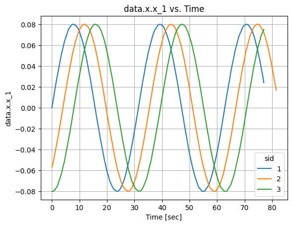

Create a new figure and plot only part of the data, where 'data.x.x_1' <= 0; plot by dashed line:

```python
>>> fig, ax = plt.subplots()
>>> citros.batch('dynamics').topic('A').set_filter({'data.x.x_1':{'<=': 0}})\
          .time_plot(ax, '--', var_name = 'data.x.x_1', time_step = 0.5)
```


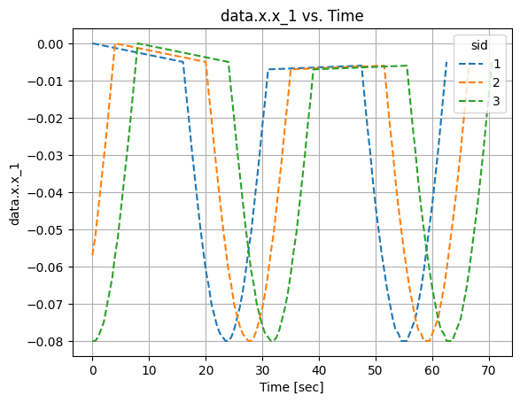
</details>


    
### Method `xy_plot` {#citros_data_analysis.data_access.citros_db.CitrosDB.xy_plot}


```python
def xy_plot(
    ax,
    *args,
    topic_name=None,
    var_x_name=None,
    var_y_name=None,
    sids=None,
    x_label=None,
    y_label=None,
    title_text=None,
    legend=True,
    remove_nan=True,
    inf_vals=1e+308,
    **kwargs
)
```


<details>
  <summary>Description</summary>

Query data and make plot **var_y_name** vs. **var_x_name** for each of the sids.

Both **[CitrosDB.time_plot()](#citros_data_analysis.data_access.citros_db.CitrosDB.time_plot "citros_data_analysis.data_access.citros_db.CitrosDB.time_plot")** and **[CitrosDB.xy_plot()](#citros_data_analysis.data_access.citros_db.CitrosDB.xy_plot "citros_data_analysis.data_access.citros_db.CitrosDB.xy_plot")** methods are aimed to quickly make plots.
They allow you to query data and plot it at once, without need to first save data as a separate DataFrame.
The constraints on data may be set by **batch()**, **topic()**, **rid()**, **sid()** and **time()** methods
and one of the aggregative methods **skip()**, **avg()** or **move_avg()**.

#### Parameters

Name|Type|Description
--|--|--
|**```ax```**|**matplotlib.axes.Axes**|Figure axis to plot on.
|**```*args```**|**Any**|Additional arguments to style lines, set color, etc, <br />    see **[matplotlib.axes.Axes.plot](https://matplotlib.org/stable/api/_as_gen/matplotlib.axes.Axes.plot.html)**.
|**```topic_name```**|**str**|Input topic name. If specified, will override value that was set by **topic()** method.
|**```var_x_name```**|**str**|Name of the variable to plot along x-axis.
|**```var_y_name```**|**str**|Name of the variable to plot along y-axis.
|**```sids```**|**int** or **list** of **int**, optional|List of the sids. If specified, will override values that were set by **sid()** method.<br />    If not specified, data for all sids is used.
|**```x_label```**|**str**, optional|Label to set to x-axis. Default **var_x_name**.
|**```y_label```**|**str**, optional|Label to set to y-axis. Default **var_y_name**.
|**```title_text```**|**str**, optional|Title of the figure. Default '**var_y_name** vs. **var_x_name**'.
|**```legend```**|**bool**, default **True**|If True, show the legend with sids.
|**```remove_nan```**|**bool**, default **True**|If True, NaN values will be removed before plotting.
|**```inf_vals```**|**None** or **float**, default **1e308**|If specified, all values that exceed the provided value in absolute terms will be removed before plotting.<br />    If this functionality is not required, set inf_vals = None.
#### Other Parameters

Name|Type|Description
--|--|--
|**```kwargs```**|**dict**, optional|Other keyword arguments, see **[matplotlib.axes.Axes.plot](https://matplotlib.org/stable/api/_as_gen/matplotlib.axes.Axes.plot.html)**.
#### See Also

**[CitrosDB.time_plot()](#citros_data_analysis.data_access.citros_db.CitrosDB.time_plot "citros_data_analysis.data_access.citros_db.CitrosDB.time_plot"),**
**[CitrosDB.batch()](#citros_data_analysis.data_access.citros_db.CitrosDB.batch "citros_data_analysis.data_access.citros_db.CitrosDB.batch")**, **[CitrosDB.topic()](#citros_data_analysis.data_access.citros_db.CitrosDB.topic "citros_data_analysis.data_access.citros_db.CitrosDB.topic")**, **[CitrosDB.rid()](#citros_data_analysis.data_access.citros_db.CitrosDB.rid "citros_data_analysis.data_access.citros_db.CitrosDB.rid")**, **[CitrosDB.sid()](#citros_data_analysis.data_access.citros_db.CitrosDB.sid "citros_data_analysis.data_access.citros_db.CitrosDB.sid")**, **[CitrosDB.time()](#citros_data_analysis.data_access.citros_db.CitrosDB.time "citros_data_analysis.data_access.citros_db.CitrosDB.time")**, **[CitrosDB.skip()](#citros_data_analysis.data_access.citros_db.CitrosDB.skip "citros_data_analysis.data_access.citros_db.CitrosDB.skip")**, **[CitrosDB.avg()](#citros_data_analysis.data_access.citros_db.CitrosDB.avg "citros_data_analysis.data_access.citros_db.CitrosDB.avg")**, **[CitrosDB.move_avg()](#citros_data_analysis.data_access.citros_db.CitrosDB.move_avg "citros_data_analysis.data_access.citros_db.CitrosDB.move_avg")**, **[CitrosDB.set_order()](#citros_data_analysis.data_access.citros_db.CitrosDB.set_order "citros_data_analysis.data_access.citros_db.CitrosDB.set_order")**


</details>
<details>
  <summary>Examples</summary>

```python
>>> import matplotlib.pyplot as plt
>>> fig, ax = plt.subplots()
```


For batch 'dynamics' for topic 'A' plot 'data.x.x_1' vs. 'data.time' for all existing sids:

```python
>>> citros = da.CitrosDB()
>>> citros.batch('dynamics').topic('A').xy_plot(ax, var_x_name = 'data.x.x_1', var_y_name = 'data.time')
```


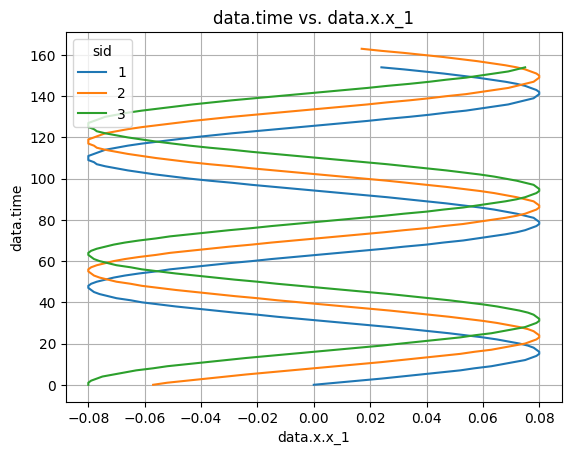

Create new figure and plot only part of the data, where 'data.x.x_1' <= 0, sid = 1 and 2; plot by dashed lines:

```python
>>> fig, ax = plt.subplots()
>>> citros.batch('dynamics').topic('A').set_filter({'data.x.x_1':{'<=': 0}}).sid([1,2])\
          .xy_plot(ax, '--', var_x_name = 'data.x.x_1', var_y_name = 'data.time')
```


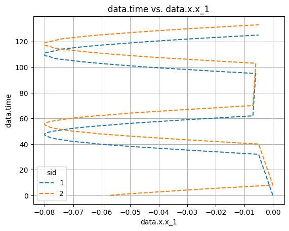
</details>


    
### Method `plot_graph` {#citros_data_analysis.data_access.citros_db.CitrosDB.plot_graph}


```python
def plot_graph(
    df,
    x_label,
    y_label,
    *args,
    ax=None,
    legend=True,
    title=None,
    set_x_label=None,
    set_y_label=None,
    remove_nan=True,
    inf_vals=1e+308,
    **kwargs
)
```


<details>
  <summary>Description</summary>

Plot graph '**y_label** vs. **x_label**' for each sid, where **x_label** and **y_label**
are the labels of columns of the pandas.DataFrame **df**.

#### Parameters

Name|Type|Description
--|--|--
|**```df```**|**pandas.DataFrame**|Data table.
|**```x_label```**|**str**|Label of the column to plot along x-axis.
|**```y_label```**|**str**|Label of the column to plot along y-axis.
|**```*args```**|**Any**|Additional arguments to style lines, set color, etc, <br />    see **[matplotlib.axes.Axes.plot](https://matplotlib.org/stable/api/_as_gen/matplotlib.axes.Axes.plot.html)**.
|**```ax```**|**matplotlib.axes.Axes**|Figure axis to plot on. If not specified, the new pair of fig, ax will be created.
|**```legend```**|**bool**, default **True**|If True, show the legend with sids.
|**```title```**|**str**|Set title of the plot.
|**```set_x_label```**|**str**, default **None**|Label to set to the x-axis. If None, label is set according to **x_label**.
|**```set_y_label```**|**str**, default **None**|Label to set to the y-axis. If None, label is set according to **y_label**.
|**```remove_nan```**|**bool**, default **True**|If True, NaN values will be removed before plotting.
|**```inf_vals```**|**None** or **float**, default **1e308**|If specified, all values that exceed the provided value in absolute terms will be removed before plotting.<br />    If this functionality is not required, set inf_vals = None.
#### Returns

Name|Type|Description
--|--|--
|**```fig```**|**matplotlib.figure.Figure**|Created figure if **ax** is not passed.
|**```ax```**|**matplotlib.axes.Axes**|Created axis if **ax** is not passed.
#### Other Parameters

Name|Type|Description
--|--|--
|**```kwargs```**|**dict**, optional|Other keyword arguments, see **[matplotlib.axes.Axes.plot](https://matplotlib.org/stable/api/_as_gen/matplotlib.axes.Axes.plot.html)**.
#### See Also

**[CitrosDB.plot_3dgraph()](#citros_data_analysis.data_access.citros_db.CitrosDB.plot_3dgraph "citros_data_analysis.data_access.citros_db.CitrosDB.plot_3dgraph")**, **[CitrosDB.multiple_y_plot()](#citros_data_analysis.data_access.citros_db.CitrosDB.multiple_y_plot "citros_data_analysis.data_access.citros_db.CitrosDB.multiple_y_plot")**, **[CitrosDB.multiplot()](#citros_data_analysis.data_access.citros_db.CitrosDB.multiplot "citros_data_analysis.data_access.citros_db.CitrosDB.multiplot")**, **[CitrosDB.plot_sigma_ellipse()](#citros_data_analysis.data_access.citros_db.CitrosDB.plot_sigma_ellipse "citros_data_analysis.data_access.citros_db.CitrosDB.plot_sigma_ellipse")**


</details>
<details>
  <summary>Examples</summary>

Import matplotlib and create figure to plot on:

```python
>>> import matplotlib.pyplot as plt
>>> fig, ax = plt.subplots()
```


Download from batch 'kinematics' for topic 'A' from json-data column 'data.x.x_1' and 'data.x.x_2' columns:

```python
>>> citros = da.CitrosDB()
>>> df = citros.batch('kinematics').topic('A').data(['data.x.x_1', 'data.x.x_2'])
```


Plot **data.x.x_1** vs. **data.x.x_2**:

```python
>>> citros.plot_graph(df, 'data.x.x_1', 'data.x.x_2', ax = ax, title = 'Example plot')
```


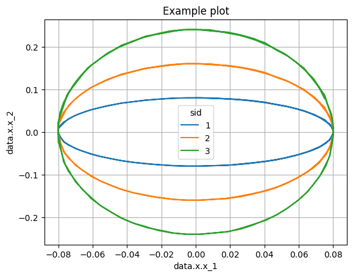

If **ax** parameter is not passed, **plot_graph()** generates a pair of (matplotlib.figure.Figure, matplotlib.axes.Axes) objects and
returns them. Let's plot the previous image without passing **ax** argument, and also let's plot with a dotted line:

```python
>>> fig, ax = citros.plot_graph(df, 'data.x.x_1', 'data.x.x_2', '.', title = 'Example plot')
>>> fig.show()
```


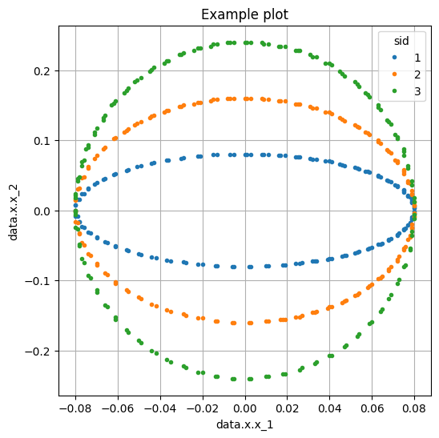
</details>


    
### Method `plot_3dgraph` {#citros_data_analysis.data_access.citros_db.CitrosDB.plot_3dgraph}


```python
def plot_3dgraph(
    df,
    x_label,
    y_label,
    z_label,
    *args,
    ax=None,
    scale=True,
    legend=True,
    title=None,
    set_x_label=None,
    set_y_label=None,
    set_z_label=None,
    remove_nan=True,
    inf_vals=1e+308,
    **kwargs
)
```


<details>
  <summary>Description</summary>

Plot 3D graph '**z_label** vs. **x_label** and **y_label**' for each sid, where **x_label**, **y_label** and **z_label**
are the labels of columns of the pandas.DataFrame **df**.

#### Parameters

Name|Type|Description
--|--|--
|**```df```**|**pandas.DataFrame**|Data table.
|**```x_label```**|**str**|Label of the column to plot along x-axis.
|**```y_label```**|**str**|Label of the column to plot along y-axis.
|**```*args```**|**Any**|Additional arguments to style lines, set color, etc, <br />    see **[matplotlib.axes.Axes.plot](https://matplotlib.org/stable/api/_as_gen/matplotlib.axes.Axes.plot.html)**.
|**```ax```**|**matplotlib.axes.Axes**|Figure axis to plot on. If not specified, the new pair of fig, ax will be created.
|**```scale```**|**bool**, default **True**|Specify whether the axis range should be the same for all axes.
|**```legend```**|**bool**, default **True**|If True, show the legend with sids.
|**```title```**|**str**|Set title of the plot.
|**```set_x_label```**|**str**, default **None**|Label to set to the x-axis. If None, label is set according to **x_label**.
|**```set_y_label```**|**str**, default **None**|Label to set to the y-axis. If None, label is set according to **y_label**.
|**```set_z_label```**|**str**, default **None**|Label to set to the z-axis. If None, label is set according to **z_label**.
|**```remove_nan```**|**bool**, default **True**|If True, NaN values will be removed before plotting.
|**```inf_vals```**|**None** or **float**, default **1e308**|If specified, all values that exceed the provided value in absolute terms will be removed before plotting.<br />    If this functionality is not required, set inf_vals = None.
#### Returns

Name|Type|Description
--|--|--
|**```fig```**|**matplotlib.figure.Figure**|Created figure if **ax** is not passed.
|**```ax```**|**matplotlib.axes.Axes**|Created axis if **ax** is not passed.
#### Other Parameters

Name|Type|Description
--|--|--
|**```kwargs```**|**dict**, optional|Other keyword arguments, see **[matplotlib.axes.Axes.plot](https://matplotlib.org/stable/api/_as_gen/matplotlib.axes.Axes.plot.html)**.
#### See Also

**[CitrosDB.plot_graph()](#citros_data_analysis.data_access.citros_db.CitrosDB.plot_graph "citros_data_analysis.data_access.citros_db.CitrosDB.plot_graph")**, **[CitrosDB.multiple_y_plot()](#citros_data_analysis.data_access.citros_db.CitrosDB.multiple_y_plot "citros_data_analysis.data_access.citros_db.CitrosDB.multiple_y_plot")**, **[CitrosDB.multiplot()](#citros_data_analysis.data_access.citros_db.CitrosDB.multiplot "citros_data_analysis.data_access.citros_db.CitrosDB.multiplot")**, **[CitrosDB.plot_sigma_ellipse()](#citros_data_analysis.data_access.citros_db.CitrosDB.plot_sigma_ellipse "citros_data_analysis.data_access.citros_db.CitrosDB.plot_sigma_ellipse")**


</details>
<details>
  <summary>Examples</summary>

Import matplotlib and mplot3d for 3D plots and create figure to plot on:

```python
>>> import matplotlib.pyplot as plt
>>> from mpl_toolkits import mplot3d
>>> fig = plt.figure(figsize=(6, 6))
>>> ax = fig.add_subplot(111, projection = '3d')
```


For topic 'A' from batch 'testing' from json-data column download 'data.x.x_1', 'data.x.x_2' and 'data.x.x_3' columns:

```python
>>> citros = da.CitrosDB()
>>> df = citros.batch('testing').topic('A').data(['data.x.x_1', 'data.x.x_2', 'data.x.x_3'])
```


Make 3D plot with dashed lines; **scale** = True aligns all axes to have the same range:

```python
>>> citros.plot_3dgraph(df, 'data.x.x_1', 'data.x.x_2', 'data.x.x_3', '--', ax = ax, scale = True)
```


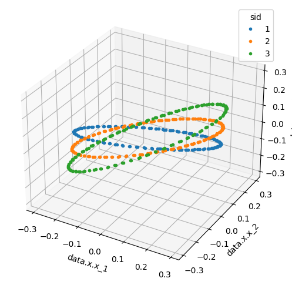
</details>


    
### Method `multiple_y_plot` {#citros_data_analysis.data_access.citros_db.CitrosDB.multiple_y_plot}


```python
def multiple_y_plot(
    df,
    x_label,
    y_labels,
    *args,
    fig=None,
    legend=True,
    title=None,
    set_x_label=None,
    set_y_label=None,
    remove_nan=True,
    inf_vals=1e+308,
    **kwargs
)
```


<details>
  <summary>Description</summary>

Plot a series of vertically arranged graphs 'y vs. **x_label**', with the y-axis labels 
specified in the **y_labels** parameter.

Different colors correspond to different sids.

#### Parameters

Name|Type|Description
--|--|--
|**```df```**|**pandas.DataFrame**|Data table.
|**```x_label```**|**str**|Label of the column to plot along x-axis.
|**```y_labels```**|**list** of **str**|Labels of the columns to plot along y-axis.
|**```*args```**|**Any**|Additional arguments to style lines, set color, etc, <br />    see **[matplotlib.axes.Axes.plot](https://matplotlib.org/stable/api/_as_gen/matplotlib.axes.Axes.plot.html)**.
|**```fig```**|**matplotlib.figure.Figure**, optional|If None, a new Figure will be created.
|**```legend```**|**bool**, default **True**|If True, show the legend with sids.
|**```title```**|**str**|Set title of the plot.
|**```set_x_label```**|**str**, default **None**|Label to set to the x-axis. If None, label is set according to **x_label**.
|**```set_y_label```**|**list** of **str**, default **None**|Labels to set to the y-axis. If None, label is set according to **y_labels**.
|**```remove_nan```**|**bool**, default **True**|If True, NaN values will be removed before plotting.
|**```inf_vals```**|**None** or **float**, default **1e308**|If specified, all values that exceed the provided value in absolute terms will be removed before plotting.<br />    If this functionality is not required, set inf_vals = None.
#### Returns

Name|Type|Description
--|--|--
|**```fig```**|**matplotlib.figure.Figure**|Created figure if **fig** is not passed.
|**```ax```**|**numpy.ndarray** of **matplotlib.axes.Axes**|Created axis if **fig** is not passed.
#### Other Parameters

Name|Type|Description
--|--|--
|**```kwargs```**|**dict**, optional|Other keyword arguments, see **[matplotlib.axes.Axes.plot](https://matplotlib.org/stable/api/_as_gen/matplotlib.axes.Axes.plot.html)**.
#### See Also

**[CitrosDB.plot_graph()](#citros_data_analysis.data_access.citros_db.CitrosDB.plot_graph "citros_data_analysis.data_access.citros_db.CitrosDB.plot_graph")**, **[CitrosDB.plot_3dgraph()](#citros_data_analysis.data_access.citros_db.CitrosDB.plot_3dgraph "citros_data_analysis.data_access.citros_db.CitrosDB.plot_3dgraph")**, **[CitrosDB.multiplot()](#citros_data_analysis.data_access.citros_db.CitrosDB.multiplot "citros_data_analysis.data_access.citros_db.CitrosDB.multiplot")**, **[CitrosDB.plot_sigma_ellipse()](#citros_data_analysis.data_access.citros_db.CitrosDB.plot_sigma_ellipse "citros_data_analysis.data_access.citros_db.CitrosDB.plot_sigma_ellipse")**


</details>
<details>
  <summary>Examples</summary>

For topic 'A' from batch 'testing' from json-data column download 'data.x.x_1', 'data.x.x_2' and 'data.x.x_3' and 'data.time' columns:

```python
>>> citros = da.CitrosDB()
>>> df = citros.batch('testing').topic('A').data(['data.x.x_1', 'data.x.x_2', 'data.x.x_3', 'data.time'])
```


Plot three subplots with a common x axis: 'data.x.x_1' vs. 'data.time', 'data.x.x_2' vs. 'data.time' and 'data.x.x_3' vs. 'data.time':

```python
>>> fig, ax = citros.multiple_y_plot(df, 'data.time', ['data.x.x_1', 'data.x.x_2', 'data.x.x_3'])
```


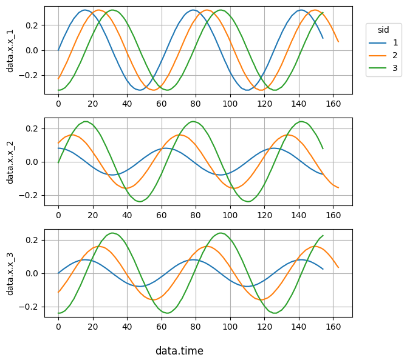

If **ax** parameter is not passed, **multiple_y_plot()** generates a pair of (matplotlib.figure.Figure, matplotlib.axes.Axes) objects and
returns them. Let's make a scatter plot in this manner:

```python
>>> fig, ax = citros.multiple_y_plot(df, 'data.time', ['data.x.x_1', 'data.x.x_2', 'data.x.x_3'], '.')
```


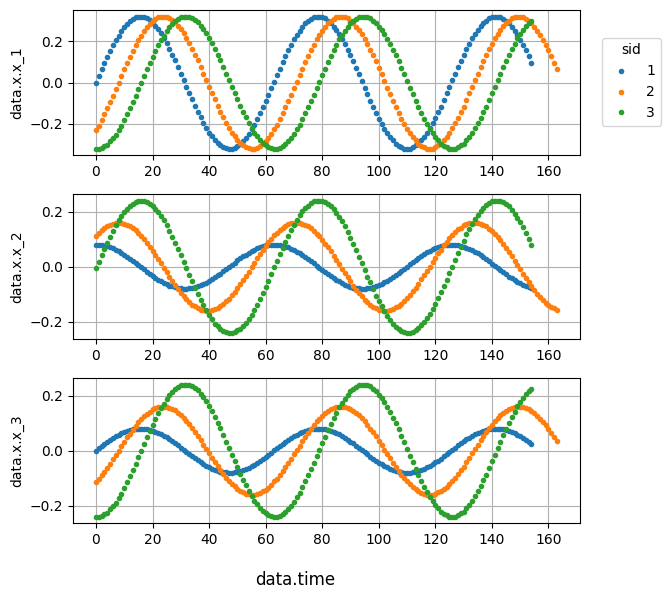
</details>


    
### Method `multiplot` {#citros_data_analysis.data_access.citros_db.CitrosDB.multiplot}


```python
def multiplot(
    df,
    labels,
    *args,
    scale=True,
    fig=None,
    legend=True,
    title=None,
    set_x_label=None,
    set_y_label=None,
    remove_nan=True,
    inf_vals=1e+308,
    label_all_xaxis=False,
    label_all_yaxis=False,
    num=5,
    **kwargs
)
```


<details>
  <summary>Description</summary>

Plot a matrix of N x N graphs, each displaying either the histogram with values distribution (for graphs on the diogonal) or
the relationship between variables listed in **labels**, with N being the length of **labels** list.

For non-diagonal graphs, colors are assigned to points according to sids.

#### Parameters

Name|Type|Description
--|--|--
|**```df```**|**pandas.DataFrame**|Data table.
|**```labels```**|**list** of **str**|Labels of the columns to plot.
|**```*args```**|**Any**|Additional arguments to style lines, set color, etc, <br />    see **[matplotlib.axes.Axes.plot](https://matplotlib.org/stable/api/_as_gen/matplotlib.axes.Axes.plot.html)**.
|**```scale```**|**bool**, default **True**|Specify whether the axis range should be the same for x and y axes.
|**```fig```**|**matplotlib.figure.Figure**, optional|If None, a new Figure will be created.
|**```legend```**|**bool**, default **True**|If True, show the legend with sids.
|**```title```**|**str**|Set title of the plot.
|**```set_x_label```**|**list** of **str**|Labels to set to the x-axis. If None, label is set according to **labels**.
|**```set_y_label```**|**list** of **str**|Labels to set to the y-axis. If None, label is set according to **labels**.
|**```remove_nan```**|**bool**, default **True**|If True, NaN values will be removed before plotting.
|**```inf_vals```**|**None** or **float**, default **1e308**|If specified, all values that exceed the provided value in absolute terms will be removed before plotting.<br />    If this functionality is not required, set inf_vals = None.
|**```label_all_xaxis```**|**bool**, default **False**|If True, x labels are set to the x-axes of the all graphs, otherwise only to the graphs in the bottom row.
|**```label_all_yaxis```**|**bool**, default **False**|If True, y labels are set to the y-axes of the all graphs, otherwise only to the graphs in the first column.
|**```num```**|**int**, default **5**|Number of bins in the histogram on the diagonal.
#### Returns

Name|Type|Description
--|--|--
|**```fig```**|**matplotlib.figure.Figure**|Created figure if **fig** is not passed.
|**```ax```**|**numpy.ndarray** of **matplotlib.axes.Axes**|Created axis if **fig** is not passed.
#### Other Parameters

Name|Type|Description
--|--|--
|**```kwargs```**|**dict**, optional|Other keyword arguments, see **[matplotlib.axes.Axes.plot](https://matplotlib.org/stable/api/_as_gen/matplotlib.axes.Axes.plot.html)**.
#### See Also

**[CitrosDB.plot_graph()](#citros_data_analysis.data_access.citros_db.CitrosDB.plot_graph "citros_data_analysis.data_access.citros_db.CitrosDB.plot_graph")**, **[CitrosDB.plot_3dgraph()](#citros_data_analysis.data_access.citros_db.CitrosDB.plot_3dgraph "citros_data_analysis.data_access.citros_db.CitrosDB.plot_3dgraph")**, **[CitrosDB.multiple_y_plot()](#citros_data_analysis.data_access.citros_db.CitrosDB.multiple_y_plot "citros_data_analysis.data_access.citros_db.CitrosDB.multiple_y_plot")**, **[CitrosDB.plot_sigma_ellipse()](#citros_data_analysis.data_access.citros_db.CitrosDB.plot_sigma_ellipse "citros_data_analysis.data_access.citros_db.CitrosDB.plot_sigma_ellipse")**


</details>
<details>
  <summary>Examples</summary>

For topic 'A' from the batch 'testing_robotics' from json-data column download 'data.x.x_1', 'data.x.x_2' and 'data.x.x_3':

```python
>>> citros = da.CitrosDB()
>>> df = citros.batch('testing_robotics').topic('A').data(['data.x.x_1', 'data.x.x_2', 'data.x.x_3'])
```


Plot nine graphs: histograms for three graphs on the diagonal, that represent 
distribution of the 'data.x.x_1', 'data.x.x_2' and 'data.x.x_3' values, and six graphs that show 
correlation between them; plot by dots and scale x and y axes ranges to one interval for each graph:

```python
>>> fig, ax = citros.multiplot(df, ['data.x.x_1', 'data.x.x_2', 'data.x.x_3'], '.' , scale = True)
>>> fig.show()
```


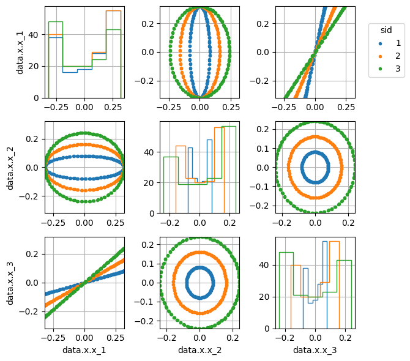
</details>


    
### Method `plot_sigma_ellipse` {#citros_data_analysis.data_access.citros_db.CitrosDB.plot_sigma_ellipse}


```python
def plot_sigma_ellipse(
    df,
    x_label,
    y_label,
    ax=None,
    n_std=3,
    plot_origin=True,
    bounding_error=False,
    inf_vals=1e+308,
    legend=True,
    title=None,
    set_x_label=None,
    set_y_label=None,
    scale=False,
    return_ellipse_param=False
)
```


<details>
  <summary>Description</summary>

Plot sigma ellipses for the set of data.

#### Parameters

Name|Type|Description
--|--|--
|**```df```**|**pandas.DataFrame**|Data table.
|**```x_label```**|**str**|Label of the column to plot along x-axis.
|**```y_labels```**|**list** of **str**|Labels of the columns to plot along y-axis.
|**```ax```**|**matplotlib.axes.Axes**|Figure axis to plot on. If not specified, the new pair of fig, ax will be created and returned.
|**```n_std```**|**int** or **list** of **ints**|Radius of ellipses in sigmas.
|**```plot_origin```**|**bool**, default **True**|If True, depicts origin (0, 0) with black cross.
|**```bounding_error```**|**bool**, default **False**|If True, plots bounding error circle for each of the ellipses.
|**```inf_vals```**|**None** or **float**, default **1e308**|If specified, all values that exceed the provided value in absolute terms will be removed before plotting.<br />    If this functionality is not required, set inf_vals = None.
|**```legend```**|**bool**, default **True**|If True, show the legend.
|**```title```**|**str**, optional|Set title. If None, title is set as '**x_label** vs. **y_label**'.
|**```set_x_label```**|**str**, optional|Set label of the x-axis. If None, label is set according to **x_label**.
|**```set_y_label```**|**str**, optional|Set label of the y-axis. If None, label is set according to **y_label**.
|**```scale```**|**bool**, default **False**|Specify whether the axis range should be the same for x and y axes.
|**```return_ellipse_param```**|**bool**, default **False**|If True, returns ellipse parameters.
#### Returns

Name|Type|Description
--|--|--
|**```fig```**|**matplotlib.figure.Figure**|Created figure if **ax** is not passed.
|**```ax```**|**numpy.ndarray** of **matplotlib.axes.Axes**|Created axis if **ax** is not passed.
|**```ellipse_param```**|**dict** or **list** of **dict**|Ellipse parameters if **return_ellipse_param** set True.<br />    Parameters of the ellipse:<br />      &#8226; x : float - x coordinate of the center.<br />      &#8226; y : float - y coordinate of the center.<br />      &#8226; width : float - total ellipse width (diameter along the longer axis).<br />      &#8226; height : float - total ellipse height (diameter along the shorter axis).<br />      &#8226; alpha : float - angle of rotation, in degrees, anti-clockwise from the shorter axis.<br /><br />    If bounding_error set True:<br />      &#8226; bounding_error : float - radius of the error circle.
#### See Also

**[CitrosDB.plot_graph()](#citros_data_analysis.data_access.citros_db.CitrosDB.plot_graph "citros_data_analysis.data_access.citros_db.CitrosDB.plot_graph")**, **[CitrosDB.plot_3dgraph()](#citros_data_analysis.data_access.citros_db.CitrosDB.plot_3dgraph "citros_data_analysis.data_access.citros_db.CitrosDB.plot_3dgraph")**, **[CitrosDB.multiple_y_plot()](#citros_data_analysis.data_access.citros_db.CitrosDB.multiple_y_plot "citros_data_analysis.data_access.citros_db.CitrosDB.multiple_y_plot")**, **[CitrosDB.multiplot()](#citros_data_analysis.data_access.citros_db.CitrosDB.multiplot "citros_data_analysis.data_access.citros_db.CitrosDB.multiplot")**


</details>
<details>
  <summary>Examples</summary>

Let's assume that in topic 'A', the batch named 'aerostatic' includes the columns 'data.x.x_1' and 'data.x.x_2'.
We would like to analyze the spread of these values from their mean.
First, we'll query the data and compute new columns 'X1' and 'X2', which will represent the deviations of 'data.x.x_1' and 'data.x.x_2' from their respective mean values:

```python
>>> citros = da.CitrosDB()
>>> df = citros.batch('aerostatic').topic('A').data(['data.x.x_1', 'data.x.x_2'])
>>> df['X1'] = df['data.x.x_1'] - df['data.x.x_1'].mean()
>>> df['X2'] = df['data.x.x_2'] - df['data.x.x_2'].mean()
```


Let's plot 'X1' vs. 'X2', 3-$\sigma$ ellipse, origin point that has coordinates (0, 0) 
and set the same range for x and y axis:

```python
>>> fig, ax = citros.plot_sigma_ellipse(df, x_label = 'X1', y_label = 'X2',
...                                      n_std = 3, plot_origin=True, scale = True)
```


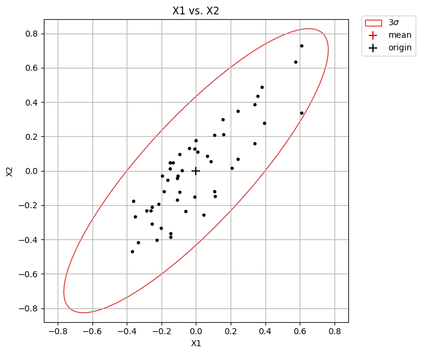

If we set **return_ellipse_param** = **True**, the parameters of the error ellipse will be returned:
```python
>>> fig, ax, param = citros.plot_sigma_ellipse(df, x_label = 'X1', y_label = 'X2', n_std = 3, 
...                                            plot_origin=True, scale = True, return_ellipse_param = True)
>>> print(param)
{'x': 0,
 'y': 0,
 'width': 2.1688175559868204,
 'height': 0.6108213775972502,
 'alpha': -132.38622331887413}
```


Plot the same but for 1-, 2- and 3-$\sigma$ ellipses, add bounding error circle (that indicates the maximum distance
between the ellipse points and the origin), set custom labels and title to the plot:

```python
>>> fig, ax = citros.plot_sigma_ellipse(df, x_label = 'X1', y_label = 'X2', 
...                                     n_std = [1,2,3], plot_origin=True, bounding_error=True, 
...                                     set_x_label='x, [m]', set_y_label = 'y, [m]', 
...                                     title = 'Coordinates')
```


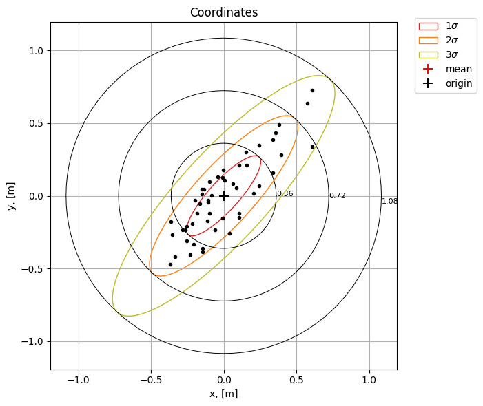
</details>