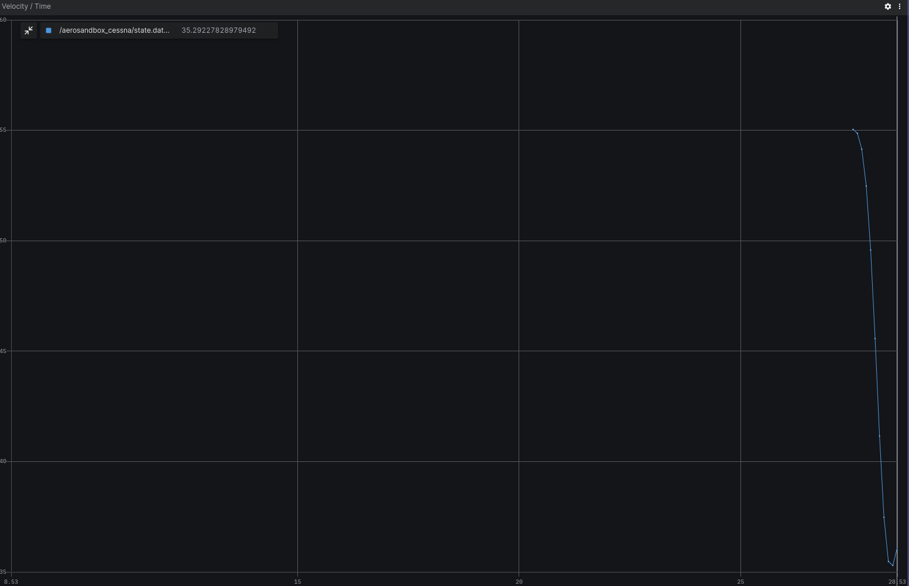
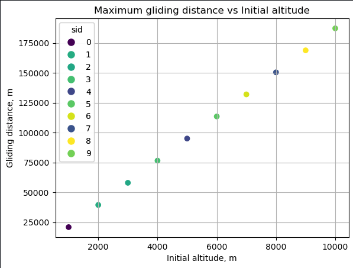

# Aerosandbox

## Overview
The project is a simulation tool developed using ROS 2 (Robot Operating System) nodes and leverages the Aerosandbox Python library for aerodynamic calculations. Its primary objective is to simulate gliding flight scenarios for a Cessna 152 aircraft in the event of engine failure.

You can find more information about this useful aerodynamics library on [Aerosandbox official website](https://github.com/peterdsharpe/AeroSandbox). All project installation, code overview and usage details are also available on the project's [GitHub page](https://github.com/citros-garden/aerosandbox_cessna).

.jpg")

## Prerequisites

1. Please make sure you have all the [necessary softwares](https://citros.io/doc/docs_tutorials/getting_started/#softwares-to-work-with-citros) to work with CITROS installed on your computer.
2. Install [Visual Studio code](https://code.visualstudio.com/download).
3. We strongly recommend that you work with [dockers](https://citros.io/doc/docs_tutorials/dockerfile_overview/). However, if you wish to work without dockers, please refer to the .devcontainer [directory](https://github.com/citros-garden/aerosandbox_cessna/tree/main/.devcontainer) in project's repo, the dependencies you need are in the ```Dockerfile``` file.
4. (Optional) Install [Foxglove](https://docs.Foxglove.dev/docs/introduction).


## Table of Contents
1. [Installation](#installation)
2. [Workspace Overview](#workspace-overview)
3. [CITROS Initialization](#citros-initialization)
4. [Scenario](#scenario)
5. [Running the Scenario Using CITROS](#running-the-scenario-using-citros)
6. [Results](#results)

## Installation
1. Clone the repository:

```bash
git clone git@github.com:citros-garden/aerosandbox_cessna.git
```

2. Open the repository in the [VScode Dev Container](https://citros.io/doc/docs_tutorials/getting_started/#open-project-in-vscode-dev-container).

## Workspace Overview

The Aerosandbox simulation has the following ROS 2 parameters:

|Parameter	|Description	|Package
|--|--|--
h_0	|Initial altitude (m)	|aerosandbox_cessna		
v_0	|Initial velocity (knots)	|aerosandbox_cessna	
publish_freq	|Frequency of publishing	|aerosandbox_cessna	

This project contains only one launch file ```aerosandbox_cessna.launch.py```. This file will be used for CITROS launch. 

|Launch File	|Description	|Package
|--|--|--
aerosandbox_cessna.launch.py	|Aerosandbox simulation launch file  |aerosandbox_cessna


## CITROS Initialization

1. [Install CITROS](https://citros.io/doc/docs_tutorials/getting_started/#installation).
2. Follow [these steps](https://citros.io/doc/docs_tutorials/getting_started/#initialization) to Initialize CITROS.

Now you can see .citros directory in the explorer.


## Scenario
For this tutorial, let's check how far the Cessna can glide with engine failure depending on initial altitude. To find it out, we need to set up parameters and launch CITROS simulation. <br/>
The user provides flight parameters as input parameters to configure the simulation. These parameters are essential for defining the initial conditions of the simulated flight.<br/>
The simulation takes into account various flight dynamics and aerodynamic factors to model the gliding behavior of the Cessna 152. The maximum gliding distance depends on plane's aerodynamic parameters, initial altitude and initial velocity.<br/>
We will be using [iPOPT](https://en.wikipedia.org/wiki/IPOPT#:~:text=IPOPT%2C%20short%20for%20%22Interior%20Point,the%20EPL%20(formerly%20CPL).) - optimal under the hood problem solver (iPOPT is also installed as part of the AeroSandbox package).<br/>
The parameter setup is listed in ```.citros/parameter_setups/default_param_setup.json```. <br/>
To find out how far the Cessna can glide with engine failure, we will examine the initial altitude, starting from 1000m and up to 10000m.
```json
{
    "packages": {
        "aerosandbox_cessna": {
            "aerosandbox_cessna": {
                "ros__parameters": {
                    "h_0": {
                        "function": "my_func.py:func_with_context",
                        "args": [1000.0]
                    },
                    "v_0": 107.0,
                    "publish_freq": 10.0
                }
            }
        }
    }
}
```

The ```my_func.py``` file should contain:
```python
def func_with_context(num, citros_context):
    return num + float(citros_context['run_id'])*1000
```

This function will set the ```h_0``` parameter in range from 1000 to 1000+1000*n, where n = number of runs.

Learn more about parameter setup and defining custom functions in [Directory parameter_setups](https://citros.io/doc/docs_cli/structure/citros_structure/#directory-parameter_setups) and [Adding Functions to Parameter Setup](https://citros.io/doc/docs_cli/configuration/config_params) pages.

## Running the Scenario Using CITROS

### Running Locally
First ensure that the project has been [built and sourced](https://citros.io/doc/docs_tutorials/getting_started/#build-the-project).<br/>
Set up the performance setup listed in ```.citros/simulations/simulation_aerosandbox_cessna.json```: for local run the recommended timeout value is 180 seconds. <br/>
Now we can launch it locally:
```bash 
>>> citros run -n 'aerosandbox_cessna' -m 'local test run'
? Please choose the simulation you wish to run:
❯ aerosandbox_cessna
```
Select the launch file (should be the only one here) by pressing ```Enter``` button and wait for the output in the terminal. 

```bash
created new batch_id: <batch_run / batch name>. Running locally.
+ running batch [<batch_run / batch name>], description: local test run, repeating simulations: [1]
+ + running simulation [0]
...
```

All the results will be saved under `.citros/runs/[simulation_name]` folder.

To plot the local run results you can use [Foxglove](https://citros.io/doc/docs_tutorials/#visualization-with-Foxglove).



### Running in Cloud

[Upload project to CITROS Server](https://citros.io/doc/docs_tutorials/getting_started/#upload-to-citros-server). <br />
Set up the performance setup listed in ```.citros/simulations/simulation_aerosandbox_cessna.json```: for cloud run the recommended timeout value is 180 seconds, 4 CPU, 4 GPU and 4096 MB of Memory.<br />
Finally, we can run it in the cloud! Simply add `-r` to the terminal command: 
```bash 
citros run -n 'aerosandbox_cessna' -m 'cloud test run' -r
? Please choose the simulation you wish to run:
❯ aerosandbox_cessna
```

Select the launch file (should be the only one here) by pressing `Enter` button. Now the simulation is running in the CITROS server, and the results will be automatically uploaded to the CITROS database.

```bash
created new batch_id: <batch_id / batch name>. Running on Citros cluster. See https://citros.io/batch/<batch_id / batch name>.
```

## Results

To get and process the simulation results, execute [built-in Jupiter Notebook](https://citros.io/aerosandbox_cessna/blob/main/notebooks/aerosandbox_notebook_example.ipynb).

